

### 313

|Name|RAJ2000[deg]|DEJ2000[deg] |Ext[arcmin]| Ext,ml | z | z_src| C|GC(XSZ,Delta_z<0.01)| GC(OPT,Delta_z<0.01)|GC| R_sig[arcmin] | R500[arcmin] | R500[Mpc]| CRsig[c/s] | CR500[c/s] |L500[1E44 erg/s]|F500[1E-12 erg/s/cm^2]| M500[1E14 Msun]|Tx[keV]|Cnt_sig|Beta|Rc[arcmin]|Comment|Alias|
|---|---|---|---|---|---|------|---|--------|---------|----------|---|---|---|---|---|---|---|---|---|---|---|---|---|---|
|313| 138.991| 17.562| 2.43| 32.37| 0.0290(0.005)| z1, z_xsz| B| MCXC| N| C, F20, MCXC, N, W| 26.675| 17.871| 0.623| 0.409(0.060)| 0.388(0.057)| 0.128(0.018)| 6.626(0.923)| 0.71(0.05)| 1.75(0.08)| 134.8| 0.542(-0.029+0.045)| 6.772(-0.785+1.170)| -| k288|

|[RASS image](../image/313/313_img.pdf)|[filtered image](../image/313/313_fil.pdf)|[Segment image](../image/313/313_seg.pdf)|
|-------------------|--------------------|-------------------|
| 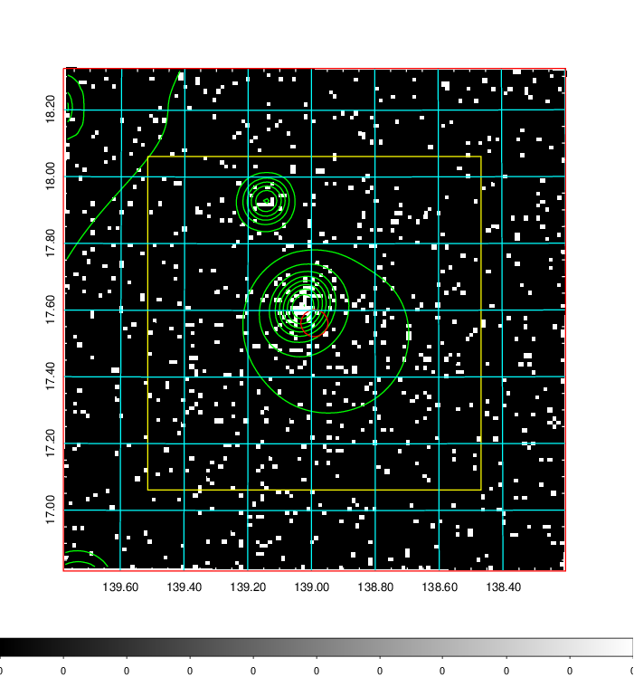  | 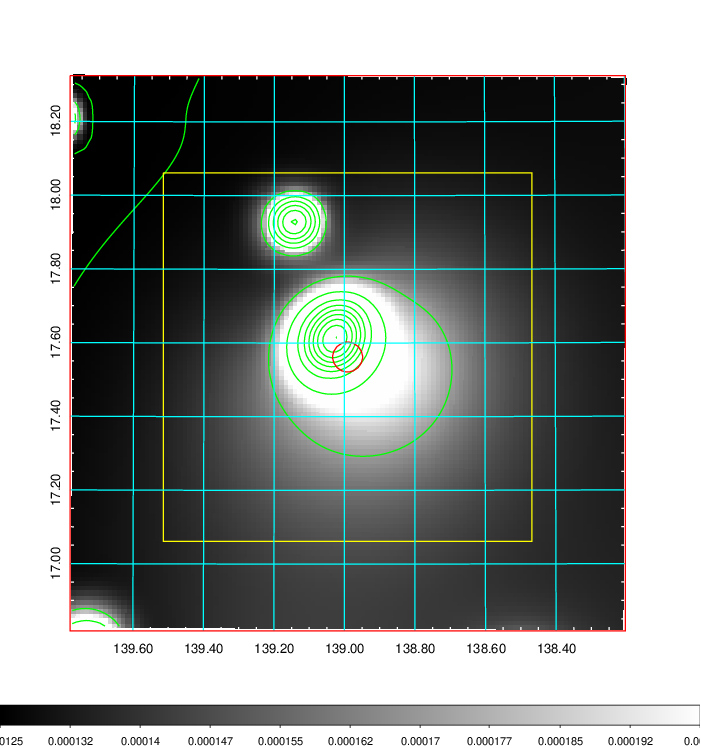   | 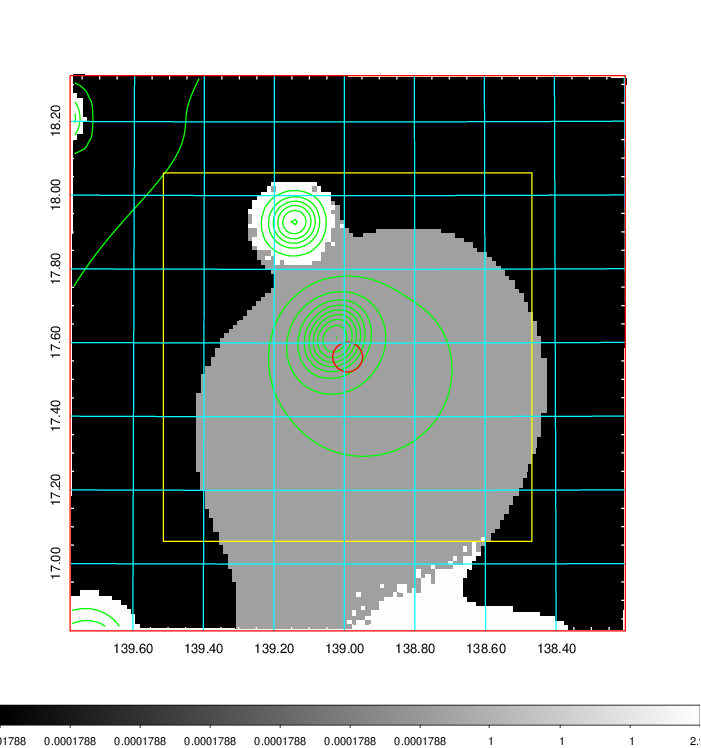  |

|[Exposure image](../image/313/313_mex.pdf)| [nH image](../image/313/313_nh.pdf)| [Planck image](../image/313/313_p.pdf)|
|-------------------|--------------------|-------------------|
|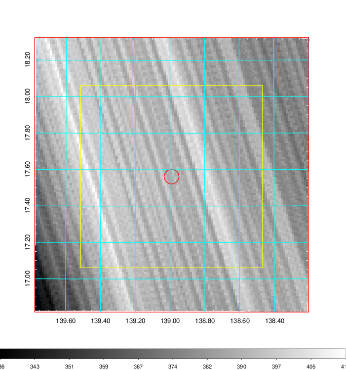   | 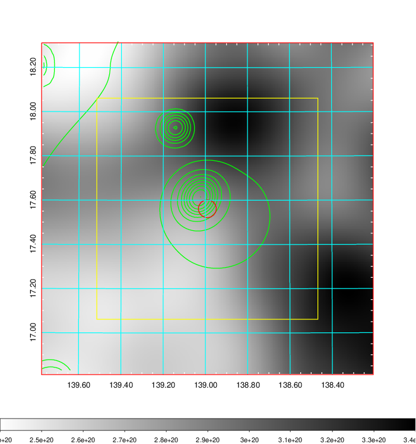    | 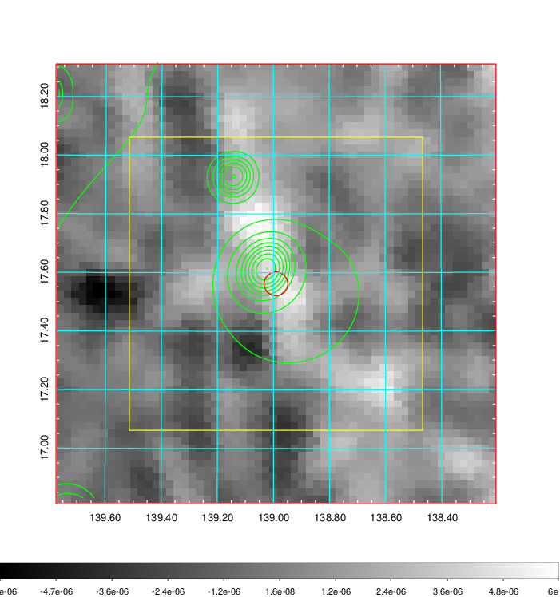 |

|[Redshift Histogram](../image/313/313_zg.pdf) | [DSS image(z1)](../image/313/313_dss_z1.pdf)      |  [DSS image(z2)](../image/313/313_dss_z2.pdf)    |
|-------------------|--------------------|-------------------|
|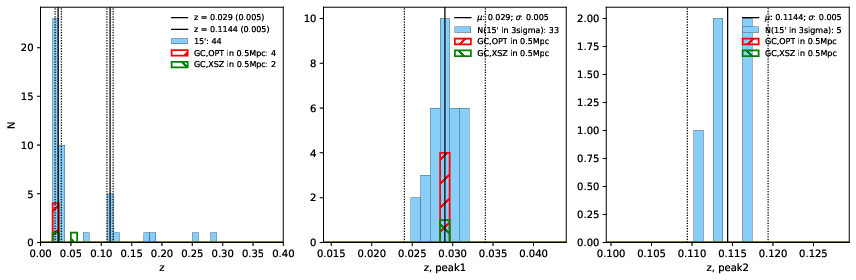 |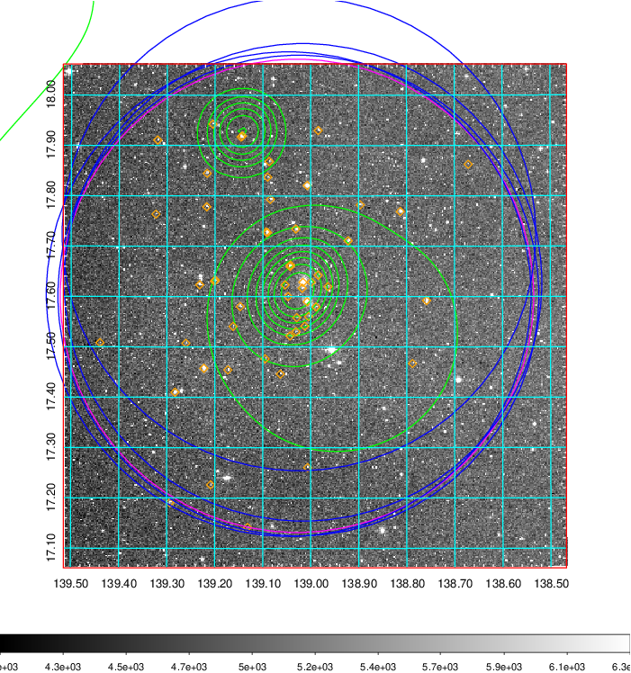  Blue circle for optical clusters;  Magenta circle for XSZ clusters;  all with r=1Mpc;  Only GC with Delta_z<0.01 are shown. | 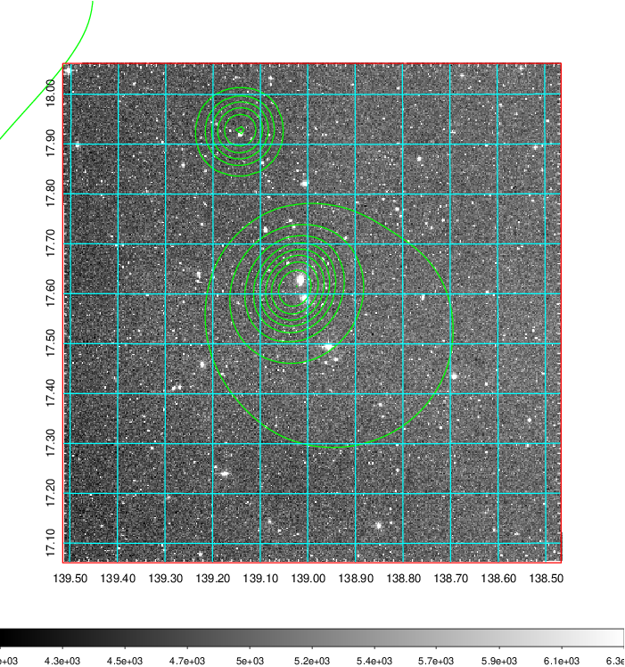 Blue circle for optical clusters;  Magenta circle for XSZ clusters;  all with r=1Mpc;  Only GC with Delta_z<0.01 are shown.  |

|[known Abell/XSZ clusters](../image/313/313_gc.pdf) | [2MASS image](../image/313/313_2mass.pdf)      |[SDSS image](../image/313/313_sdss.pdf)   |
|-------------------|-------------------|-------------------|
|  Magenta, blue and green circles  for optical, X-ray and SZ clusters  respectively, with redshift of clusters  labelled. The radius of circles  are 1Mpc.|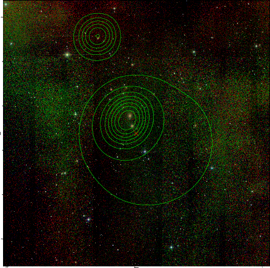  | 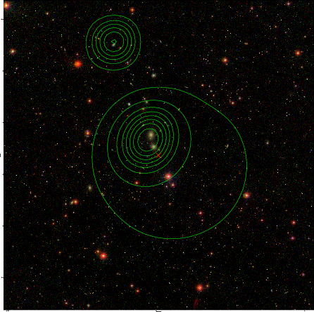  |

