

### 314

|Name|RAJ2000[deg]|DEJ2000[deg] |Ext[arcmin]| Ext,ml | z | z_src| C|GC(XSZ,Delta_z<0.01)| GC(OPT,Delta_z<0.01)|GC| R_sig[arcmin] | R500[arcmin] | R500[Mpc]| CRsig[c/s] | CR500[c/s] |L500[1E44 erg/s]|F500[1E-12 erg/s/cm^2]| M500[1E14 Msun]|Tx[keV]|Cnt_sig|Beta|Rc[arcmin]|Comment|Alias|
|---|---|---|---|---|---|------|---|--------|---------|----------|---|---|---|---|---|---|---|---|---|---|---|---|---|---|
|314| 139.294| 63.765| 8.96| 27.88| 0.1197(0.005)| z1, z_opt| S| -| C, N, W| A, C, N, W| 14.650| 6.261| 0.811| 0.094(0.029)| 0.086(0.026)| 0.579(0.215)| 1.553(0.577)| 1.70(0.32)| 3.09(0.36)| 48.8| 0.570(-0.054+0.144)| 5.463(-0.732+1.561)| -| t415|

|[RASS image](../image/314/314_img.pdf)|[filtered image](../image/314/314_fil.pdf)|[Segment image](../image/314/314_seg.pdf)|
|-------------------|--------------------|-------------------|
| 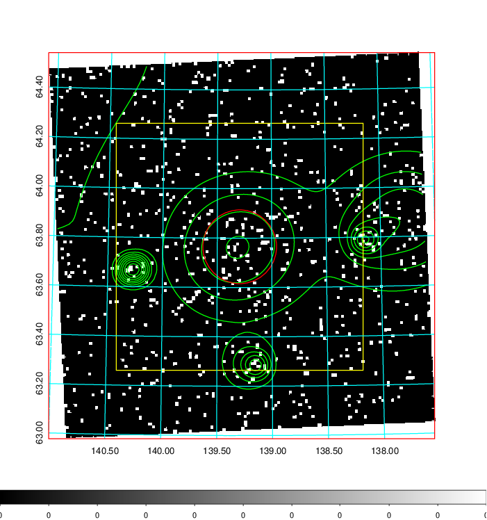  | 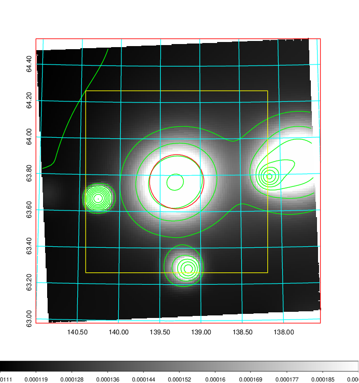   | 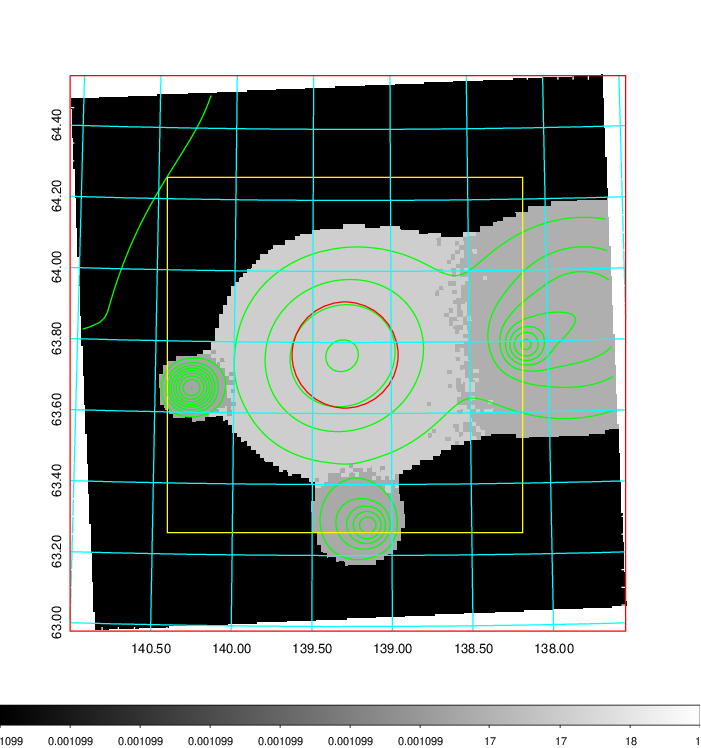  |

|[Exposure image](../image/314/314_mex.pdf)| [nH image](../image/314/314_nh.pdf)| [Planck image](../image/314/314_p.pdf)|
|-------------------|--------------------|-------------------|
|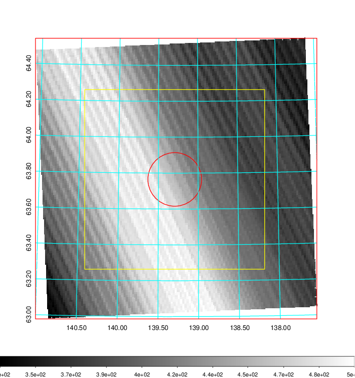   | 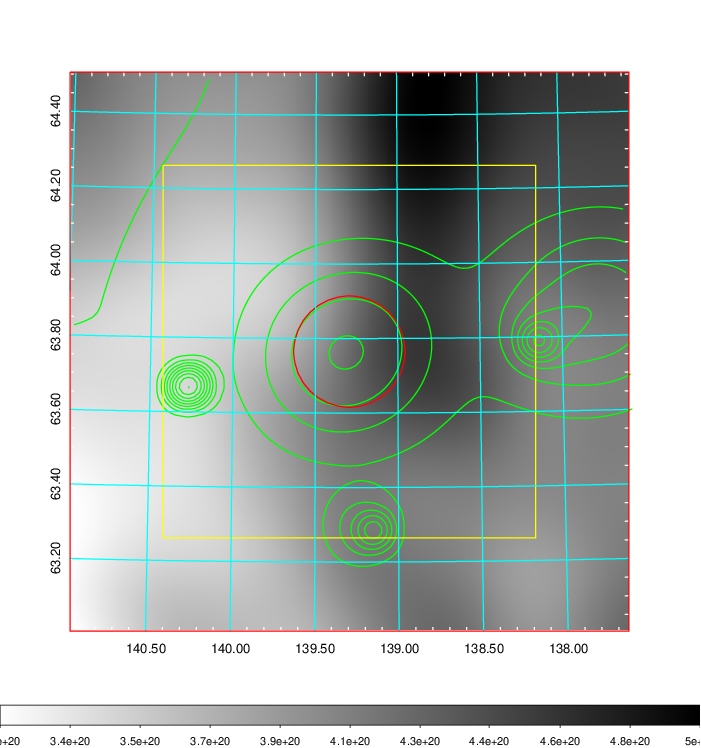    | 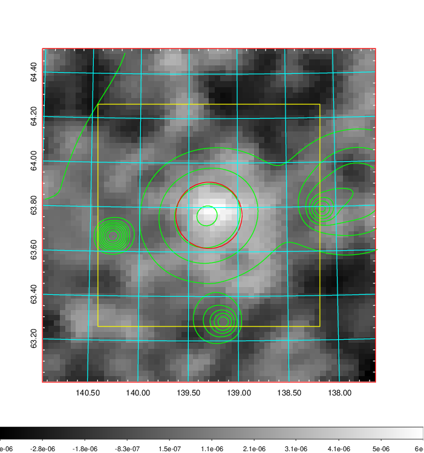 |

|[Redshift Histogram](../image/314/314_zg.pdf) | [DSS image(z1)](../image/314/314_dss_z1.pdf)      |  [DSS image(z2)](../image/314/314_dss_z2.pdf)    |
|-------------------|--------------------|-------------------|
|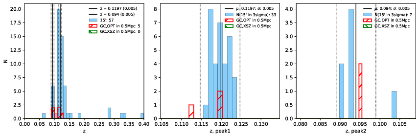 |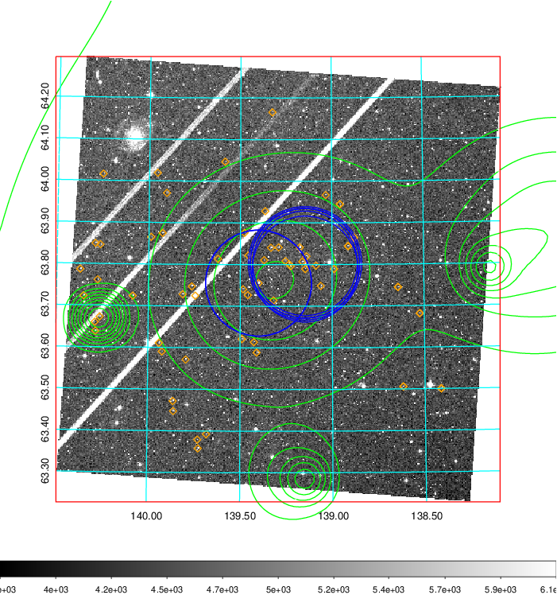  Blue circle for optical clusters;  Magenta circle for XSZ clusters;  all with r=1Mpc;  Only GC with Delta_z<0.01 are shown. | 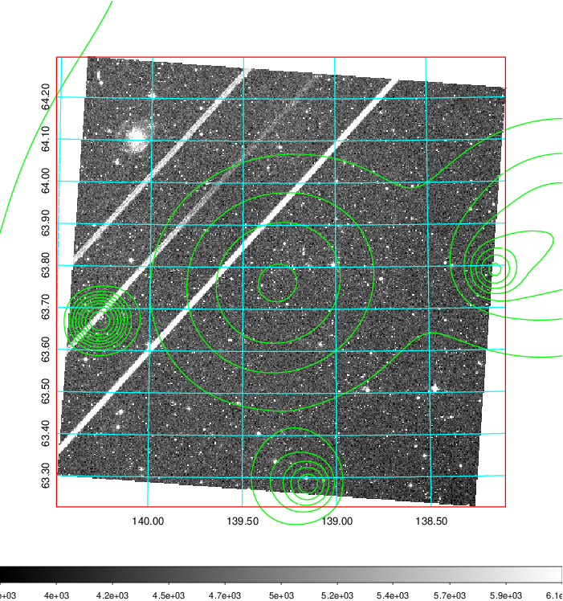 Blue circle for optical clusters;  Magenta circle for XSZ clusters;  all with r=1Mpc;  Only GC with Delta_z<0.01 are shown.  |

|[known Abell/XSZ clusters](../image/314/314_gc.pdf) | [2MASS image](../image/314/314_2mass.pdf)      |[SDSS image](../image/314/314_sdss.pdf)   |
|-------------------|-------------------|-------------------|
|  Magenta, blue and green circles  for optical, X-ray and SZ clusters  respectively, with redshift of clusters  labelled. The radius of circles  are 1Mpc.|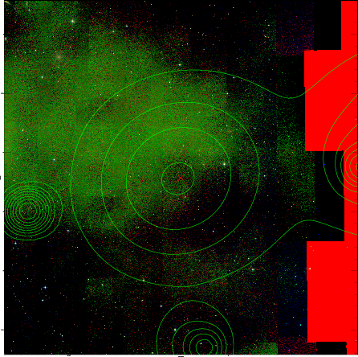  | 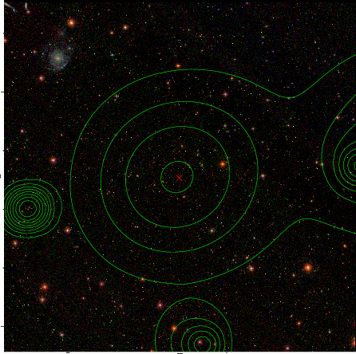  |

