

### 315

|Name|RAJ2000[deg]|DEJ2000[deg] |Ext[arcmin]| Ext,ml | z | z_src| C|GC(XSZ,Delta_z<0.01)| GC(OPT,Delta_z<0.01)|GC| R_sig[arcmin] | R500[arcmin] | R500[Mpc]| CRsig[c/s] | CR500[c/s] |L500[1E44 erg/s]|F500[1E-12 erg/s/cm^2]| M500[1E14 Msun]|Tx[keV]|Cnt_sig|Beta|Rc[arcmin]|Comment|Alias|
|---|---|---|---|---|---|------|---|--------|---------|----------|---|---|---|---|---|---|---|---|---|---|---|---|---|---|
|315| 139.935| 33.762| 3.38| 71.99| 0.0226(0.005)| z1, z_xsz| B| L03, MCXC| A, N| A, F20, L03, MCXC, N, SPI| 20.750| 19.796| 0.542| 0.360(0.066)| 0.357(0.065)| 0.066(0.009)| 5.713(0.775)| 0.46(0.03)| 1.34(0.06)| 154.0| 0.538(-0.024+0.033)| 3.050(-0.446+0.581)| -| k415|

|[RASS image](../image/315/315_img.pdf)|[filtered image](../image/315/315_fil.pdf)|[Segment image](../image/315/315_seg.pdf)|
|-------------------|--------------------|-------------------|
| 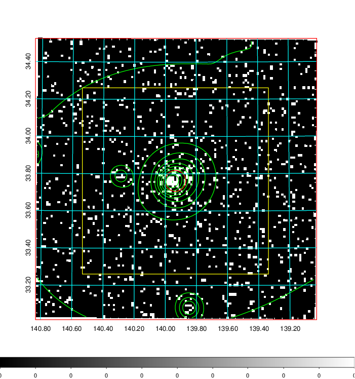  | 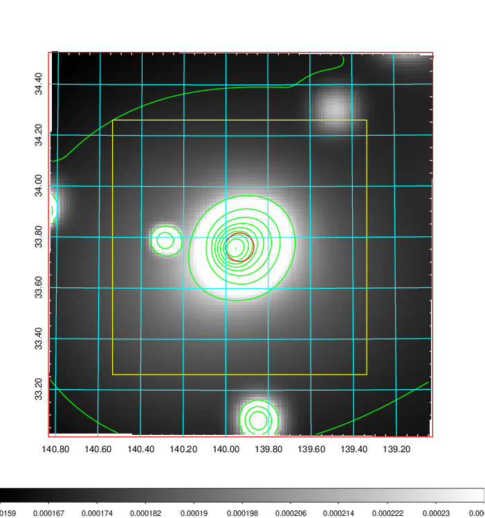   | 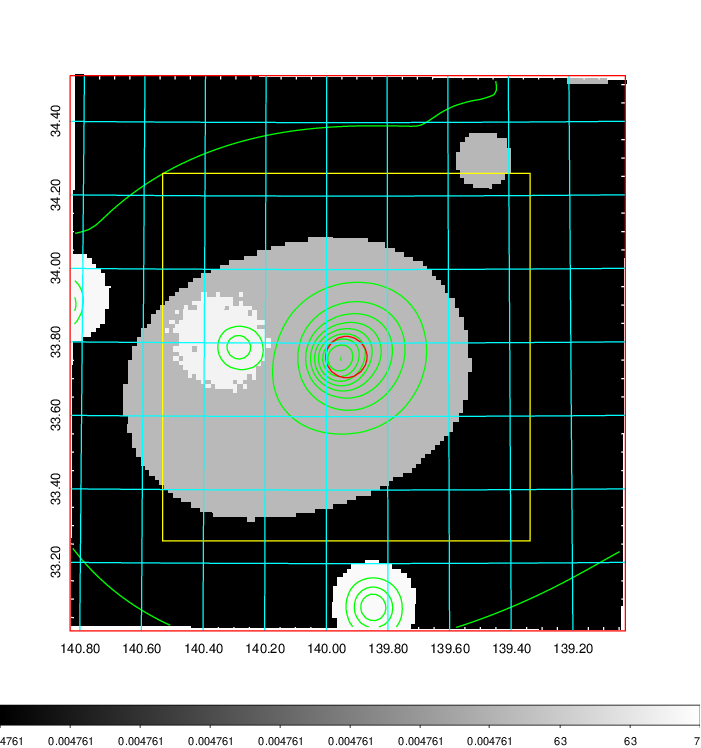  |

|[Exposure image](../image/315/315_mex.pdf)| [nH image](../image/315/315_nh.pdf)| [Planck image](../image/315/315_p.pdf)|
|-------------------|--------------------|-------------------|
|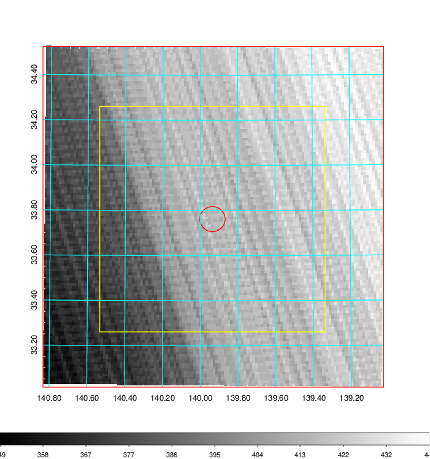   | 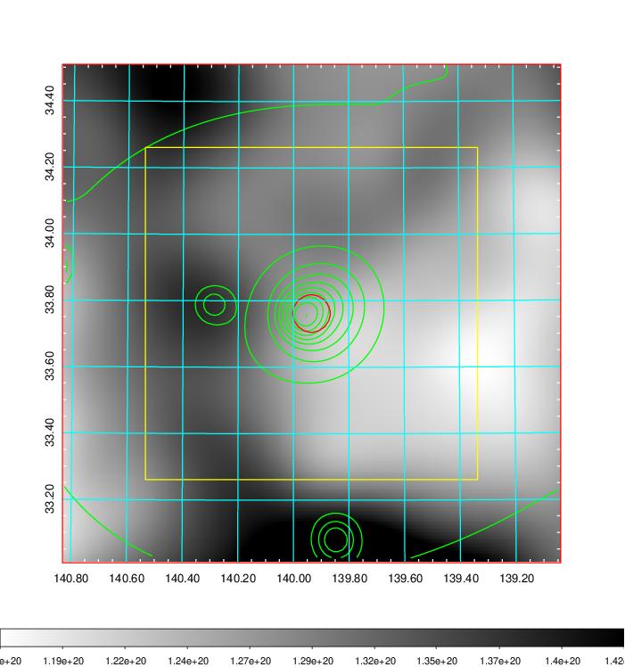    | 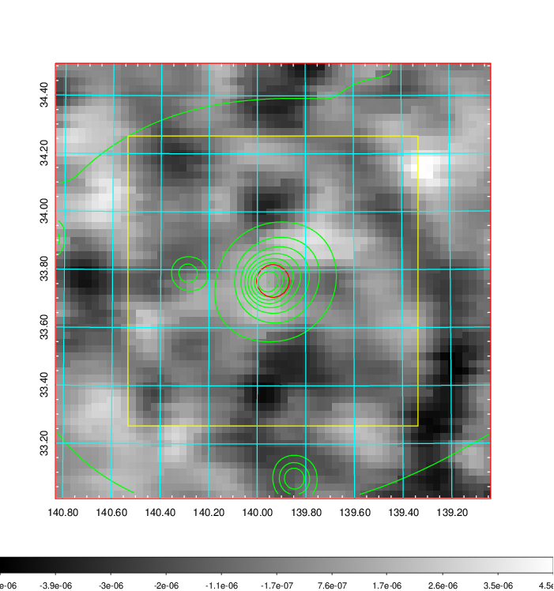 |

|[Redshift Histogram](../image/315/315_zg.pdf) | [DSS image(z1)](../image/315/315_dss_z1.pdf)      |  [DSS image(z2)](../image/315/315_dss_z2.pdf)    |
|-------------------|--------------------|-------------------|
|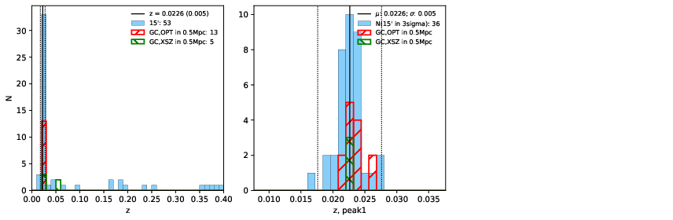 |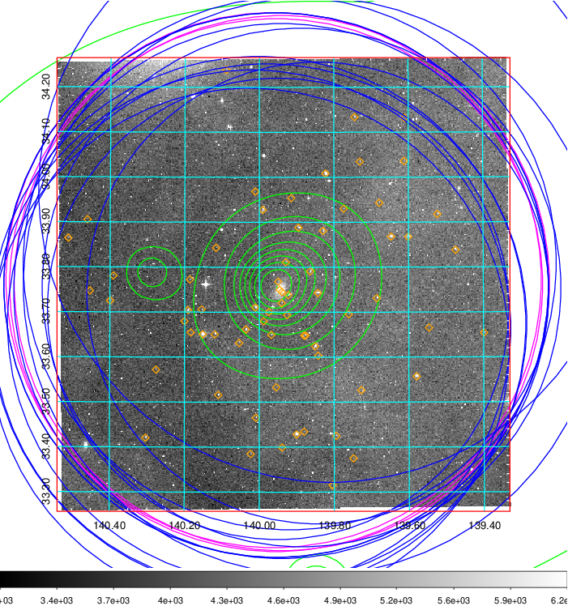  Blue circle for optical clusters;  Magenta circle for XSZ clusters;  all with r=1Mpc;  Only GC with Delta_z<0.01 are shown. | 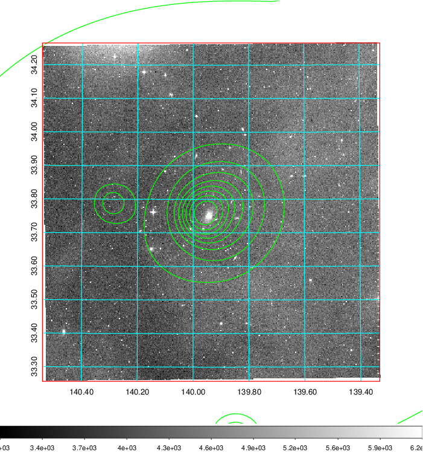 Blue circle for optical clusters;  Magenta circle for XSZ clusters;  all with r=1Mpc;  Only GC with Delta_z<0.01 are shown.  |

|[Previous-identified clusters](../image/315/315_gc.pdf) | [2MASS image](../image/315/315_2mass.pdf)      |[SDSS image](../image/315/315_sdss.pdf)   |
|-------------------|-------------------|-------------------|
|  Green, magenta, and blue circles  for optical, X-ray and SZ clusters  respectively, with redshift of clusters  labelled. The radius of circles  are 1Mpc.|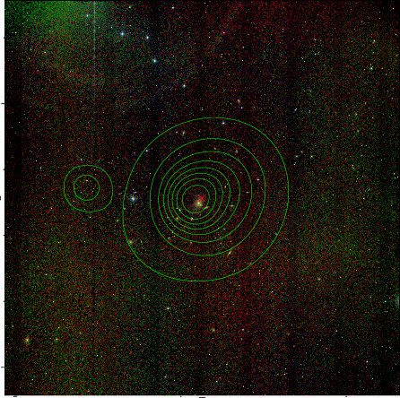  | 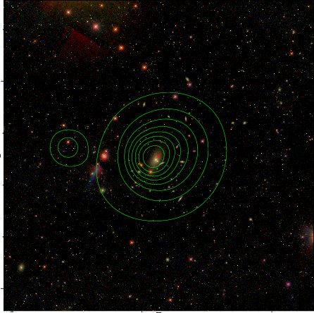  |

