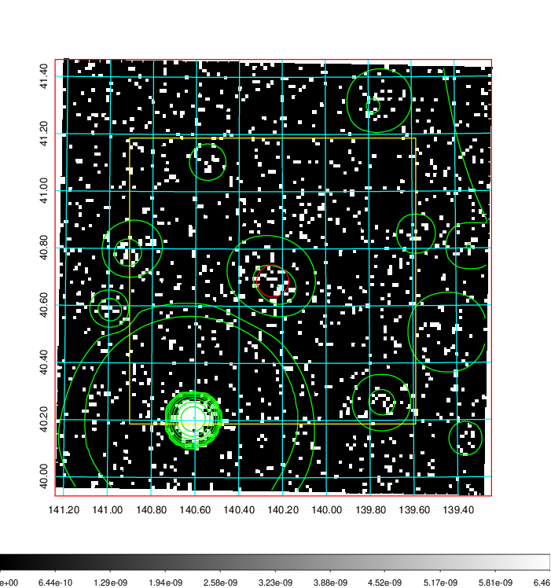
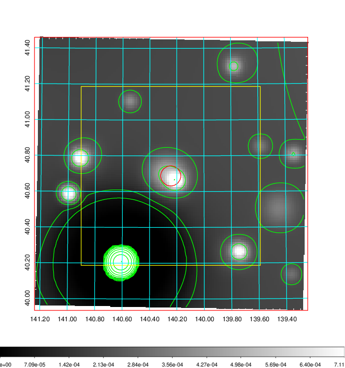
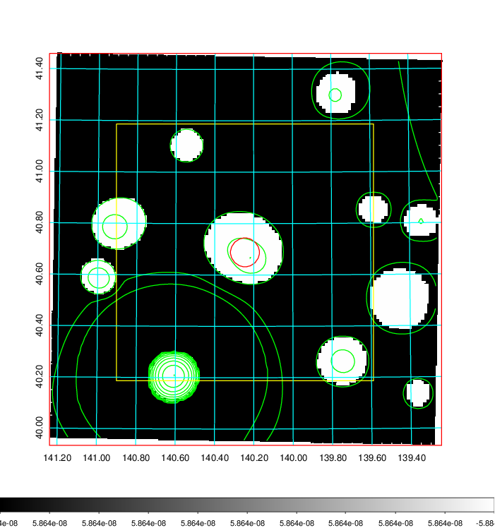
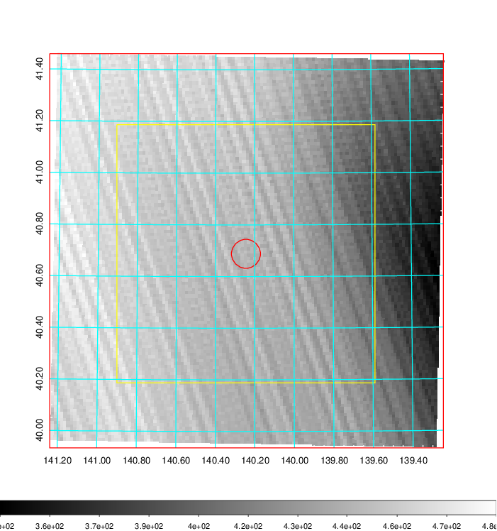
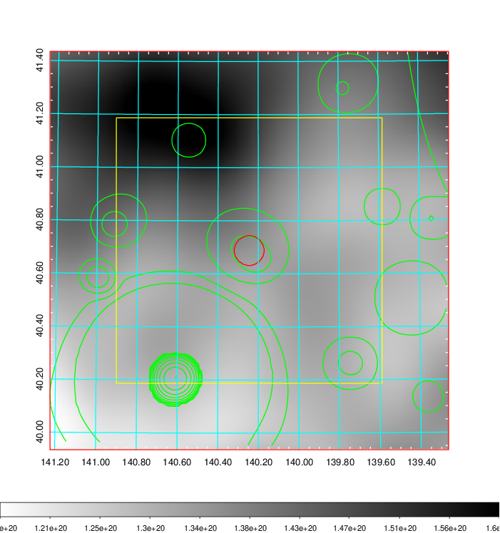
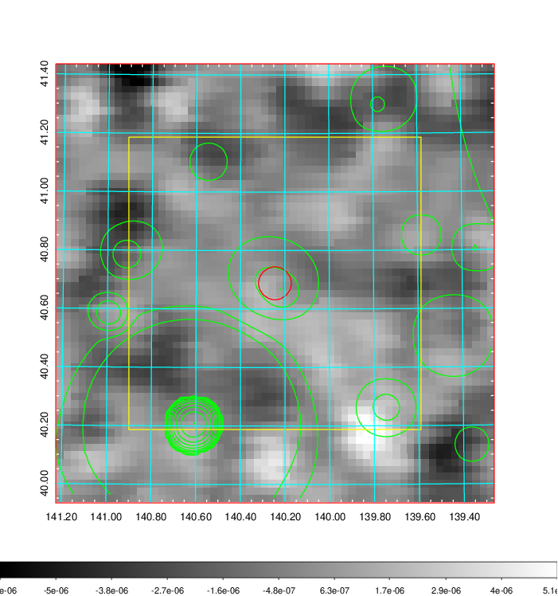
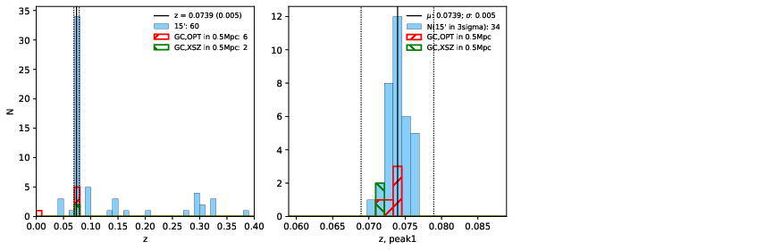
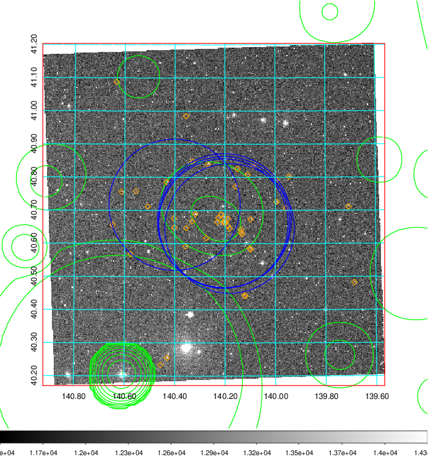
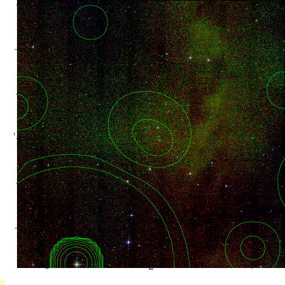
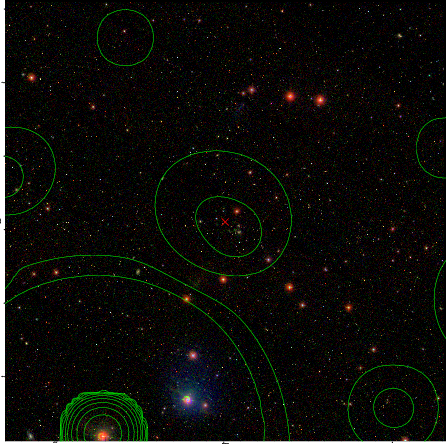

### 316

|Name|RAJ2000[deg]|DEJ2000[deg] |Ext[arcmin]| Ext,ml | z | z_src| C|GC(XSZ,Delta_z<0.01)| GC(OPT,Delta_z<0.01)|GC| R_sig[arcmin] | R500[arcmin] | R500[Mpc]| CRsig[c/s] | CR500[c/s] |L500[1E44 erg/s]|F500[1E-12 erg/s/cm^2]| M500[1E14 Msun]|Tx[keV]|Cnt_sig|Beta|Rc[arcmin]|Comment|Alias|
|---|---|---|---|---|---|------|---|--------|---------|----------|---|---|---|---|---|---|---|---|---|---|---|---|---|---|
|316| 140.245| 40.688| 3.37| 26.03| 0.0739(0.005)| z1, z_xsz| B| F20, SPI| N, W| F20, N, SPI, W| 7.338| 7.781| 0.656| 0.082(0.032)| 0.083(0.032)| 0.204(0.053)| 1.524(0.398)| 0.86(0.12)| 2.00(0.17)| 34.2| 0.869(-0.146+0.094)| 4.597(-1.014+0.830)| -| t156|

|[RASS image](../image/316/316_img.pdf)|[filtered image](../image/316/316_fil.pdf)|[Segment image](../image/316/316_seg.pdf)|
|-------------------|--------------------|-------------------|
|   |    |   |

|[Exposure image](../image/316/316_mex.pdf)| [nH image](../image/316/316_nh.pdf)| [Planck image](../image/316/316_p.pdf)|
|-------------------|--------------------|-------------------|
|   |     |  |

|[Redshift Histogram](../image/316/316_zg.pdf) | [DSS image(z1)](../image/316/316_dss_z1.pdf)      |  [DSS image(z2)](../image/316/316_dss_z2.pdf)    |
|-------------------|--------------------|-------------------|
| |  Blue circle for optical clusters;  Magenta circle for XSZ clusters;  all with r=1Mpc;  Only GC with Delta_z<0.01 are shown. |  Blue circle for optical clusters;  Magenta circle for XSZ clusters;  all with r=1Mpc;  Only GC with Delta_z<0.01 are shown.  |

|[Previous-identified clusters](../image/316/316_gc.pdf) | [2MASS image](../image/316/316_2mass.pdf)      |[SDSS image](../image/316/316_sdss.pdf)   |
|-------------------|-------------------|-------------------|
|  Green, magenta, and blue circles  for optical, X-ray and SZ clusters  respectively, with redshift of clusters  labelled. The radius of circles  are 1Mpc.|  |   |

