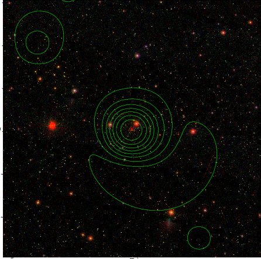

### 317

|Name|RAJ2000[deg]|DEJ2000[deg] |Ext[arcmin]| Ext,ml | z | z_src| C|GC(XSZ,Delta_z<0.01)| GC(OPT,Delta_z<0.01)|GC| R_sig[arcmin] | R500[arcmin] | R500[Mpc]| CRsig[c/s] | CR500[c/s] |L500[1E44 erg/s]|F500[1E-12 erg/s/cm^2]| M500[1E14 Msun]|Tx[keV]|Cnt_sig|Beta|Rc[arcmin]|Comment|Alias|
|---|---|---|---|---|---|------|---|--------|---------|----------|---|---|---|---|---|---|---|---|---|---|---|---|---|---|
|317| 141.023| 14.177| 1.17| 46.59| 0.1384(0.005)| z1, z_xsz| B| F20, MCXC, PSZ2, Tar, XB| A, C, N, W| A, C, F20, MCXC, N, PSZ2, Tar, W, XB| 7.338| 7.818| 1.146| 0.350(0.041)| 0.354(0.041)| 3.503(0.168)| 6.861(0.330)| 4.90(0.11)| 5.96(0.09)| 131.4| 0.890(-0.108+0.078)| 3.131(-0.564+0.404)| -| k055|

|[RASS image](../image/317/317_img.pdf)|[filtered image](../image/317/317_fil.pdf)|[Segment image](../image/317/317_seg.pdf)|
|-------------------|--------------------|-------------------|
|   |    |   |

|[Exposure image](../image/317/317_mex.pdf)| [nH image](../image/317/317_nh.pdf)| [Planck image](../image/317/317_p.pdf)|
|-------------------|--------------------|-------------------|
|   |     |  |

|[Redshift Histogram](../image/317/317_zg.pdf) | [DSS image(z1)](../image/317/317_dss_z1.pdf)      |  [DSS image(z2)](../image/317/317_dss_z2.pdf)    |
|-------------------|--------------------|-------------------|
| |  Blue circle for optical clusters;  Magenta circle for XSZ clusters;  all with r=1Mpc;  Only GC with Delta_z<0.01 are shown. |  Blue circle for optical clusters;  Magenta circle for XSZ clusters;  all with r=1Mpc;  Only GC with Delta_z<0.01 are shown.  |

|[Previous-identified clusters](../image/317/317_gc.pdf) | [2MASS image](../image/317/317_2mass.pdf)      |[SDSS image](../image/317/317_sdss.pdf)   |
|-------------------|-------------------|-------------------|
|  Green, magenta, and blue circles  for optical, X-ray and SZ clusters  respectively, with redshift of clusters  labelled. The radius of circles  are 1Mpc.|  |   |

