

### 318

|Name|RAJ2000[deg]|DEJ2000[deg] |Ext[arcmin]| Ext,ml | z | z_src| C|GC(XSZ,Delta_z<0.01)| GC(OPT,Delta_z<0.01)|GC| R_sig[arcmin] | R500[arcmin] | R500[Mpc]| CRsig[c/s] | CR500[c/s] |L500[1E44 erg/s]|F500[1E-12 erg/s/cm^2]| M500[1E14 Msun]|Tx[keV]|Cnt_sig|Beta|Rc[arcmin]|Comment|Alias|
|---|---|---|---|---|---|------|---|--------|---------|----------|---|---|---|---|---|---|---|---|---|---|---|---|---|---|
|318| 142.733| 28.827| 2.61| 30.63| 0.2951(0.005)| z1, z_xsz| B| F20, PSZ2, SPI, Tar| C, W| C, F20, N, PSZ2, SPI, Tar, W| 15.138| 4.087| 1.080| 0.087(0.031)| 0.077(0.027)| 4.383(0.822)| 1.578(0.296)| 4.85(0.42)| 6.25(0.35)| 56.1| 0.932(-0.088+0.050)| 4.896(-0.598+0.523)| -| k322|

|[RASS image](../image/318/318_img.pdf)|[filtered image](../image/318/318_fil.pdf)|[Segment image](../image/318/318_seg.pdf)|
|-------------------|--------------------|-------------------|
| 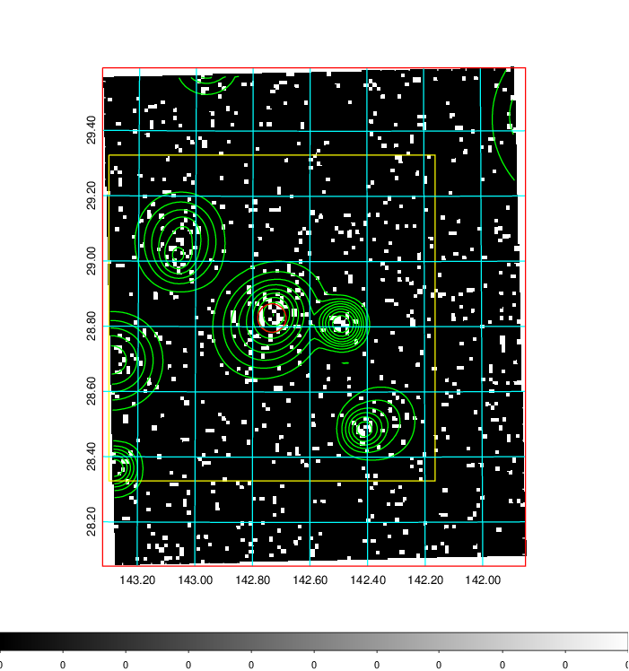  | 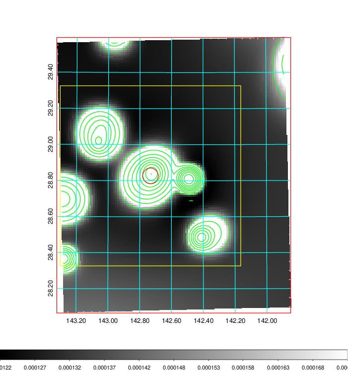   | 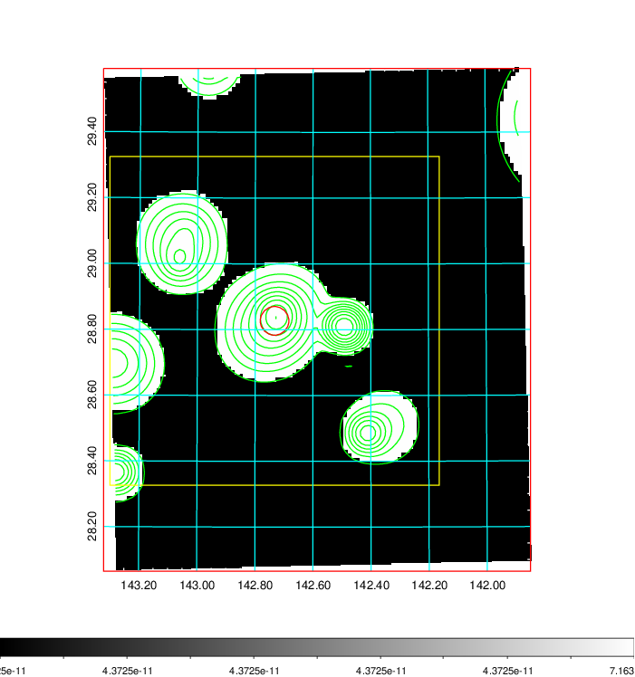  |

|[Exposure image](../image/318/318_mex.pdf)| [nH image](../image/318/318_nh.pdf)| [Planck image](../image/318/318_p.pdf)|
|-------------------|--------------------|-------------------|
|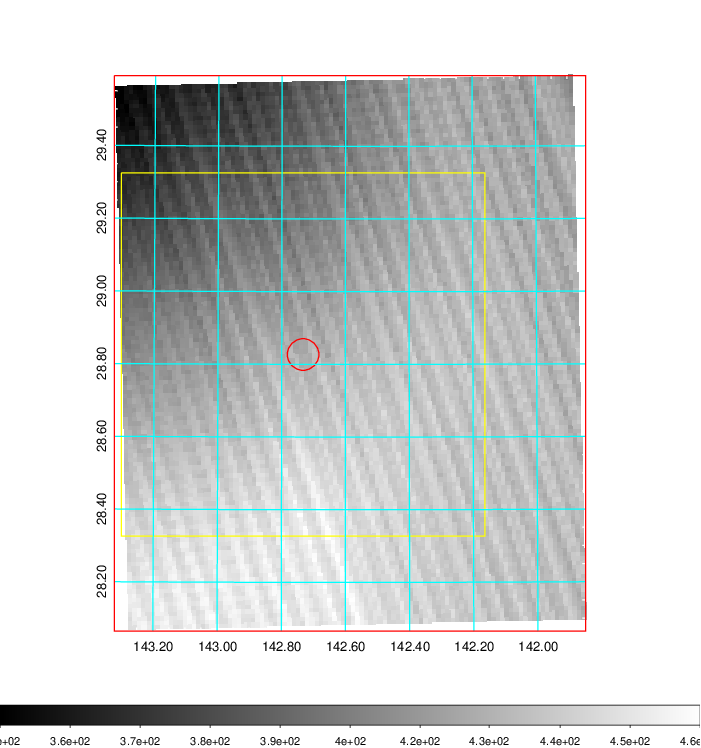   | 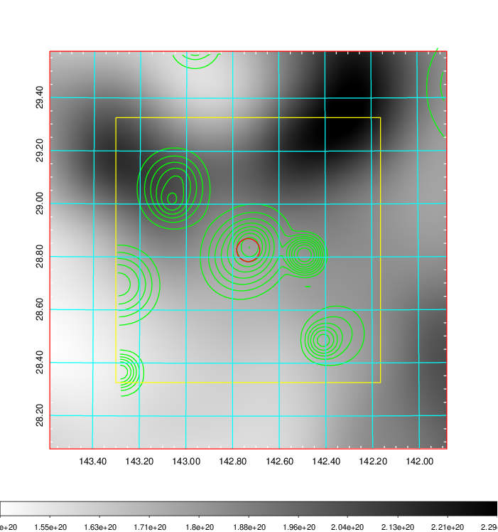    | 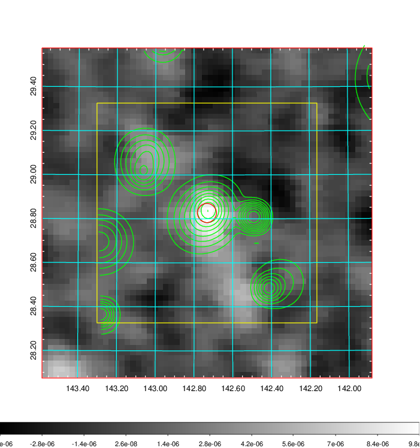 |

|[Redshift Histogram](../image/318/318_zg.pdf) | [DSS image(z1)](../image/318/318_dss_z1.pdf)      |  [DSS image(z2)](../image/318/318_dss_z2.pdf)    |
|-------------------|--------------------|-------------------|
|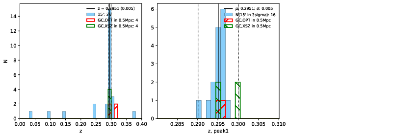 |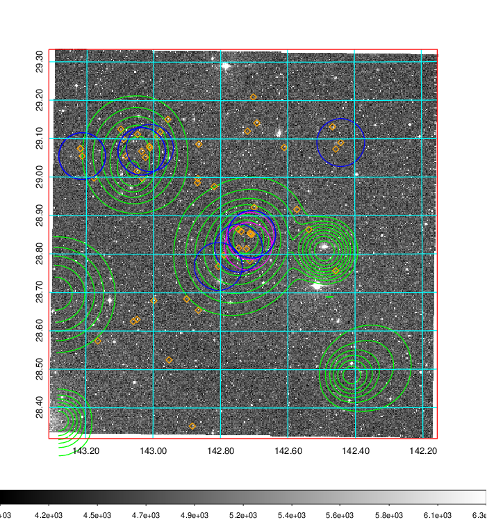  Blue circle for optical clusters;  Magenta circle for XSZ clusters;  all with r=1Mpc;  Only GC with Delta_z<0.01 are shown. | 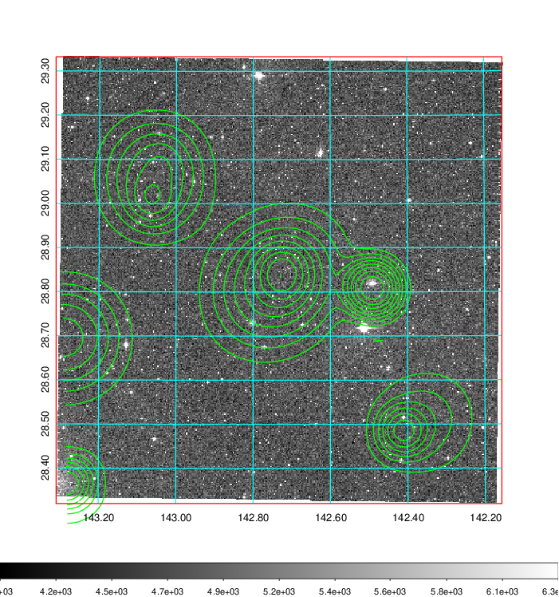 Blue circle for optical clusters;  Magenta circle for XSZ clusters;  all with r=1Mpc;  Only GC with Delta_z<0.01 are shown.  |

|[Previous-identified clusters](../image/318/318_gc.pdf) | [2MASS image](../image/318/318_2mass.pdf)      |[SDSS image](../image/318/318_sdss.pdf)   |
|-------------------|-------------------|-------------------|
|  Green, magenta, and blue circles  for optical, X-ray and SZ clusters  respectively, with redshift of clusters  labelled. The radius of circles  are 1Mpc.|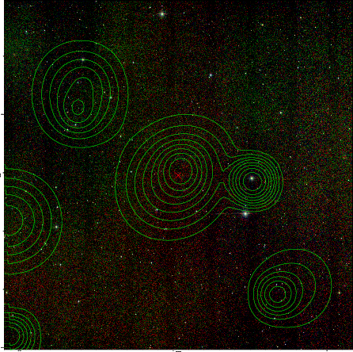  | 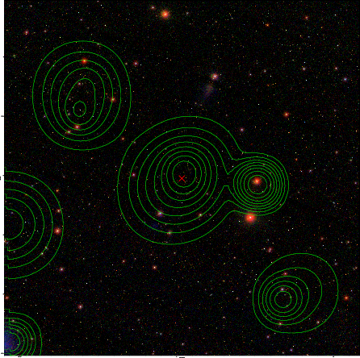  |

