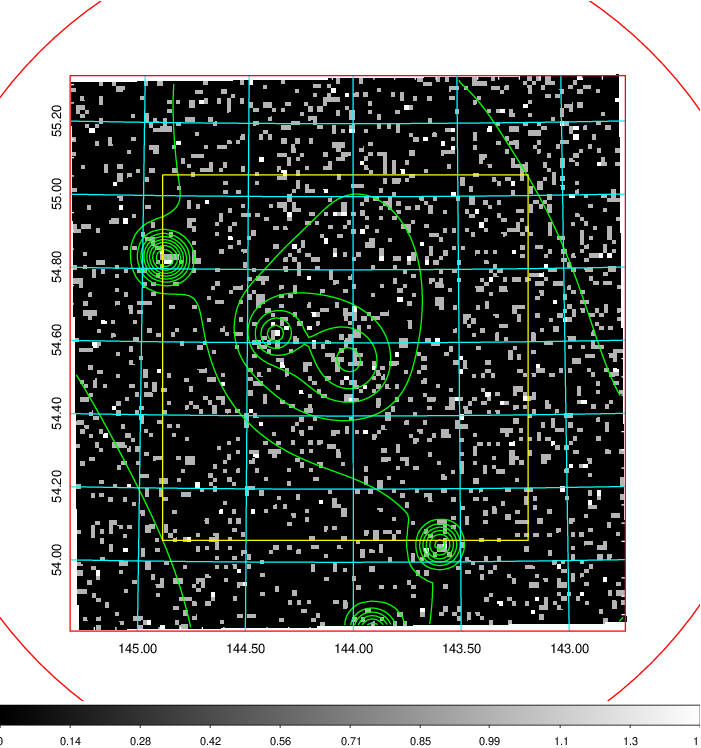
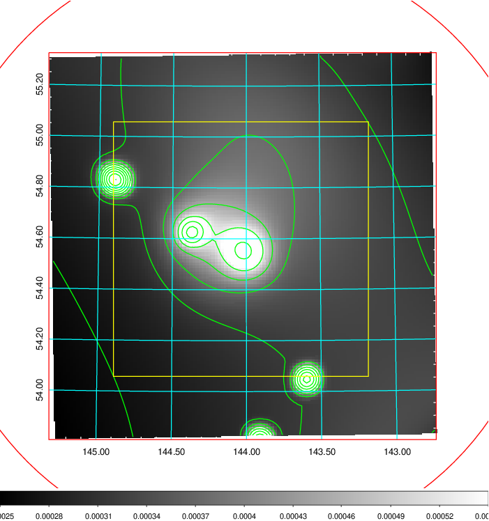
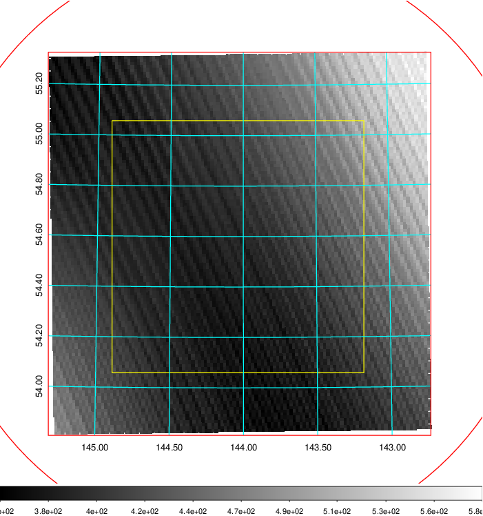
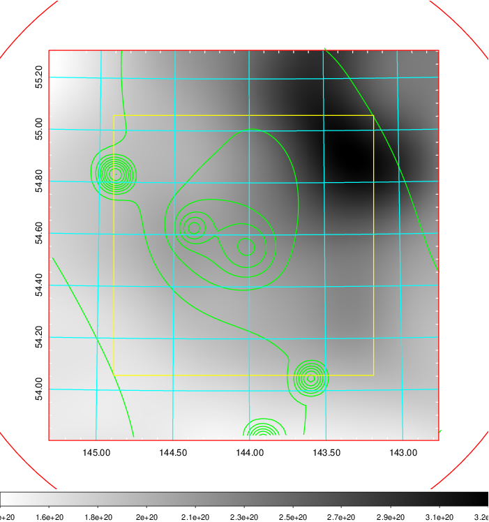
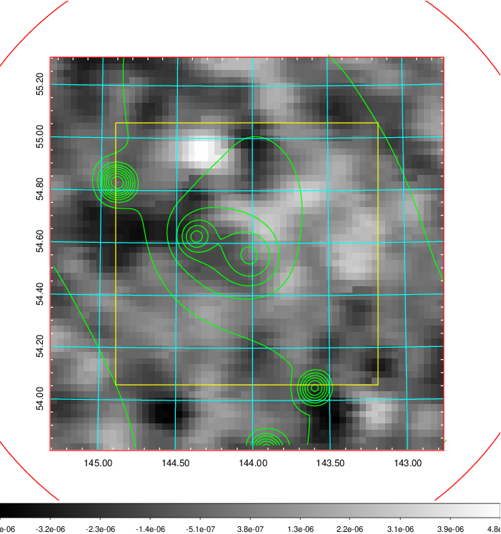
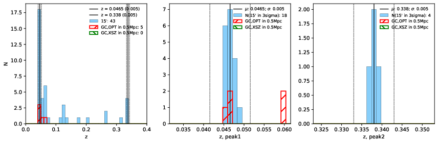
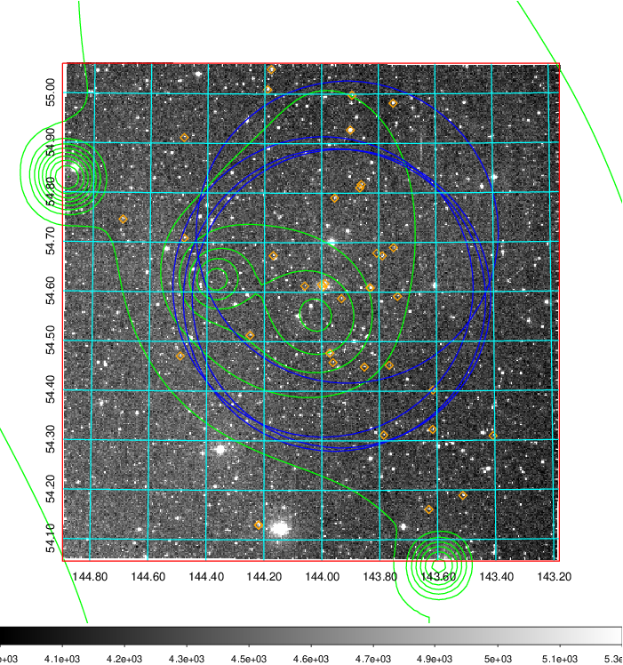
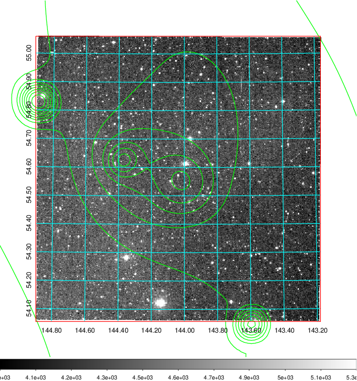
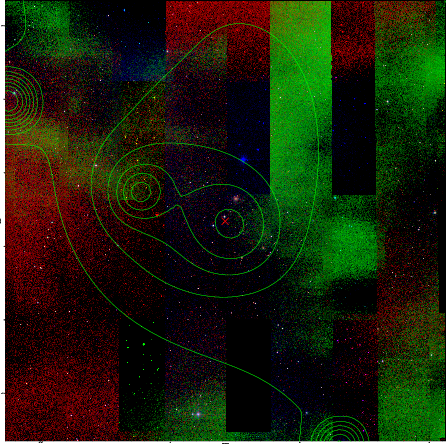

### 319

|Name|RAJ2000[deg]|DEJ2000[deg] |Ext[arcmin]| Ext,ml | z | z_src| C|GC(XSZ,Delta_z<0.01)| GC(OPT,Delta_z<0.01)|GC| R_sig[arcmin] | R500[arcmin] | R500[Mpc]| CRsig[c/s] | CR500[c/s] |L500[1E44 erg/s]|F500[1E-12 erg/s/cm^2]| M500[1E14 Msun]|Tx[keV]|Cnt_sig|Beta|Rc[arcmin]|Comment|Alias|
|---|---|---|---|---|---|------|---|--------|---------|----------|---|---|---|---|---|---|---|---|---|---|---|---|---|---|
|319| 144.037| 54.560| 70.97| 426.72| 0.0465(0.005)| z1, z_opt| S| -| N, W| N, W| 33.094| 13.434| 0.736| 0.381(0.086)| 0.388(0.079)| 0.346(0.118)| 6.803(2.319)| 1.18(0.21)| 2.41(0.27)| 385.1| 0.522(-0.017+0.039)| 7.548(-0.991+1.334)| -| t717|

|[RASS image](../image/319/319_img.pdf)|[filtered image](../image/319/319_fil.pdf)|[Segment image](../image/319/319_seg.pdf)|
|-------------------|--------------------|-------------------|
|   |    |   |

|[Exposure image](../image/319/319_mex.pdf)| [nH image](../image/319/319_nh.pdf)| [Planck image](../image/319/319_p.pdf)|
|-------------------|--------------------|-------------------|
|   |     |  |

|[Redshift Histogram](../image/319/319_zg.pdf) | [DSS image(z1)](../image/319/319_dss_z1.pdf)      |  [DSS image(z2)](../image/319/319_dss_z2.pdf)    |
|-------------------|--------------------|-------------------|
| |  Blue circle for optical clusters;  Magenta circle for XSZ clusters;  all with r=1Mpc;  Only GC with Delta_z<0.01 are shown. |  Blue circle for optical clusters;  Magenta circle for XSZ clusters;  all with r=1Mpc;  Only GC with Delta_z<0.01 are shown.  |

|[known Abell/XSZ clusters](../image/319/319_gc.pdf) | [2MASS image](../image/319/319_2mass.pdf)      |
|-------------------|-------------------|
|  Magenta, blue and green circles  for optical, X-ray and SZ clusters  respectively, with redshift of clusters  labelled. The radius of circles  are 1Mpc.|  |

|[PS1 image](../image/319/319_ps1.pdf)            |
|-------------------|
|   |
