

### 32

|Name|RAJ2000[deg]|DEJ2000[deg] |Ext[arcmin]| Ext,ml | z | z_src| C|GC(XSZ,Delta_z<0.01)| GC(OPT,Delta_z<0.01)|GC| R_sig[arcmin] | R500[arcmin] | R500[Mpc]| CRsig[c/s] | CR500[c/s] |L500[1E44 erg/s]|F500[1E-12 erg/s/cm^2]| M500[1E14 Msun]|Tx[keV]|Cnt_sig|Beta|Rc[arcmin]|Comment|Alias|
|---|---|---|---|---|---|------|---|--------|---------|----------|---|---|---|---|---|---|---|---|---|---|---|---|---|---|
|32| 10.535| -28.534| 1.10| 57.65| 0.1075(0.005)| z1, z_xsz| B| MCXC, PSZ2, Tar, XB| A| A, MCXC, N, PSZ2, Tar, W, XB| 8.312| 9.462| 1.116| 0.502(0.052)| 0.514(0.053)| 3.027(0.141)| 10.228(0.477)| 4.38(0.10)| 5.51(0.08)| 159.8| 0.924(-0.083+0.054)| 3.115(-0.394+0.290)| -| k044|

|[RASS image](../image/32/32_img.pdf)|[filtered image](../image/32/32_fil.pdf)|[Segment image](../image/32/32_seg.pdf)|
|-------------------|--------------------|-------------------|
| 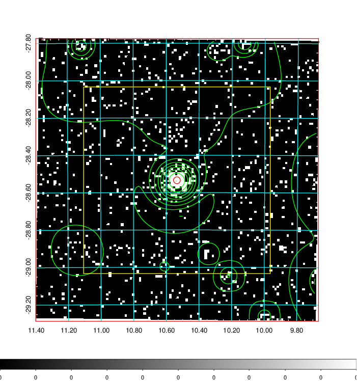  | 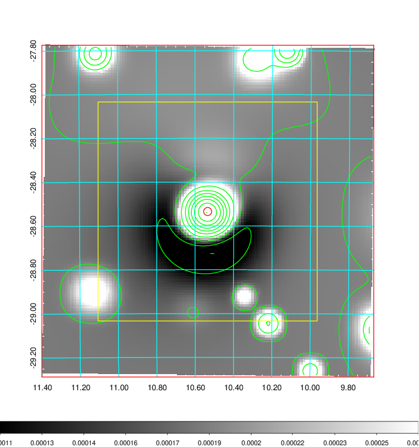   | 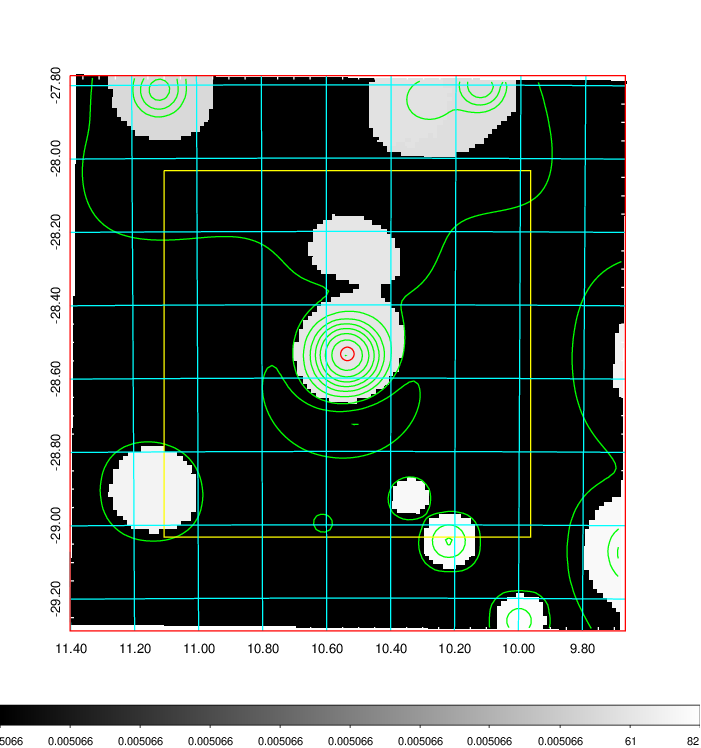  |

|[Exposure image](../image/32/32_mex.pdf)| [nH image](../image/32/32_nh.pdf)| [Planck image](../image/32/32_p.pdf)|
|-------------------|--------------------|-------------------|
|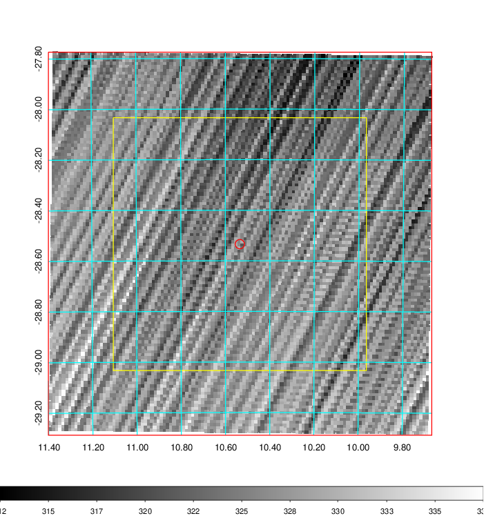   | 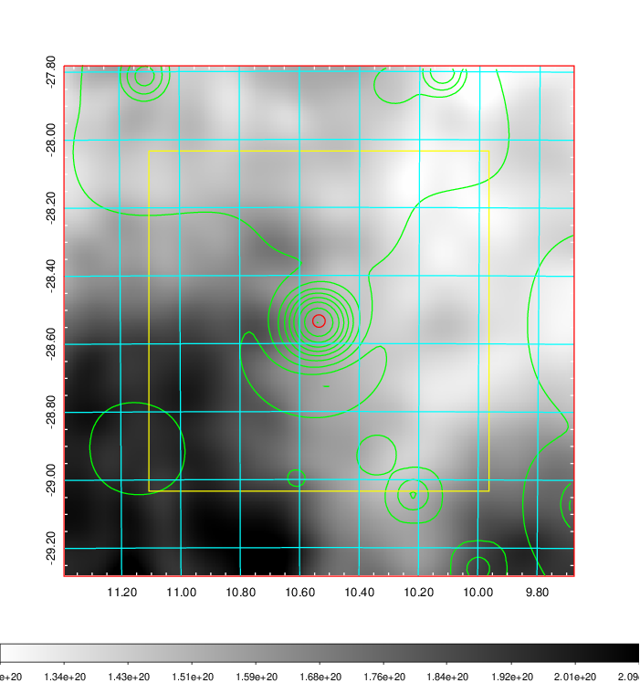    | 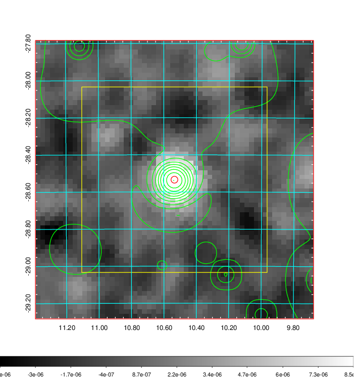 |

|[Redshift Histogram](../image/32/32_zg.pdf) | [DSS image(z1)](../image/32/32_dss_z1.pdf)      |  [DSS image(z2)](../image/32/32_dss_z2.pdf)    |
|-------------------|--------------------|-------------------|
|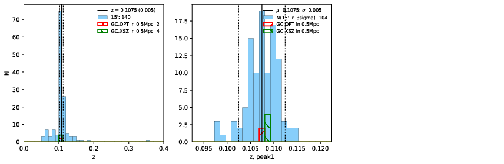 |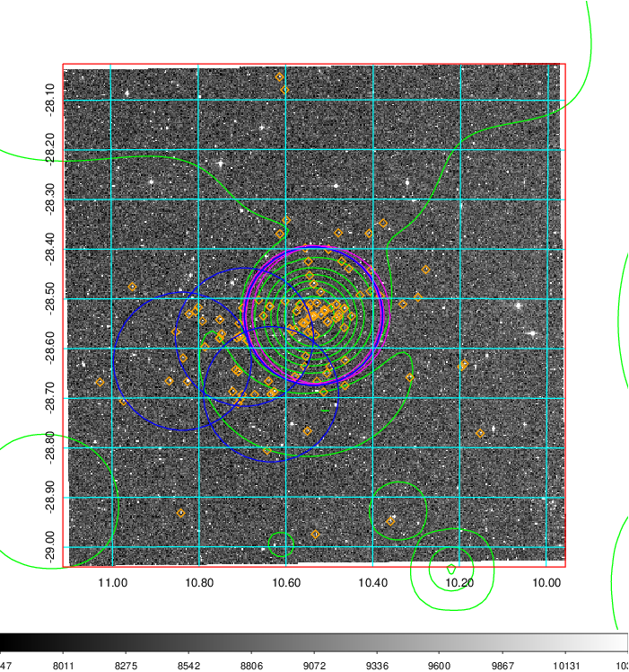  Blue circle for optical clusters;  Magenta circle for XSZ clusters;  all with r=1Mpc;  Only GC with Delta_z<0.01 are shown. | 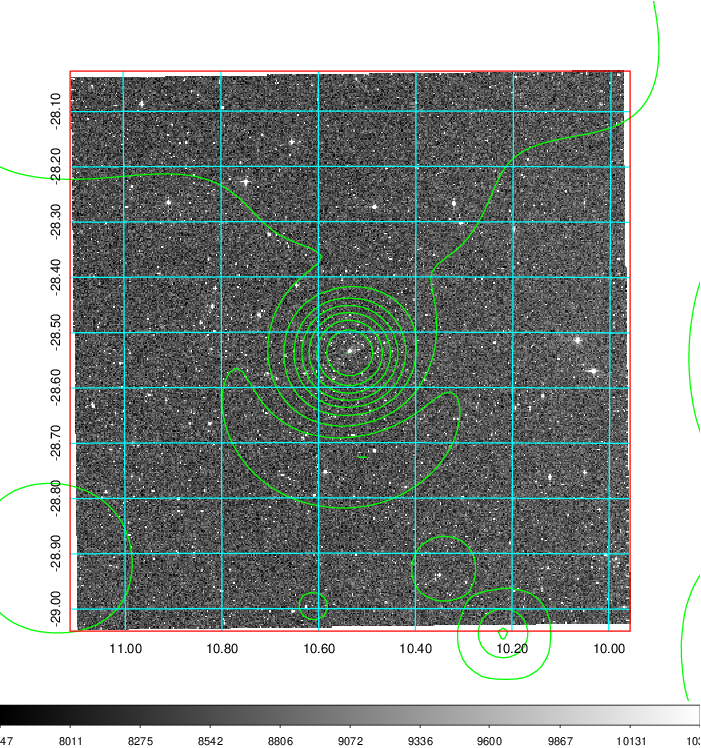 Blue circle for optical clusters;  Magenta circle for XSZ clusters;  all with r=1Mpc;  Only GC with Delta_z<0.01 are shown.  |

|[Previous-identified clusters](../image/32/32_gc.pdf) | [2MASS image](../image/32/32_2mass.pdf)      |
|-------------------|-------------------|
|  Green, magenta, and blue circles  for optical, X-ray and SZ clusters  respectively, with redshift of clusters  labelled. The radius of circles  are 1Mpc.|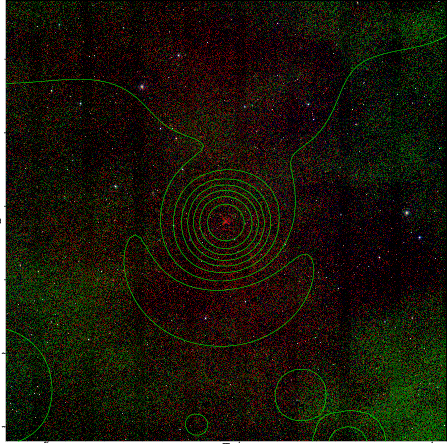  |

|[DES image](../image/32/32_des.pdf)   |[ATLAS image](../image/32/32_s.pdf)        |
|-------------------|-------------------|
| 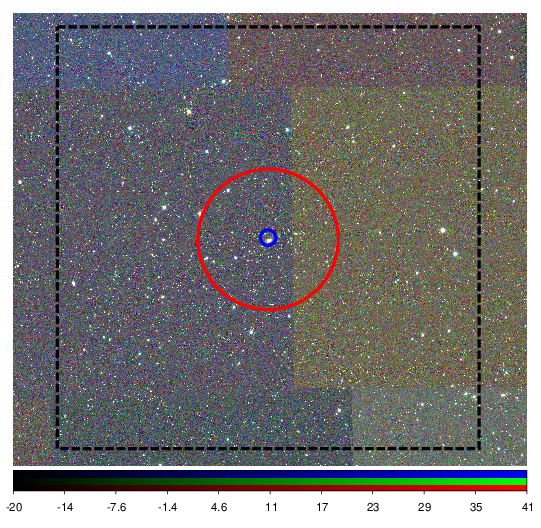  | 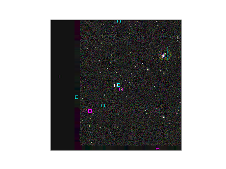  |
