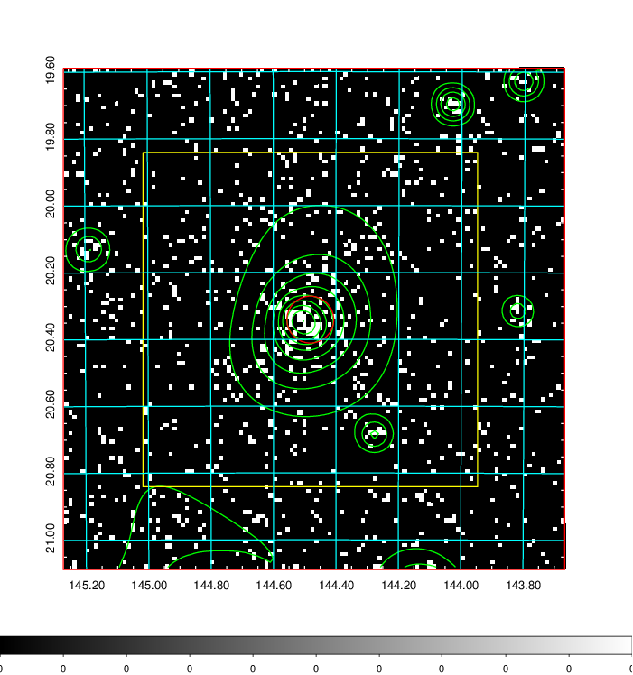
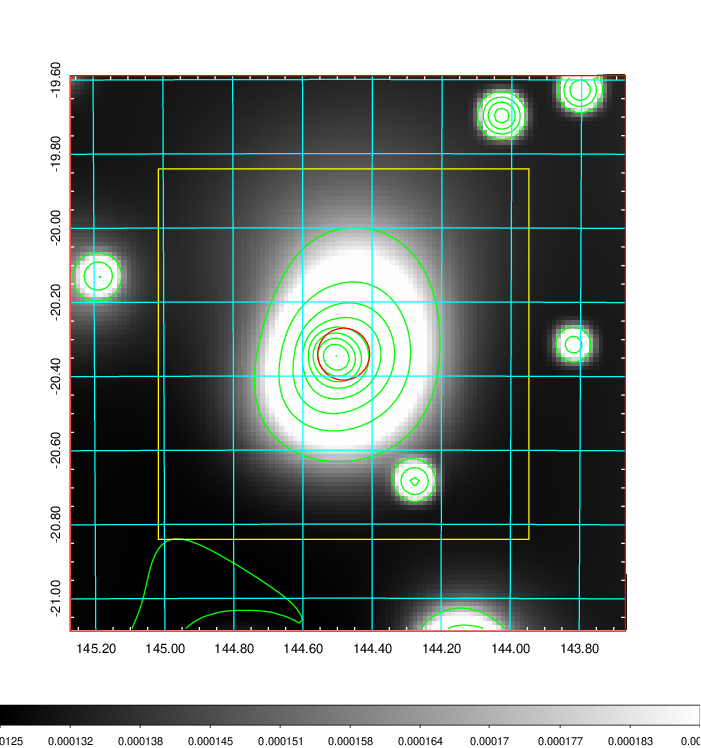
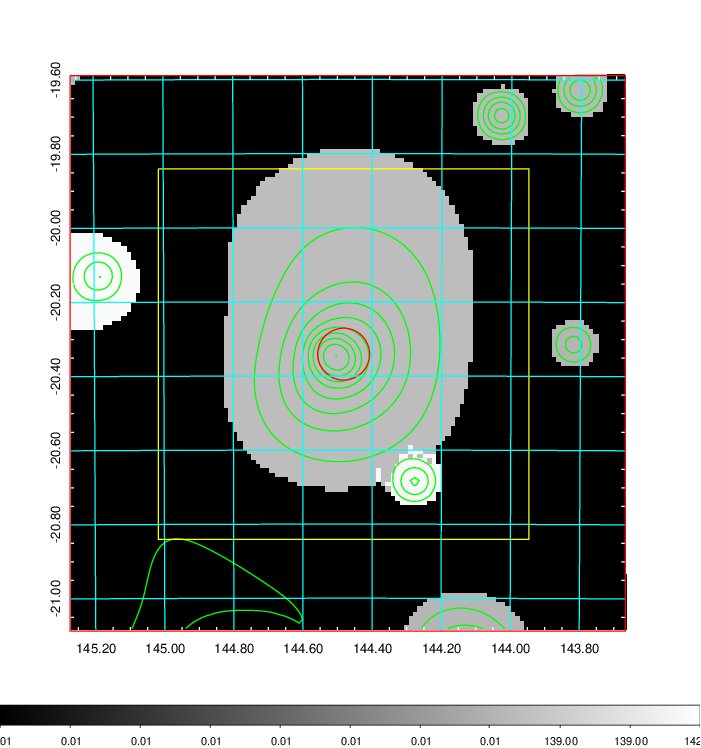
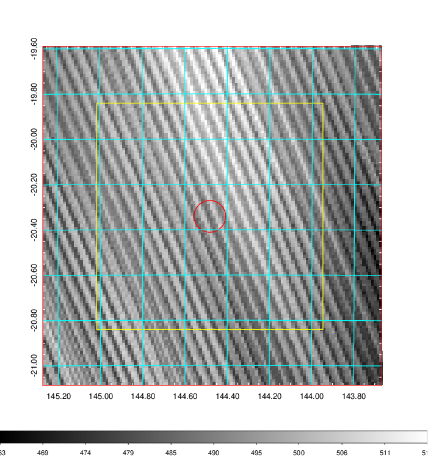
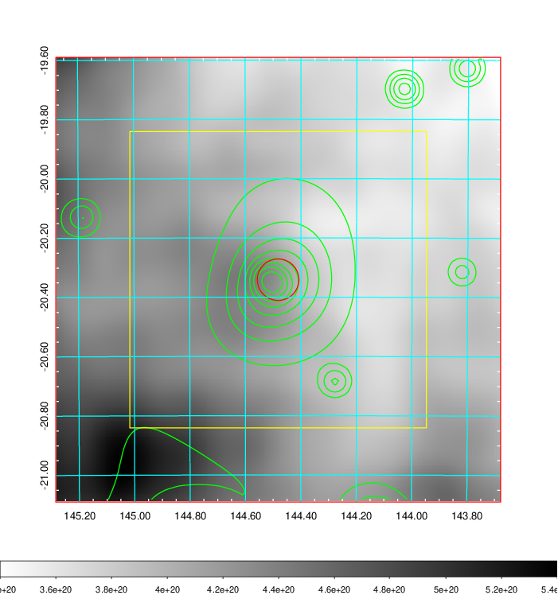
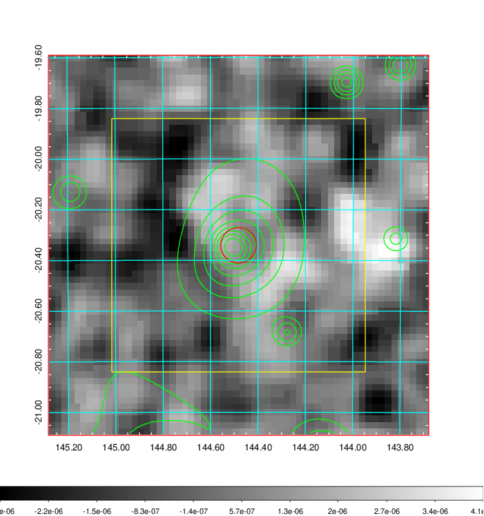
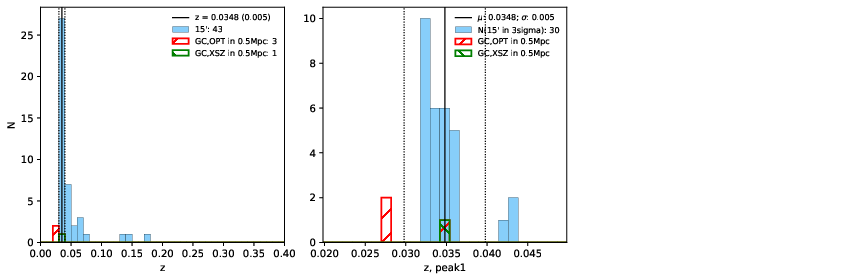
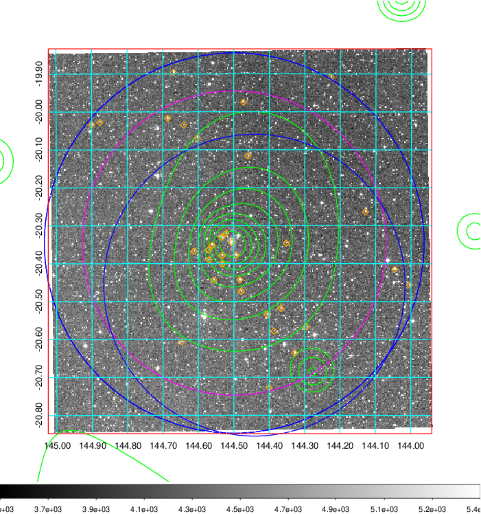
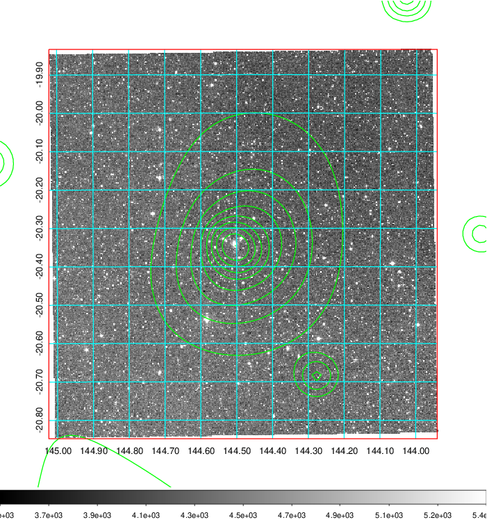
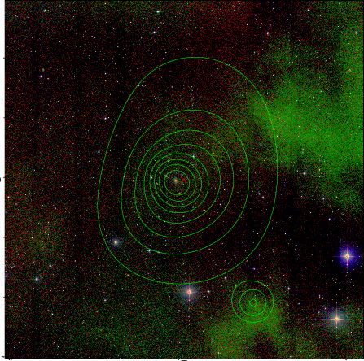

### 320

|Name|RAJ2000[deg]|DEJ2000[deg] |Ext[arcmin]| Ext,ml | z | z_src| C|GC(XSZ,Delta_z<0.01)| GC(OPT,Delta_z<0.01)|GC| R_sig[arcmin] | R500[arcmin] | R500[Mpc]| CRsig[c/s] | CR500[c/s] |L500[1E44 erg/s]|F500[1E-12 erg/s/cm^2]| M500[1E14 Msun]|Tx[keV]|Cnt_sig|Beta|Rc[arcmin]|Comment|Alias|
|---|---|---|---|---|---|------|---|--------|---------|----------|---|---|---|---|---|---|---|---|---|---|---|---|---|---|
|320| 144.482| -20.341| 4.21| 84.11| 0.0348(0.005)| z1, z_xsz| B| MCXC| A, N| A, MCXC, N| 20.256| 14.899| 0.619| 0.267(0.051)| 0.256(0.049)| 0.117(0.015)| 4.164(0.526)| 0.70(0.05)| 1.73(0.07)| 154.2| 0.884(-0.097+0.078)| 7.402(-1.080+0.825)| -| k491|

|[RASS image](../image/320/320_img.pdf)|[filtered image](../image/320/320_fil.pdf)|[Segment image](../image/320/320_seg.pdf)|
|-------------------|--------------------|-------------------|
|   |    |   |

|[Exposure image](../image/320/320_mex.pdf)| [nH image](../image/320/320_nh.pdf)| [Planck image](../image/320/320_p.pdf)|
|-------------------|--------------------|-------------------|
|   |     |  |

|[Redshift Histogram](../image/320/320_zg.pdf) | [DSS image(z1)](../image/320/320_dss_z1.pdf)      |  [DSS image(z2)](../image/320/320_dss_z2.pdf)    |
|-------------------|--------------------|-------------------|
| |  Blue circle for optical clusters;  Magenta circle for XSZ clusters;  all with r=1Mpc;  Only GC with Delta_z<0.01 are shown. |  Blue circle for optical clusters;  Magenta circle for XSZ clusters;  all with r=1Mpc;  Only GC with Delta_z<0.01 are shown.  |

|[known Abell/XSZ clusters](../image/320/320_gc.pdf) | [2MASS image](../image/320/320_2mass.pdf)      |
|-------------------|-------------------|
|  Magenta, blue and green circles  for optical, X-ray and SZ clusters  respectively, with redshift of clusters  labelled. The radius of circles  are 1Mpc.|  |

|[PS1 image](../image/320/320_ps1.pdf)            |
|-------------------|
|   |
