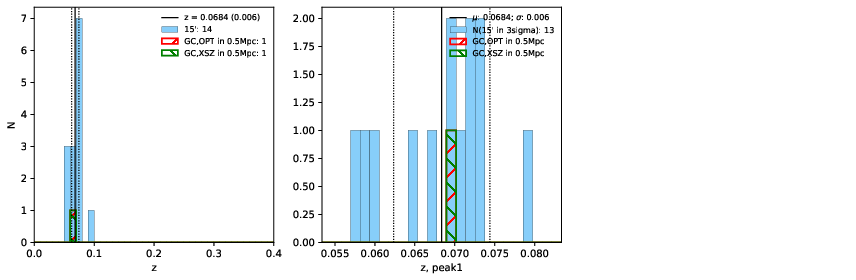

### 321

|Name|RAJ2000[deg]|DEJ2000[deg] |Ext[arcmin]| Ext,ml | z | z_src| C|GC(XSZ,Delta_z<0.01)| GC(OPT,Delta_z<0.01)|GC| R_sig[arcmin] | R500[arcmin] | R500[Mpc]| CRsig[c/s] | CR500[c/s] |L500[1E44 erg/s]|F500[1E-12 erg/s/cm^2]| M500[1E14 Msun]|Tx[keV]|Cnt_sig|Beta|Rc[arcmin]|Comment|Alias|
|---|---|---|---|---|---|------|---|--------|---------|----------|---|---|---|---|---|---|---|---|---|---|---|---|---|---|
|321| 144.615| -4.311| 6.42| 48.33| 0.0684(0.006)| z1, z_xsz| B| L03| W| A, L03, W| 24.206| 9.669| 0.759| 0.199(0.052)| 0.181(0.047)| 0.369(0.089)| 3.248(0.786)| 1.33(0.16)| 2.61(0.20)| 83.3| 0.788(-0.131+0.135)| 11.197(-2.430+2.218)| -| t324|

|[RASS image](../image/321/321_img.pdf)|[filtered image](../image/321/321_fil.pdf)|[Segment image](../image/321/321_seg.pdf)|
|-------------------|--------------------|-------------------|
|   |    |   |

|[Exposure image](../image/321/321_mex.pdf)| [nH image](../image/321/321_nh.pdf)| [Planck image](../image/321/321_p.pdf)|
|-------------------|--------------------|-------------------|
|   |     |  |

|[Redshift Histogram](../image/321/321_zg.pdf) | [DSS image(z1)](../image/321/321_dss_z1.pdf)      |  [DSS image(z2)](../image/321/321_dss_z2.pdf)    |
|-------------------|--------------------|-------------------|
| |  Blue circle for optical clusters;  Magenta circle for XSZ clusters;  all with r=1Mpc;  Only GC with Delta_z<0.01 are shown. |  Blue circle for optical clusters;  Magenta circle for XSZ clusters;  all with r=1Mpc;  Only GC with Delta_z<0.01 are shown.  |

|[known Abell/XSZ clusters](../image/321/321_gc.pdf) | [2MASS image](../image/321/321_2mass.pdf)      |
|-------------------|-------------------|
|  Magenta, blue and green circles  for optical, X-ray and SZ clusters  respectively, with redshift of clusters  labelled. The radius of circles  are 1Mpc.|  |

|[PS1 image](../image/321/321_ps1.pdf)            |
|-------------------|
|   |
