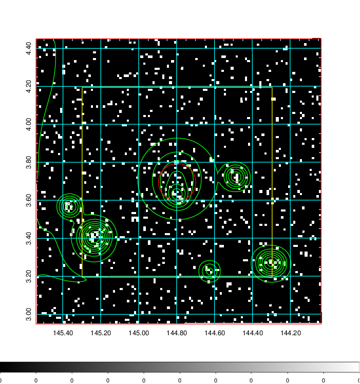
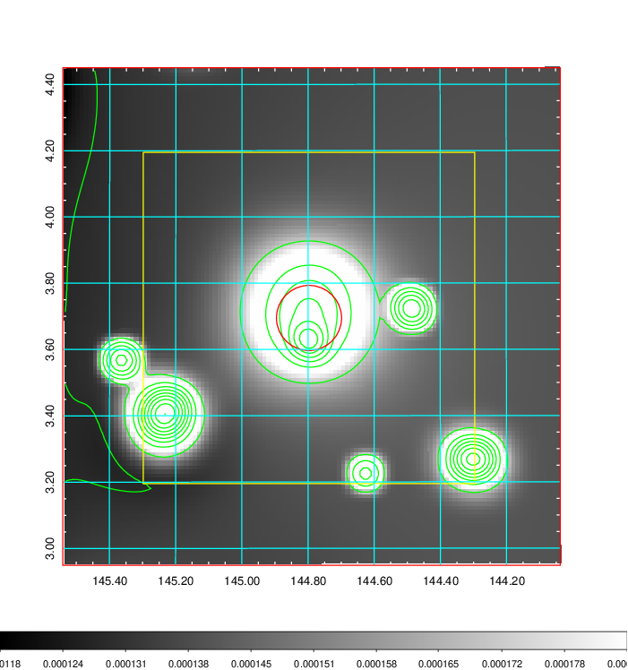
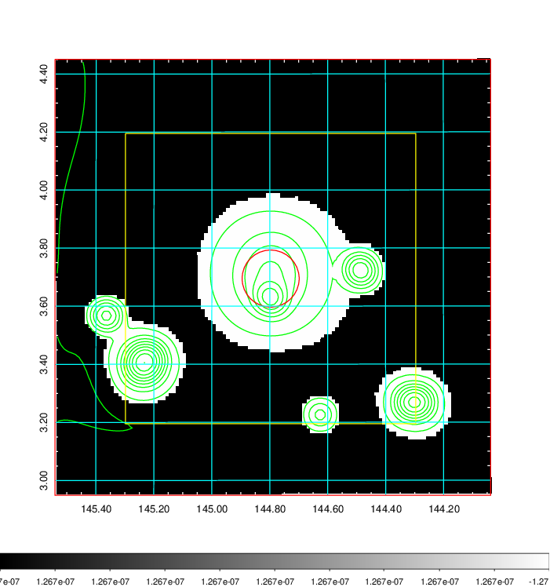
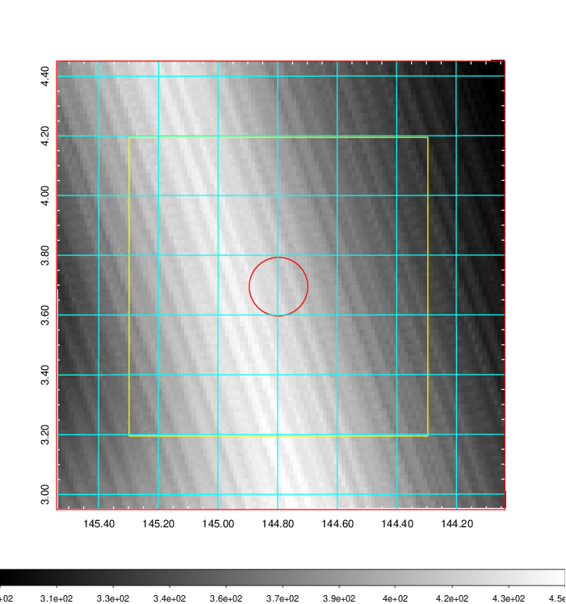
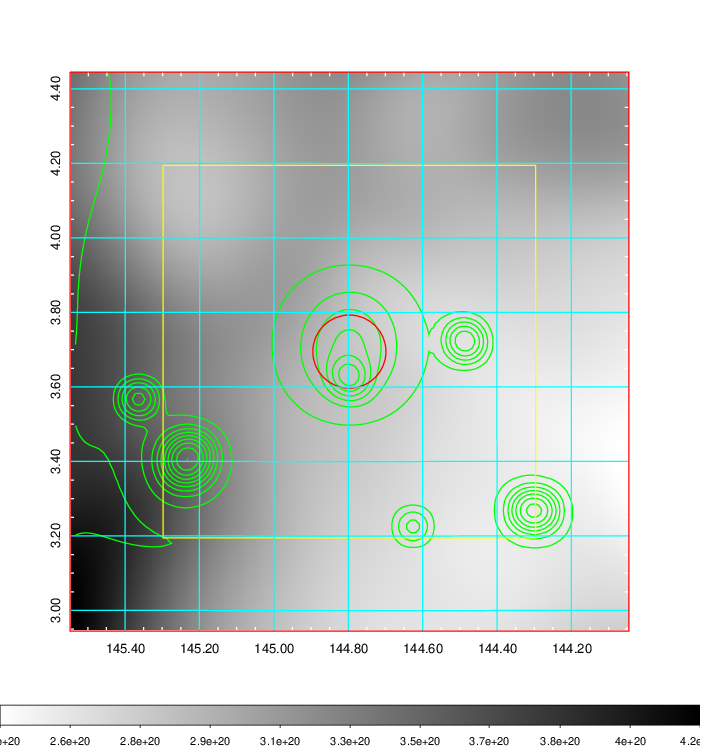
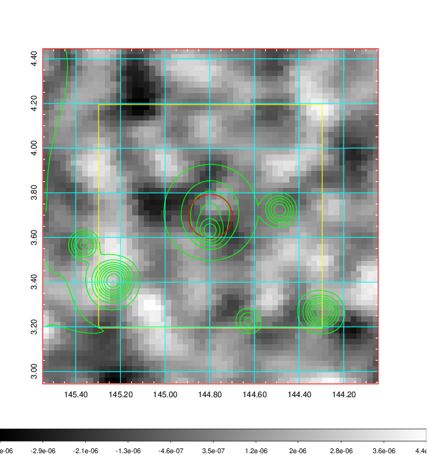
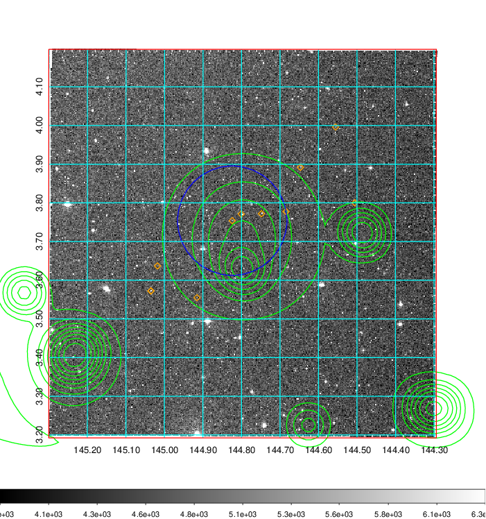
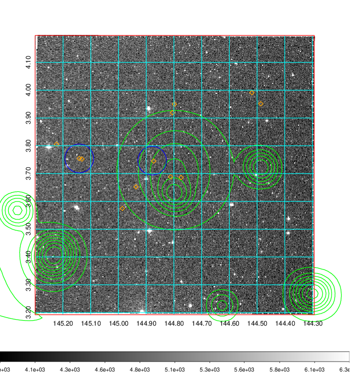
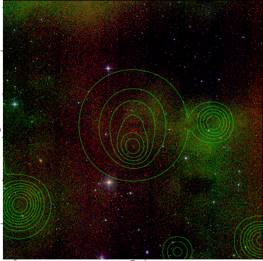

### 322

|Name|RAJ2000[deg]|DEJ2000[deg] |Ext[arcmin]| Ext,ml | z | z_src| C|GC(XSZ,Delta_z<0.01)| GC(OPT,Delta_z<0.01)|GC| R_sig[arcmin] | R500[arcmin] | R500[Mpc]| CRsig[c/s] | CR500[c/s] |L500[1E44 erg/s]|F500[1E-12 erg/s/cm^2]| M500[1E14 Msun]|Tx[keV]|Cnt_sig|Beta|Rc[arcmin]|Comment|Alias|
|---|---|---|---|---|---|------|---|--------|---------|----------|---|---|---|---|---|---|---|---|---|---|---|---|---|---|
|322| 144.797| 3.695| 5.90| 36.53| 0.1043(0.005)| z1, z_opt| S| -| N| F20, N, W| 43.075| 8.571| 0.984| 0.328(0.087)| 0.290(0.077)| 1.535(0.660)| 5.536(2.379)| 3.00(0.64)| 4.36(0.59)| 144.2| 0.507(-0.005+0.011)| 6.263(-0.536+0.476)| -| t304|

|[RASS image](../image/322/322_img.pdf)|[filtered image](../image/322/322_fil.pdf)|[Segment image](../image/322/322_seg.pdf)|
|-------------------|--------------------|-------------------|
|   |    |   |

|[Exposure image](../image/322/322_mex.pdf)| [nH image](../image/322/322_nh.pdf)| [Planck image](../image/322/322_p.pdf)|
|-------------------|--------------------|-------------------|
|   |     |  |

|[Redshift Histogram](../image/322/322_zg.pdf) | [DSS image(z1)](../image/322/322_dss_z1.pdf)      |  [DSS image(z2)](../image/322/322_dss_z2.pdf)    |
|-------------------|--------------------|-------------------|
| |  Blue circle for optical clusters;  Magenta circle for XSZ clusters;  all with r=1Mpc;  Only GC with Delta_z<0.01 are shown. |  Blue circle for optical clusters;  Magenta circle for XSZ clusters;  all with r=1Mpc;  Only GC with Delta_z<0.01 are shown.  |

|[Previous-identified clusters](../image/322/322_gc.pdf) | [2MASS image](../image/322/322_2mass.pdf)      |[SDSS image](../image/322/322_sdss.pdf)   |
|-------------------|-------------------|-------------------|
|  Green, magenta, and blue circles  for optical, X-ray and SZ clusters  respectively, with redshift of clusters  labelled. The radius of circles  are 1Mpc.|  |   |

