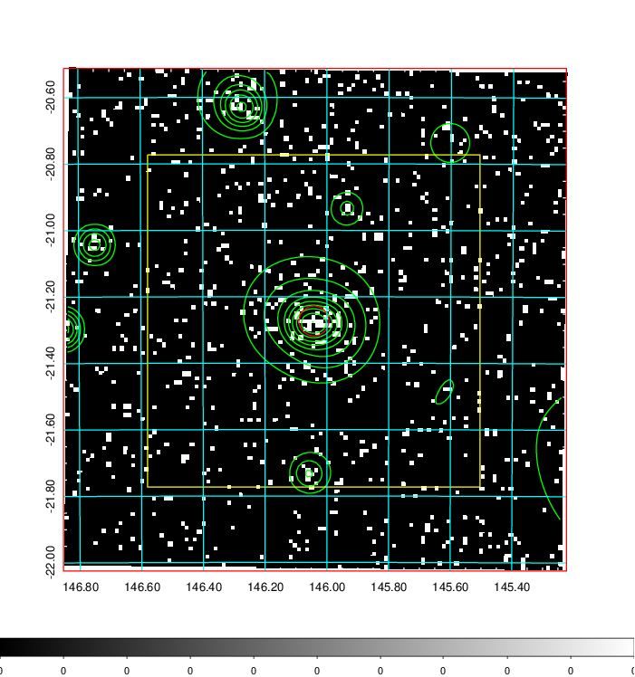
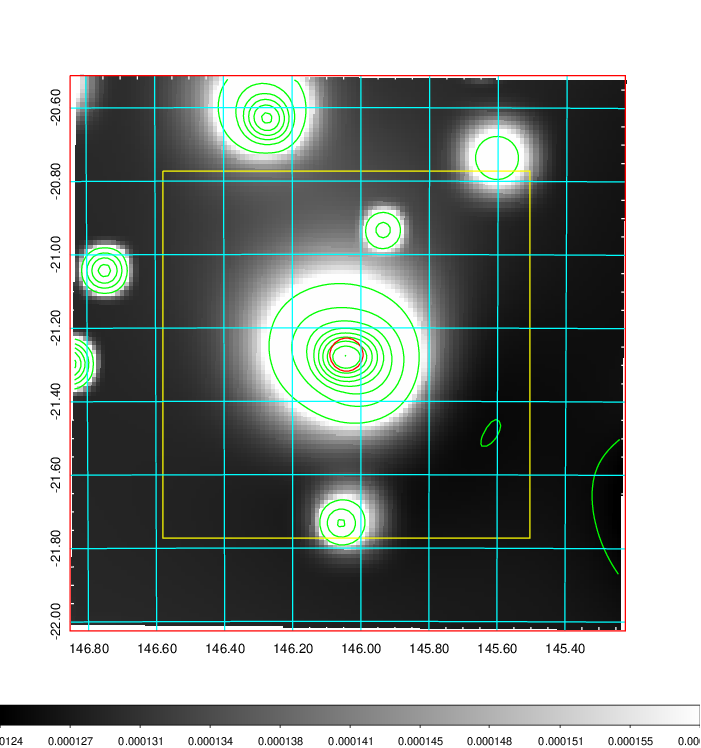
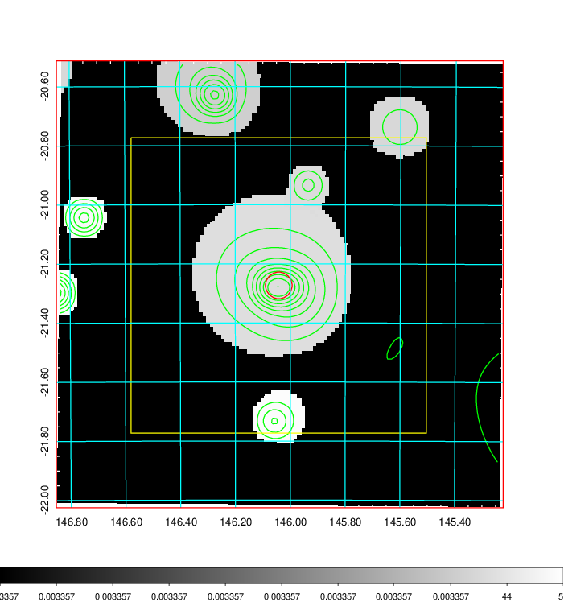
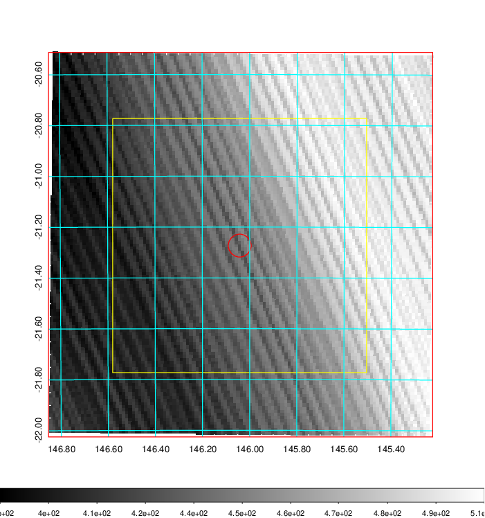
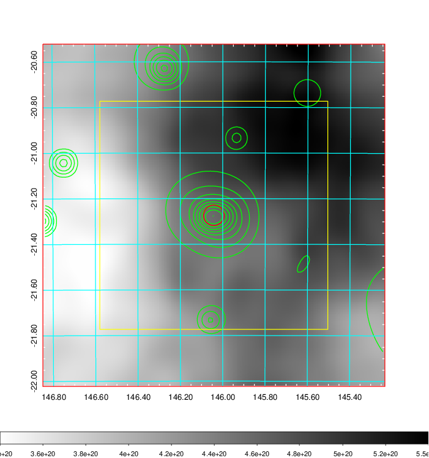
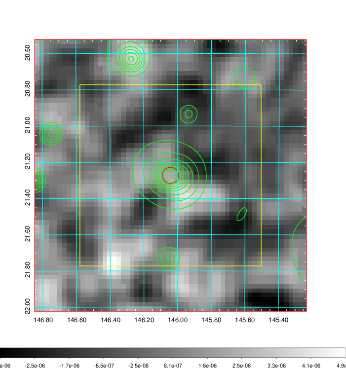
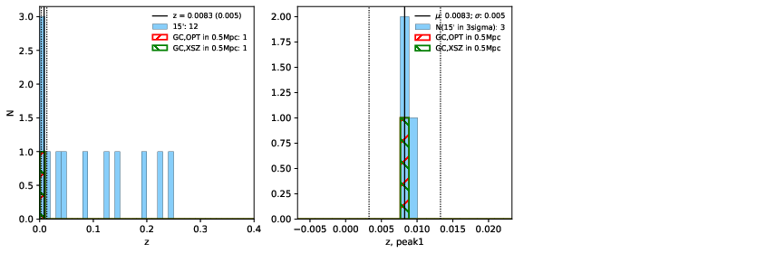
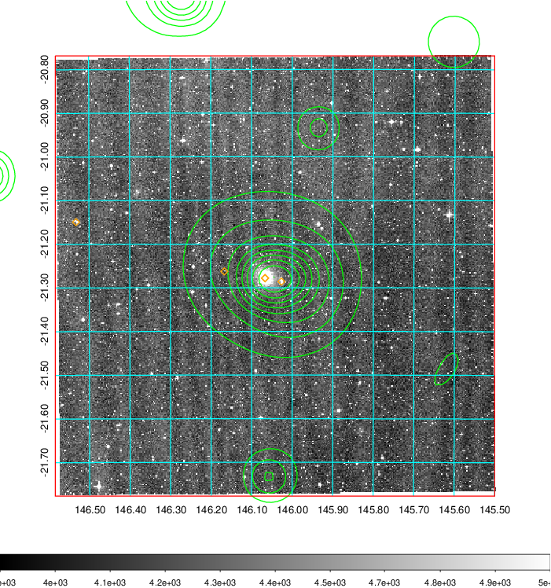
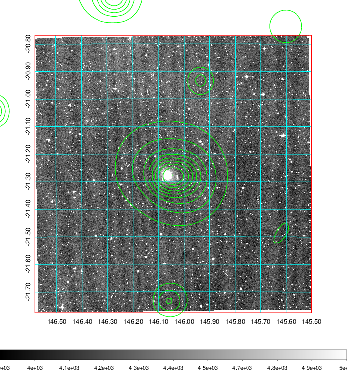
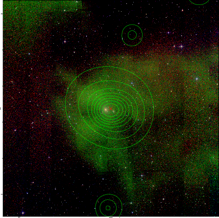

### 324

|Name|RAJ2000[deg]|DEJ2000[deg] |Ext[arcmin]| Ext,ml | z | z_src| C|GC(XSZ,Delta_z<0.01)| GC(OPT,Delta_z<0.01)|GC| R_sig[arcmin] | R500[arcmin] | R500[Mpc]| CRsig[c/s] | CR500[c/s] |L500[1E44 erg/s]|F500[1E-12 erg/s/cm^2]| M500[1E14 Msun]|Tx[keV]|Cnt_sig|Beta|Rc[arcmin]|Comment|Alias|
|---|---|---|---|---|---|------|---|--------|---------|----------|---|---|---|---|---|---|---|---|---|---|---|---|---|---|
|324| 146.042| -21.273| 2.71| 28.19| 0.0083(0.005)| z1, z_xsz| B| MCXC| N| MCXC, N, W| 11.238| 35.116| 0.359| 0.165(0.031)| 0.256(0.045)| 0.005(0.001)| 3.471(0.645)| 0.13(0.01)| 0.62(0.04)| 73.1| 0.698(-0.131+0.179)| 4.134(-1.391+1.592)| -| k339|

|[RASS image](../image/324/324_img.pdf)|[filtered image](../image/324/324_fil.pdf)|[Segment image](../image/324/324_seg.pdf)|
|-------------------|--------------------|-------------------|
|   |    |   |

|[Exposure image](../image/324/324_mex.pdf)| [nH image](../image/324/324_nh.pdf)| [Planck image](../image/324/324_p.pdf)|
|-------------------|--------------------|-------------------|
|   |     |  |

|[Redshift Histogram](../image/324/324_zg.pdf) | [DSS image(z1)](../image/324/324_dss_z1.pdf)      |  [DSS image(z2)](../image/324/324_dss_z2.pdf)    |
|-------------------|--------------------|-------------------|
| |  Blue circle for optical clusters;  Magenta circle for XSZ clusters;  all with r=1Mpc;  Only GC with Delta_z<0.01 are shown. |  Blue circle for optical clusters;  Magenta circle for XSZ clusters;  all with r=1Mpc;  Only GC with Delta_z<0.01 are shown.  |

|[known Abell/XSZ clusters](../image/324/324_gc.pdf) | [2MASS image](../image/324/324_2mass.pdf)      |
|-------------------|-------------------|
|  Magenta, blue and green circles  for optical, X-ray and SZ clusters  respectively, with redshift of clusters  labelled. The radius of circles  are 1Mpc.|  |

|[PS1 image](../image/324/324_ps1.pdf)            |
|-------------------|
|   |
