

### 325

|Name|RAJ2000[deg]|DEJ2000[deg] |Ext[arcmin]| Ext,ml | z | z_src| C|GC(XSZ,Delta_z<0.01)| GC(OPT,Delta_z<0.01)|GC| R_sig[arcmin] | R500[arcmin] | R500[Mpc]| CRsig[c/s] | CR500[c/s] |L500[1E44 erg/s]|F500[1E-12 erg/s/cm^2]| M500[1E14 Msun]|Tx[keV]|Cnt_sig|Beta|Rc[arcmin]|Comment|Alias|
|---|---|---|---|---|---|------|---|--------|---------|----------|---|---|---|---|---|---|---|---|---|---|---|---|---|---|
|325| 146.089| 57.578| 6.15| 51.84| 0.1342(0.006)| z1,| G| -| -| C, N, W| 13.675| 6.019| 0.860| 0.108(0.041)| 0.099(0.037)| 0.938(0.210)| 1.965(0.439)| 2.06(0.23)| 3.49(0.25)| 104.6| 0.872(-0.137+0.091)| 5.535(-1.073+0.835)| -| t313|

|[RASS image](../image/325/325_img.pdf)|[filtered image](../image/325/325_fil.pdf)|[Segment image](../image/325/325_seg.pdf)|
|-------------------|--------------------|-------------------|
| 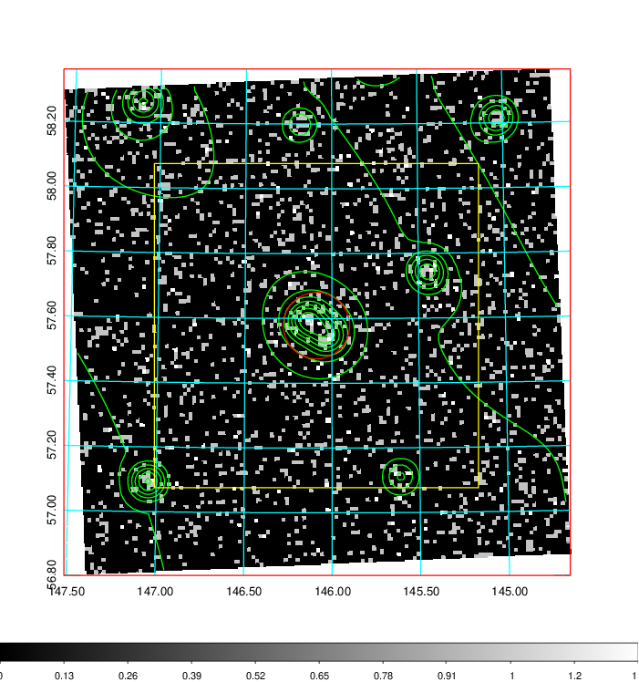  | 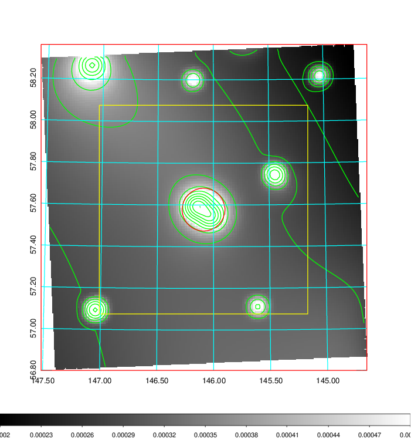   | 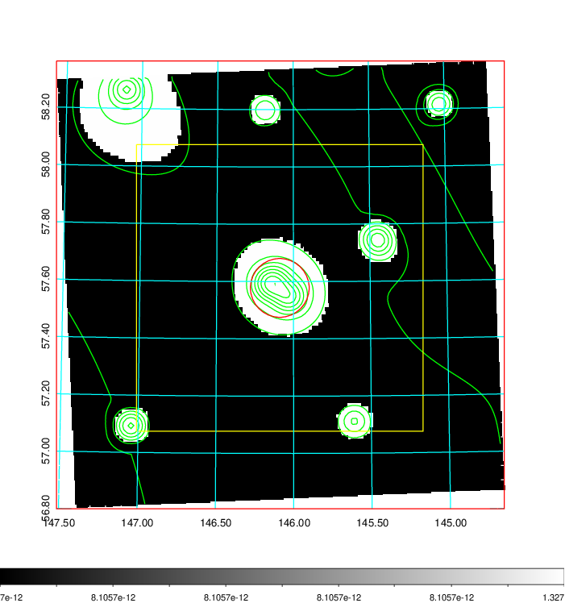  |

|[Exposure image](../image/325/325_mex.pdf)| [nH image](../image/325/325_nh.pdf)| [Planck image](../image/325/325_p.pdf)|
|-------------------|--------------------|-------------------|
|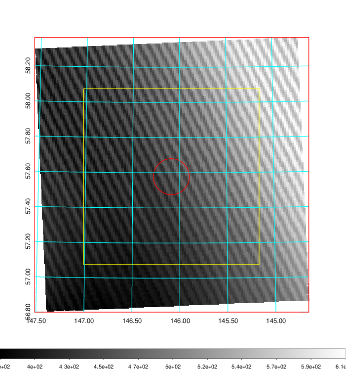   | 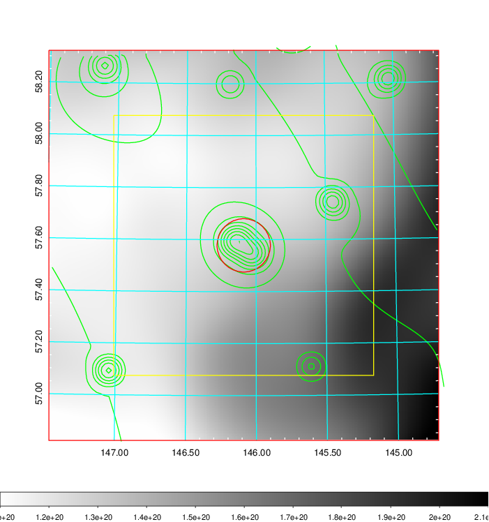    | 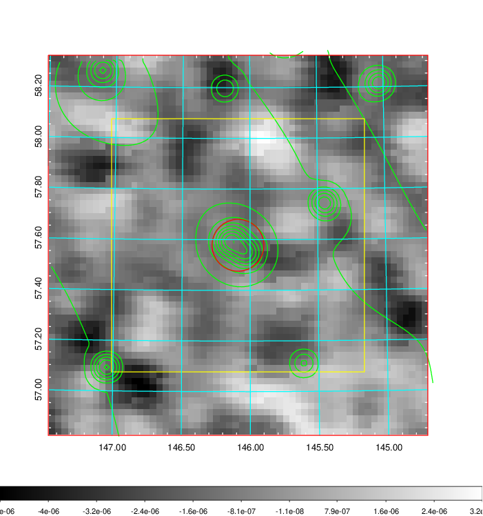 |

|[Redshift Histogram](../image/325/325_zg.pdf) | [DSS image(z1)](../image/325/325_dss_z1.pdf)      |  [DSS image(z2)](../image/325/325_dss_z2.pdf)    |
|-------------------|--------------------|-------------------|
|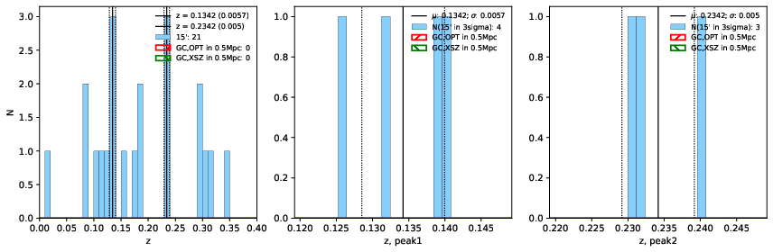 |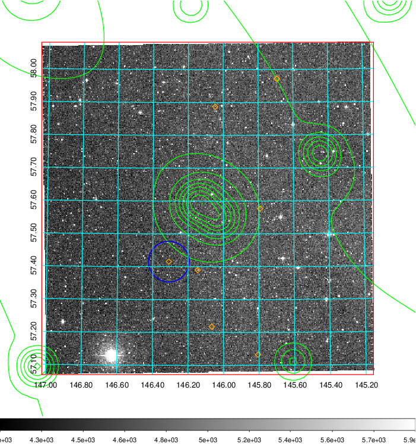  Blue circle for optical clusters;  Magenta circle for XSZ clusters;  all with r=1Mpc;  Only GC with Delta_z<0.01 are shown. | 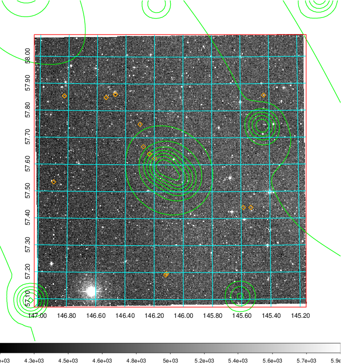 Blue circle for optical clusters;  Magenta circle for XSZ clusters;  all with r=1Mpc;  Only GC with Delta_z<0.01 are shown.  |

|[Previous-identified clusters](../image/325/325_gc.pdf) | [2MASS image](../image/325/325_2mass.pdf)      |[SDSS image](../image/325/325_sdss.pdf)   |
|-------------------|-------------------|-------------------|
|  Green, magenta, and blue circles  for optical, X-ray and SZ clusters  respectively, with redshift of clusters  labelled. The radius of circles  are 1Mpc.|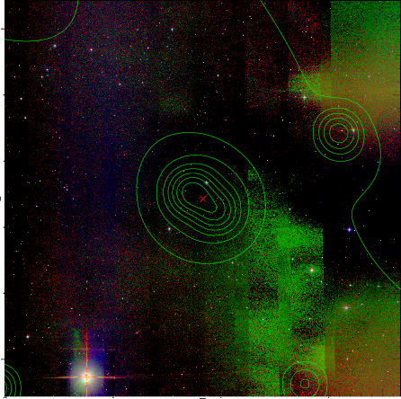  | 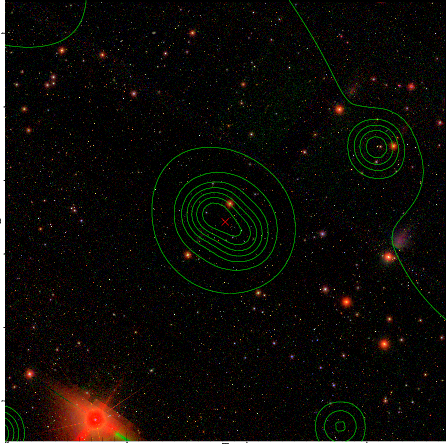  |

