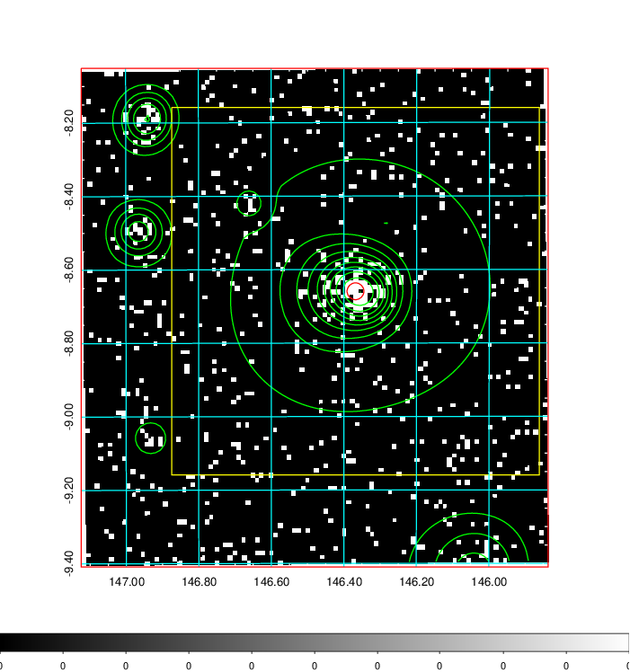
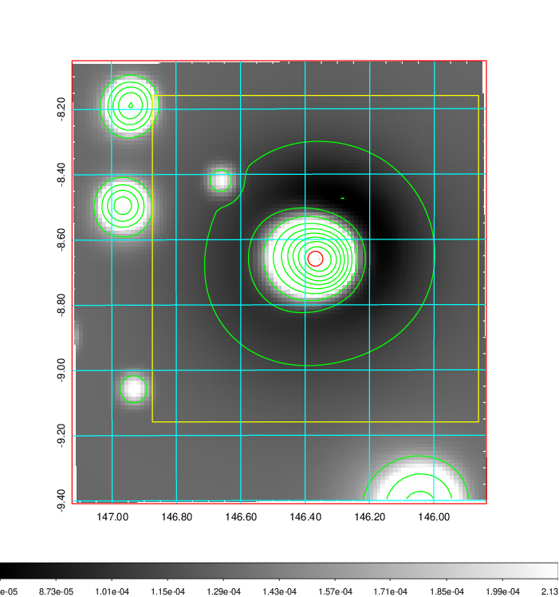
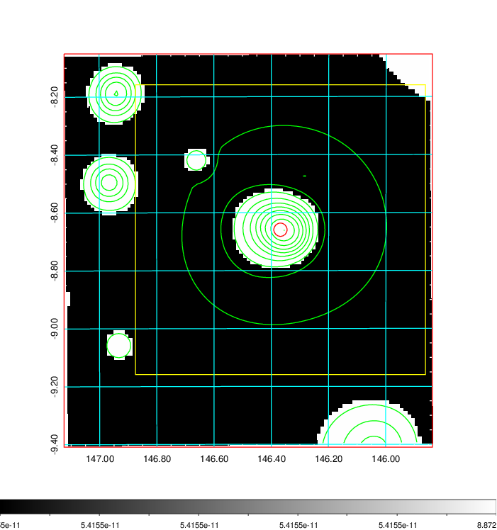
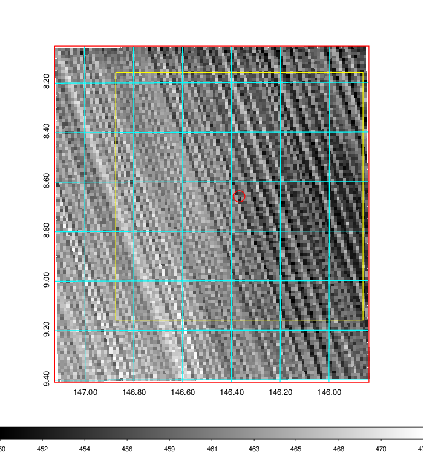
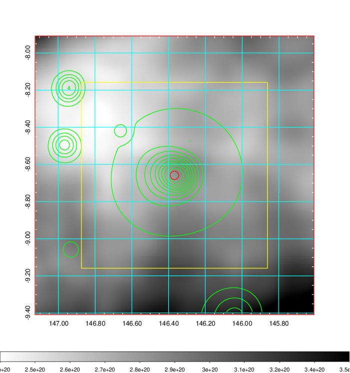
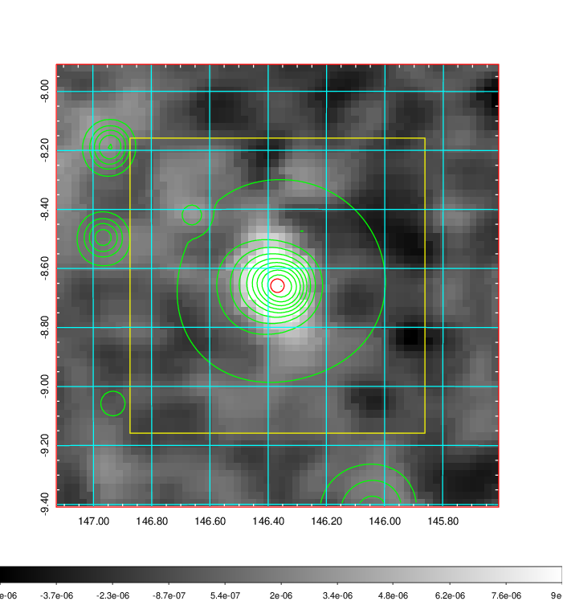
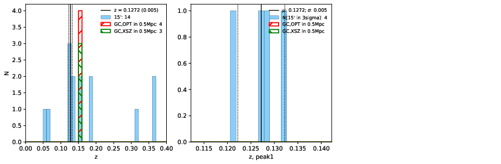
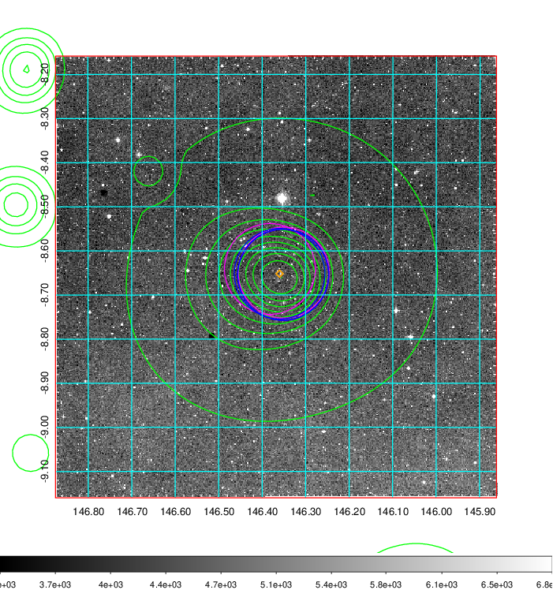
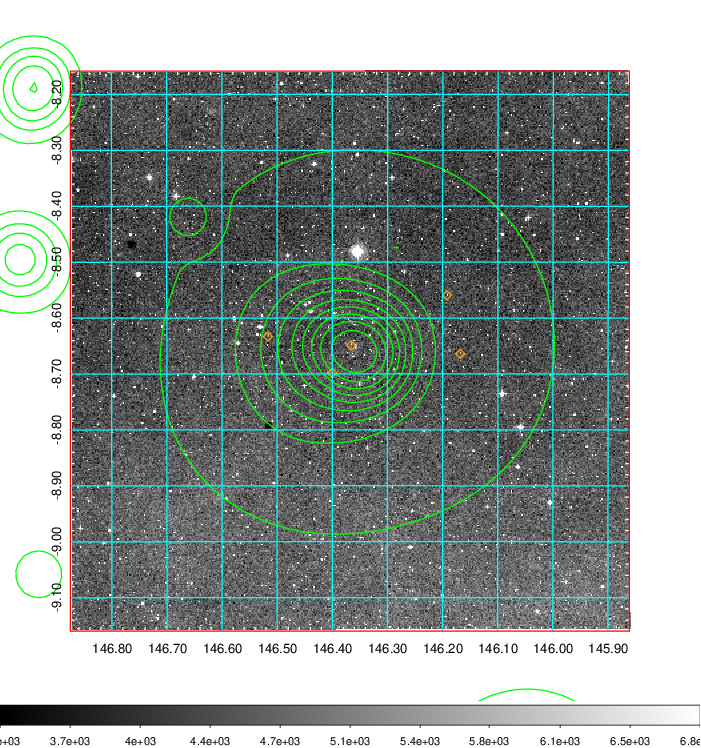
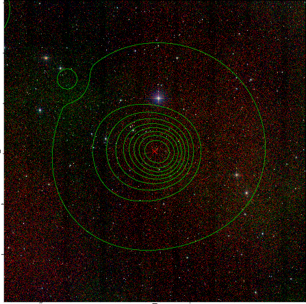

### 326

|Name|RAJ2000[deg]|DEJ2000[deg] |Ext[arcmin]| Ext,ml | z | z_src| C|GC(XSZ,Delta_z<0.01)| GC(OPT,Delta_z<0.01)|GC| R_sig[arcmin] | R500[arcmin] | R500[Mpc]| CRsig[c/s] | CR500[c/s] |L500[1E44 erg/s]|F500[1E-12 erg/s/cm^2]| M500[1E14 Msun]|Tx[keV]|Cnt_sig|Beta|Rc[arcmin]|Comment|Alias|
|---|---|---|---|---|---|------|---|--------|---------|----------|---|---|---|---|---|---|---|---|---|---|---|---|---|---|
|326| 146.368| -8.659| 1.37| 45.28| 0.1535(0.000)| z_xsz| B| MCXC, PSZ2, Tar| A, N, W| A, MCXC, N, PSZ2, Tar, W| 14.650| 6.383| 1.021| 0.185(0.032)| 0.170(0.029)| 2.096(0.139)| 3.275(0.218)| 3.51(0.11)| 4.88(0.10)| 100.4| 0.940(-0.075+0.044)| 3.150(-0.364+0.304)| -| k091|

|[RASS image](../image/326/326_img.pdf)|[filtered image](../image/326/326_fil.pdf)|[Segment image](../image/326/326_seg.pdf)|
|-------------------|--------------------|-------------------|
|   |    |   |

|[Exposure image](../image/326/326_mex.pdf)| [nH image](../image/326/326_nh.pdf)| [Planck image](../image/326/326_p.pdf)|
|-------------------|--------------------|-------------------|
|   |     |  |

|[Redshift Histogram](../image/326/326_zg.pdf) | [DSS image(z1)](../image/326/326_dss_z1.pdf)      |  [DSS image(z2)](../image/326/326_dss_z2.pdf)    |
|-------------------|--------------------|-------------------|
| |  Blue circle for optical clusters;  Magenta circle for XSZ clusters;  all with r=1Mpc;  Only GC with Delta_z<0.01 are shown. |  Blue circle for optical clusters;  Magenta circle for XSZ clusters;  all with r=1Mpc;  Only GC with Delta_z<0.01 are shown.  |

|[known Abell/XSZ clusters](../image/326/326_gc.pdf) | [2MASS image](../image/326/326_2mass.pdf)      |
|-------------------|-------------------|
|  Magenta, blue and green circles  for optical, X-ray and SZ clusters  respectively, with redshift of clusters  labelled. The radius of circles  are 1Mpc.|  |

|[PS1 image](../image/326/326_ps1.pdf)            |
|-------------------|
|   |
