

### 328

|Name|RAJ2000[deg]|DEJ2000[deg] |Ext[arcmin]| Ext,ml | z | z_src| C|GC(XSZ,Delta_z<0.01)| GC(OPT,Delta_z<0.01)|GC| R_sig[arcmin] | R500[arcmin] | R500[Mpc]| CRsig[c/s] | CR500[c/s] |L500[1E44 erg/s]|F500[1E-12 erg/s/cm^2]| M500[1E14 Msun]|Tx[keV]|Cnt_sig|Beta|Rc[arcmin]|Comment|Alias|
|---|---|---|---|---|---|------|---|--------|---------|----------|---|---|---|---|---|---|---|---|---|---|---|---|---|---|
|328| 147.136| 58.197| 25.17| 95.45| 0.1436(0.006)| z1,| G| -| -| A, N, Tak, W| 11.725| 5.517| 0.834| 0.082(0.041)| 0.075(0.038)| 0.833(0.705)| 1.506(1.275)| 1.90(0.80)| 3.33(0.89)| 73.6| 0.754(-0.166+0.165)| 6.533(-1.619+1.437)| likely c4| t616|

|[RASS image](../image/328/328_img.pdf)|[filtered image](../image/328/328_fil.pdf)|[Segment image](../image/328/328_seg.pdf)|
|-------------------|--------------------|-------------------|
| 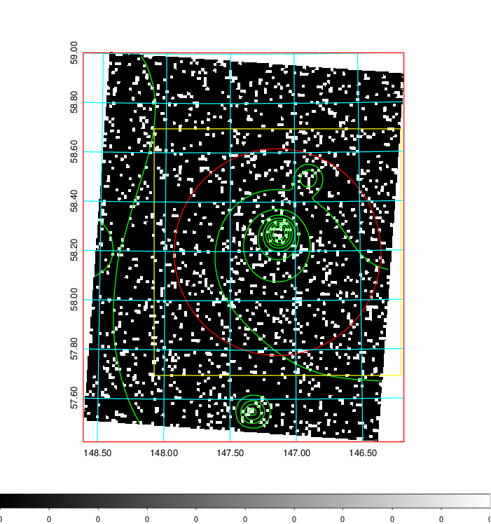  | 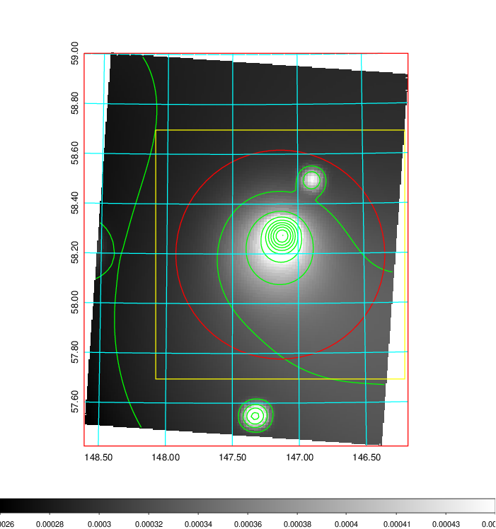   | 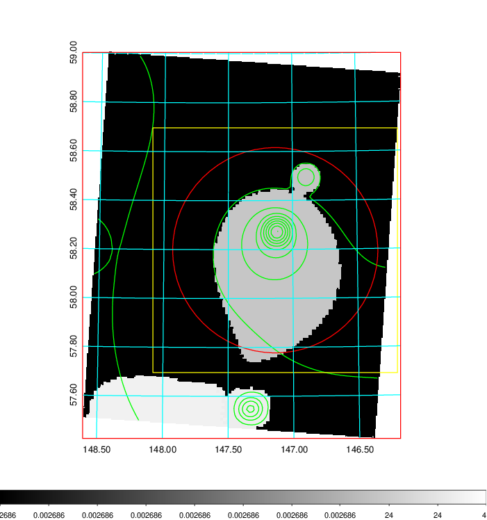  |

|[Exposure image](../image/328/328_mex.pdf)| [nH image](../image/328/328_nh.pdf)| [Planck image](../image/328/328_p.pdf)|
|-------------------|--------------------|-------------------|
|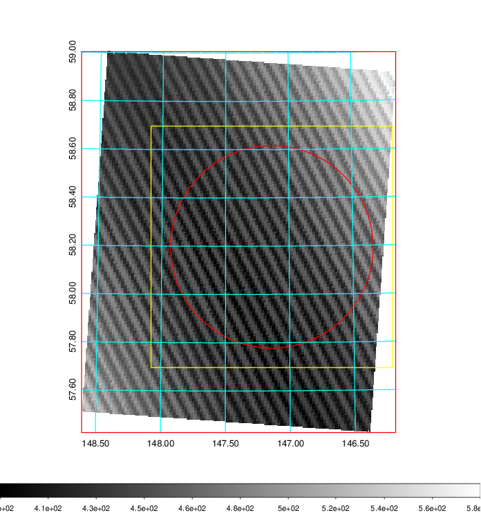   | 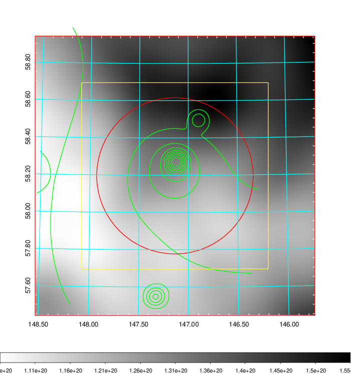    | 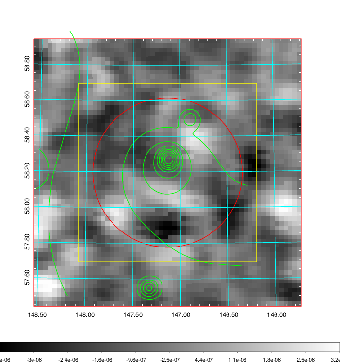 |

|[Redshift Histogram](../image/328/328_zg.pdf) | [DSS image(z1)](../image/328/328_dss_z1.pdf)      |  [DSS image(z2)](../image/328/328_dss_z2.pdf)    |
|-------------------|--------------------|-------------------|
|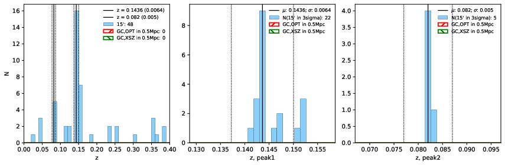 |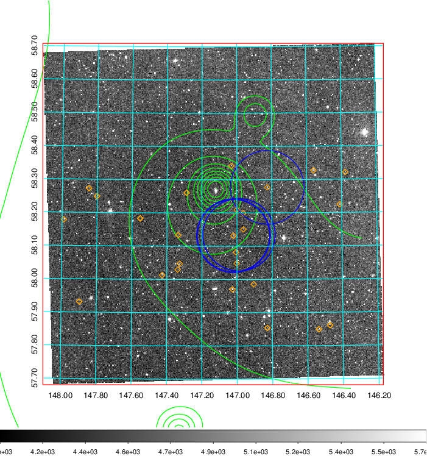  Blue circle for optical clusters;  Magenta circle for XSZ clusters;  all with r=1Mpc;  Only GC with Delta_z<0.01 are shown. | 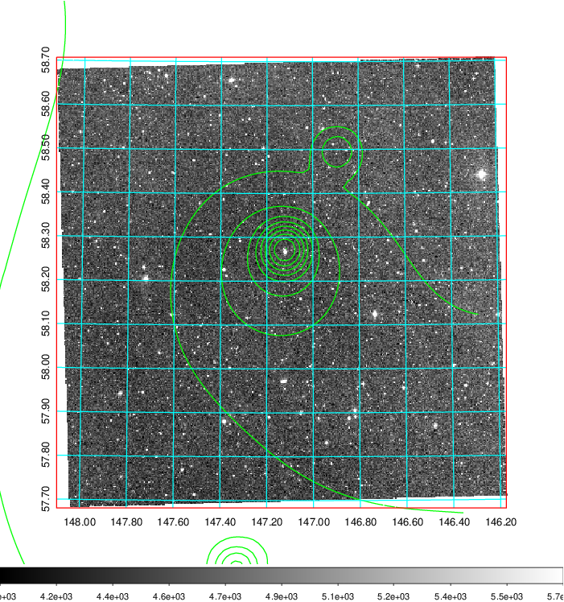 Blue circle for optical clusters;  Magenta circle for XSZ clusters;  all with r=1Mpc;  Only GC with Delta_z<0.01 are shown.  |

|[known Abell/XSZ clusters](../image/328/328_gc.pdf) | [2MASS image](../image/328/328_2mass.pdf)      |[SDSS image](../image/328/328_sdss.pdf)   |
|-------------------|-------------------|-------------------|
|  Magenta, blue and green circles  for optical, X-ray and SZ clusters  respectively, with redshift of clusters  labelled. The radius of circles  are 1Mpc.|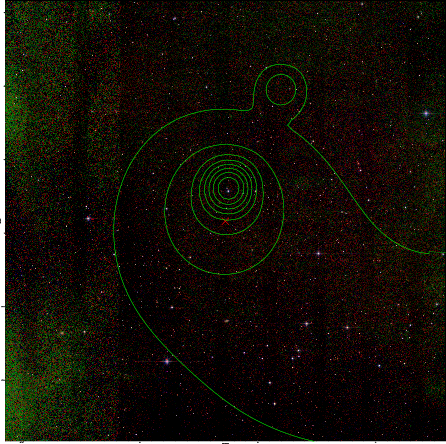  | 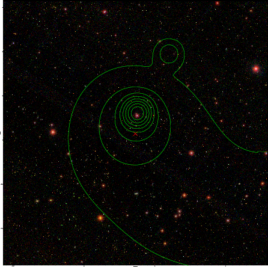  |

