

### 33

|Name|RAJ2000[deg]|DEJ2000[deg] |Ext[arcmin]| Ext,ml | z | z_src| C|GC(XSZ,Delta_z<0.01)| GC(OPT,Delta_z<0.01)|GC| R_sig[arcmin] | R500[arcmin] | R500[Mpc]| CRsig[c/s] | CR500[c/s] |L500[1E44 erg/s]|F500[1E-12 erg/s/cm^2]| M500[1E14 Msun]|Tx[keV]|Cnt_sig|Beta|Rc[arcmin]|Comment|Alias|
|---|---|---|---|---|---|------|---|--------|---------|----------|---|---|---|---|---|---|---|---|---|---|---|---|---|---|
|33| 10.536| 40.341| 1.83| 70.80| 0.0928(0.008)| z1,| G| -| -| C, N, W| 7.338| 8.521| 0.882| 0.187(0.032)| 0.192(0.033)| 0.721(0.052)| 3.336(0.240)| 2.13(0.08)| 3.52(0.08)| 92.7| 0.937(-0.080+0.046)| 4.272(-0.448+0.360)| -| t050|

|[RASS image](../image/33/33_img.pdf)|[filtered image](../image/33/33_fil.pdf)|[Segment image](../image/33/33_seg.pdf)|
|-------------------|--------------------|-------------------|
| 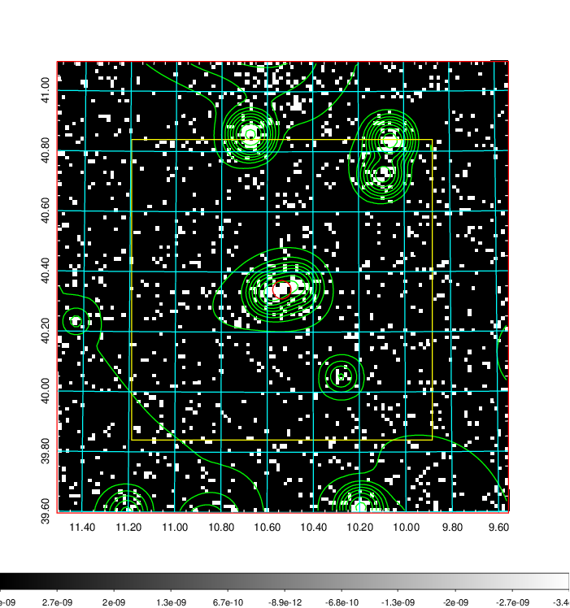  | 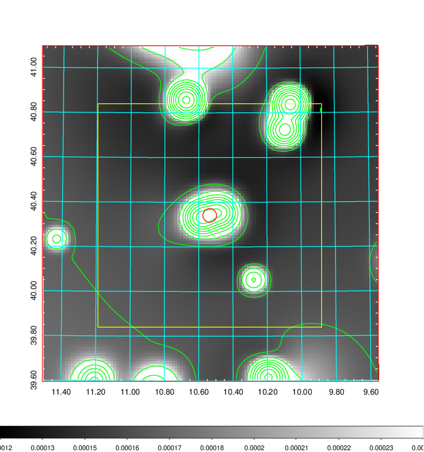   | 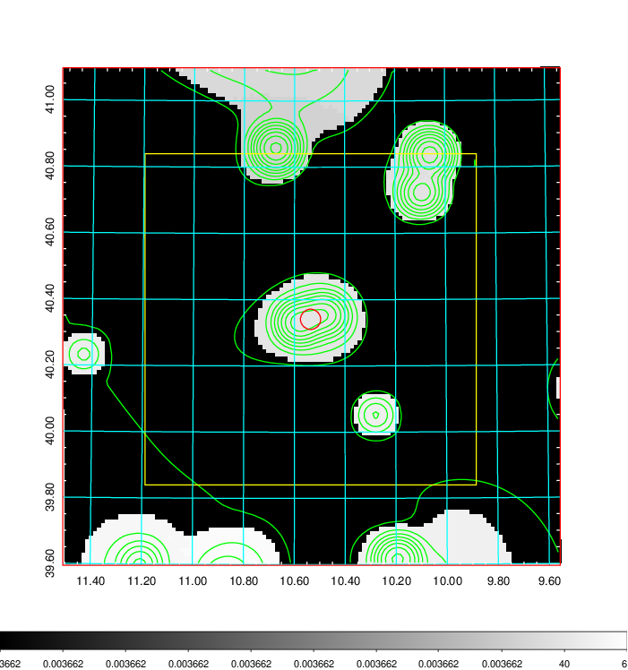  |

|[Exposure image](../image/33/33_mex.pdf)| [nH image](../image/33/33_nh.pdf)| [Planck image](../image/33/33_p.pdf)|
|-------------------|--------------------|-------------------|
|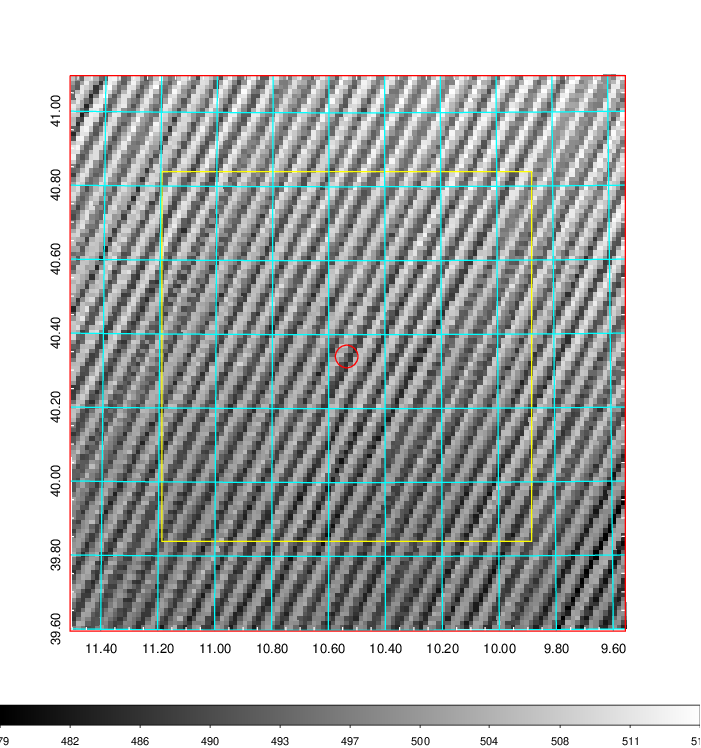   | 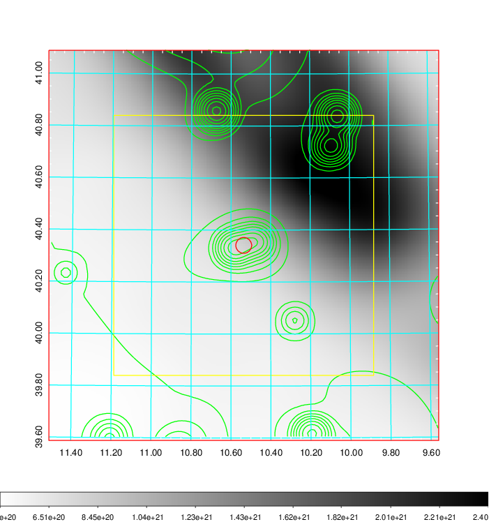    | 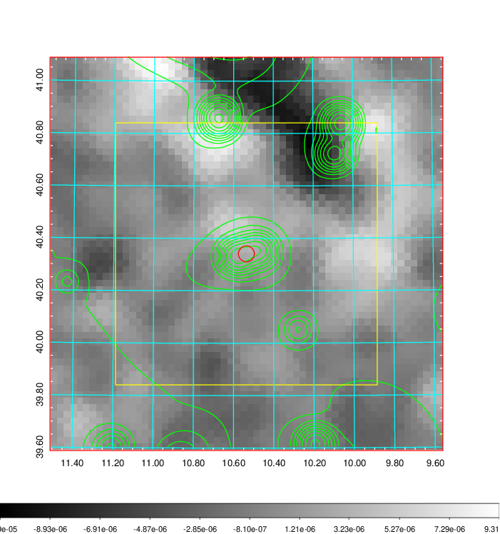 |

|[Redshift Histogram](../image/33/33_zg.pdf) | [DSS image(z1)](../image/33/33_dss_z1.pdf)      |  [DSS image(z2)](../image/33/33_dss_z2.pdf)    |
|-------------------|--------------------|-------------------|
|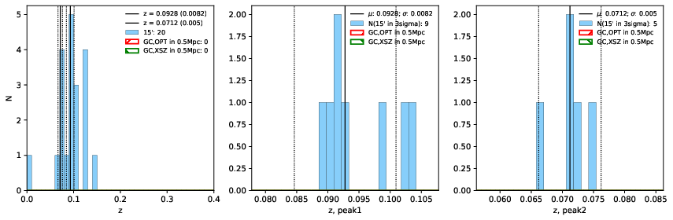 |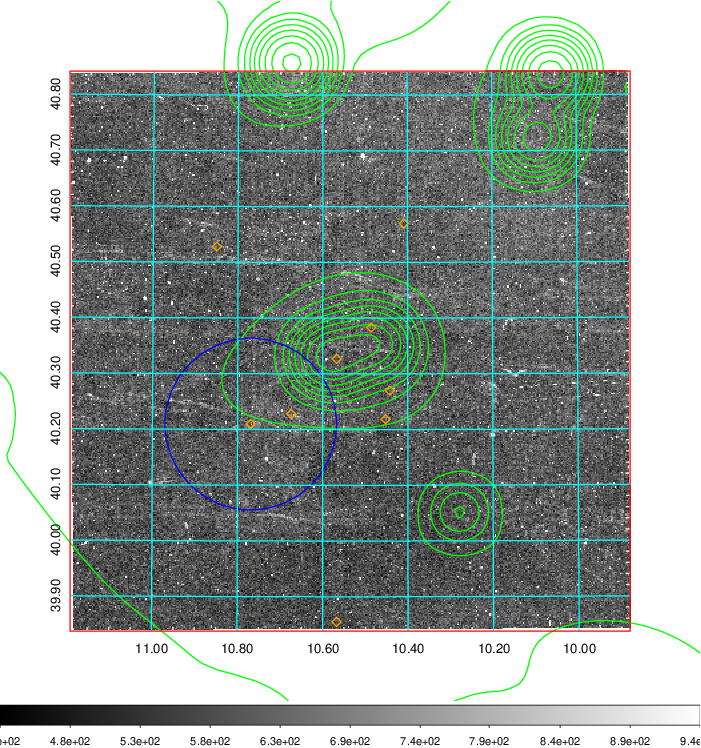  Blue circle for optical clusters;  Magenta circle for XSZ clusters;  all with r=1Mpc;  Only GC with Delta_z<0.01 are shown. | 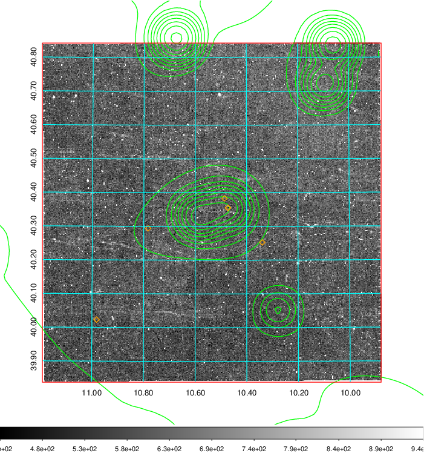 Blue circle for optical clusters;  Magenta circle for XSZ clusters;  all with r=1Mpc;  Only GC with Delta_z<0.01 are shown.  |

|[Previous-identified clusters](../image/33/33_gc.pdf) | [2MASS image](../image/33/33_2mass.pdf)      |[SDSS image](../image/33/33_sdss.pdf)   |
|-------------------|-------------------|-------------------|
|  Green, magenta, and blue circles  for optical, X-ray and SZ clusters  respectively, with redshift of clusters  labelled. The radius of circles  are 1Mpc.|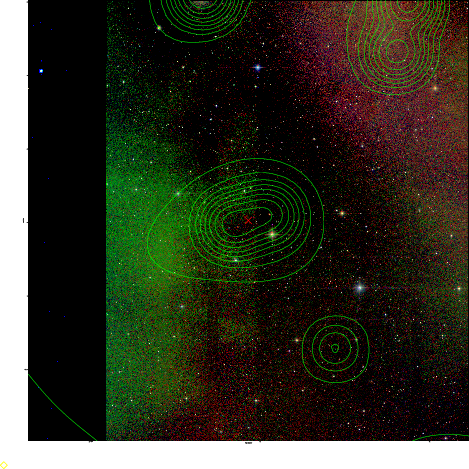  | 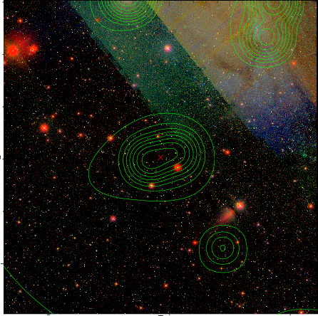  |

