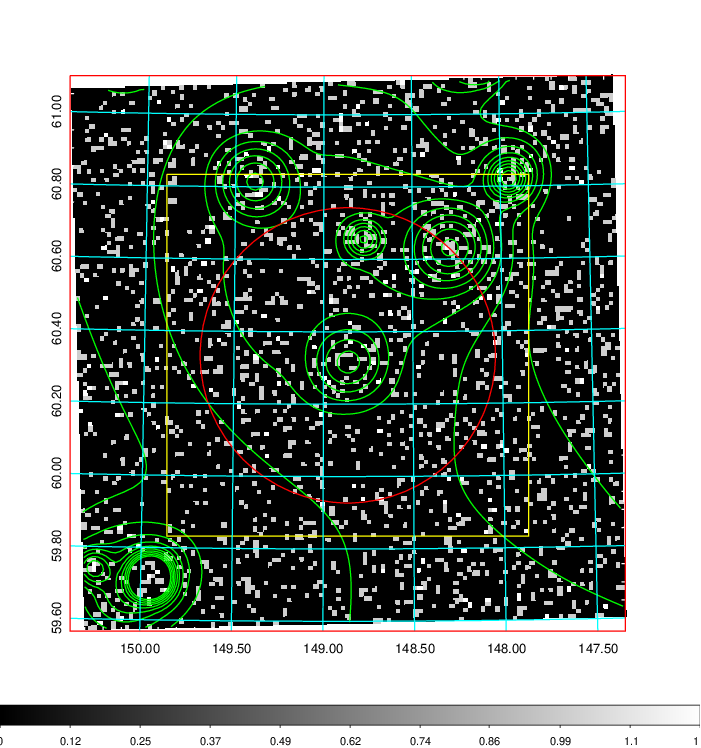
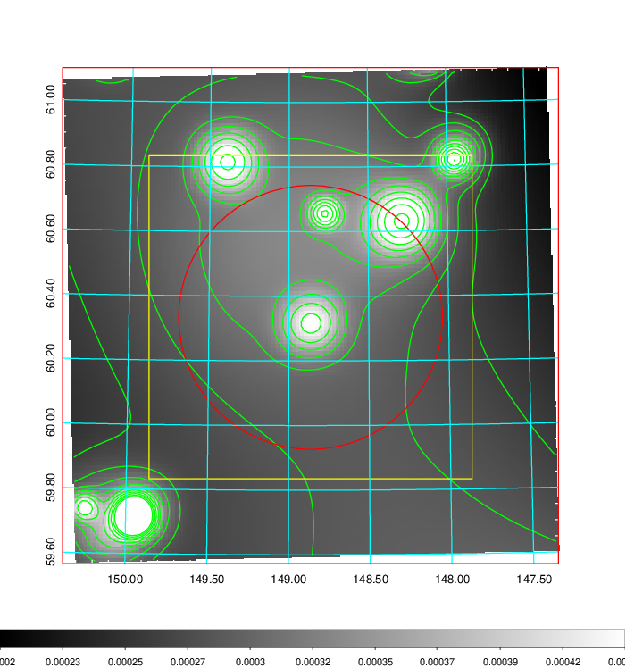
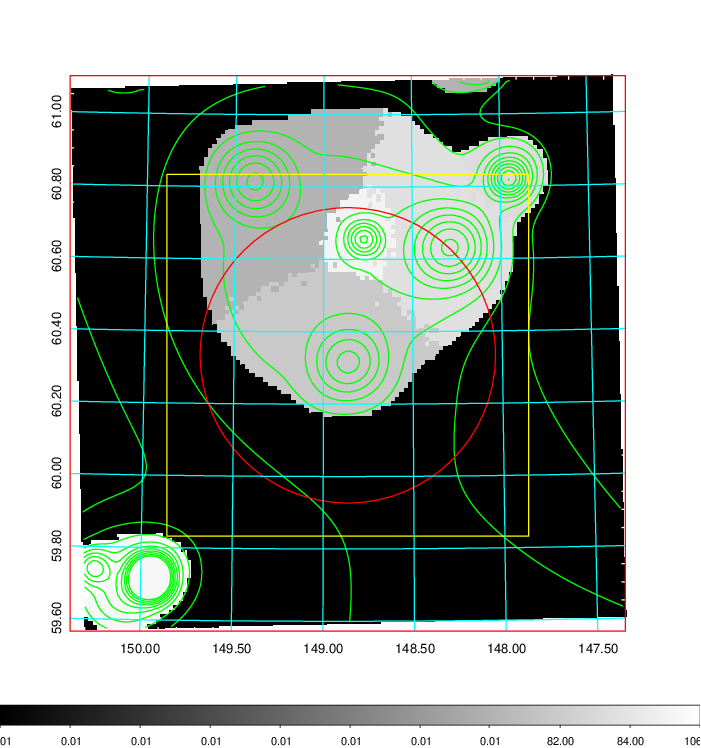
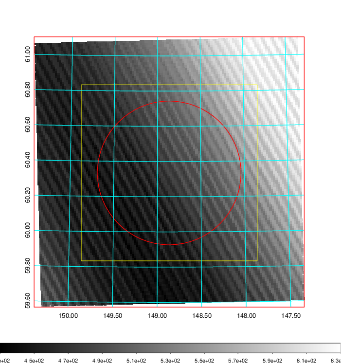
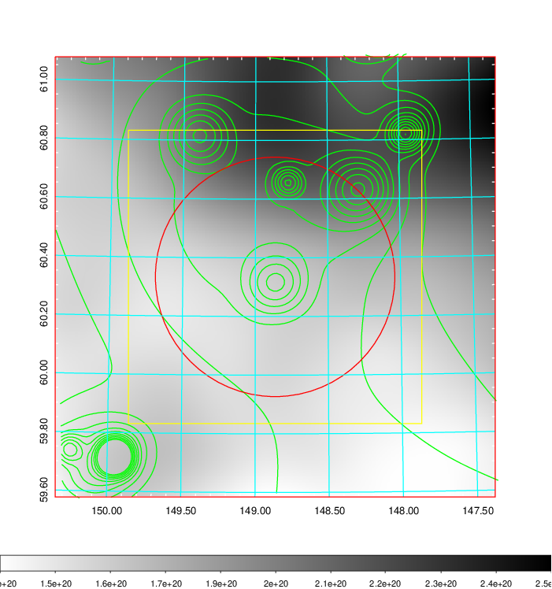
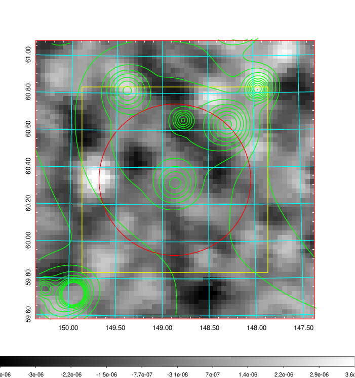
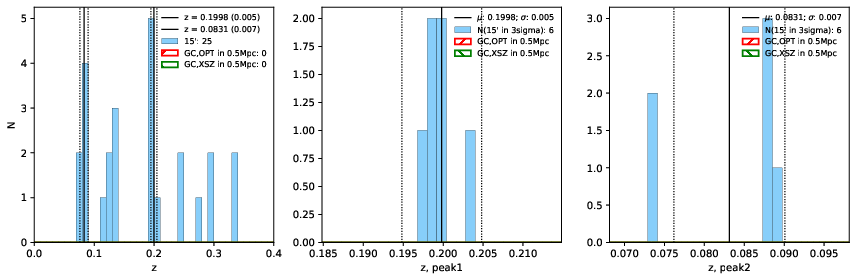
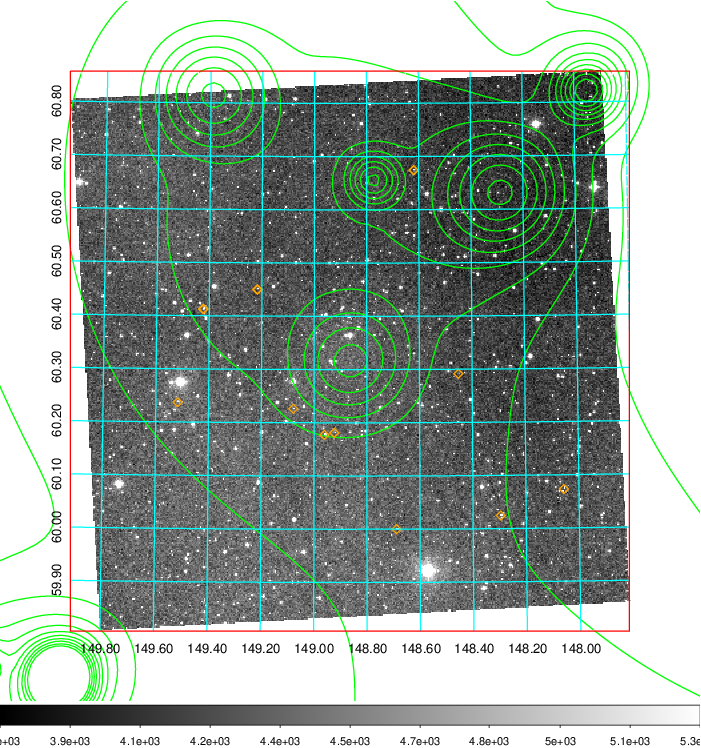
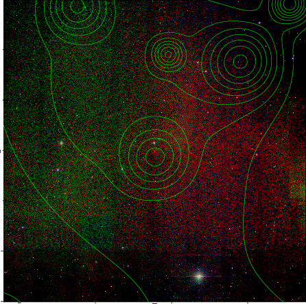

### 330

|Name|RAJ2000[deg]|DEJ2000[deg] |Ext[arcmin]| Ext,ml | z | z_src| C|GC(XSZ,Delta_z<0.01)| GC(OPT,Delta_z<0.01)|GC| R_sig[arcmin] | R500[arcmin] | R500[Mpc]| CRsig[c/s] | CR500[c/s] |L500[1E44 erg/s]|F500[1E-12 erg/s/cm^2]| M500[1E14 Msun]|Tx[keV]|Cnt_sig|Beta|Rc[arcmin]|Comment|Alias|
|---|---|---|---|---|---|------|---|--------|---------|----------|---|---|---|---|---|---|---|---|---|---|---|---|---|---|
|330| 148.864| 60.335| 24.49| 71.67| 0.1998(0.005)| z1,| G| -| -| C, N, W| 12.212| 4.295| 0.850| 0.050(0.038)| 0.046(0.034)| 1.038(0.675)| 0.906(0.588)| 2.13(0.68)| 3.64(0.74)| 65.9| 0.830(-0.171+0.122)| 4.433(-1.221+1.116)| -| t608|

|[RASS image](../image/330/330_img.pdf)|[filtered image](../image/330/330_fil.pdf)|[Segment image](../image/330/330_seg.pdf)|
|-------------------|--------------------|-------------------|
|   |    |   |

|[Exposure image](../image/330/330_mex.pdf)| [nH image](../image/330/330_nh.pdf)| [Planck image](../image/330/330_p.pdf)|
|-------------------|--------------------|-------------------|
|   |     |  |

|[Redshift Histogram](../image/330/330_zg.pdf) | [DSS image(z1)](../image/330/330_dss_z1.pdf)      |  [DSS image(z2)](../image/330/330_dss_z2.pdf)    |
|-------------------|--------------------|-------------------|
| |  Blue circle for optical clusters;  Magenta circle for XSZ clusters;  all with r=1Mpc;  Only GC with Delta_z<0.01 are shown. |  Blue circle for optical clusters;  Magenta circle for XSZ clusters;  all with r=1Mpc;  Only GC with Delta_z<0.01 are shown.  |

|[known Abell/XSZ clusters](../image/330/330_gc.pdf) | [2MASS image](../image/330/330_2mass.pdf)      |
|-------------------|-------------------|
|  Magenta, blue and green circles  for optical, X-ray and SZ clusters  respectively, with redshift of clusters  labelled. The radius of circles  are 1Mpc.|  |

|[PS1 image](../image/330/330_ps1.pdf)            |
|-------------------|
|   |
