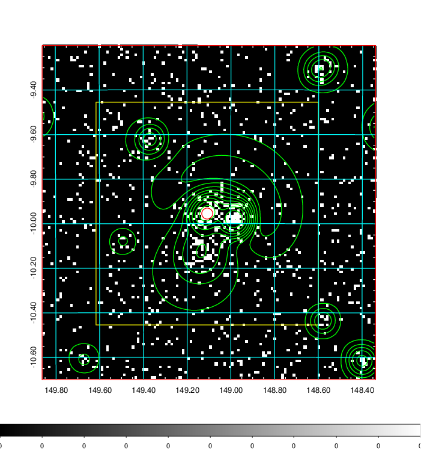
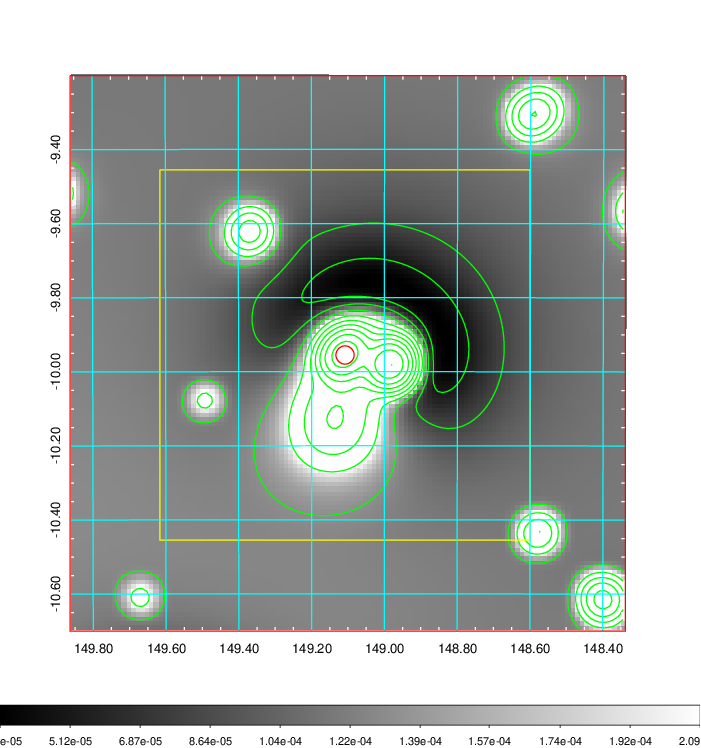
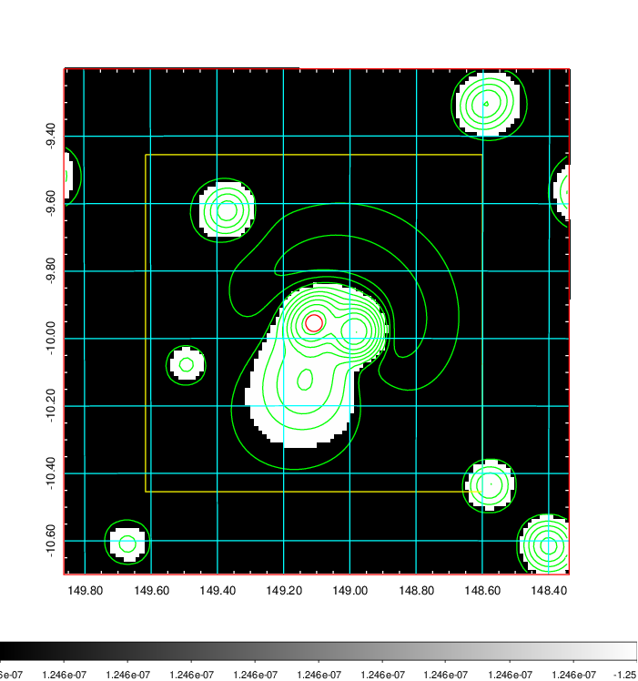
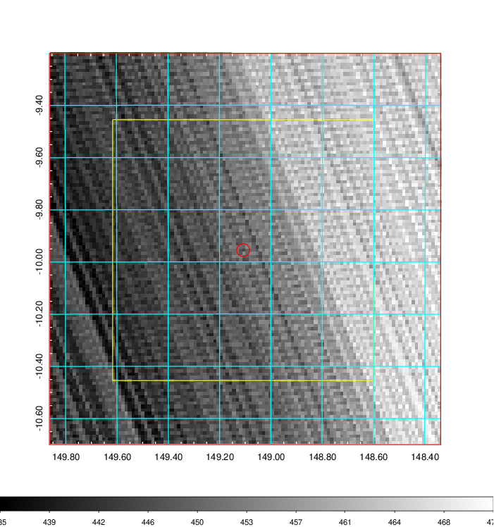
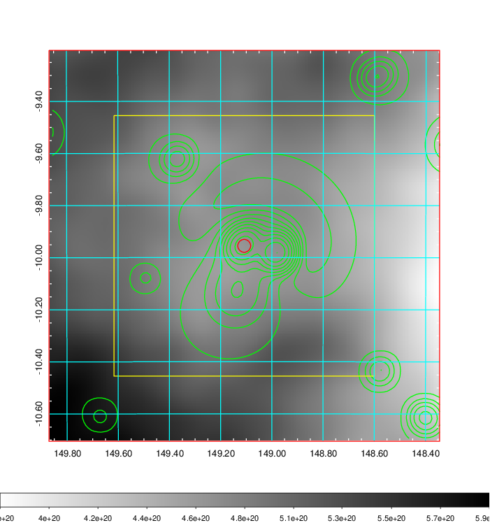
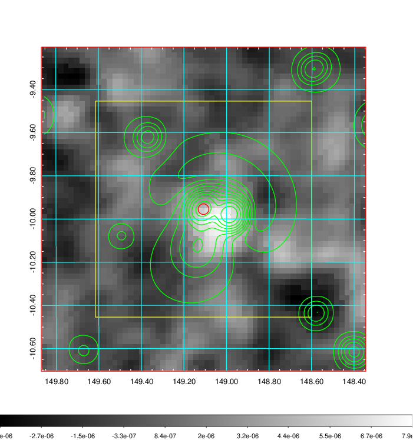
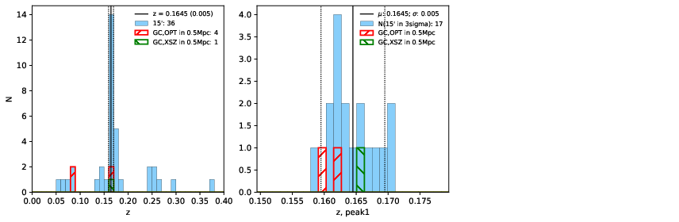
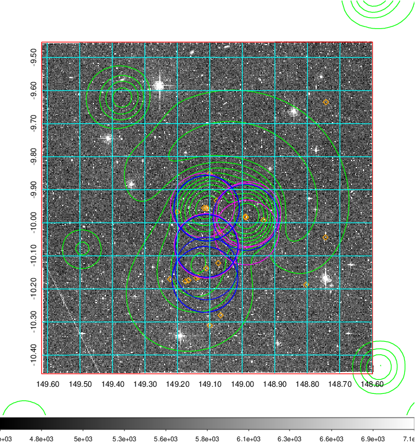
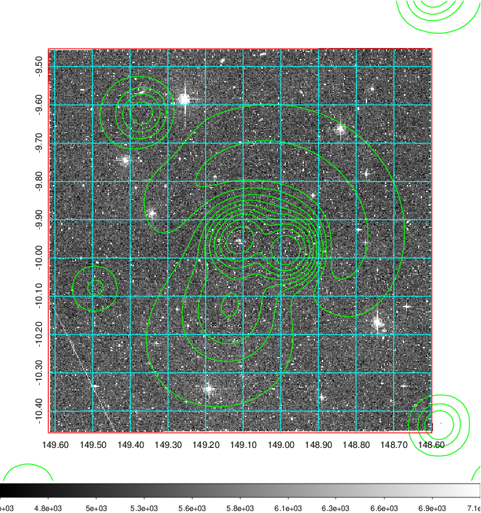
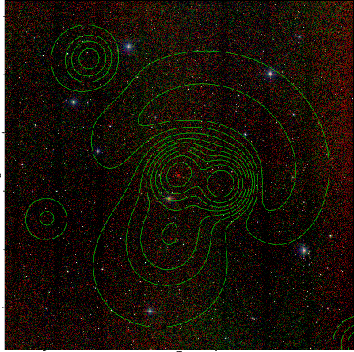

### 332

|Name|RAJ2000[deg]|DEJ2000[deg] |Ext[arcmin]| Ext,ml | z | z_src| C|GC(XSZ,Delta_z<0.01)| GC(OPT,Delta_z<0.01)|GC| R_sig[arcmin] | R500[arcmin] | R500[Mpc]| CRsig[c/s] | CR500[c/s] |L500[1E44 erg/s]|F500[1E-12 erg/s/cm^2]| M500[1E14 Msun]|Tx[keV]|Cnt_sig|Beta|Rc[arcmin]|Comment|Alias|
|---|---|---|---|---|---|------|---|--------|---------|----------|---|---|---|---|---|---|---|---|---|---|---|---|---|---|
|332| 149.108| -9.955| 1.48| 34.68| 0.1645(0.005)| z1, z_xsz| B| XB| A, W| A, MCXC, N, PSZ2, Tar, W, XB| 9.288| 6.784| 1.148| 0.264(0.034)| 0.253(0.032)| 3.546(0.220)| 4.759(0.296)| 5.06(0.15)| 6.14(0.12)| 171.5| 0.656(-0.084+0.124)| 2.562(-0.778+0.974)| -| k107|

|[RASS image](../image/332/332_img.pdf)|[filtered image](../image/332/332_fil.pdf)|[Segment image](../image/332/332_seg.pdf)|
|-------------------|--------------------|-------------------|
|   |    |   |

|[Exposure image](../image/332/332_mex.pdf)| [nH image](../image/332/332_nh.pdf)| [Planck image](../image/332/332_p.pdf)|
|-------------------|--------------------|-------------------|
|   |     |  |

|[Redshift Histogram](../image/332/332_zg.pdf) | [DSS image(z1)](../image/332/332_dss_z1.pdf)      |  [DSS image(z2)](../image/332/332_dss_z2.pdf)    |
|-------------------|--------------------|-------------------|
| |  Blue circle for optical clusters;  Magenta circle for XSZ clusters;  all with r=1Mpc;  Only GC with Delta_z<0.01 are shown. |  Blue circle for optical clusters;  Magenta circle for XSZ clusters;  all with r=1Mpc;  Only GC with Delta_z<0.01 are shown.  |

|[known Abell/XSZ clusters](../image/332/332_gc.pdf) | [2MASS image](../image/332/332_2mass.pdf)      |
|-------------------|-------------------|
|  Magenta, blue and green circles  for optical, X-ray and SZ clusters  respectively, with redshift of clusters  labelled. The radius of circles  are 1Mpc.|  |

|[PS1 image](../image/332/332_ps1.pdf)            |
|-------------------|
|   |
