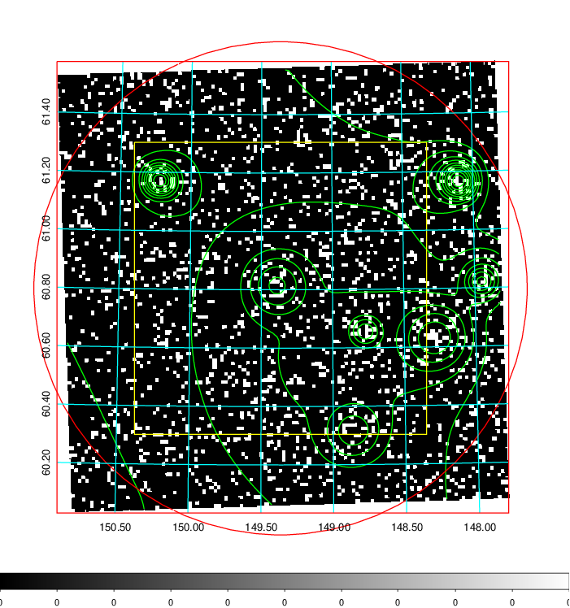
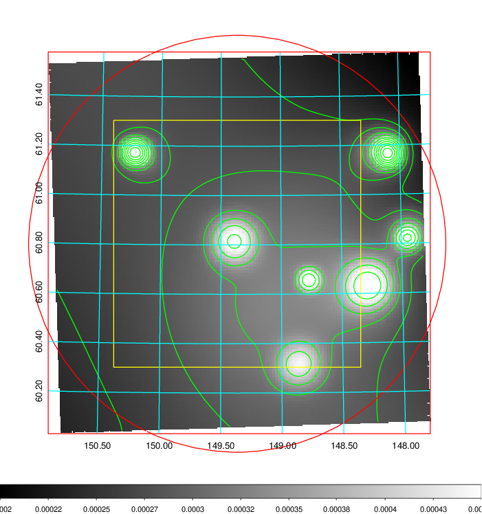
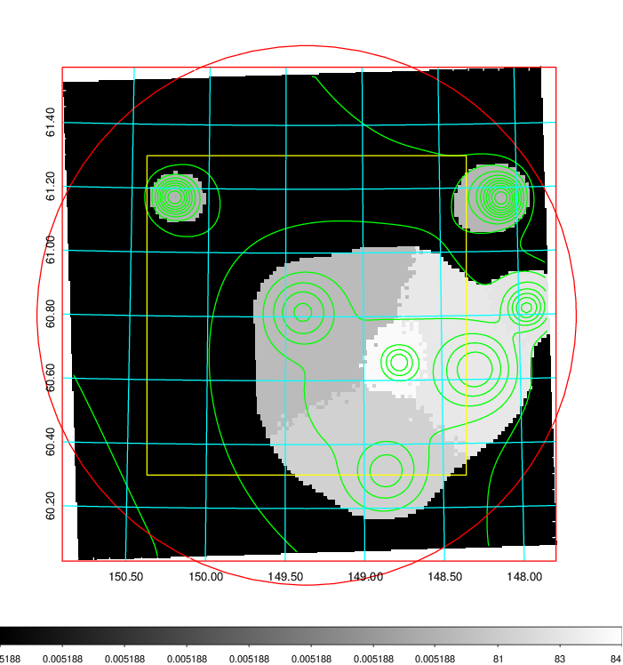
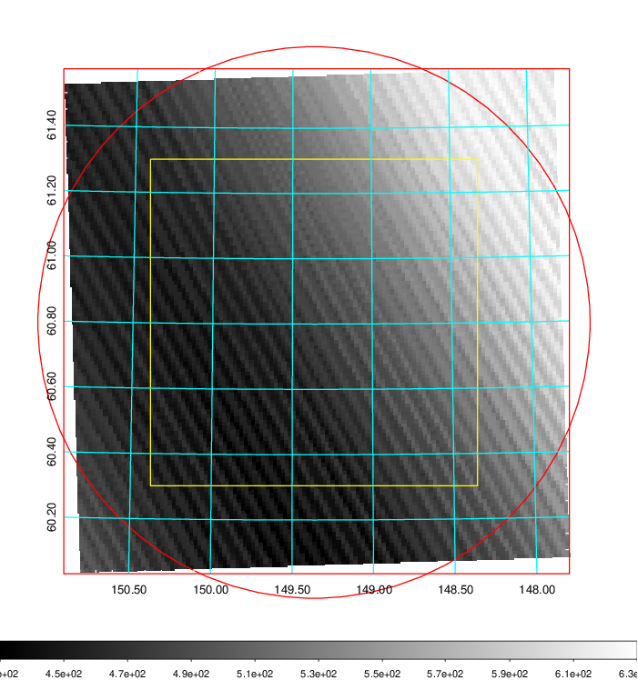
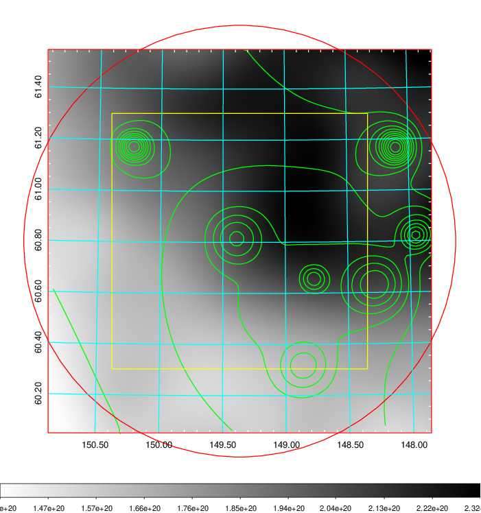
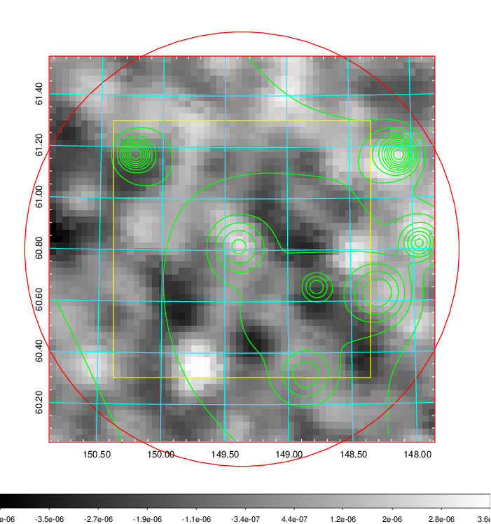
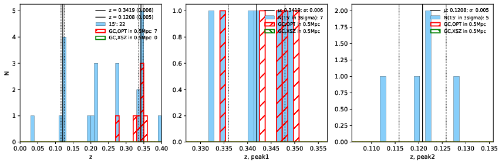
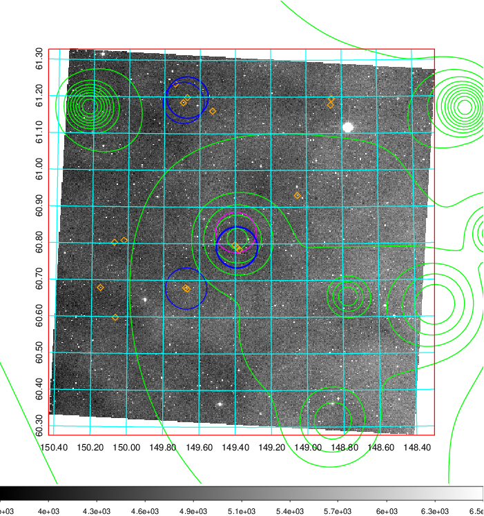
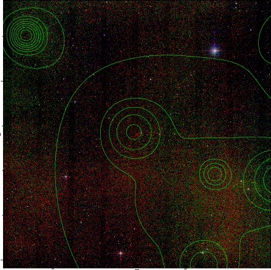

### 333

|Name|RAJ2000[deg]|DEJ2000[deg] |Ext[arcmin]| Ext,ml | z | z_src| C|GC(XSZ,Delta_z<0.01)| GC(OPT,Delta_z<0.01)|GC| R_sig[arcmin] | R500[arcmin] | R500[Mpc]| CRsig[c/s] | CR500[c/s] |L500[1E44 erg/s]|F500[1E-12 erg/s/cm^2]| M500[1E14 Msun]|Tx[keV]|Cnt_sig|Beta|Rc[arcmin]|Comment|Alias|
|---|---|---|---|---|---|------|---|--------|---------|----------|---|---|---|---|---|---|---|---|---|---|---|---|---|---|
|333| 149.365| 60.805| 50.68| 90.86| 0.3419(0.006)| z1, z_opt| S| -| C, N, RM, W| C, N, Tar, W| 43.570| 5.837| 1.704| 0.626(0.100)| 0.547(0.087)| 43.688(32.137)| 11.183(8.227)| 20.07(6.31)| 15.29(3.11)| 614.7| 0.501(-0.001+0.002)| 9.156(-0.195+1.505)| An SZ cluster with $z$ = 0.3508 and offset = 0.55 Mpc| t697|

|[RASS image](../image/333/333_img.pdf)|[filtered image](../image/333/333_fil.pdf)|[Segment image](../image/333/333_seg.pdf)|
|-------------------|--------------------|-------------------|
|   |    |   |

|[Exposure image](../image/333/333_mex.pdf)| [nH image](../image/333/333_nh.pdf)| [Planck image](../image/333/333_p.pdf)|
|-------------------|--------------------|-------------------|
|   |     |  |

|[Redshift Histogram](../image/333/333_zg.pdf) | [DSS image(z1)](../image/333/333_dss_z1.pdf)      |  [DSS image(z2)](../image/333/333_dss_z2.pdf)    |
|-------------------|--------------------|-------------------|
| |  Blue circle for optical clusters;  Magenta circle for XSZ clusters;  all with r=1Mpc;  Only GC with Delta_z<0.01 are shown. |  Blue circle for optical clusters;  Magenta circle for XSZ clusters;  all with r=1Mpc;  Only GC with Delta_z<0.01 are shown.  |

|[known Abell/XSZ clusters](../image/333/333_gc.pdf) | [2MASS image](../image/333/333_2mass.pdf)      |
|-------------------|-------------------|
|  Magenta, blue and green circles  for optical, X-ray and SZ clusters  respectively, with redshift of clusters  labelled. The radius of circles  are 1Mpc.|  |

|[PS1 image](../image/333/333_ps1.pdf)            |
|-------------------|
|   |
