

### 334

|Name|RAJ2000[deg]|DEJ2000[deg] |Ext[arcmin]| Ext,ml | z | z_src| C|GC(XSZ,Delta_z<0.01)| GC(OPT,Delta_z<0.01)|GC| R_sig[arcmin] | R500[arcmin] | R500[Mpc]| CRsig[c/s] | CR500[c/s] |L500[1E44 erg/s]|F500[1E-12 erg/s/cm^2]| M500[1E14 Msun]|Tx[keV]|Cnt_sig|Beta|Rc[arcmin]|Comment|Alias|
|---|---|---|---|---|---|------|---|--------|---------|----------|---|---|---|---|---|---|---|---|---|---|---|---|---|---|
|334| 149.456| 59.023| 6.55| 39.50| 0.3550(0.005)| z1,| G| -| -| C, F20, N, SPI, W| 30.131| 4.612| 1.379| 0.222(0.061)| 0.195(0.053)| 17.459(6.348)| 4.094(1.488)| 10.81(1.73)| 10.48(1.08)| 249.7| 0.529(-0.021+0.046)| 4.384(-0.646+0.936)| -| t328|

|[RASS image](../image/334/334_img.pdf)|[filtered image](../image/334/334_fil.pdf)|[Segment image](../image/334/334_seg.pdf)|
|-------------------|--------------------|-------------------|
| 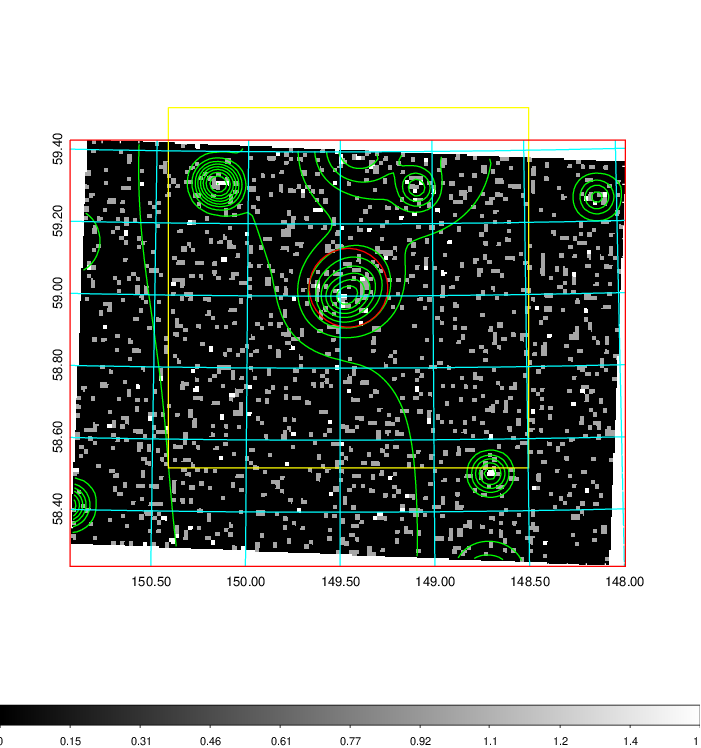  | 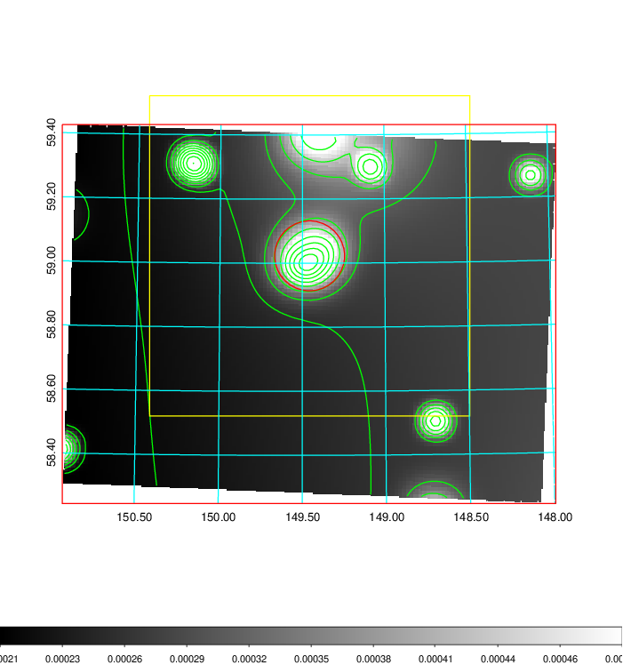   | 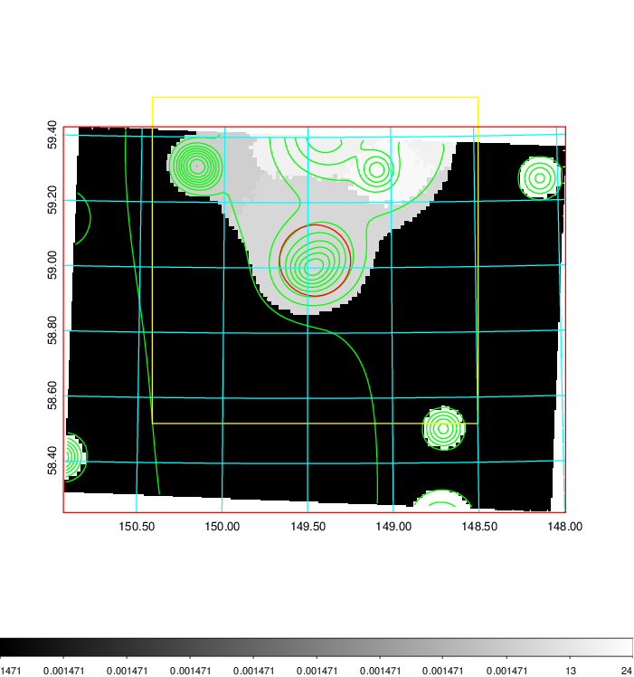  |

|[Exposure image](../image/334/334_mex.pdf)| [nH image](../image/334/334_nh.pdf)| [Planck image](../image/334/334_p.pdf)|
|-------------------|--------------------|-------------------|
|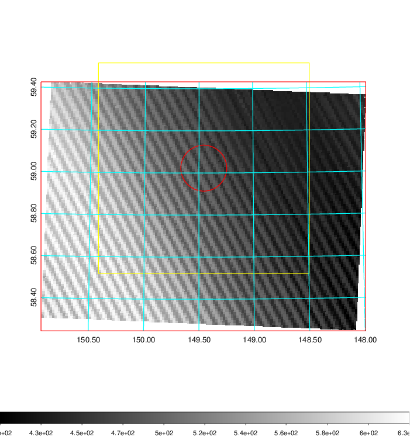   | 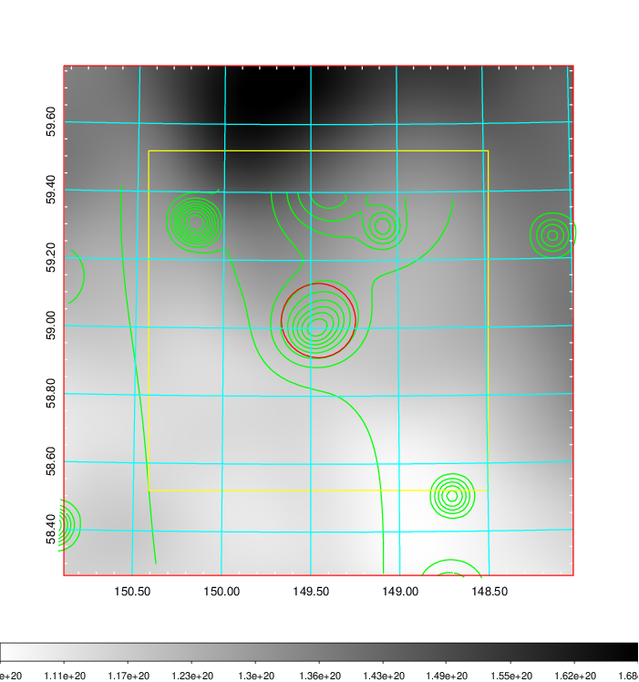    | 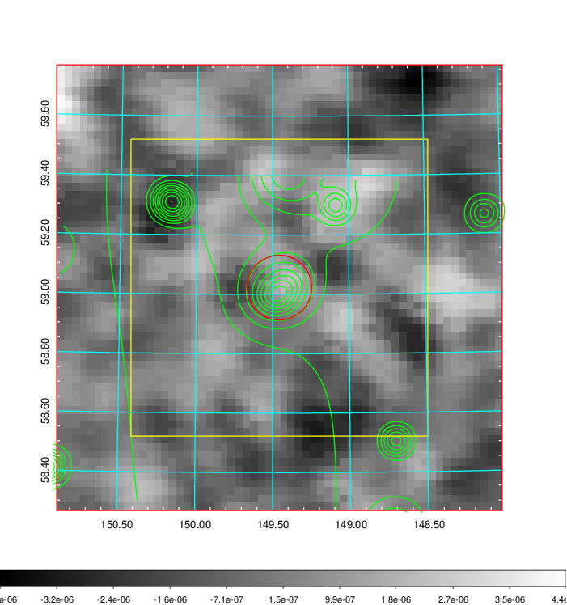 |

|[Redshift Histogram](../image/334/334_zg.pdf) | [DSS image(z1)](../image/334/334_dss_z1.pdf)      |  [DSS image(z2)](../image/334/334_dss_z2.pdf)    |
|-------------------|--------------------|-------------------|
|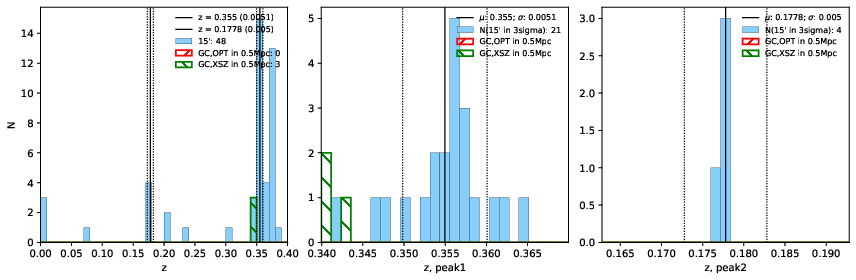 |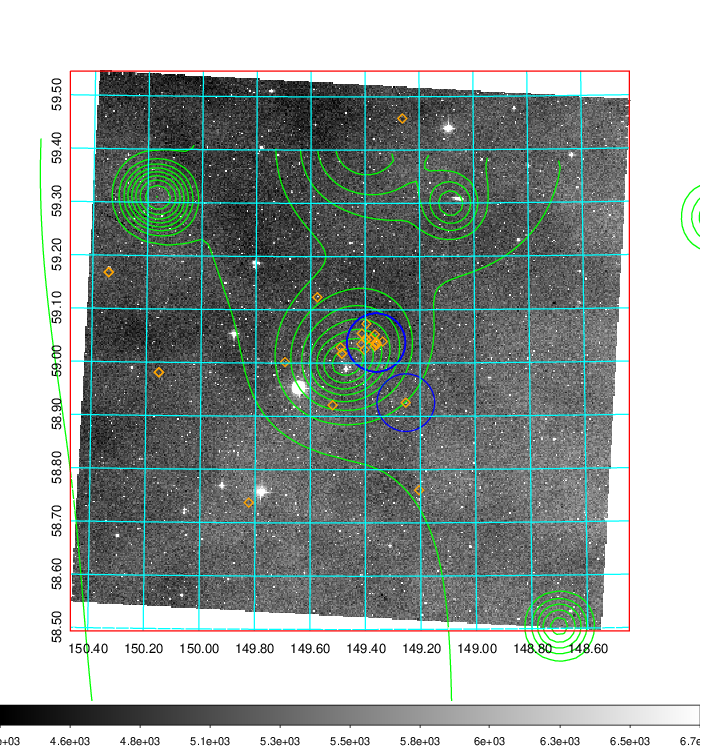  Blue circle for optical clusters;  Magenta circle for XSZ clusters;  all with r=1Mpc;  Only GC with Delta_z<0.01 are shown. | 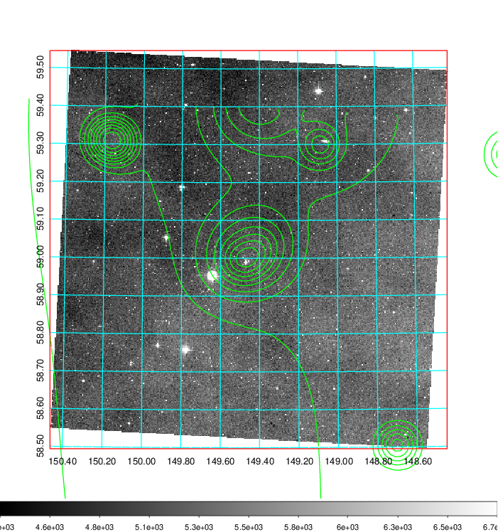 Blue circle for optical clusters;  Magenta circle for XSZ clusters;  all with r=1Mpc;  Only GC with Delta_z<0.01 are shown.  |

|[Previous-identified clusters](../image/334/334_gc.pdf) | [2MASS image](../image/334/334_2mass.pdf)      |[SDSS image](../image/334/334_sdss.pdf)   |
|-------------------|-------------------|-------------------|
|  Green, magenta, and blue circles  for optical, X-ray and SZ clusters  respectively, with redshift of clusters  labelled. The radius of circles  are 1Mpc.|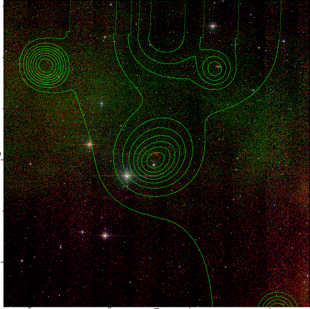  | 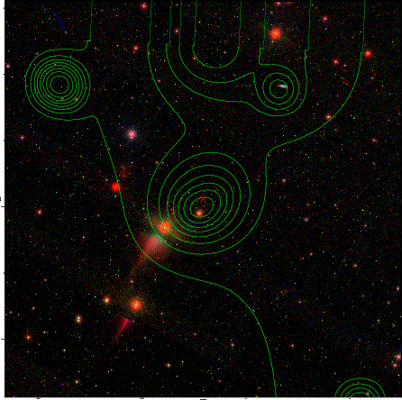  |

