

### 335

|Name|RAJ2000[deg]|DEJ2000[deg] |Ext[arcmin]| Ext,ml | z | z_src| C|GC(XSZ,Delta_z<0.01)| GC(OPT,Delta_z<0.01)|GC| R_sig[arcmin] | R500[arcmin] | R500[Mpc]| CRsig[c/s] | CR500[c/s] |L500[1E44 erg/s]|F500[1E-12 erg/s/cm^2]| M500[1E14 Msun]|Tx[keV]|Cnt_sig|Beta|Rc[arcmin]|Comment|Alias|
|---|---|---|---|---|---|------|---|--------|---------|----------|---|---|---|---|---|---|---|---|---|---|---|---|---|---|
|335| 149.592| -11.059| 0.82| 38.21| 0.1667(0.005)| z1, z_xsz| B| MCXC, PSZ2, Tar| W| A, MCXC, PSZ2, Tar, W, XB| 5.875| 7.319| 1.252| 0.354(0.036)| 0.369(0.037)| 5.271(0.187)| 6.870(0.244)| 6.58(0.11)| 7.22(0.08)| 150.2| 0.915(-0.091+0.061)| 2.476(-0.388+0.285)| -| k016|

|[RASS image](../image/335/335_img.pdf)|[filtered image](../image/335/335_fil.pdf)|[Segment image](../image/335/335_seg.pdf)|
|-------------------|--------------------|-------------------|
| 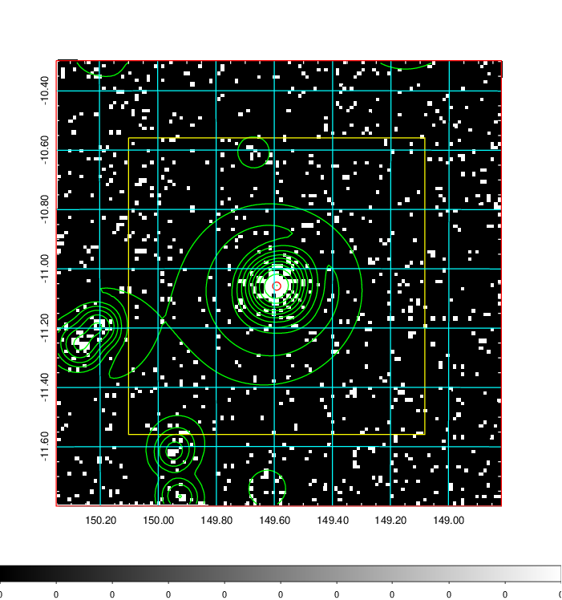  | 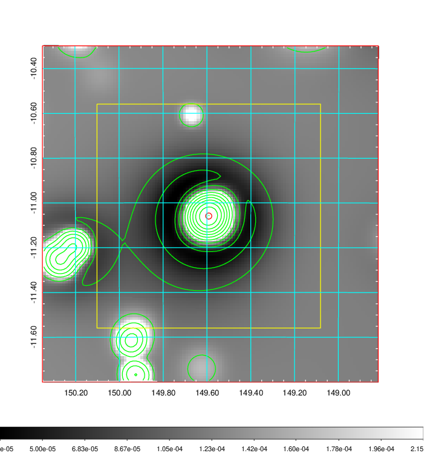   | 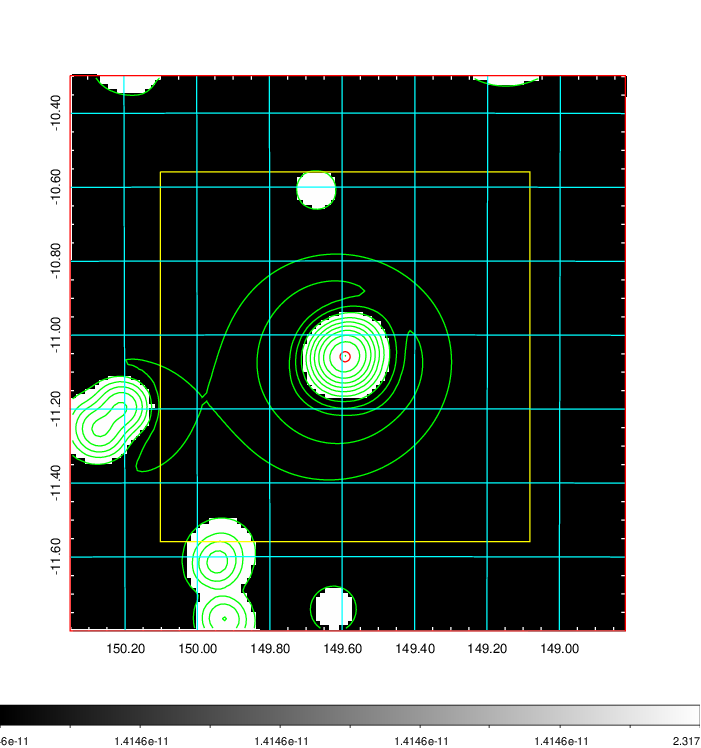  |

|[Exposure image](../image/335/335_mex.pdf)| [nH image](../image/335/335_nh.pdf)| [Planck image](../image/335/335_p.pdf)|
|-------------------|--------------------|-------------------|
|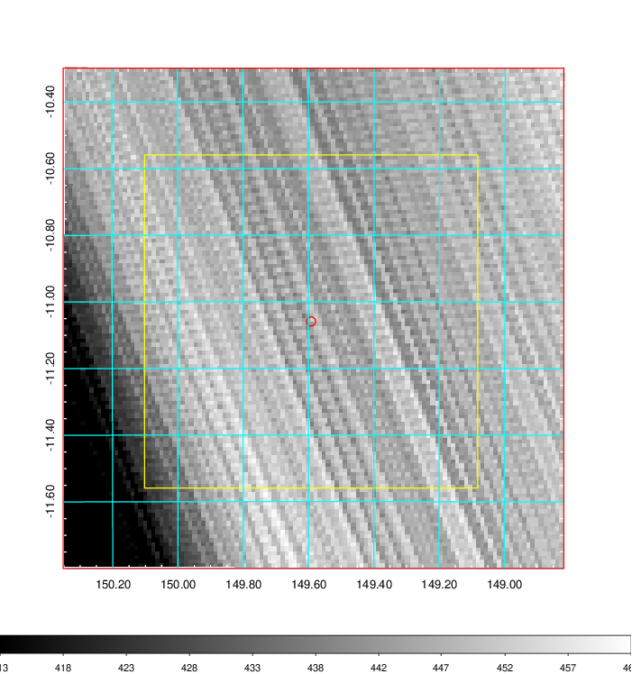   | 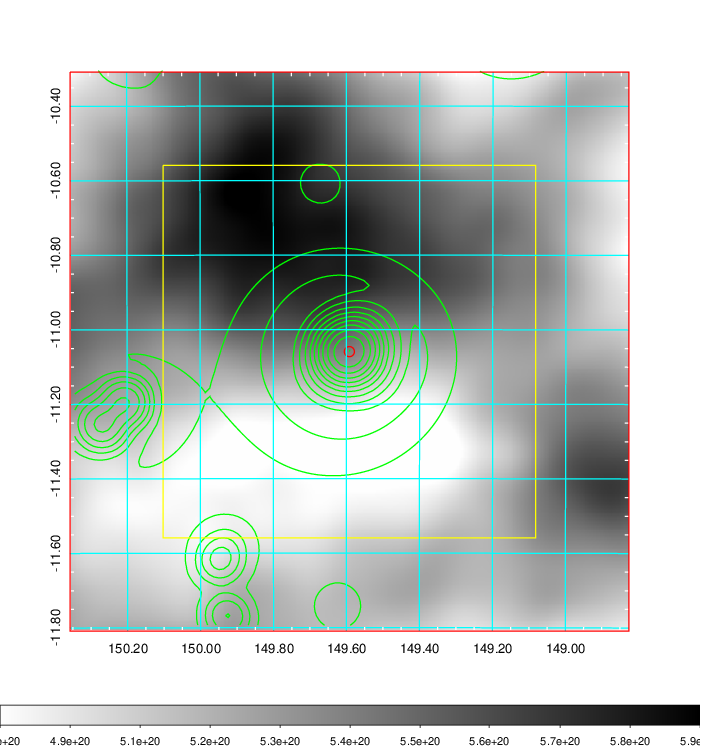    | 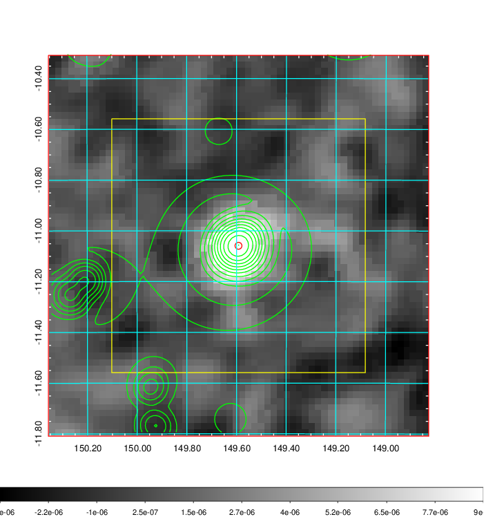 |

|[Redshift Histogram](../image/335/335_zg.pdf) | [DSS image(z1)](../image/335/335_dss_z1.pdf)      |  [DSS image(z2)](../image/335/335_dss_z2.pdf)    |
|-------------------|--------------------|-------------------|
|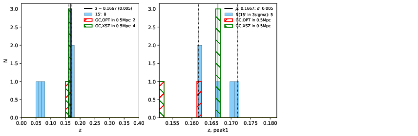 |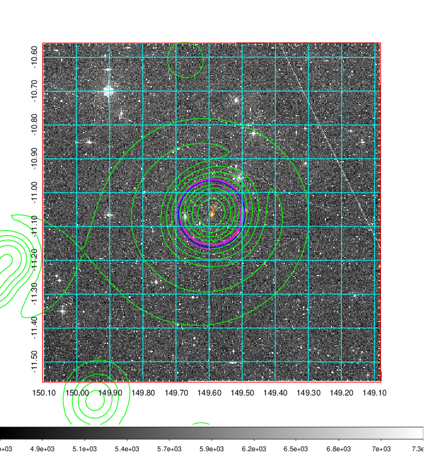  Blue circle for optical clusters;  Magenta circle for XSZ clusters;  all with r=1Mpc;  Only GC with Delta_z<0.01 are shown. | 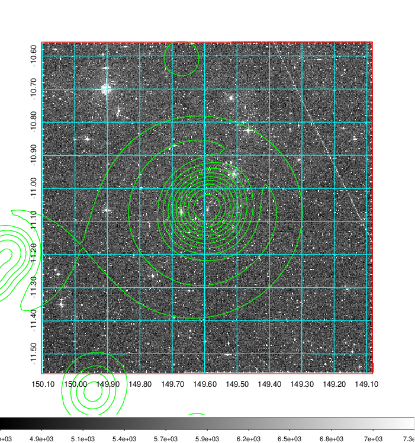 Blue circle for optical clusters;  Magenta circle for XSZ clusters;  all with r=1Mpc;  Only GC with Delta_z<0.01 are shown.  |

|[Previous-identified clusters](../image/335/335_gc.pdf) | [2MASS image](../image/335/335_2mass.pdf)      |
|-------------------|-------------------|
|  Green, magenta, and blue circles  for optical, X-ray and SZ clusters  respectively, with redshift of clusters  labelled. The radius of circles  are 1Mpc.|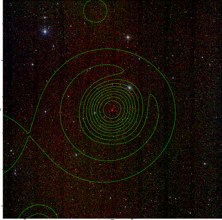  |

|[PS1 image](../image/335/335_ps1.pdf)            |
|-------------------|
| 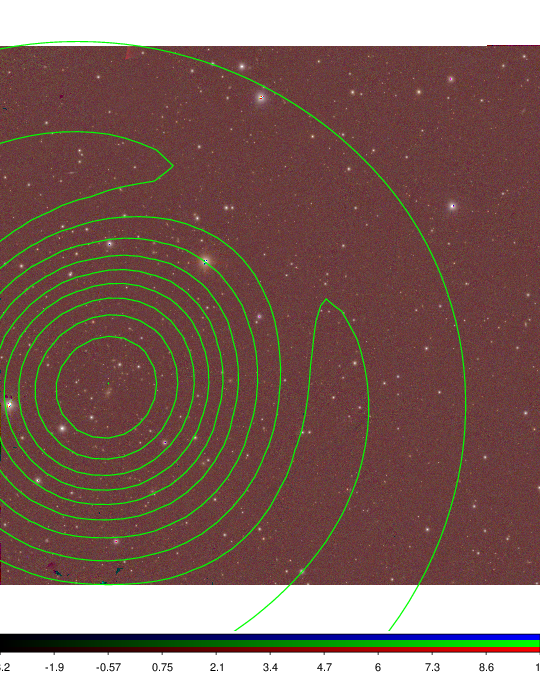  |
