

### 336

|Name|RAJ2000[deg]|DEJ2000[deg] |Ext[arcmin]| Ext,ml | z | z_src| C|GC(XSZ,Delta_z<0.01)| GC(OPT,Delta_z<0.01)|GC| R_sig[arcmin] | R500[arcmin] | R500[Mpc]| CRsig[c/s] | CR500[c/s] |L500[1E44 erg/s]|F500[1E-12 erg/s/cm^2]| M500[1E14 Msun]|Tx[keV]|Cnt_sig|Beta|Rc[arcmin]|Comment|Alias|
|---|---|---|---|---|---|------|---|--------|---------|----------|---|---|---|---|---|---|---|---|---|---|---|---|---|---|
|336| 149.929| 11.492| 2.72| 37.16| 0.0769(0.005)| z1, z_opt| S| -| N, RM| F20, N, W| 13.675| 9.352| 0.817| 0.222(0.037)| 0.211(0.035)| 0.565(0.063)| 3.889(0.437)| 1.67(0.09)| 3.01(0.11)| 82.8| 0.590(-0.065+0.144)| 2.713(-0.767+1.392)| -| t115|

|[RASS image](../image/336/336_img.pdf)|[filtered image](../image/336/336_fil.pdf)|[Segment image](../image/336/336_seg.pdf)|
|-------------------|--------------------|-------------------|
| 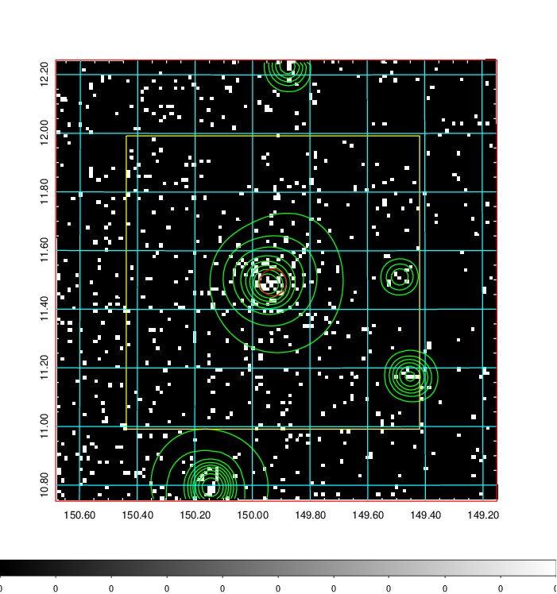  | 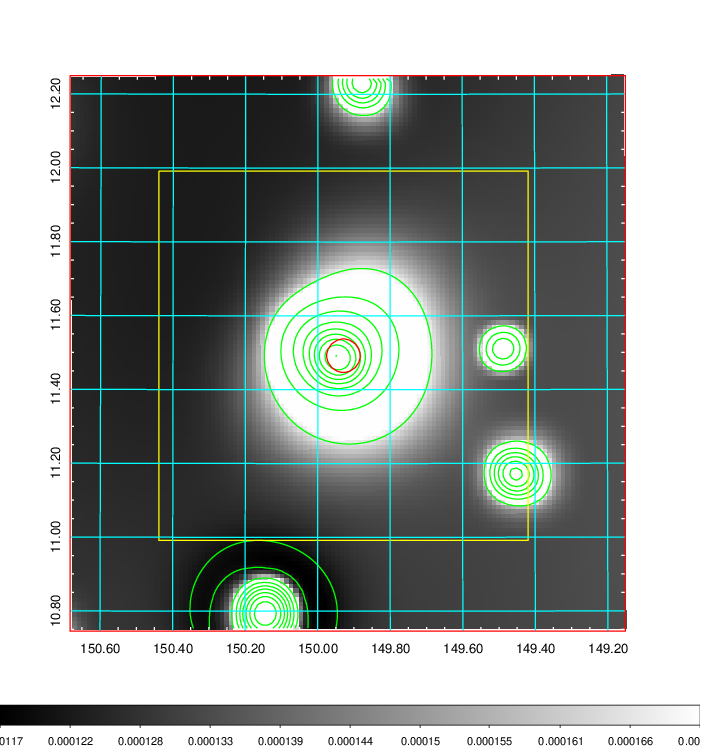   | 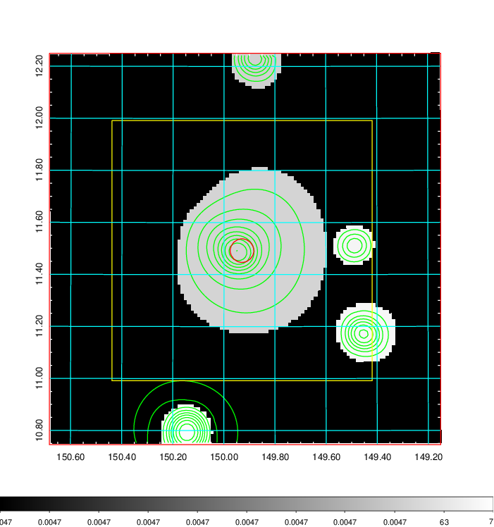  |

|[Exposure image](../image/336/336_mex.pdf)| [nH image](../image/336/336_nh.pdf)| [Planck image](../image/336/336_p.pdf)|
|-------------------|--------------------|-------------------|
|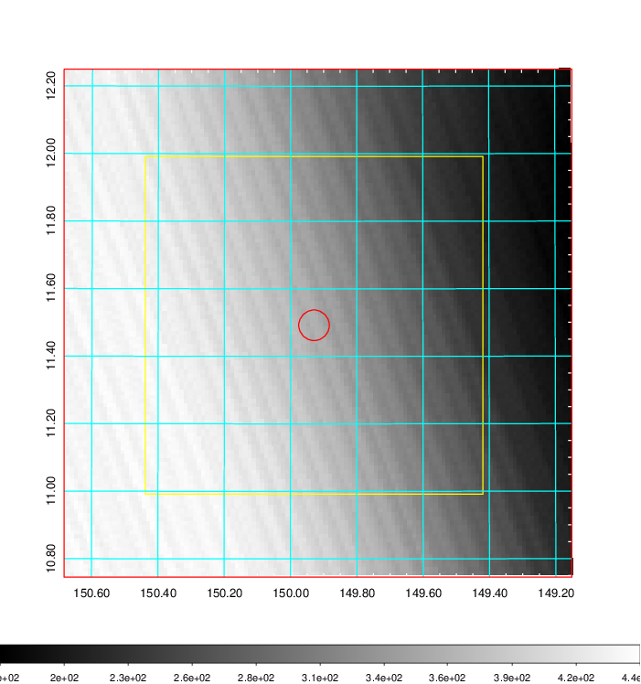   | 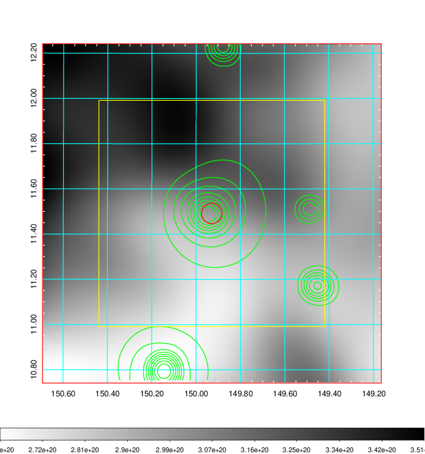    | 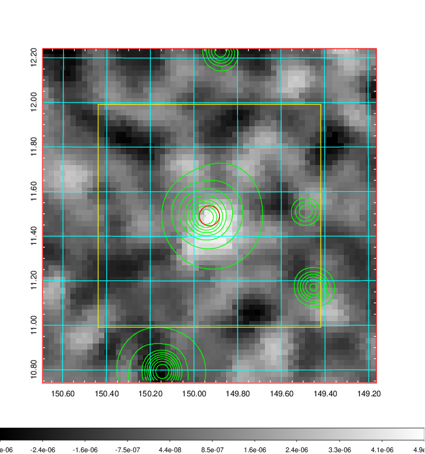 |

|[Redshift Histogram](../image/336/336_zg.pdf) | [DSS image(z1)](../image/336/336_dss_z1.pdf)      |  [DSS image(z2)](../image/336/336_dss_z2.pdf)    |
|-------------------|--------------------|-------------------|
|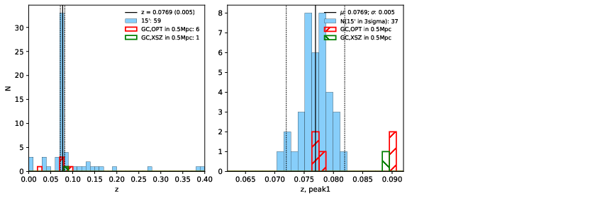 |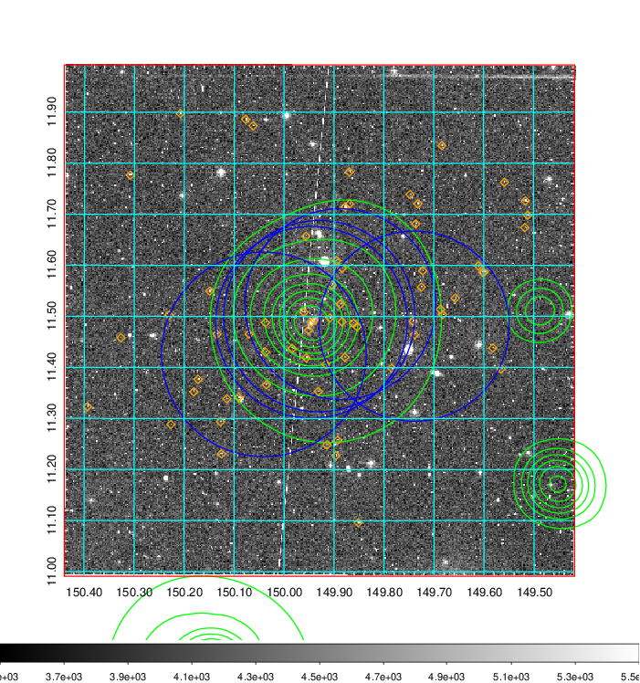  Blue circle for optical clusters;  Magenta circle for XSZ clusters;  all with r=1Mpc;  Only GC with Delta_z<0.01 are shown. | 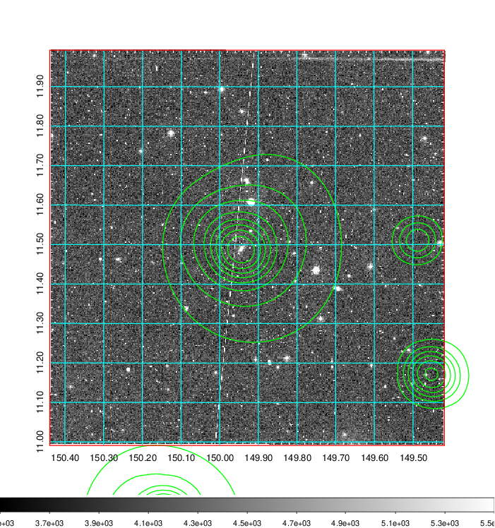 Blue circle for optical clusters;  Magenta circle for XSZ clusters;  all with r=1Mpc;  Only GC with Delta_z<0.01 are shown.  |

|[Previous-identified clusters](../image/336/336_gc.pdf) | [2MASS image](../image/336/336_2mass.pdf)      |[SDSS image](../image/336/336_sdss.pdf)   |
|-------------------|-------------------|-------------------|
|  Green, magenta, and blue circles  for optical, X-ray and SZ clusters  respectively, with redshift of clusters  labelled. The radius of circles  are 1Mpc.|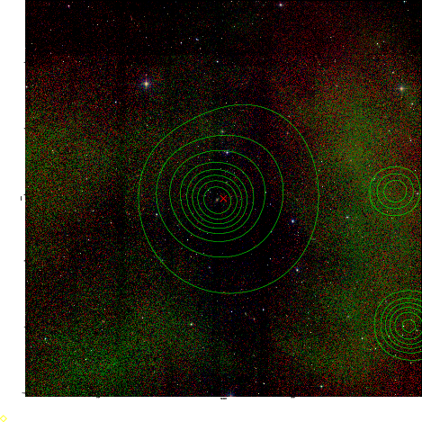  | 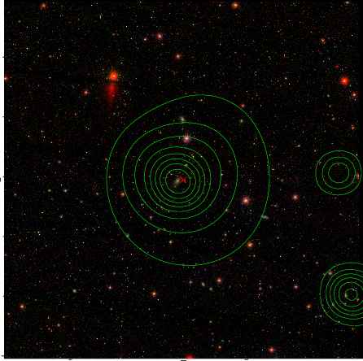  |

