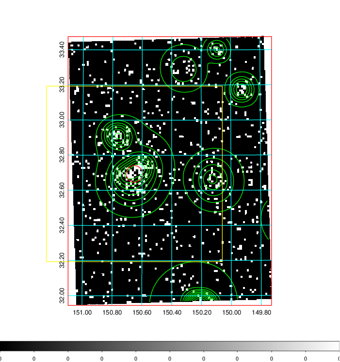
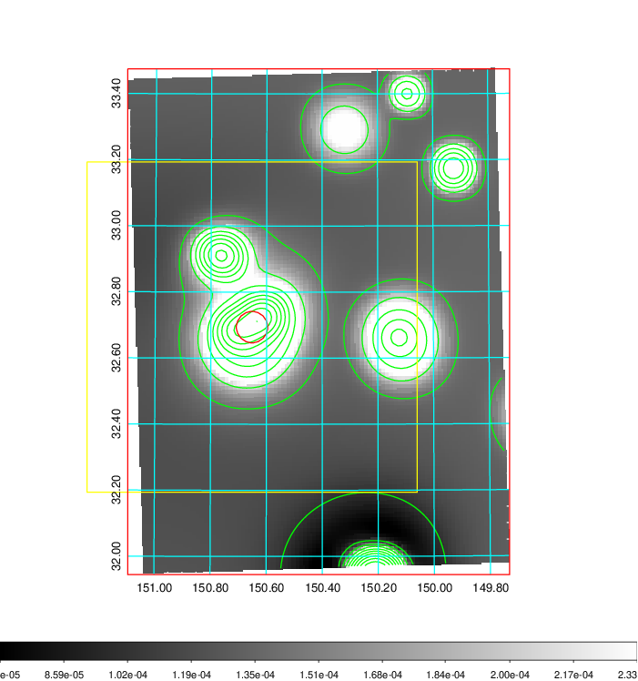
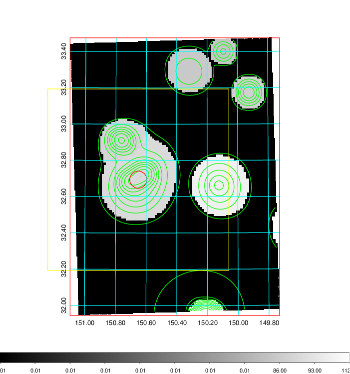
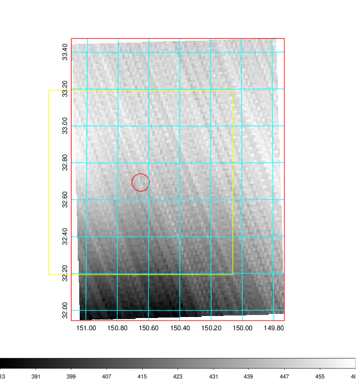
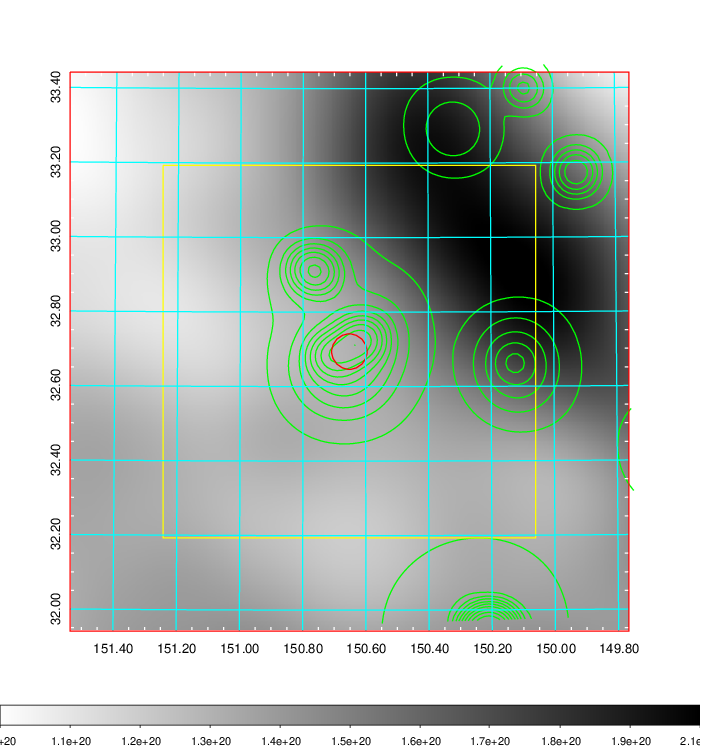
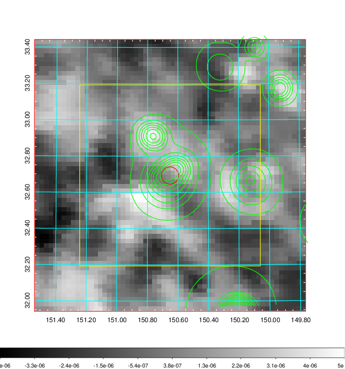
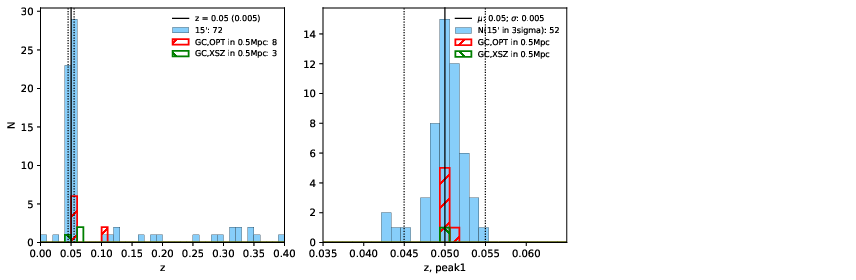
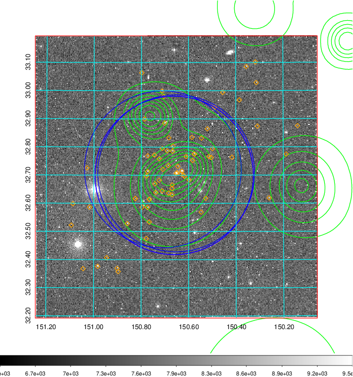
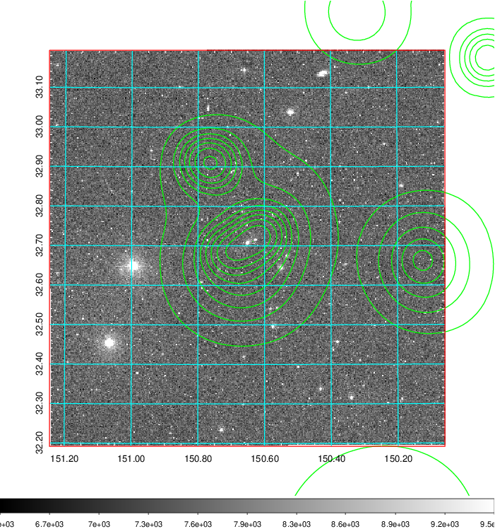
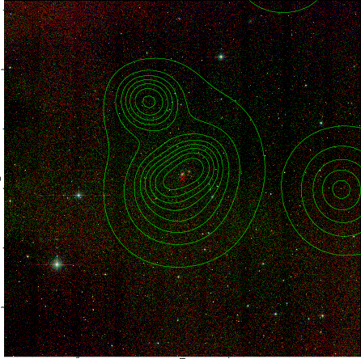

### 337

|Name|RAJ2000[deg]|DEJ2000[deg] |Ext[arcmin]| Ext,ml | z | z_src| C|GC(XSZ,Delta_z<0.01)| GC(OPT,Delta_z<0.01)|GC| R_sig[arcmin] | R500[arcmin] | R500[Mpc]| CRsig[c/s] | CR500[c/s] |L500[1E44 erg/s]|F500[1E-12 erg/s/cm^2]| M500[1E14 Msun]|Tx[keV]|Cnt_sig|Beta|Rc[arcmin]|Comment|Alias|
|---|---|---|---|---|---|------|---|--------|---------|----------|---|---|---|---|---|---|---|---|---|---|---|---|---|---|
|337| 150.652| 32.694| 2.85| 96.96| 0.0500(0.005)| z1, z_xsz| B| MCXC| N, W, Zw| C, F20, MCXC, N, SPI, Tak, W| 14.162| 12.506| 0.733| 0.305(0.037)| 0.299(0.037)| 0.338(0.028)| 5.709(0.473)| 1.18(0.05)| 2.40(0.06)| 137.9| 0.793(-0.122+0.129)| 5.169(-1.105+1.018)| -| k360|

|[RASS image](../image/337/337_img.pdf)|[filtered image](../image/337/337_fil.pdf)|[Segment image](../image/337/337_seg.pdf)|
|-------------------|--------------------|-------------------|
|   |    |   |

|[Exposure image](../image/337/337_mex.pdf)| [nH image](../image/337/337_nh.pdf)| [Planck image](../image/337/337_p.pdf)|
|-------------------|--------------------|-------------------|
|   |     |  |

|[Redshift Histogram](../image/337/337_zg.pdf) | [DSS image(z1)](../image/337/337_dss_z1.pdf)      |  [DSS image(z2)](../image/337/337_dss_z2.pdf)    |
|-------------------|--------------------|-------------------|
| |  Blue circle for optical clusters;  Magenta circle for XSZ clusters;  all with r=1Mpc;  Only GC with Delta_z<0.01 are shown. |  Blue circle for optical clusters;  Magenta circle for XSZ clusters;  all with r=1Mpc;  Only GC with Delta_z<0.01 are shown.  |

|[Previous-identified clusters](../image/337/337_gc.pdf) | [2MASS image](../image/337/337_2mass.pdf)      |[SDSS image](../image/337/337_sdss.pdf)   |
|-------------------|-------------------|-------------------|
|  Green, magenta, and blue circles  for optical, X-ray and SZ clusters  respectively, with redshift of clusters  labelled. The radius of circles  are 1Mpc.|  |   |

