

### 338

|Name|RAJ2000[deg]|DEJ2000[deg] |Ext[arcmin]| Ext,ml | z | z_src| C|GC(XSZ,Delta_z<0.01)| GC(OPT,Delta_z<0.01)|GC| R_sig[arcmin] | R500[arcmin] | R500[Mpc]| CRsig[c/s] | CR500[c/s] |L500[1E44 erg/s]|F500[1E-12 erg/s/cm^2]| M500[1E14 Msun]|Tx[keV]|Cnt_sig|Beta|Rc[arcmin]|Comment|Alias|
|---|---|---|---|---|---|------|---|--------|---------|----------|---|---|---|---|---|---|---|---|---|---|---|---|---|---|
|338| 150.772| 67.158| 1.58| 28.33| 0.2060(0.000)| z_xsz| B| MCXC, PSZ2, Tar| A| A, C, MCXC, N, PSZ2, Tar, W| 9.775| 5.409| 1.096| 0.150(0.030)| 0.140(0.028)| 3.274(0.312)| 2.666(0.254)| 4.59(0.21)| 5.86(0.17)| 55.9| 0.885(-0.122+0.082)| 3.798(-0.705+0.524)| -| k133|

|[RASS image](../image/338/338_img.pdf)|[filtered image](../image/338/338_fil.pdf)|[Segment image](../image/338/338_seg.pdf)|
|-------------------|--------------------|-------------------|
| 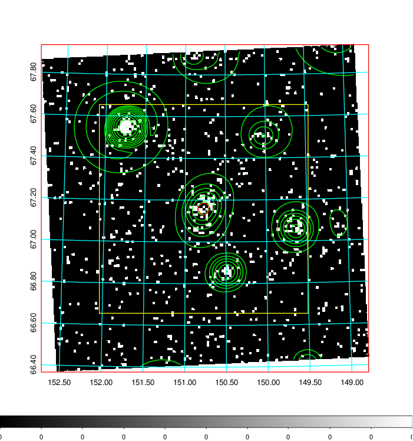  | 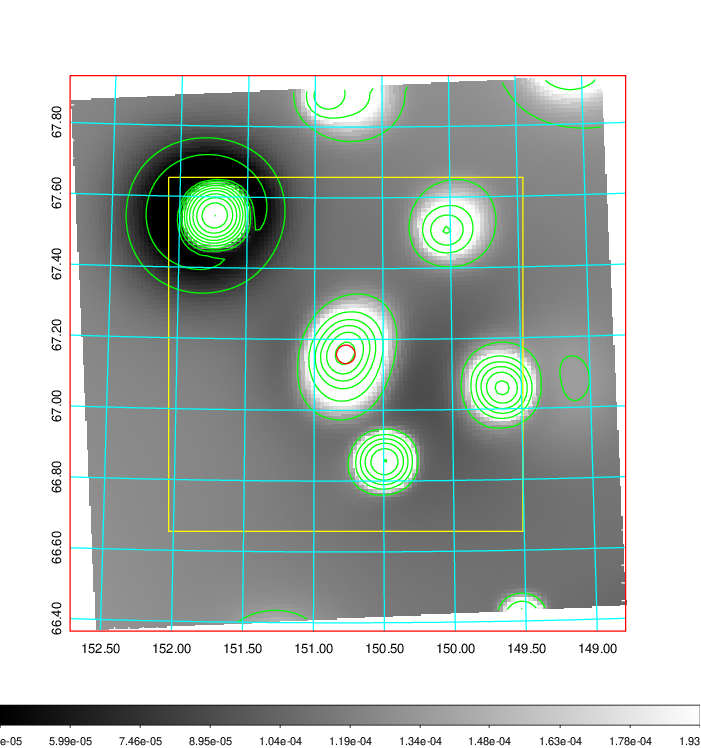   | 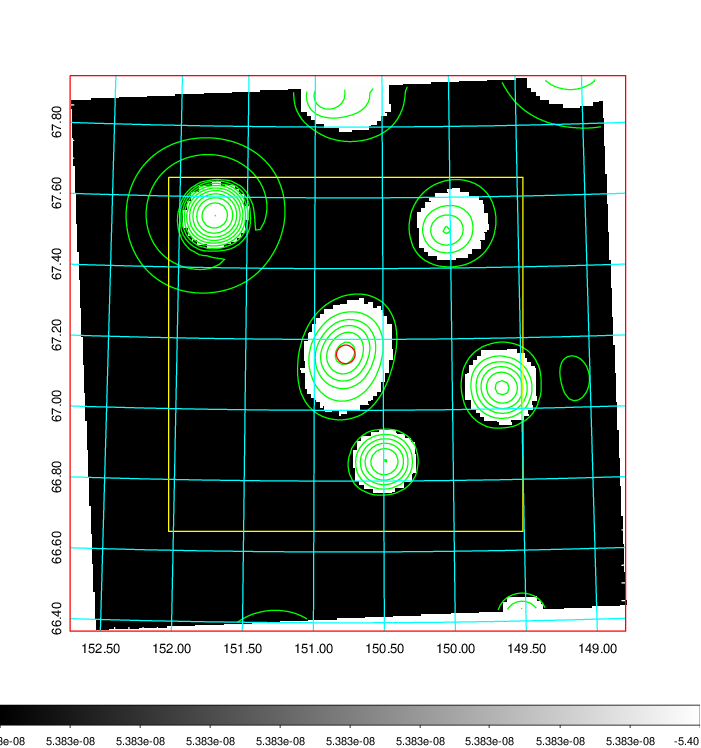  |

|[Exposure image](../image/338/338_mex.pdf)| [nH image](../image/338/338_nh.pdf)| [Planck image](../image/338/338_p.pdf)|
|-------------------|--------------------|-------------------|
|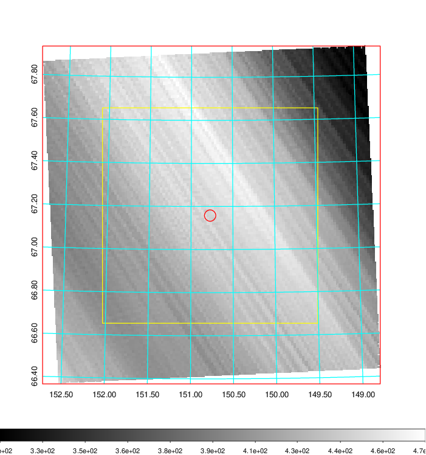   | 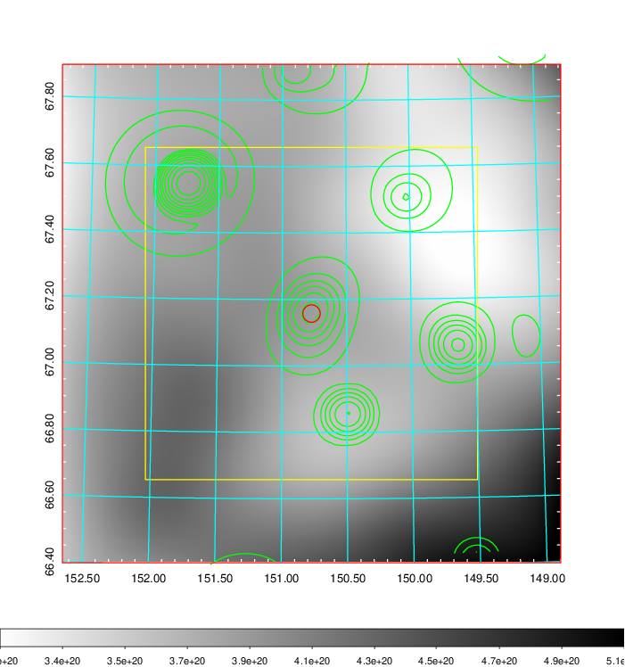    | 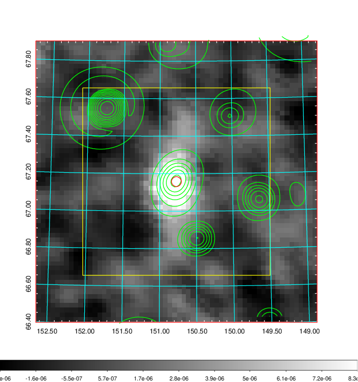 |

|[Redshift Histogram](../image/338/338_zg.pdf) | [DSS image(z1)](../image/338/338_dss_z1.pdf)      |  [DSS image(z2)](../image/338/338_dss_z2.pdf)    |
|-------------------|--------------------|-------------------|
|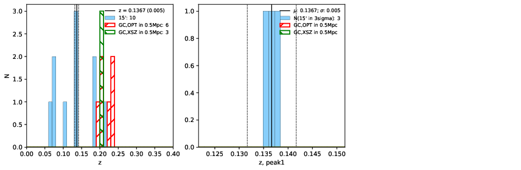 |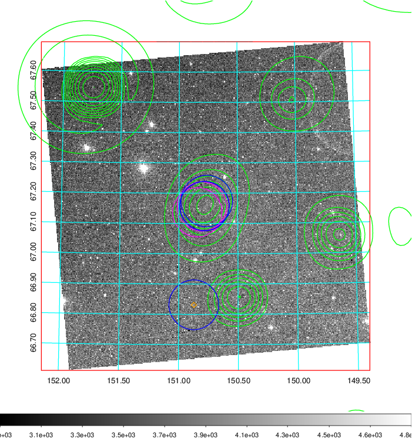  Blue circle for optical clusters;  Magenta circle for XSZ clusters;  all with r=1Mpc;  Only GC with Delta_z<0.01 are shown. | 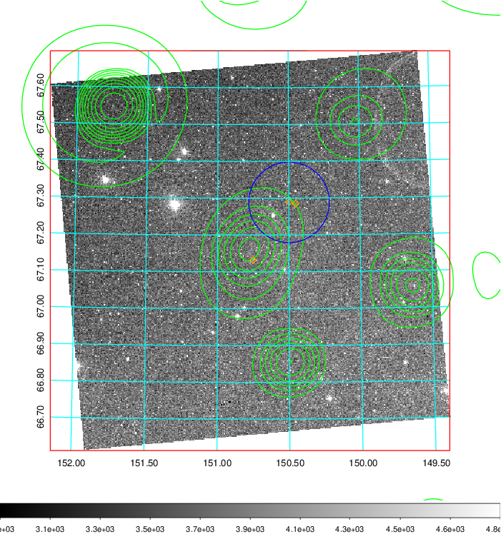 Blue circle for optical clusters;  Magenta circle for XSZ clusters;  all with r=1Mpc;  Only GC with Delta_z<0.01 are shown.  |

|[Previous-identified clusters](../image/338/338_gc.pdf) | [2MASS image](../image/338/338_2mass.pdf)      |[SDSS image](../image/338/338_sdss.pdf)   |
|-------------------|-------------------|-------------------|
|  Green, magenta, and blue circles  for optical, X-ray and SZ clusters  respectively, with redshift of clusters  labelled. The radius of circles  are 1Mpc.|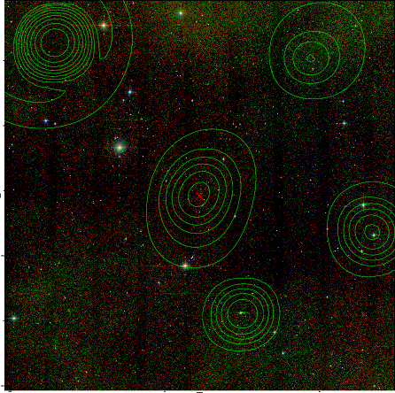  | 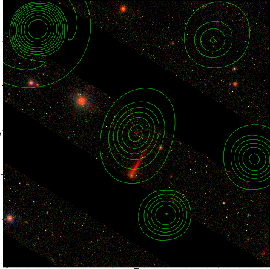  |

