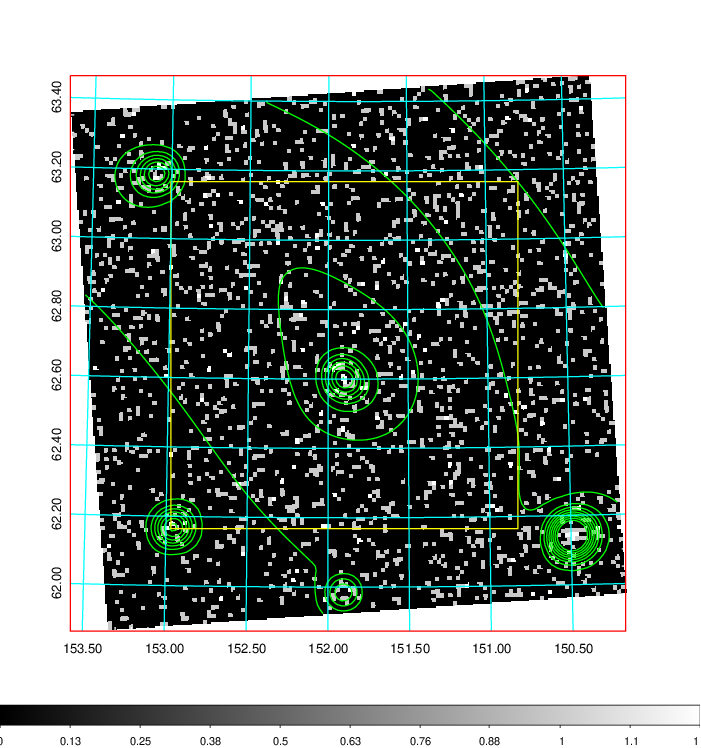
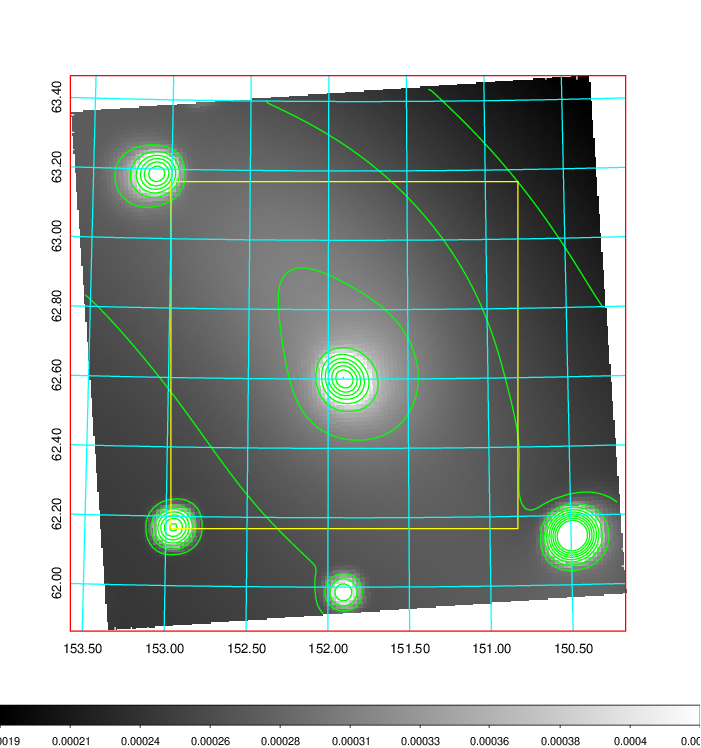
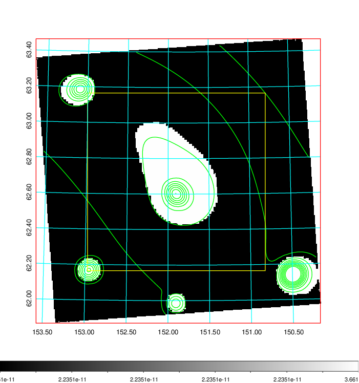
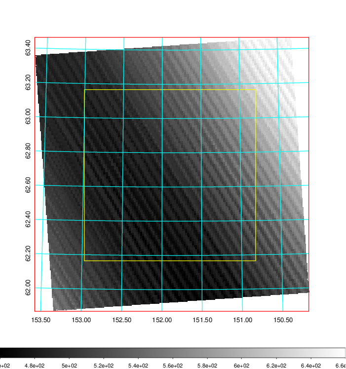
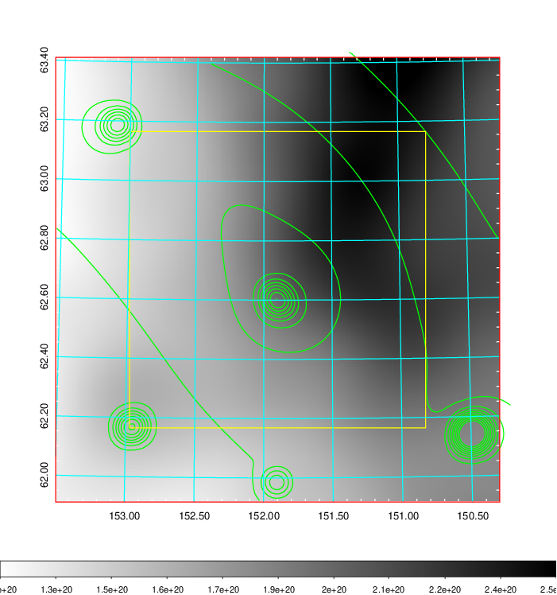
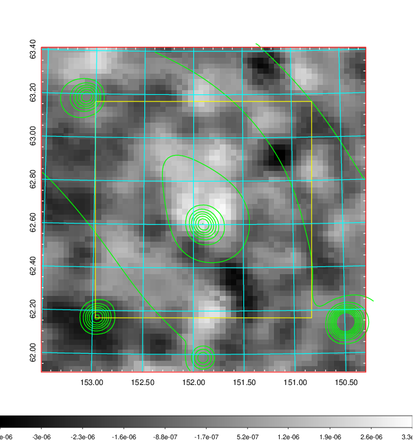
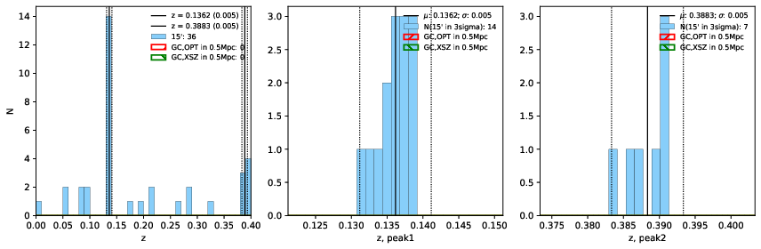
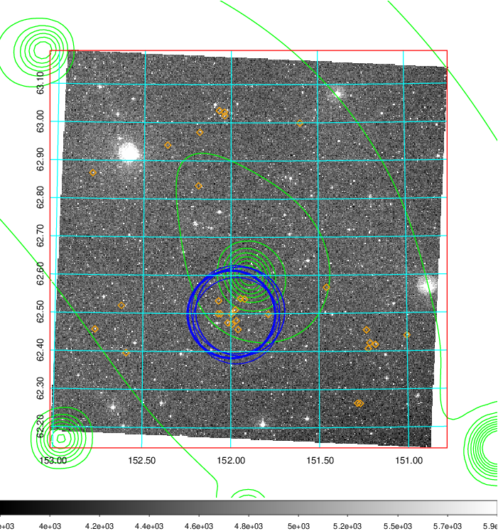
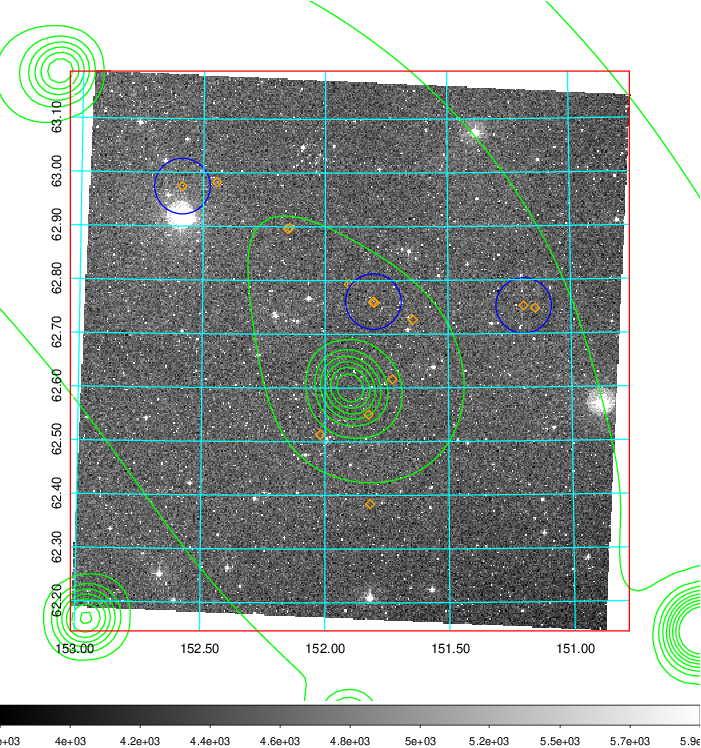
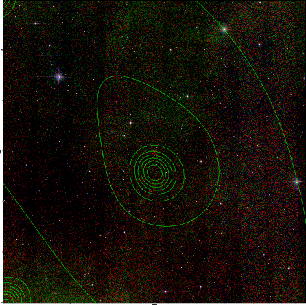

### 339

|Name|RAJ2000[deg]|DEJ2000[deg] |Ext[arcmin]| Ext,ml | z | z_src| C|GC(XSZ,Delta_z<0.01)| GC(OPT,Delta_z<0.01)|GC| R_sig[arcmin] | R500[arcmin] | R500[Mpc]| CRsig[c/s] | CR500[c/s] |L500[1E44 erg/s]|F500[1E-12 erg/s/cm^2]| M500[1E14 Msun]|Tx[keV]|Cnt_sig|Beta|Rc[arcmin]|Comment|Alias|
|---|---|---|---|---|---|------|---|--------|---------|----------|---|---|---|---|---|---|---|---|---|---|---|---|---|---|
|339| 151.899| 62.669| 135.28| 157.71| 0.1362(0.005)| z1,| G| -| -| A, C, N, W| 29.638| 7.541| 1.091| 0.330(0.068)| 0.294(0.061)| 2.863(1.290)| 5.807(2.615)| 4.21(0.92)| 5.43(0.76)| 288.8| 0.505(-0.005+0.011)| 7.376(-0.272+0.426)| might be c4,| t730|

|[RASS image](../image/339/339_img.pdf)|[filtered image](../image/339/339_fil.pdf)|[Segment image](../image/339/339_seg.pdf)|
|-------------------|--------------------|-------------------|
|   |    |   |

|[Exposure image](../image/339/339_mex.pdf)| [nH image](../image/339/339_nh.pdf)| [Planck image](../image/339/339_p.pdf)|
|-------------------|--------------------|-------------------|
|   |     |  |

|[Redshift Histogram](../image/339/339_zg.pdf) | [DSS image(z1)](../image/339/339_dss_z1.pdf)      |  [DSS image(z2)](../image/339/339_dss_z2.pdf)    |
|-------------------|--------------------|-------------------|
| |  Blue circle for optical clusters;  Magenta circle for XSZ clusters;  all with r=1Mpc;  Only GC with Delta_z<0.01 are shown. |  Blue circle for optical clusters;  Magenta circle for XSZ clusters;  all with r=1Mpc;  Only GC with Delta_z<0.01 are shown.  |

|[known Abell/XSZ clusters](../image/339/339_gc.pdf) | [2MASS image](../image/339/339_2mass.pdf)      |
|-------------------|-------------------|
|  Magenta, blue and green circles  for optical, X-ray and SZ clusters  respectively, with redshift of clusters  labelled. The radius of circles  are 1Mpc.|  |

|[PS1 image](../image/339/339_ps1.pdf)            |
|-------------------|
|   |
