

### 34

|Name|RAJ2000[deg]|DEJ2000[deg] |Ext[arcmin]| Ext,ml | z | z_src| C|GC(XSZ,Delta_z<0.01)| GC(OPT,Delta_z<0.01)|GC| R_sig[arcmin] | R500[arcmin] | R500[Mpc]| CRsig[c/s] | CR500[c/s] |L500[1E44 erg/s]|F500[1E-12 erg/s/cm^2]| M500[1E14 Msun]|Tx[keV]|Cnt_sig|Beta|Rc[arcmin]|Comment|Alias|
|---|---|---|---|---|---|------|---|--------|---------|----------|---|---|---|---|---|---|---|---|---|---|---|---|---|---|
|34| 10.636| 15.176| 3.35| 31.00| 0.0791(0.005)| z1,| G| -| -| C, N, W| 11.238| 7.812| 0.701| 0.098(0.030)| 0.093(0.029)| 0.239(0.054)| 1.552(0.351)| 1.05(0.12)| 2.27(0.17)| 43.6| 0.764(-0.167+0.159)| 5.394(-1.693+1.508)| -| t153|

|[RASS image](../image/34/34_img.pdf)|[filtered image](../image/34/34_fil.pdf)|[Segment image](../image/34/34_seg.pdf)|
|-------------------|--------------------|-------------------|
| 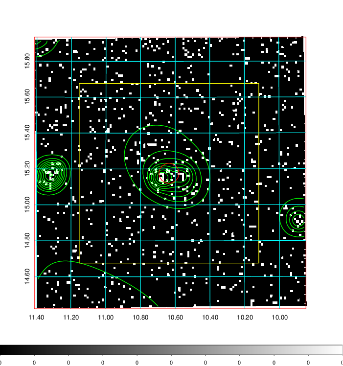  | 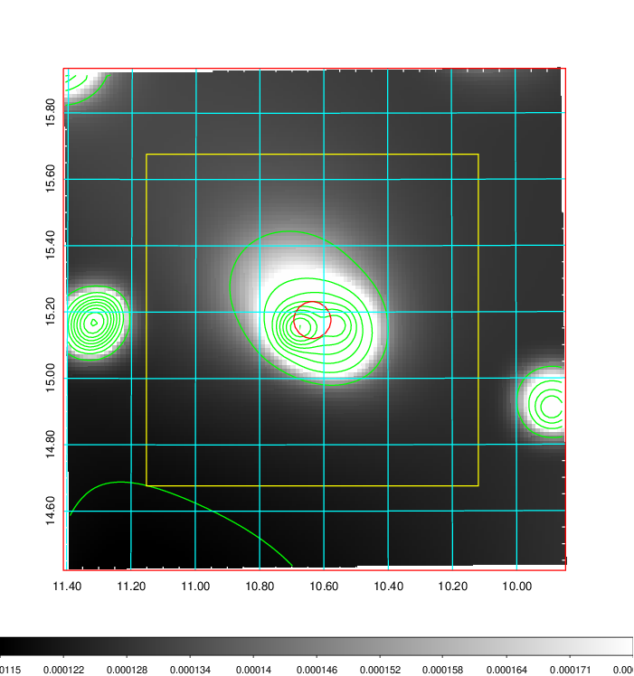   | 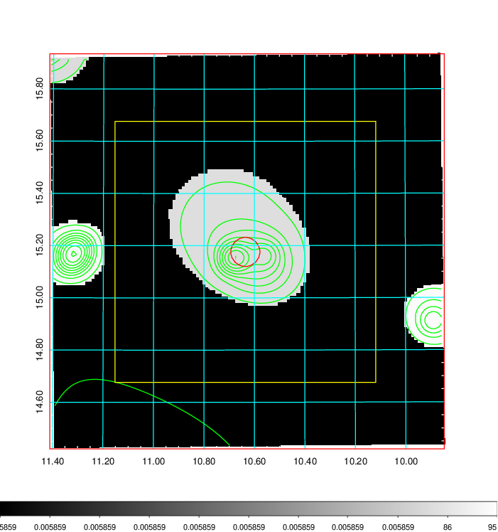  |

|[Exposure image](../image/34/34_mex.pdf)| [nH image](../image/34/34_nh.pdf)| [Planck image](../image/34/34_p.pdf)|
|-------------------|--------------------|-------------------|
|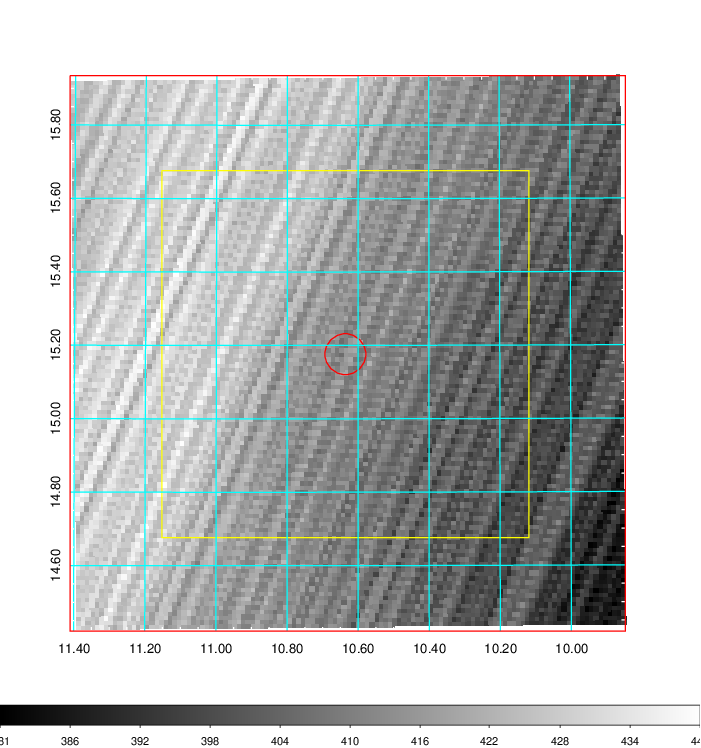   | 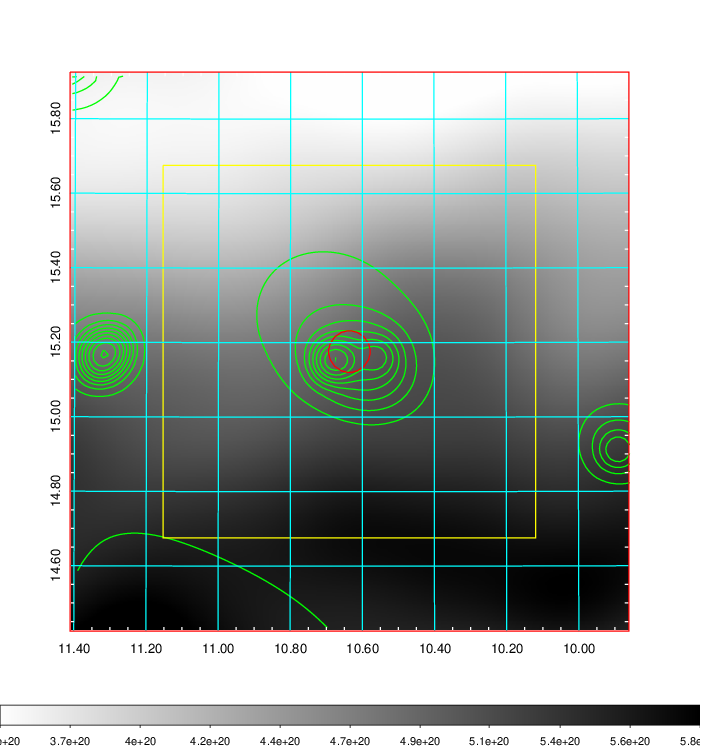    | 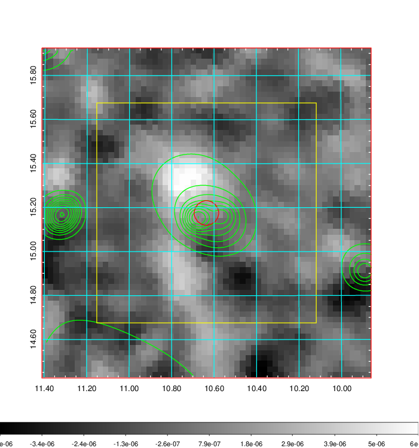 |

|[Redshift Histogram](../image/34/34_zg.pdf) | [DSS image(z1)](../image/34/34_dss_z1.pdf)      |  [DSS image(z2)](../image/34/34_dss_z2.pdf)    |
|-------------------|--------------------|-------------------|
|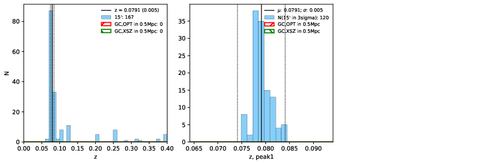 |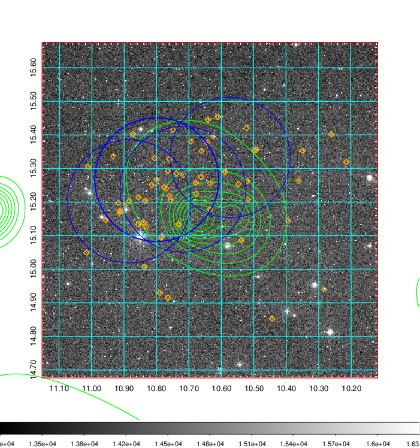  Blue circle for optical clusters;  Magenta circle for XSZ clusters;  all with r=1Mpc;  Only GC with Delta_z<0.01 are shown. | 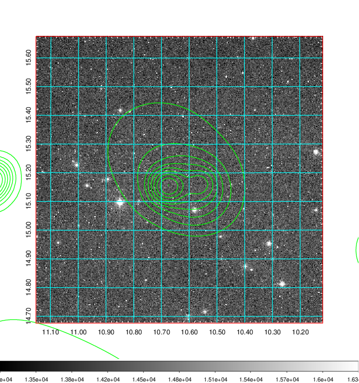 Blue circle for optical clusters;  Magenta circle for XSZ clusters;  all with r=1Mpc;  Only GC with Delta_z<0.01 are shown.  |

|[Previous-identified clusters](../image/34/34_gc.pdf) | [2MASS image](../image/34/34_2mass.pdf)      |[SDSS image](../image/34/34_sdss.pdf)   |
|-------------------|-------------------|-------------------|
|  Green, magenta, and blue circles  for optical, X-ray and SZ clusters  respectively, with redshift of clusters  labelled. The radius of circles  are 1Mpc.|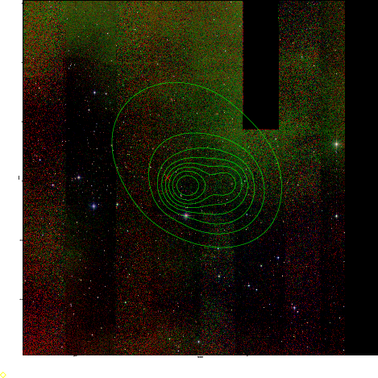  | 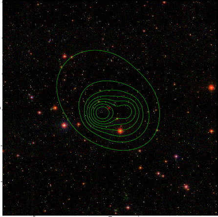  |

