

### 340

|Name|RAJ2000[deg]|DEJ2000[deg] |Ext[arcmin]| Ext,ml | z | z_src| C|GC(XSZ,Delta_z<0.01)| GC(OPT,Delta_z<0.01)|GC| R_sig[arcmin] | R500[arcmin] | R500[Mpc]| CRsig[c/s] | CR500[c/s] |L500[1E44 erg/s]|F500[1E-12 erg/s/cm^2]| M500[1E14 Msun]|Tx[keV]|Cnt_sig|Beta|Rc[arcmin]|Comment|Alias|
|---|---|---|---|---|---|------|---|--------|---------|----------|---|---|---|---|---|---|---|---|---|---|---|---|---|---|
|340| 151.981| 0.534| 4.40| 29.61| 0.0968(0.005)| z1, z_xsz| B| F20, MCXC| A, N, RM| A, C, F20, MCXC, N, W| 10.750| 6.859| 0.737| 0.089(0.028)| 0.084(0.027)| 0.368(0.076)| 1.557(0.320)| 1.25(0.13)| 2.53(0.17)| 37.9| 0.872(-0.144+0.091)| 6.691(-1.275+1.023)| -| k502|

|[RASS image](../image/340/340_img.pdf)|[filtered image](../image/340/340_fil.pdf)|[Segment image](../image/340/340_seg.pdf)|
|-------------------|--------------------|-------------------|
| 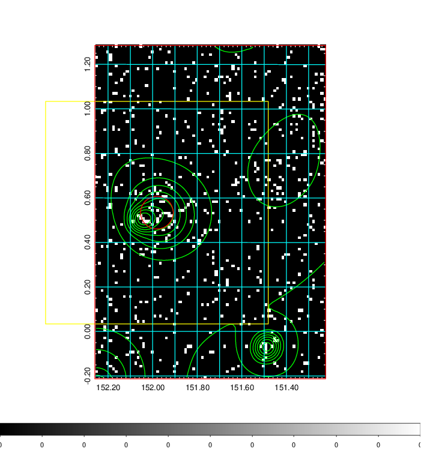  | 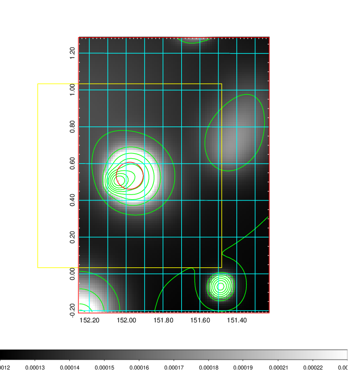   | 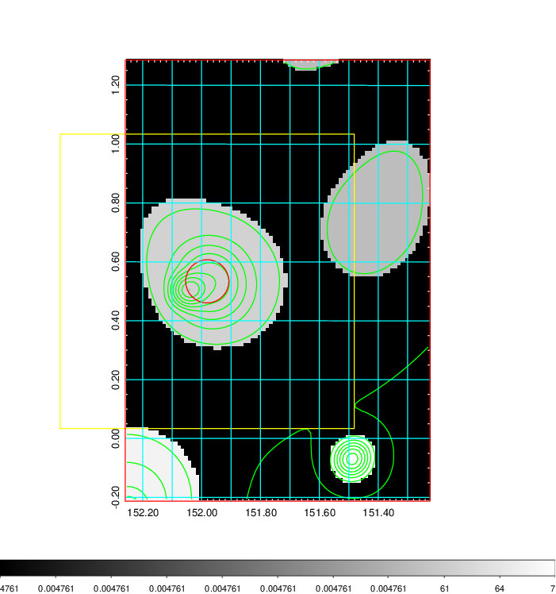  |

|[Exposure image](../image/340/340_mex.pdf)| [nH image](../image/340/340_nh.pdf)| [Planck image](../image/340/340_p.pdf)|
|-------------------|--------------------|-------------------|
|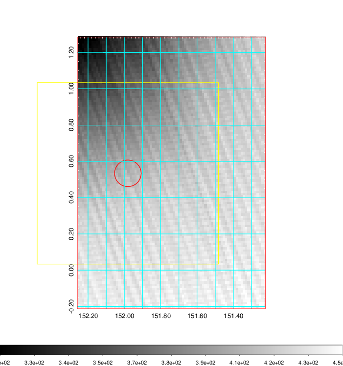   | 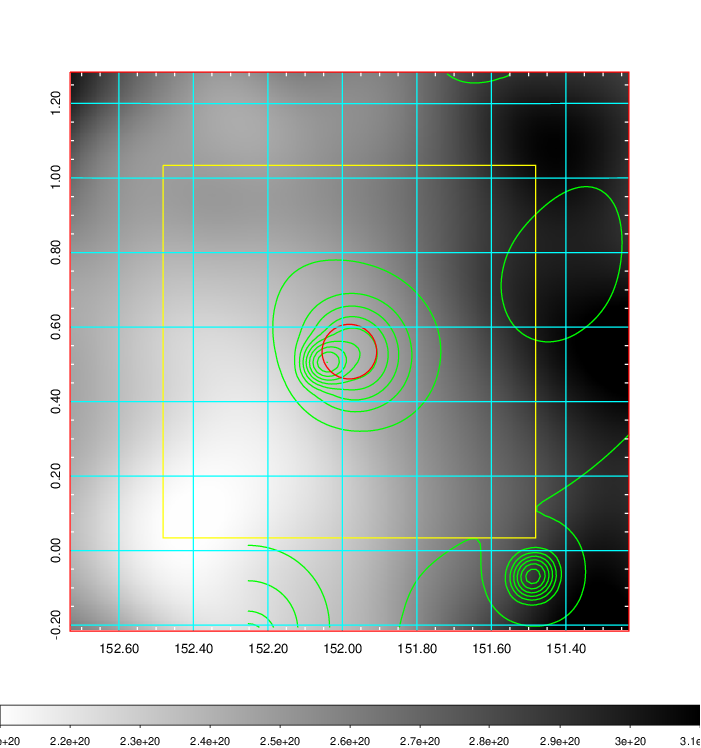    | 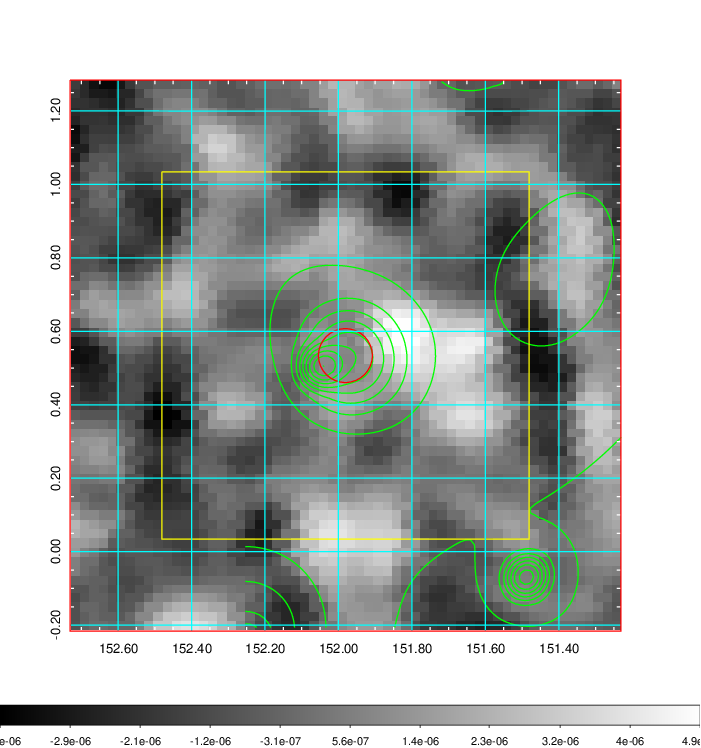 |

|[Redshift Histogram](../image/340/340_zg.pdf) | [DSS image(z1)](../image/340/340_dss_z1.pdf)      |  [DSS image(z2)](../image/340/340_dss_z2.pdf)    |
|-------------------|--------------------|-------------------|
|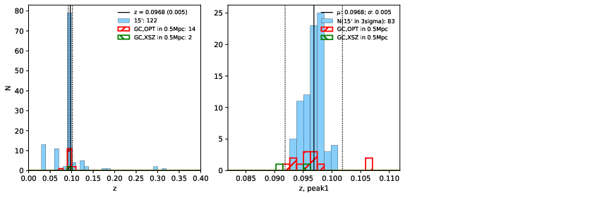 |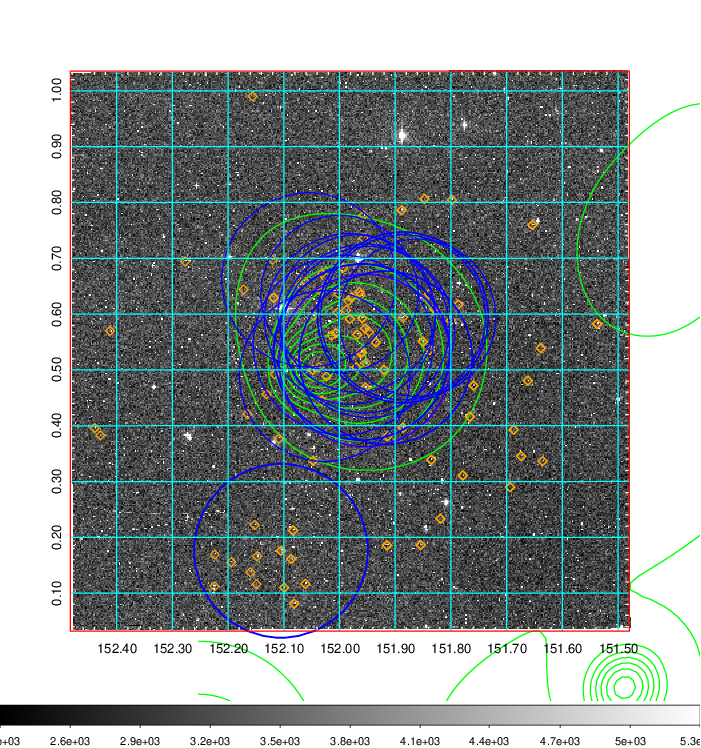  Blue circle for optical clusters;  Magenta circle for XSZ clusters;  all with r=1Mpc;  Only GC with Delta_z<0.01 are shown. | 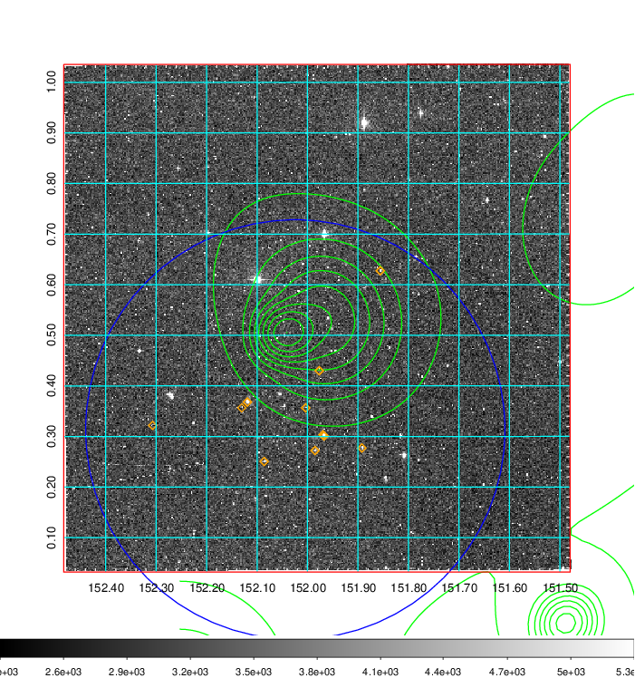 Blue circle for optical clusters;  Magenta circle for XSZ clusters;  all with r=1Mpc;  Only GC with Delta_z<0.01 are shown.  |

|[known Abell/XSZ clusters](../image/340/340_gc.pdf) | [2MASS image](../image/340/340_2mass.pdf)      |[SDSS image](../image/340/340_sdss.pdf)   |
|-------------------|-------------------|-------------------|
|  Magenta, blue and green circles  for optical, X-ray and SZ clusters  respectively, with redshift of clusters  labelled. The radius of circles  are 1Mpc.|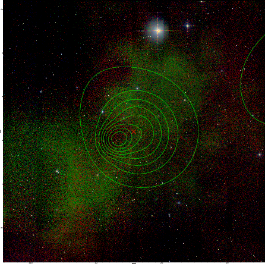  | 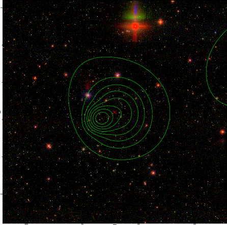  |

