

### 341

|Name|RAJ2000[deg]|DEJ2000[deg] |Ext[arcmin]| Ext,ml | z | z_src| C|GC(XSZ,Delta_z<0.01)| GC(OPT,Delta_z<0.01)|GC| R_sig[arcmin] | R500[arcmin] | R500[Mpc]| CRsig[c/s] | CR500[c/s] |L500[1E44 erg/s]|F500[1E-12 erg/s/cm^2]| M500[1E14 Msun]|Tx[keV]|Cnt_sig|Beta|Rc[arcmin]|Comment|Alias|
|---|---|---|---|---|---|------|---|--------|---------|----------|---|---|---|---|---|---|---|---|---|---|---|---|---|---|
|341| 152.982| 64.657| 12.10| 64.03| 0.1193(0.005)| z2,| G| -| -| C, N, W| 18.062| 5.724| 0.739| 0.064(0.029)| 0.000(0.026)| 0.514(0.426)| 1.390(1.151)| 1.29(0.54)| 2.60(0.69)| 102.4| 0.610(-0.084+0.190)| 6.066(-1.048+1.960)| -| t491|

|[RASS image](../image/341/341_img.pdf)|[filtered image](../image/341/341_fil.pdf)|[Segment image](../image/341/341_seg.pdf)|
|-------------------|--------------------|-------------------|
| 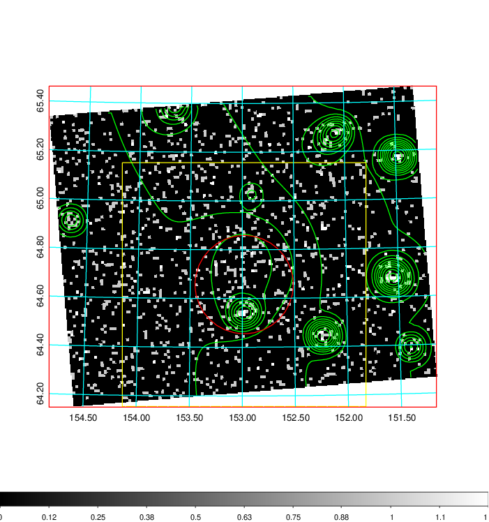  | 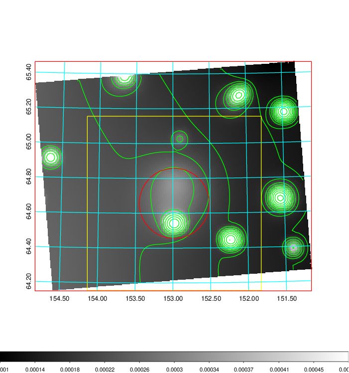   | 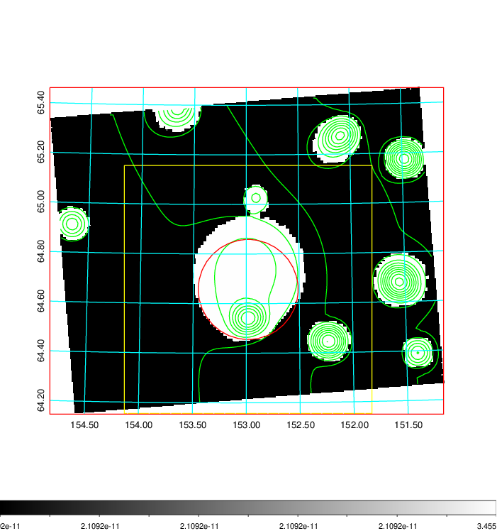  |

|[Exposure image](../image/341/341_mex.pdf)| [nH image](../image/341/341_nh.pdf)| [Planck image](../image/341/341_p.pdf)|
|-------------------|--------------------|-------------------|
|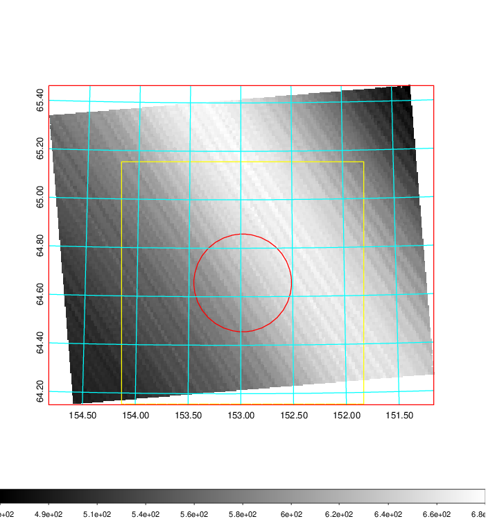   | 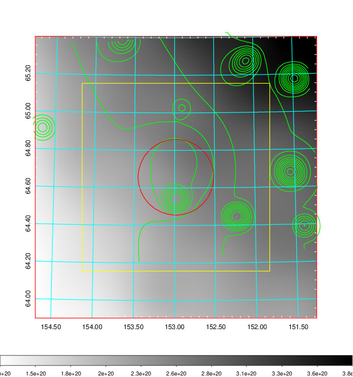    | 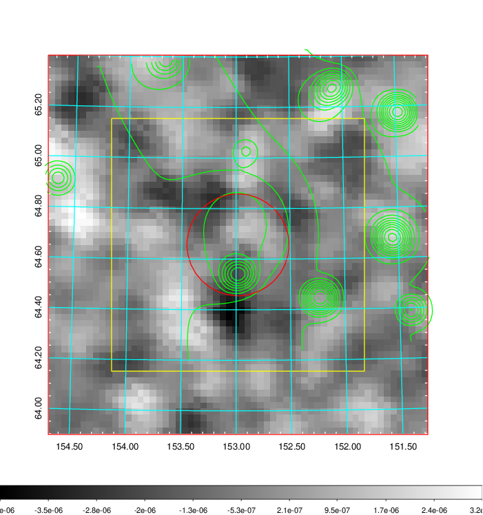 |

|[Redshift Histogram](../image/341/341_zg.pdf) | [DSS image(z1)](../image/341/341_dss_z1.pdf)      |  [DSS image(z2)](../image/341/341_dss_z2.pdf)    |
|-------------------|--------------------|-------------------|
|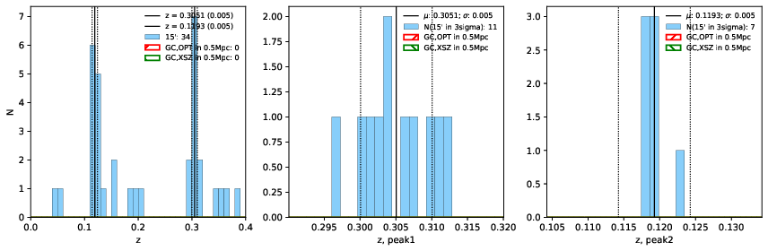 |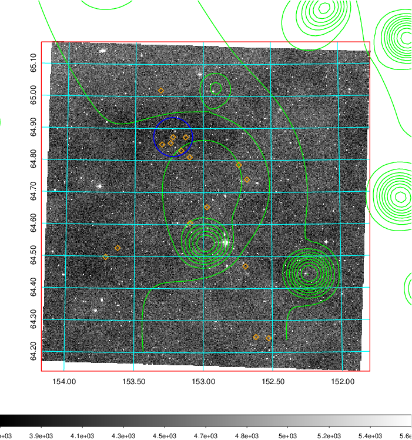  Blue circle for optical clusters;  Magenta circle for XSZ clusters;  all with r=1Mpc;  Only GC with Delta_z<0.01 are shown. | 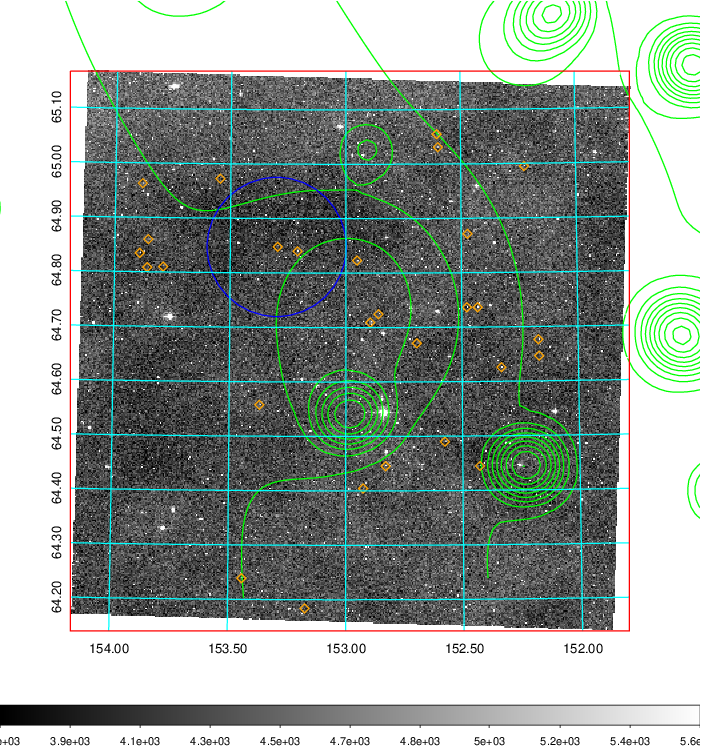 Blue circle for optical clusters;  Magenta circle for XSZ clusters;  all with r=1Mpc;  Only GC with Delta_z<0.01 are shown.  |

|[known Abell/XSZ clusters](../image/341/341_gc.pdf) | [2MASS image](../image/341/341_2mass.pdf)      |[SDSS image](../image/341/341_sdss.pdf)   |
|-------------------|-------------------|-------------------|
|  Magenta, blue and green circles  for optical, X-ray and SZ clusters  respectively, with redshift of clusters  labelled. The radius of circles  are 1Mpc.|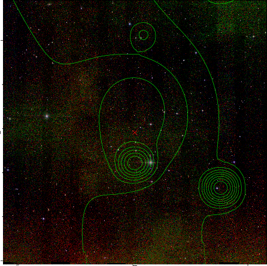  | 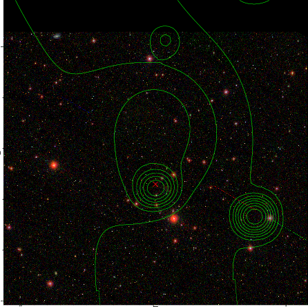  |

