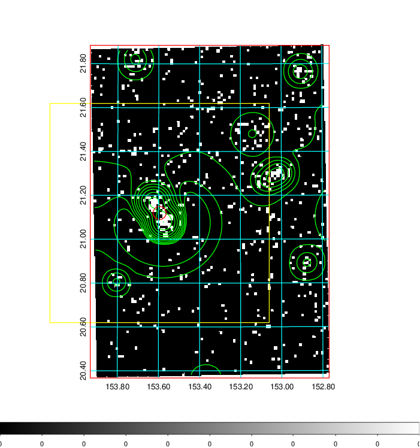
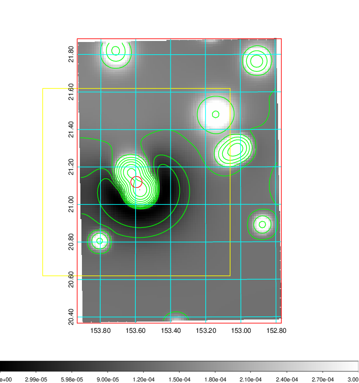
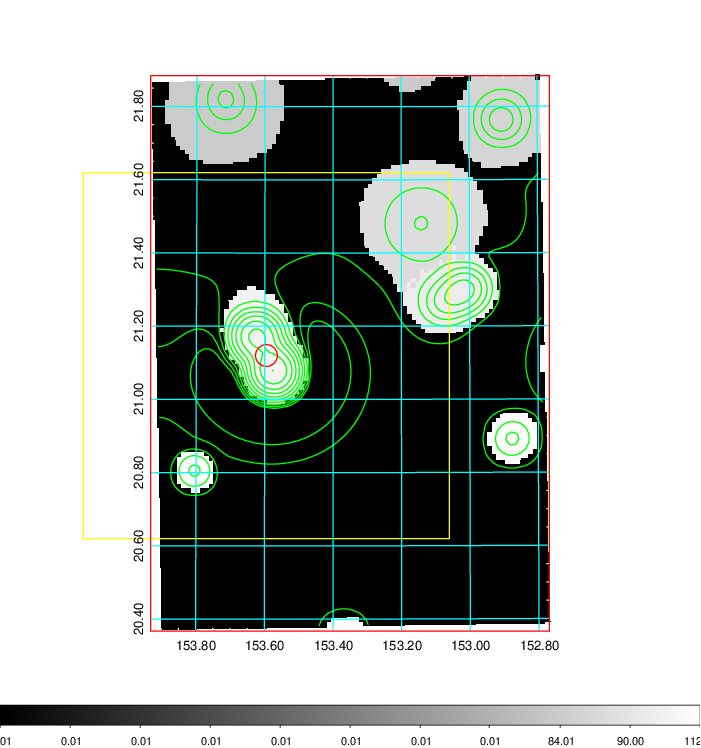
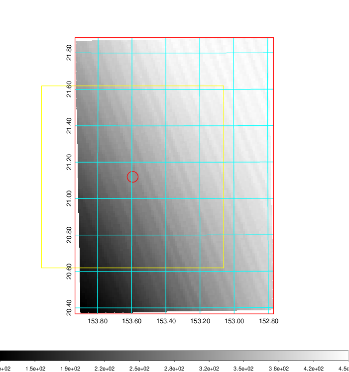
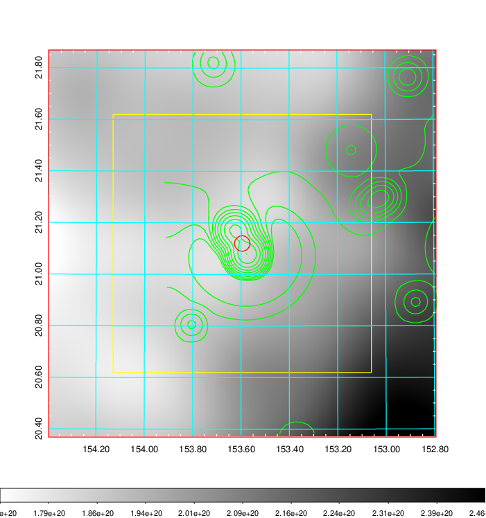
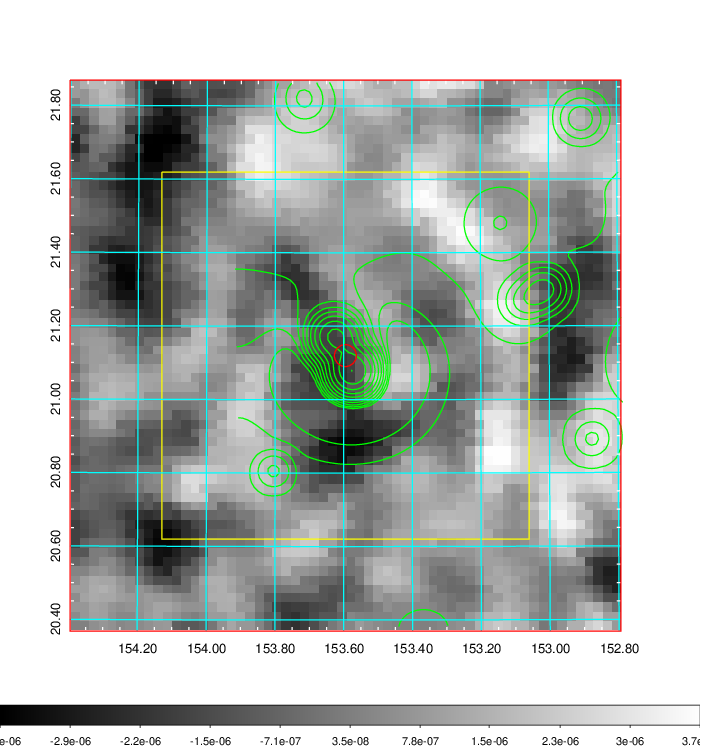
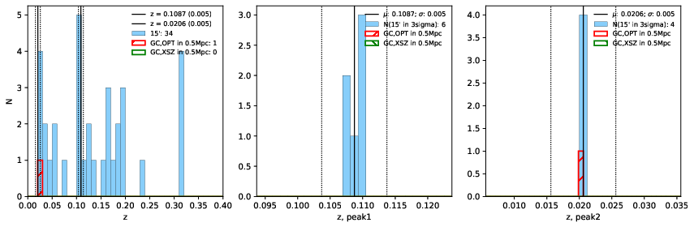
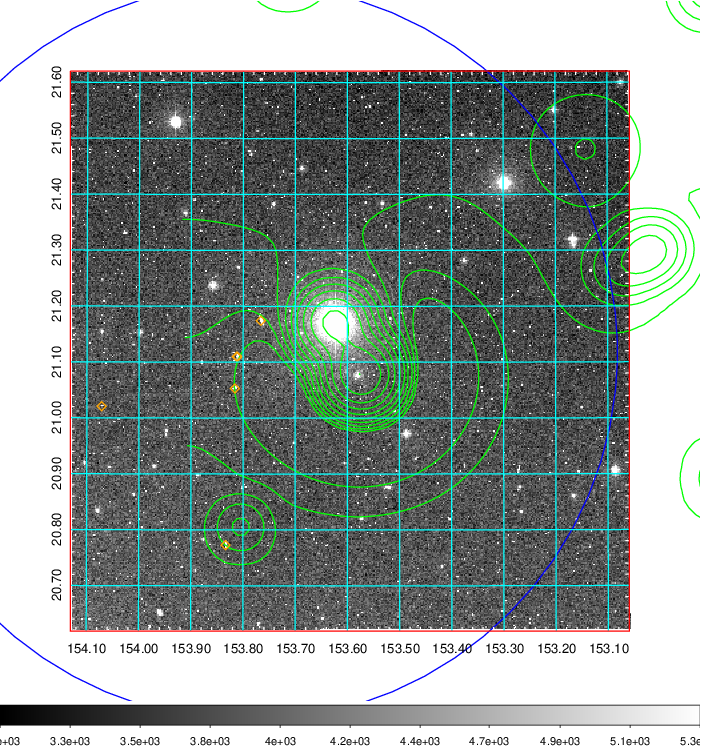
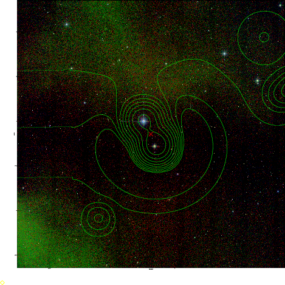
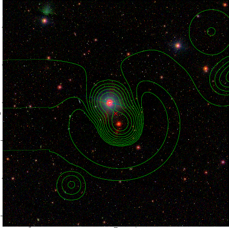

### 346

|Name|RAJ2000[deg]|DEJ2000[deg] |Ext[arcmin]| Ext,ml | z | z_src| C|GC(XSZ,Delta_z<0.01)| GC(OPT,Delta_z<0.01)|GC| R_sig[arcmin] | R500[arcmin] | R500[Mpc]| CRsig[c/s] | CR500[c/s] |L500[1E44 erg/s]|F500[1E-12 erg/s/cm^2]| M500[1E14 Msun]|Tx[keV]|Cnt_sig|Beta|Rc[arcmin]|Comment|Alias|
|---|---|---|---|---|---|------|---|--------|---------|----------|---|---|---|---|---|---|---|---|---|---|---|---|---|---|
|346| 153.595| 21.120| 1.80| 34.20| 0.1087(0.005)| z1,| G| -| -| C, N, W| 24.206| 8.549| 1.018| 0.356(0.059)| 0.322(0.054)| 1.928(0.156)| 6.364(0.513)| 3.33(0.13)| 4.66(0.12)| 129.9| 0.968(-0.045+0.024)| 5.492(-0.327+0.279)| -| t047|

|[RASS image](../image/346/346_img.pdf)|[filtered image](../image/346/346_fil.pdf)|[Segment image](../image/346/346_seg.pdf)|
|-------------------|--------------------|-------------------|
|   |    |   |

|[Exposure image](../image/346/346_mex.pdf)| [nH image](../image/346/346_nh.pdf)| [Planck image](../image/346/346_p.pdf)|
|-------------------|--------------------|-------------------|
|   |     |  |

|[Redshift Histogram](../image/346/346_zg.pdf) | [DSS image(z1)](../image/346/346_dss_z1.pdf)      |  [DSS image(z2)](../image/346/346_dss_z2.pdf)    |
|-------------------|--------------------|-------------------|
| |  Blue circle for optical clusters;  Magenta circle for XSZ clusters;  all with r=1Mpc;  Only GC with Delta_z<0.01 are shown. |  Blue circle for optical clusters;  Magenta circle for XSZ clusters;  all with r=1Mpc;  Only GC with Delta_z<0.01 are shown.  |

|[Previous-identified clusters](../image/346/346_gc.pdf) | [2MASS image](../image/346/346_2mass.pdf)      |[SDSS image](../image/346/346_sdss.pdf)   |
|-------------------|-------------------|-------------------|
|  Green, magenta, and blue circles  for optical, X-ray and SZ clusters  respectively, with redshift of clusters  labelled. The radius of circles  are 1Mpc.|  |   |

