

### 347

|Name|RAJ2000[deg]|DEJ2000[deg] |Ext[arcmin]| Ext,ml | z | z_src| C|GC(XSZ,Delta_z<0.01)| GC(OPT,Delta_z<0.01)|GC| R_sig[arcmin] | R500[arcmin] | R500[Mpc]| CRsig[c/s] | CR500[c/s] |L500[1E44 erg/s]|F500[1E-12 erg/s/cm^2]| M500[1E14 Msun]|Tx[keV]|Cnt_sig|Beta|Rc[arcmin]|Comment|Alias|
|---|---|---|---|---|---|------|---|--------|---------|----------|---|---|---|---|---|---|---|---|---|---|---|---|---|---|
|347| 153.818| -21.411| 6.22| 28.01| 0.1028(0.006)| z1,| G| -| -| W| 10.750| 6.802| 0.771| 0.094(0.036)| 0.089(0.034)| 0.423(0.115)| 1.575(0.428)| 1.44(0.20)| 2.77(0.24)| 42.1| 0.774(-0.174+0.155)| 5.583(-1.759+1.572)| -| t315|

|[RASS image](../image/347/347_img.pdf)|[filtered image](../image/347/347_fil.pdf)|[Segment image](../image/347/347_seg.pdf)|
|-------------------|--------------------|-------------------|
| 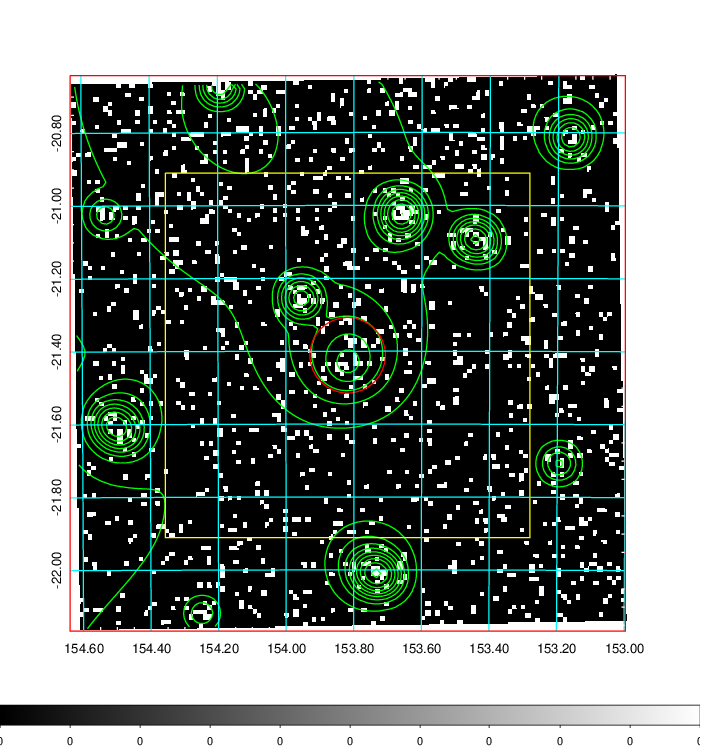  | 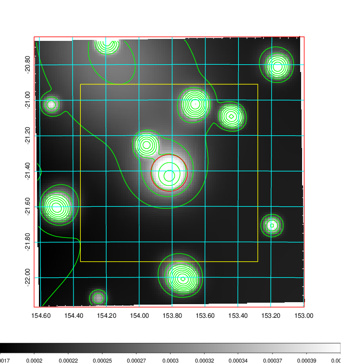   | 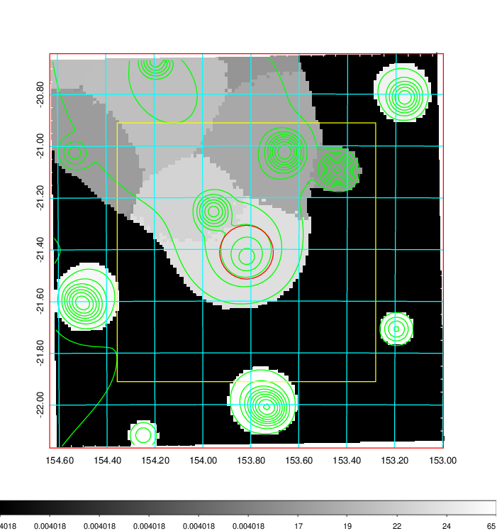  |

|[Exposure image](../image/347/347_mex.pdf)| [nH image](../image/347/347_nh.pdf)| [Planck image](../image/347/347_p.pdf)|
|-------------------|--------------------|-------------------|
|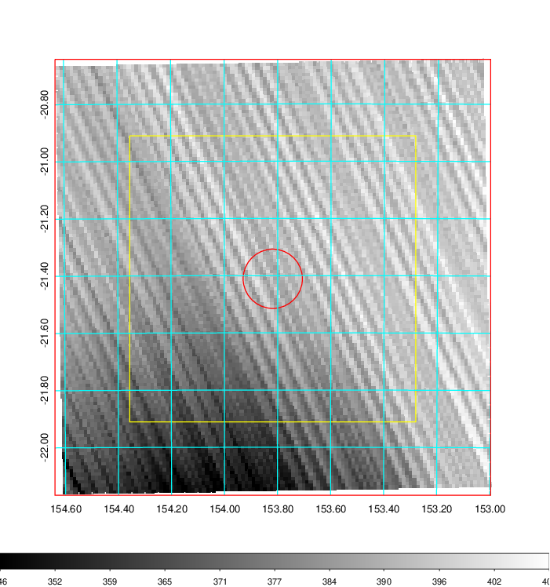   | 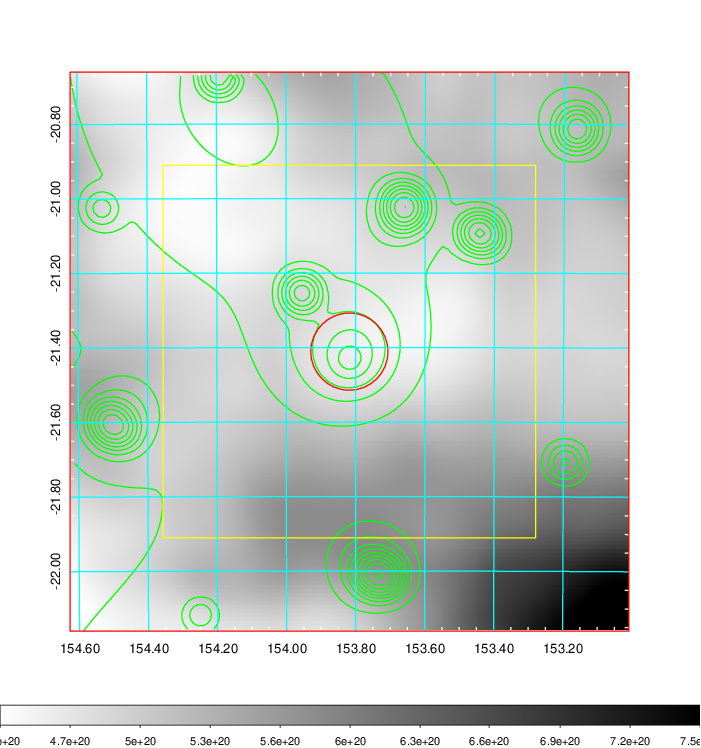    | 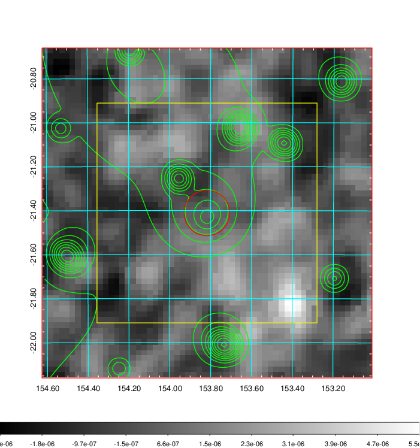 |

|[Redshift Histogram](../image/347/347_zg.pdf) | [DSS image(z1)](../image/347/347_dss_z1.pdf)      |  [DSS image(z2)](../image/347/347_dss_z2.pdf)    |
|-------------------|--------------------|-------------------|
|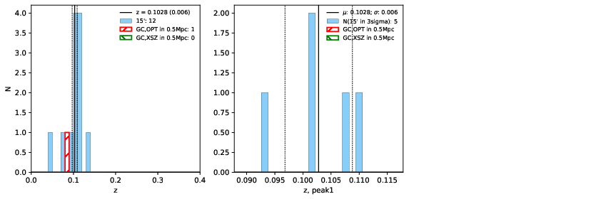 |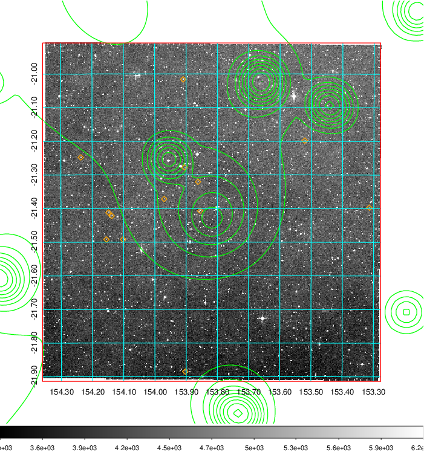  Blue circle for optical clusters;  Magenta circle for XSZ clusters;  all with r=1Mpc;  Only GC with Delta_z<0.01 are shown. | 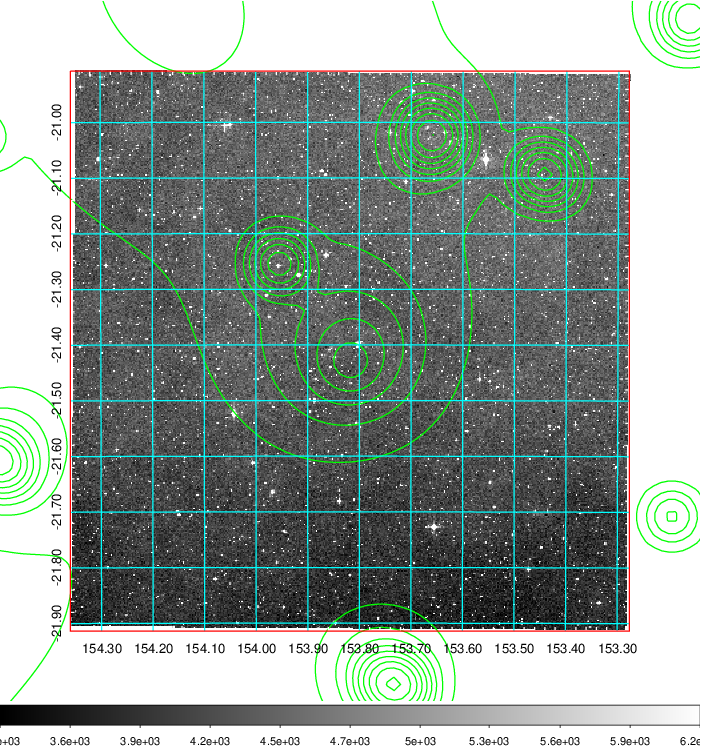 Blue circle for optical clusters;  Magenta circle for XSZ clusters;  all with r=1Mpc;  Only GC with Delta_z<0.01 are shown.  |

|[Previous-identified clusters](../image/347/347_gc.pdf) | [2MASS image](../image/347/347_2mass.pdf)      |
|-------------------|-------------------|
|  Green, magenta, and blue circles  for optical, X-ray and SZ clusters  respectively, with redshift of clusters  labelled. The radius of circles  are 1Mpc.|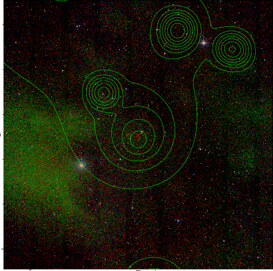  |

|[PS1 image](../image/347/347_ps1.pdf)            |
|-------------------|
| 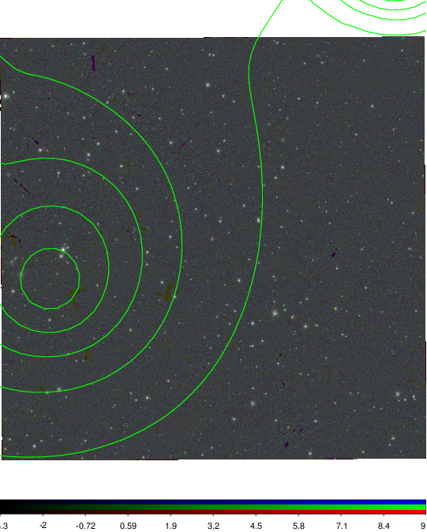  |
