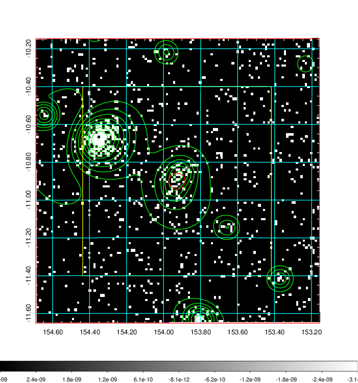
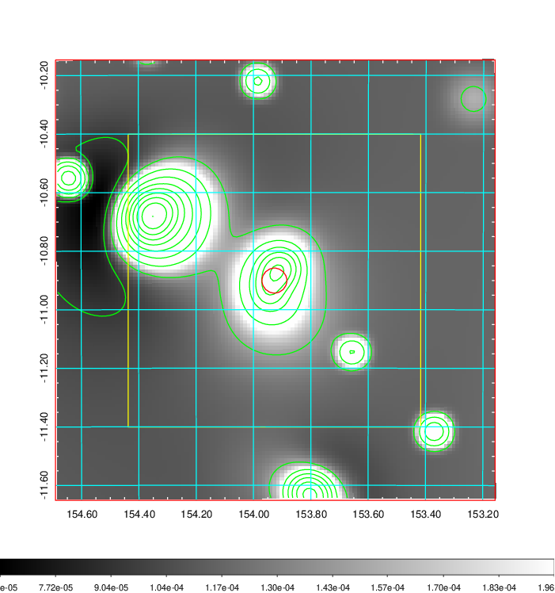
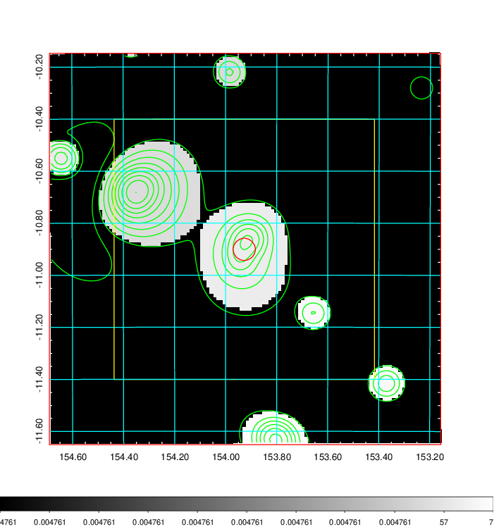
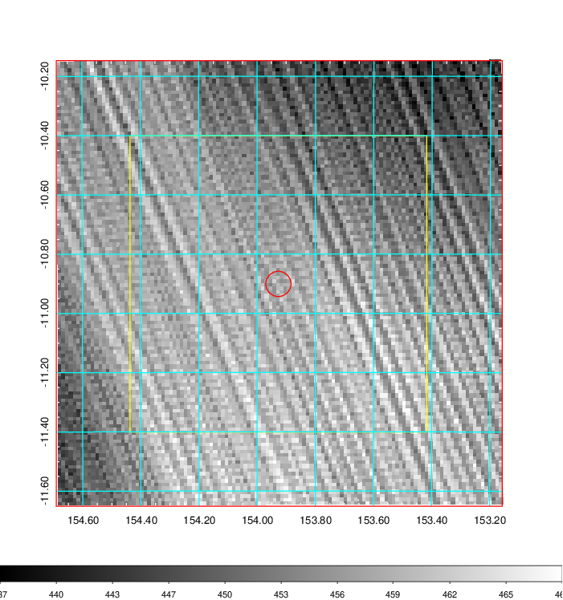
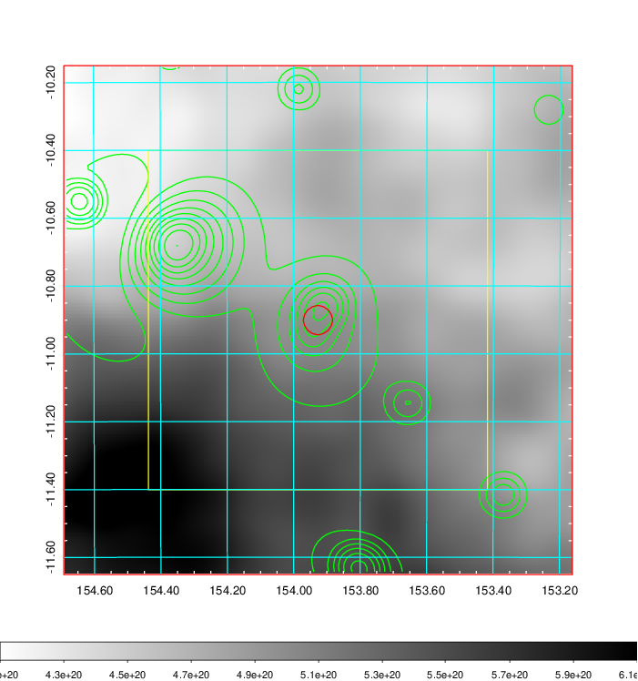
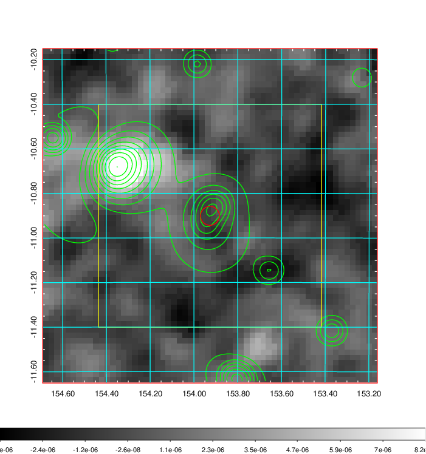
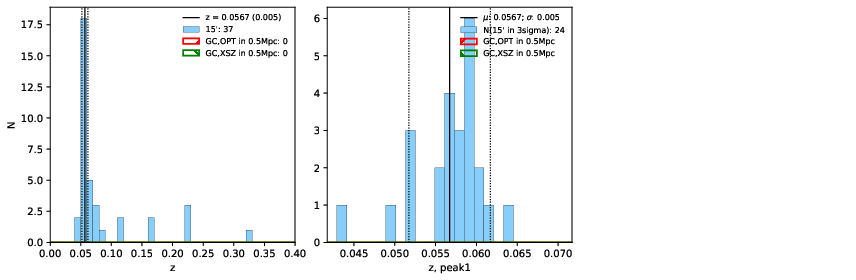
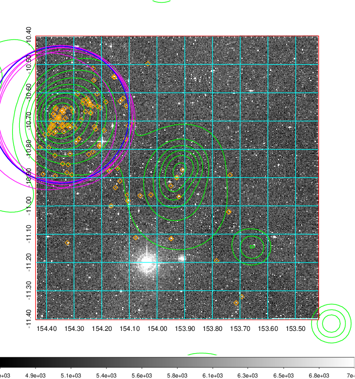
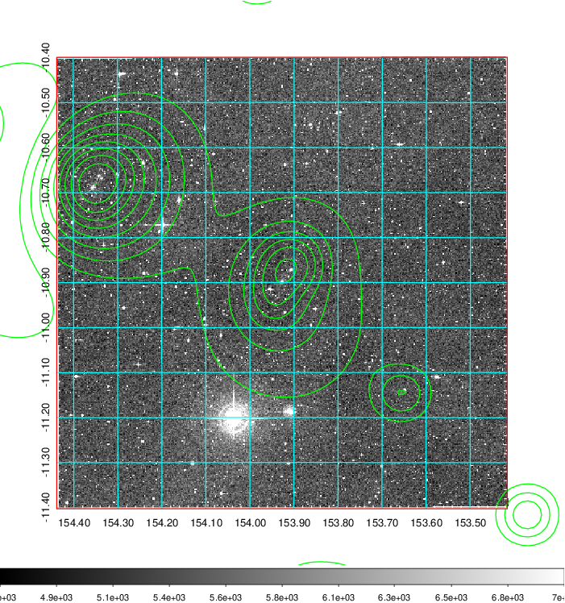
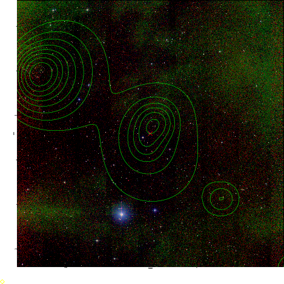

### 348

|Name|RAJ2000[deg]|DEJ2000[deg] |Ext[arcmin]| Ext,ml | z | z_src| C|GC(XSZ,Delta_z<0.01)| GC(OPT,Delta_z<0.01)|GC| R_sig[arcmin] | R500[arcmin] | R500[Mpc]| CRsig[c/s] | CR500[c/s] |L500[1E44 erg/s]|F500[1E-12 erg/s/cm^2]| M500[1E14 Msun]|Tx[keV]|Cnt_sig|Beta|Rc[arcmin]|Comment|Alias|
|---|---|---|---|---|---|------|---|--------|---------|----------|---|---|---|---|---|---|---|---|---|---|---|---|---|---|
|348| 153.927| -10.901| 2.56| 37.90| 0.0567(0.005)| z1,| G| -| -| W| 29.638| 12.160| 0.802| 0.368(0.055)| 0.335(0.050)| 0.448(0.068)| 5.843(0.880)| 1.55(0.12)| 2.86(0.14)| 272.9| 0.505(-0.004+0.009)| 3.596(-0.298+0.345)| -| t101|

|[RASS image](../image/348/348_img.pdf)|[filtered image](../image/348/348_fil.pdf)|[Segment image](../image/348/348_seg.pdf)|
|-------------------|--------------------|-------------------|
|   |    |   |

|[Exposure image](../image/348/348_mex.pdf)| [nH image](../image/348/348_nh.pdf)| [Planck image](../image/348/348_p.pdf)|
|-------------------|--------------------|-------------------|
|   |     |  |

|[Redshift Histogram](../image/348/348_zg.pdf) | [DSS image(z1)](../image/348/348_dss_z1.pdf)      |  [DSS image(z2)](../image/348/348_dss_z2.pdf)    |
|-------------------|--------------------|-------------------|
| |  Blue circle for optical clusters;  Magenta circle for XSZ clusters;  all with r=1Mpc;  Only GC with Delta_z<0.01 are shown. |  Blue circle for optical clusters;  Magenta circle for XSZ clusters;  all with r=1Mpc;  Only GC with Delta_z<0.01 are shown.  |

|[known Abell/XSZ clusters](../image/348/348_gc.pdf) | [2MASS image](../image/348/348_2mass.pdf)      |
|-------------------|-------------------|
|  Magenta, blue and green circles  for optical, X-ray and SZ clusters  respectively, with redshift of clusters  labelled. The radius of circles  are 1Mpc.|  |

|[ATLAS image](../image/348/348_s.pdf)        |
|-------------------|
|   |
