

### 349

|Name|RAJ2000[deg]|DEJ2000[deg] |Ext[arcmin]| Ext,ml | z | z_src| C|GC(XSZ,Delta_z<0.01)| GC(OPT,Delta_z<0.01)|GC| R_sig[arcmin] | R500[arcmin] | R500[Mpc]| CRsig[c/s] | CR500[c/s] |L500[1E44 erg/s]|F500[1E-12 erg/s/cm^2]| M500[1E14 Msun]|Tx[keV]|Cnt_sig|Beta|Rc[arcmin]|Comment|Alias|
|---|---|---|---|---|---|------|---|--------|---------|----------|---|---|---|---|---|---|---|---|---|---|---|---|---|---|
|349| 154.099| 33.644| 1.97| 51.65| 0.1275(0.005)| z1, z_xsz| B| F20, MCXC, PSZ2, SPI, Tar| A, C, N, RM, W| A, C, F20, MCXC, N, PSZ2, SPI, Tar, W| 12.212| 7.021| 0.960| 0.196(0.032)| 0.183(0.030)| 1.568(0.144)| 3.670(0.338)| 2.85(0.13)| 4.25(0.12)| 106.2| 0.721(-0.111+0.152)| 3.049(-0.867+0.970)| -| k213|

|[RASS image](../image/349/349_img.pdf)|[filtered image](../image/349/349_fil.pdf)|[Segment image](../image/349/349_seg.pdf)|
|-------------------|--------------------|-------------------|
| 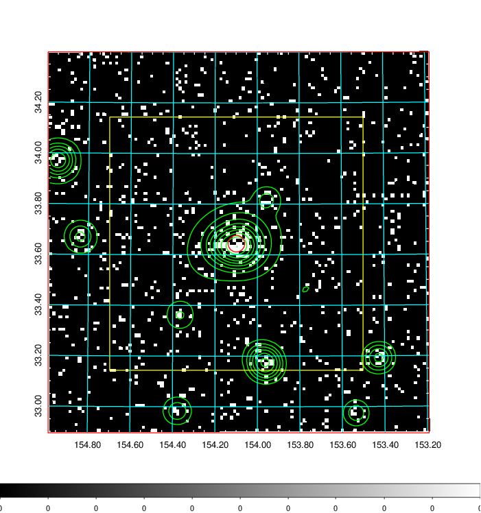  | 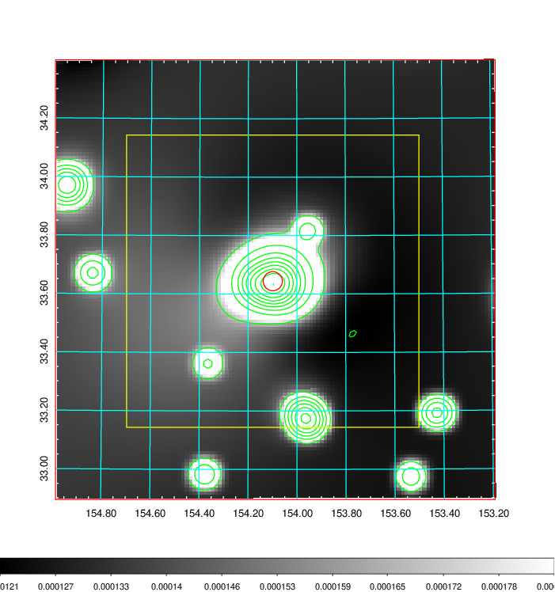   | 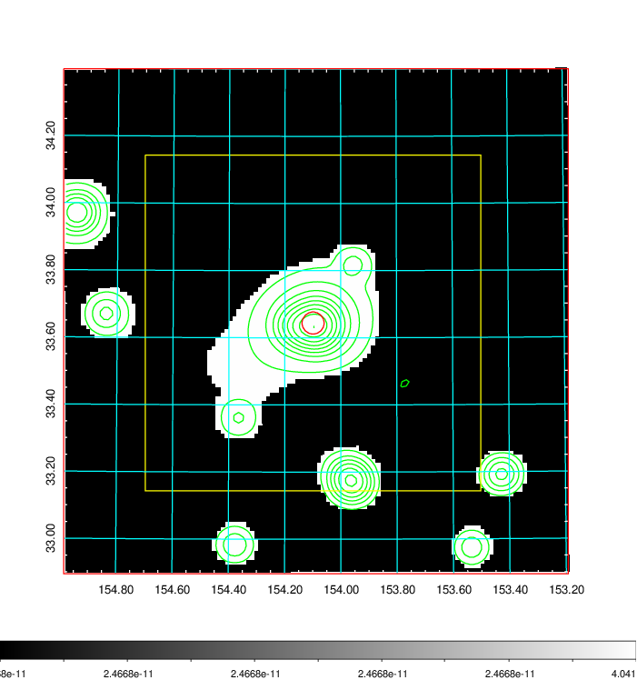  |

|[Exposure image](../image/349/349_mex.pdf)| [nH image](../image/349/349_nh.pdf)| [Planck image](../image/349/349_p.pdf)|
|-------------------|--------------------|-------------------|
|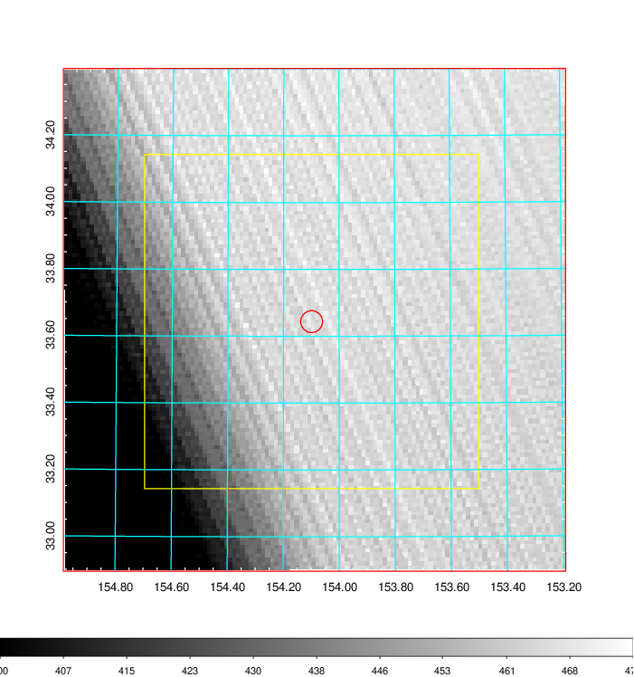   | 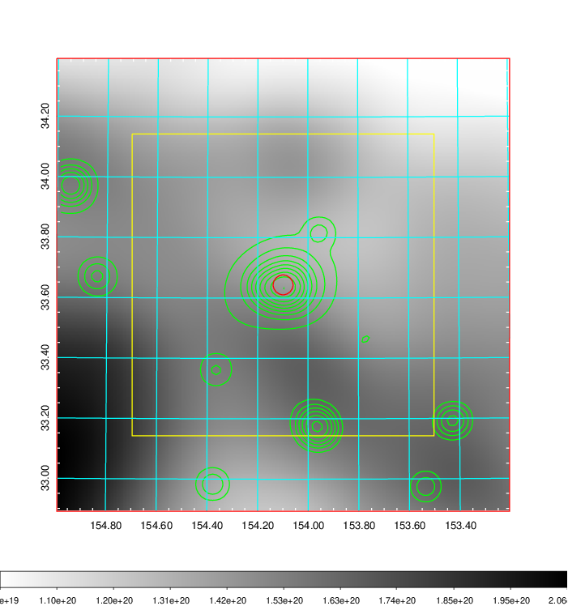    | 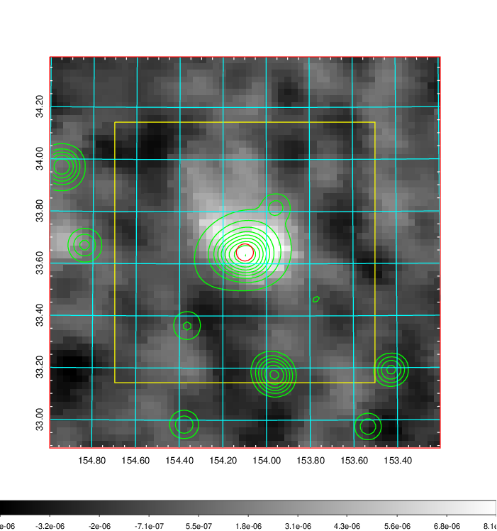 |

|[Redshift Histogram](../image/349/349_zg.pdf) | [DSS image(z1)](../image/349/349_dss_z1.pdf)      |  [DSS image(z2)](../image/349/349_dss_z2.pdf)    |
|-------------------|--------------------|-------------------|
|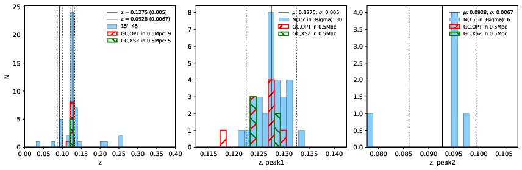 |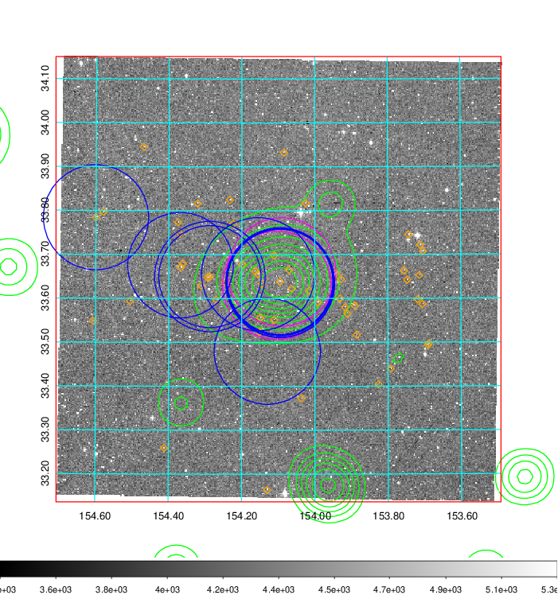  Blue circle for optical clusters;  Magenta circle for XSZ clusters;  all with r=1Mpc;  Only GC with Delta_z<0.01 are shown. | 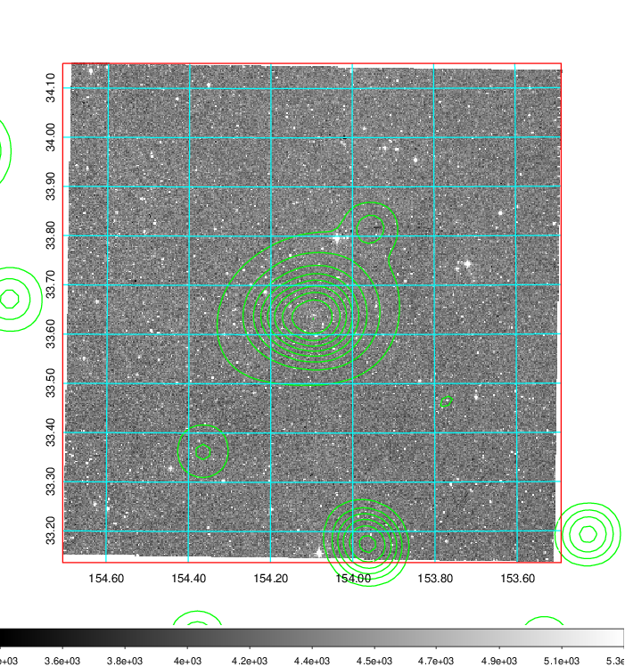 Blue circle for optical clusters;  Magenta circle for XSZ clusters;  all with r=1Mpc;  Only GC with Delta_z<0.01 are shown.  |

|[known Abell/XSZ clusters](../image/349/349_gc.pdf) | [2MASS image](../image/349/349_2mass.pdf)      |[SDSS image](../image/349/349_sdss.pdf)   |
|-------------------|-------------------|-------------------|
|  Magenta, blue and green circles  for optical, X-ray and SZ clusters  respectively, with redshift of clusters  labelled. The radius of circles  are 1Mpc.|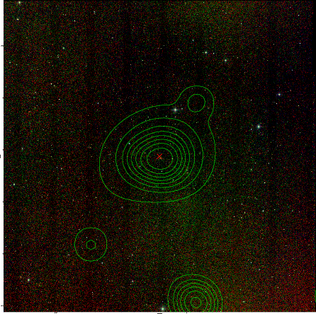  | 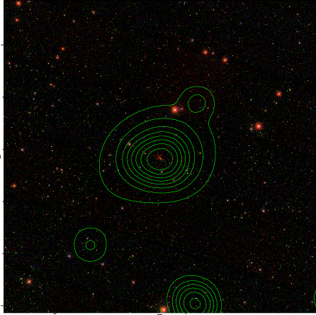  |

