

### 35

|Name|RAJ2000[deg]|DEJ2000[deg] |Ext[arcmin]| Ext,ml | z | z_src| C|GC(XSZ,Delta_z<0.01)| GC(OPT,Delta_z<0.01)|GC| R_sig[arcmin] | R500[arcmin] | R500[Mpc]| CRsig[c/s] | CR500[c/s] |L500[1E44 erg/s]|F500[1E-12 erg/s/cm^2]| M500[1E14 Msun]|Tx[keV]|Cnt_sig|Beta|Rc[arcmin]|Comment|Alias|
|---|---|---|---|---|---|------|---|--------|---------|----------|---|---|---|---|---|---|---|---|---|---|---|---|---|---|
|35| 11.394| -2.294| 7.65| 26.06| 0.1233(0.005)| z1,| G| -| -| A, C, N, W| 24.206| 5.762| 0.766| 0.072(0.064)| 0.064(0.057)| 0.472(0.338)| 1.189(0.851)| 1.44(0.52)| 2.78(0.63)| 53.8| 0.898(-0.124+0.075)| 7.736(-1.607+1.438)| -| t383|

|[RASS image](../image/35/35_img.pdf)|[filtered image](../image/35/35_fil.pdf)|[Segment image](../image/35/35_seg.pdf)|
|-------------------|--------------------|-------------------|
| 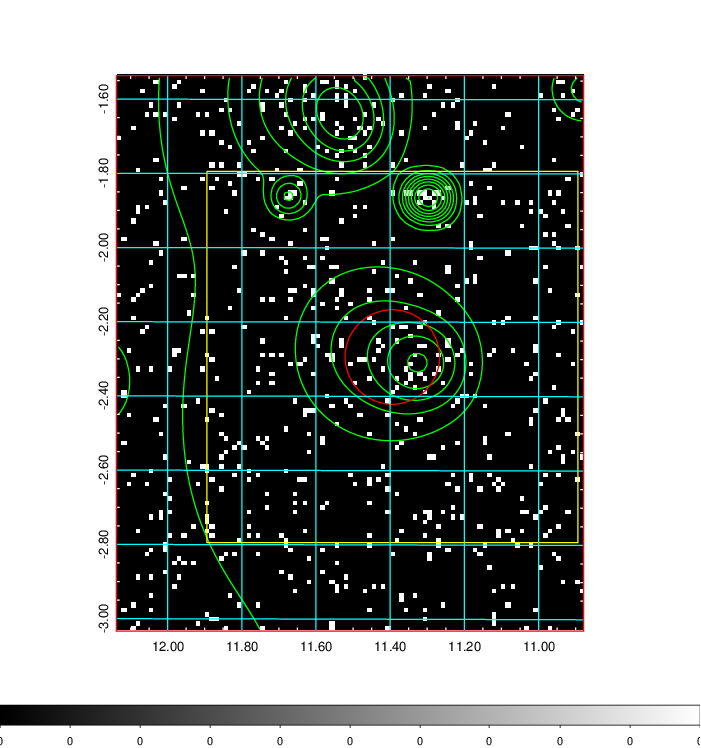  | 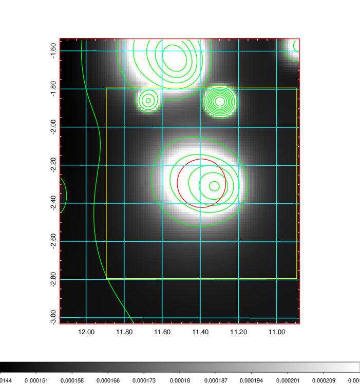   | 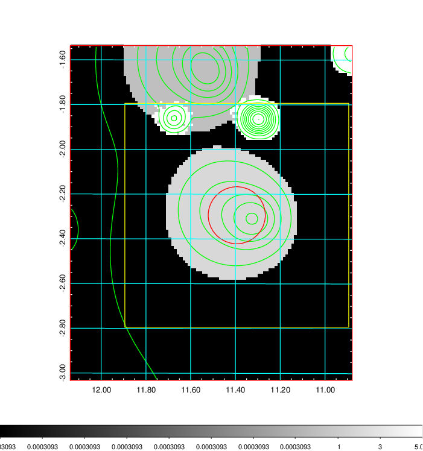  |

|[Exposure image](../image/35/35_mex.pdf)| [nH image](../image/35/35_nh.pdf)| [Planck image](../image/35/35_p.pdf)|
|-------------------|--------------------|-------------------|
|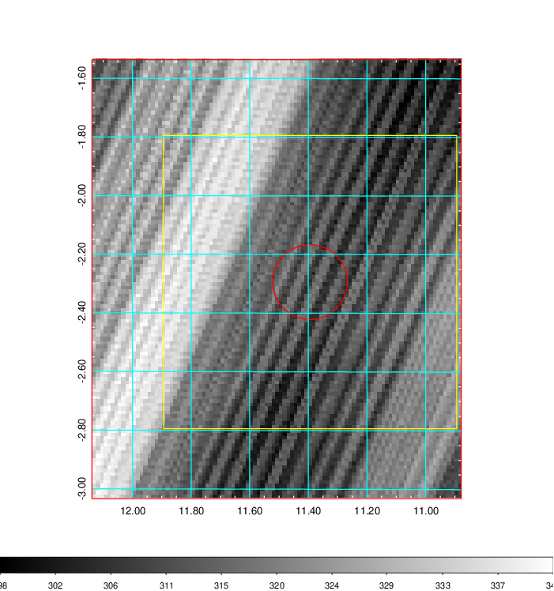   | 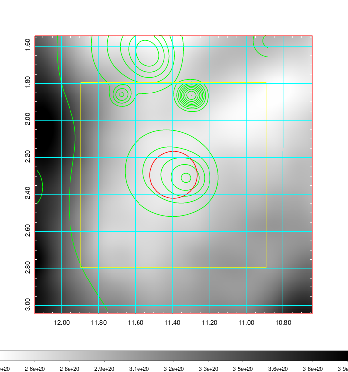    | 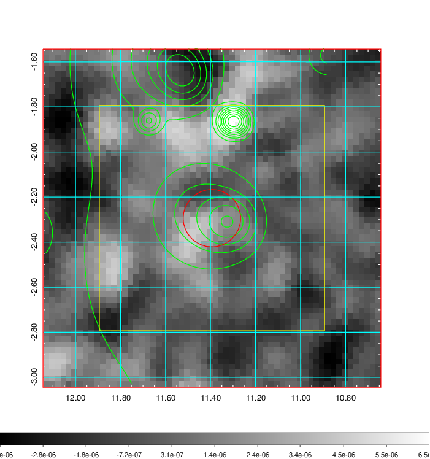 |

|[Redshift Histogram](../image/35/35_zg.pdf) | [DSS image(z1)](../image/35/35_dss_z1.pdf)      |  [DSS image(z2)](../image/35/35_dss_z2.pdf)    |
|-------------------|--------------------|-------------------|
|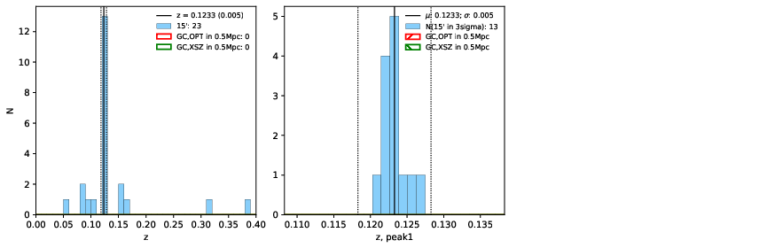 |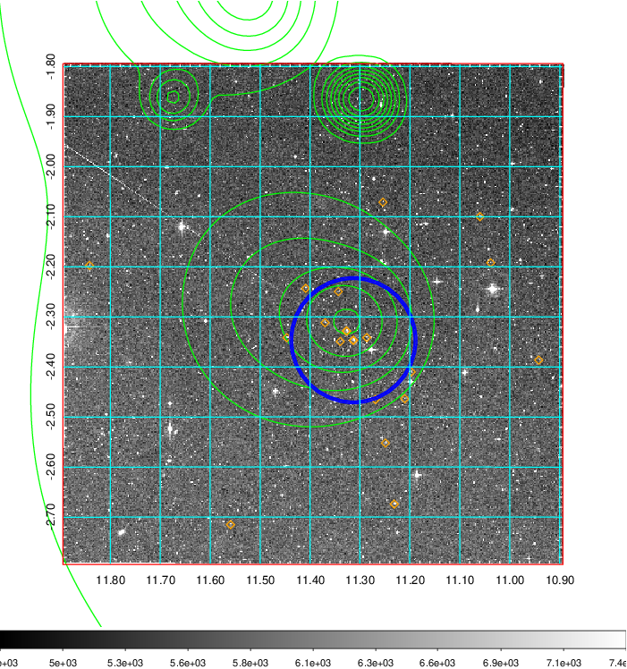  Blue circle for optical clusters;  Magenta circle for XSZ clusters;  all with r=1Mpc;  Only GC with Delta_z<0.01 are shown. | 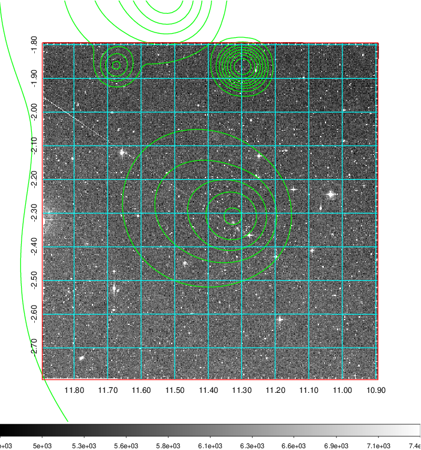 Blue circle for optical clusters;  Magenta circle for XSZ clusters;  all with r=1Mpc;  Only GC with Delta_z<0.01 are shown.  |

|[known Abell/XSZ clusters](../image/35/35_gc.pdf) | [2MASS image](../image/35/35_2mass.pdf)      |[SDSS image](../image/35/35_sdss.pdf)   |
|-------------------|-------------------|-------------------|
|  Magenta, blue and green circles  for optical, X-ray and SZ clusters  respectively, with redshift of clusters  labelled. The radius of circles  are 1Mpc.|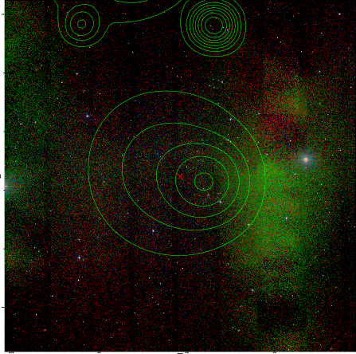  | 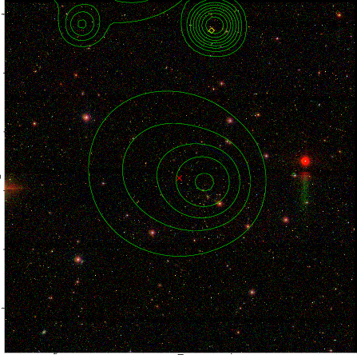  |

|[DES image](../image/35/35_des.pdf)   |
|-------------------|
|   |
