

### 350

|Name|RAJ2000[deg]|DEJ2000[deg] |Ext[arcmin]| Ext,ml | z | z_src| C|GC(XSZ,Delta_z<0.01)| GC(OPT,Delta_z<0.01)|GC| R_sig[arcmin] | R500[arcmin] | R500[Mpc]| CRsig[c/s] | CR500[c/s] |L500[1E44 erg/s]|F500[1E-12 erg/s/cm^2]| M500[1E14 Msun]|Tx[keV]|Cnt_sig|Beta|Rc[arcmin]|Comment|Alias|
|---|---|---|---|---|---|------|---|--------|---------|----------|---|---|---|---|---|---|---|---|---|---|---|---|---|---|
|350| 154.329| -10.683| 2.09| 209.96| 0.0589(0.005)| z1, z_xsz| B| L03, MCXC, PSZ2, Tar, XB| A, N| A, L03, MCXC, N, PSZ2, Tar, W, XB| 11.238| 13.229| 0.904| 0.542(0.042)| 0.559(0.043)| 0.832(0.031)| 10.015(0.374)| 2.22(0.04)| 3.57(0.04)| 232.7| 0.938(-0.075+0.045)| 4.883(-0.480+0.318)| -| k232|

|[RASS image](../image/350/350_img.pdf)|[filtered image](../image/350/350_fil.pdf)|[Segment image](../image/350/350_seg.pdf)|
|-------------------|--------------------|-------------------|
| 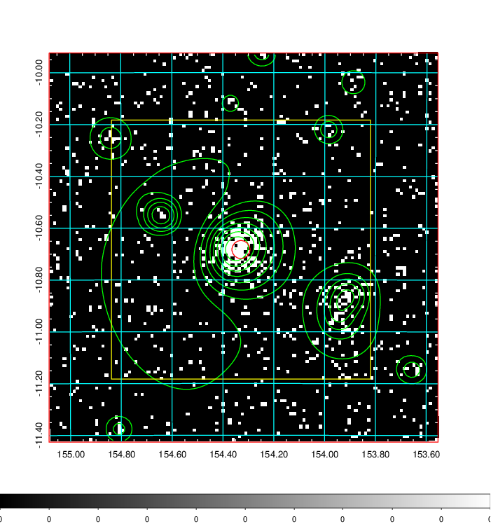  | 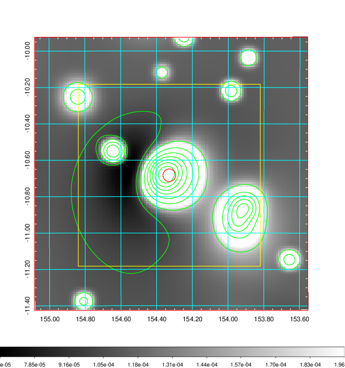   | 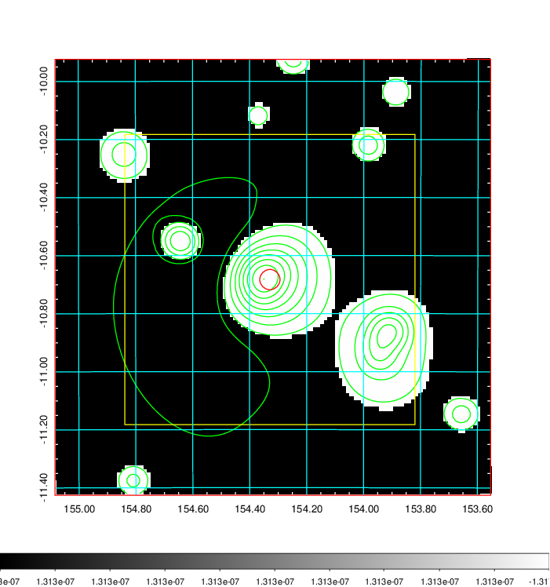  |

|[Exposure image](../image/350/350_mex.pdf)| [nH image](../image/350/350_nh.pdf)| [Planck image](../image/350/350_p.pdf)|
|-------------------|--------------------|-------------------|
|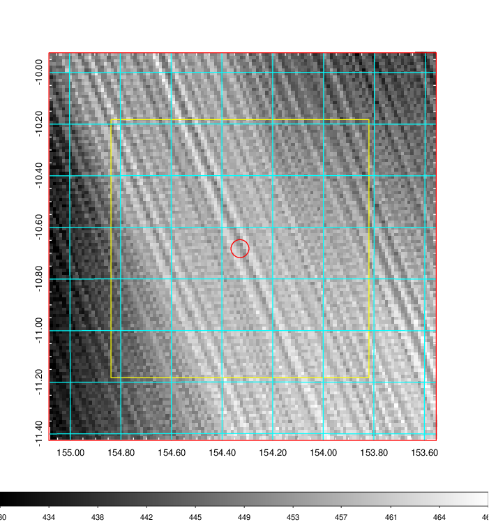   | 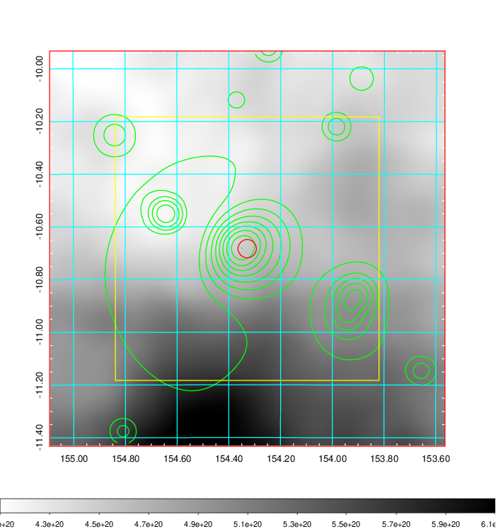    | 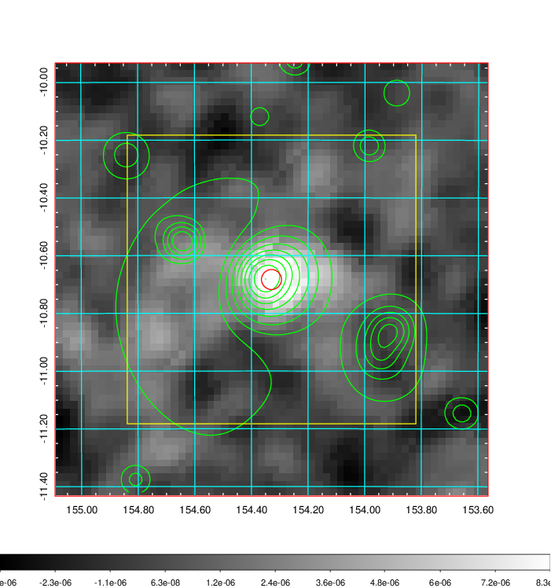 |

|[Redshift Histogram](../image/350/350_zg.pdf) | [DSS image(z1)](../image/350/350_dss_z1.pdf)      |  [DSS image(z2)](../image/350/350_dss_z2.pdf)    |
|-------------------|--------------------|-------------------|
|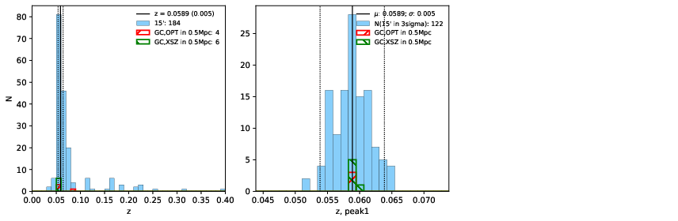 |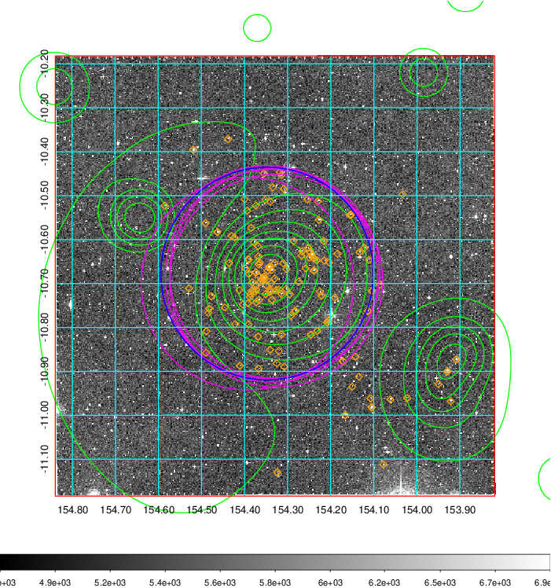  Blue circle for optical clusters;  Magenta circle for XSZ clusters;  all with r=1Mpc;  Only GC with Delta_z<0.01 are shown. | 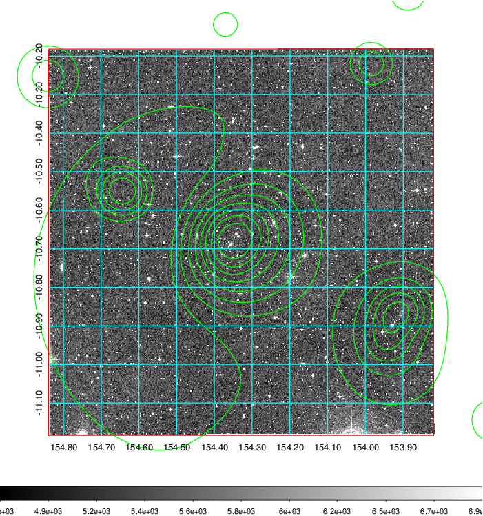 Blue circle for optical clusters;  Magenta circle for XSZ clusters;  all with r=1Mpc;  Only GC with Delta_z<0.01 are shown.  |

|[Previous-identified clusters](../image/350/350_gc.pdf) | [2MASS image](../image/350/350_2mass.pdf)      |
|-------------------|-------------------|
|  Green, magenta, and blue circles  for optical, X-ray and SZ clusters  respectively, with redshift of clusters  labelled. The radius of circles  are 1Mpc.|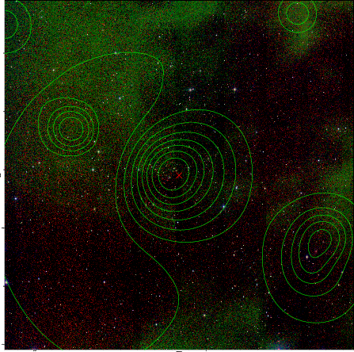  |

|[ATLAS image](../image/350/350_s.pdf)        |
|-------------------|
| 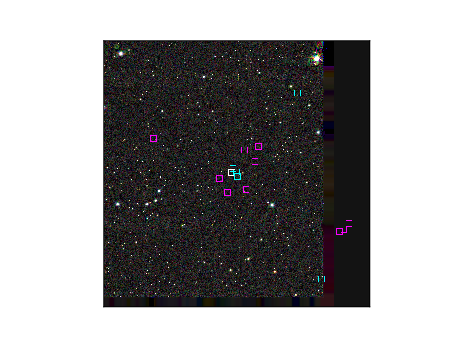  |
