

### 351

|Name|RAJ2000[deg]|DEJ2000[deg] |Ext[arcmin]| Ext,ml | z | z_src| C|GC(XSZ,Delta_z<0.01)| GC(OPT,Delta_z<0.01)|GC| R_sig[arcmin] | R500[arcmin] | R500[Mpc]| CRsig[c/s] | CR500[c/s] |L500[1E44 erg/s]|F500[1E-12 erg/s/cm^2]| M500[1E14 Msun]|Tx[keV]|Cnt_sig|Beta|Rc[arcmin]|Comment|Alias|
|---|---|---|---|---|---|------|---|--------|---------|----------|---|---|---|---|---|---|---|---|---|---|---|---|---|---|
|351| 154.660| -18.140| 7.07| 32.39| 0.0523(0.005)| z1, z_opt| S| -| N, W| N, W| 9.775| 9.480| 0.580| 0.081(0.035)| 0.080(0.035)| 0.077(0.018)| 1.185(0.274)| 0.58(0.07)| 1.56(0.12)| 46.2| 0.823(-0.163+0.124)| 5.734(-1.480+1.241)| -| t349|

|[RASS image](../image/351/351_img.pdf)|[filtered image](../image/351/351_fil.pdf)|[Segment image](../image/351/351_seg.pdf)|
|-------------------|--------------------|-------------------|
| 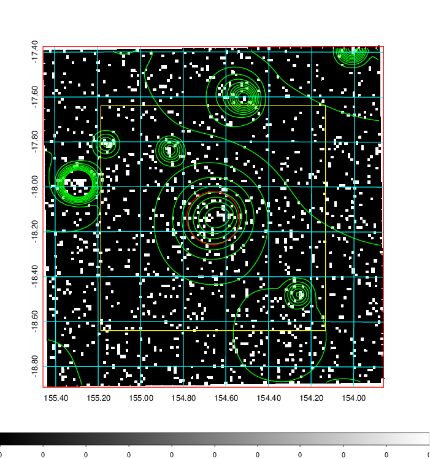  | 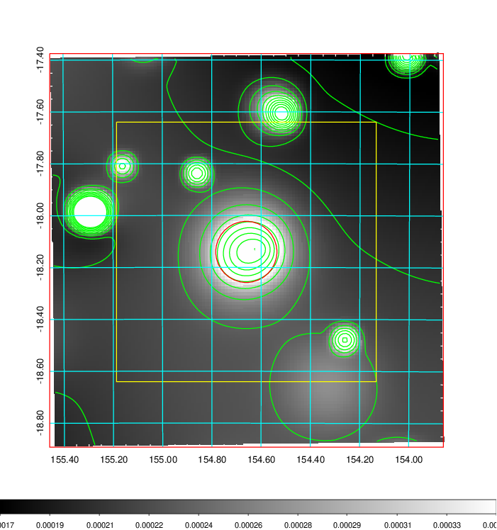   | 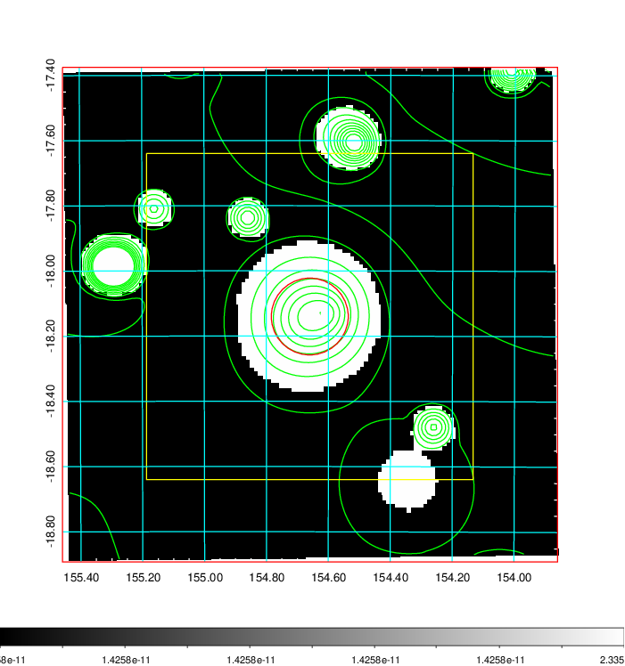  |

|[Exposure image](../image/351/351_mex.pdf)| [nH image](../image/351/351_nh.pdf)| [Planck image](../image/351/351_p.pdf)|
|-------------------|--------------------|-------------------|
|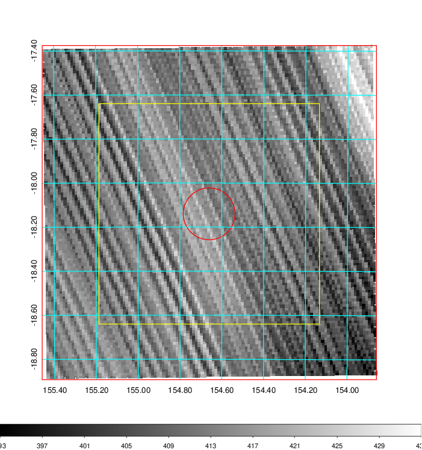   | 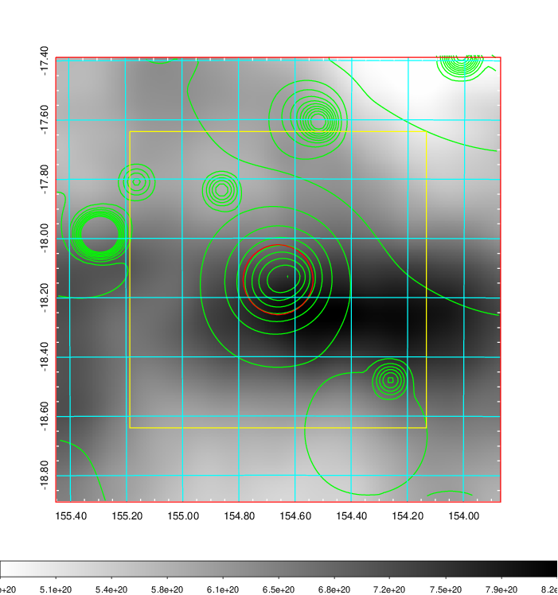    | 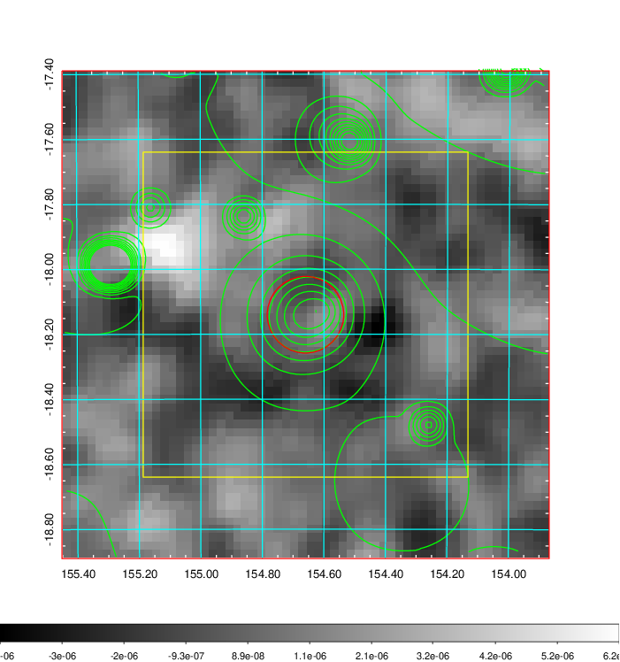 |

|[Redshift Histogram](../image/351/351_zg.pdf) | [DSS image(z1)](../image/351/351_dss_z1.pdf)      |  [DSS image(z2)](../image/351/351_dss_z2.pdf)    |
|-------------------|--------------------|-------------------|
|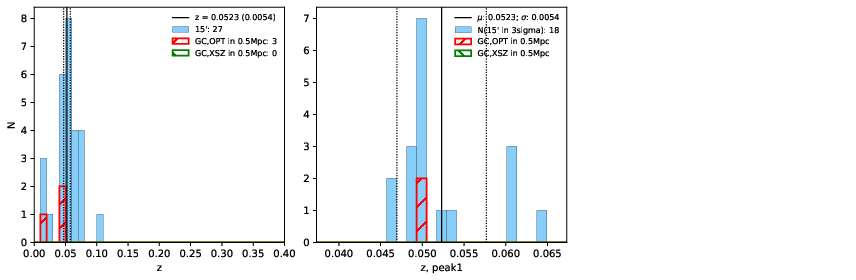 |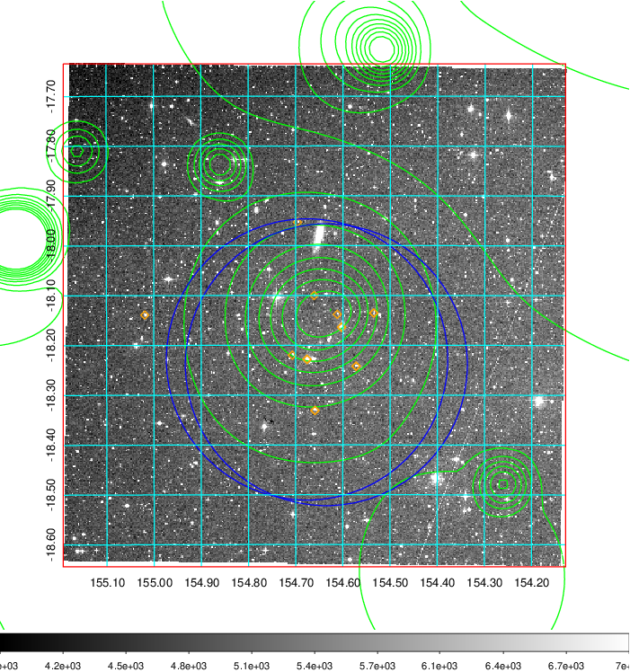  Blue circle for optical clusters;  Magenta circle for XSZ clusters;  all with r=1Mpc;  Only GC with Delta_z<0.01 are shown. | 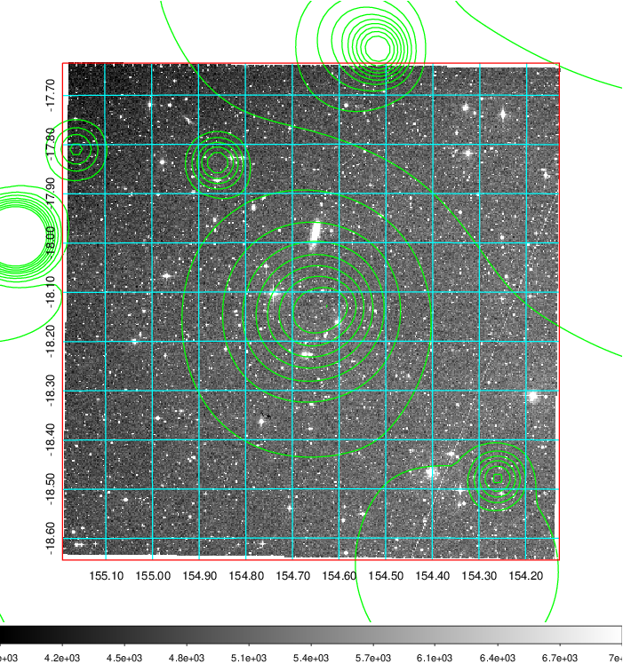 Blue circle for optical clusters;  Magenta circle for XSZ clusters;  all with r=1Mpc;  Only GC with Delta_z<0.01 are shown.  |

|[Previous-identified clusters](../image/351/351_gc.pdf) | [2MASS image](../image/351/351_2mass.pdf)      |
|-------------------|-------------------|
|  Green, magenta, and blue circles  for optical, X-ray and SZ clusters  respectively, with redshift of clusters  labelled. The radius of circles  are 1Mpc.|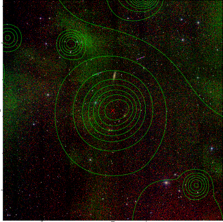  |

|[ATLAS image](../image/351/351_s.pdf)        |
|-------------------|
| 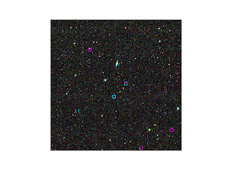  |
