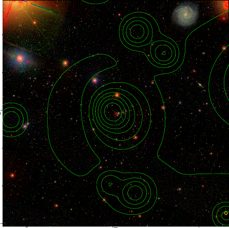

### 352

|Name|RAJ2000[deg]|DEJ2000[deg] |Ext[arcmin]| Ext,ml | z | z_src| C|GC(XSZ,Delta_z<0.01)| GC(OPT,Delta_z<0.01)|GC| R_sig[arcmin] | R500[arcmin] | R500[Mpc]| CRsig[c/s] | CR500[c/s] |L500[1E44 erg/s]|F500[1E-12 erg/s/cm^2]| M500[1E14 Msun]|Tx[keV]|Cnt_sig|Beta|Rc[arcmin]|Comment|Alias|
|---|---|---|---|---|---|------|---|--------|---------|----------|---|---|---|---|---|---|---|---|---|---|---|---|---|---|
|352| 154.983| 40.988| 1.65| 31.77| 0.0927(0.005)| z1, z_xsz| B| F20, L03, MCXC, PSZ2, SPI, Tar| A, N, RM, W| A, C, F20, L03, MCXC, N, PSZ2, SPI, Tar, W| 14.650| 7.571| 0.783| 0.135(0.030)| 0.125(0.028)| 0.546(0.065)| 2.531(0.300)| 1.49(0.09)| 2.82(0.11)| 77.1| 0.919(-0.098+0.058)| 3.424(-0.519+0.412)| -| k148|

|[RASS image](../image/352/352_img.pdf)|[filtered image](../image/352/352_fil.pdf)|[Segment image](../image/352/352_seg.pdf)|
|-------------------|--------------------|-------------------|
|   |    |   |

|[Exposure image](../image/352/352_mex.pdf)| [nH image](../image/352/352_nh.pdf)| [Planck image](../image/352/352_p.pdf)|
|-------------------|--------------------|-------------------|
|   |     |  |

|[Redshift Histogram](../image/352/352_zg.pdf) | [DSS image(z1)](../image/352/352_dss_z1.pdf)      |  [DSS image(z2)](../image/352/352_dss_z2.pdf)    |
|-------------------|--------------------|-------------------|
| |  Blue circle for optical clusters;  Magenta circle for XSZ clusters;  all with r=1Mpc;  Only GC with Delta_z<0.01 are shown. |  Blue circle for optical clusters;  Magenta circle for XSZ clusters;  all with r=1Mpc;  Only GC with Delta_z<0.01 are shown.  |

|[Previous-identified clusters](../image/352/352_gc.pdf) | [2MASS image](../image/352/352_2mass.pdf)      |[SDSS image](../image/352/352_sdss.pdf)   |
|-------------------|-------------------|-------------------|
|  Green, magenta, and blue circles  for optical, X-ray and SZ clusters  respectively, with redshift of clusters  labelled. The radius of circles  are 1Mpc.|  |   |

