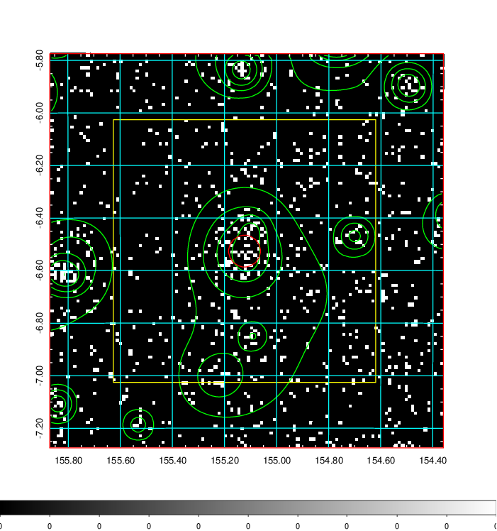
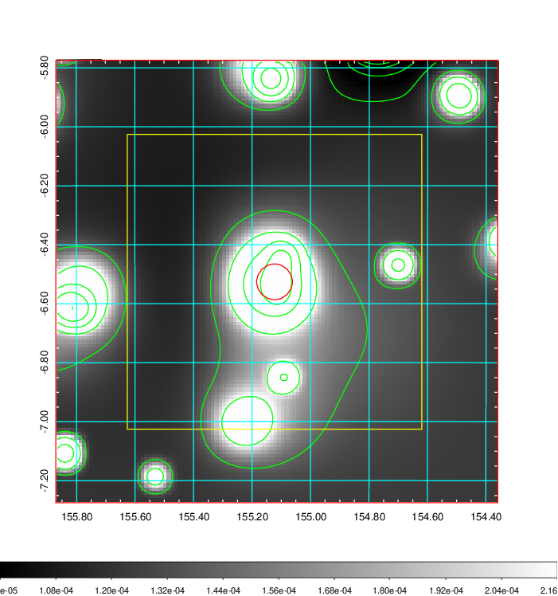
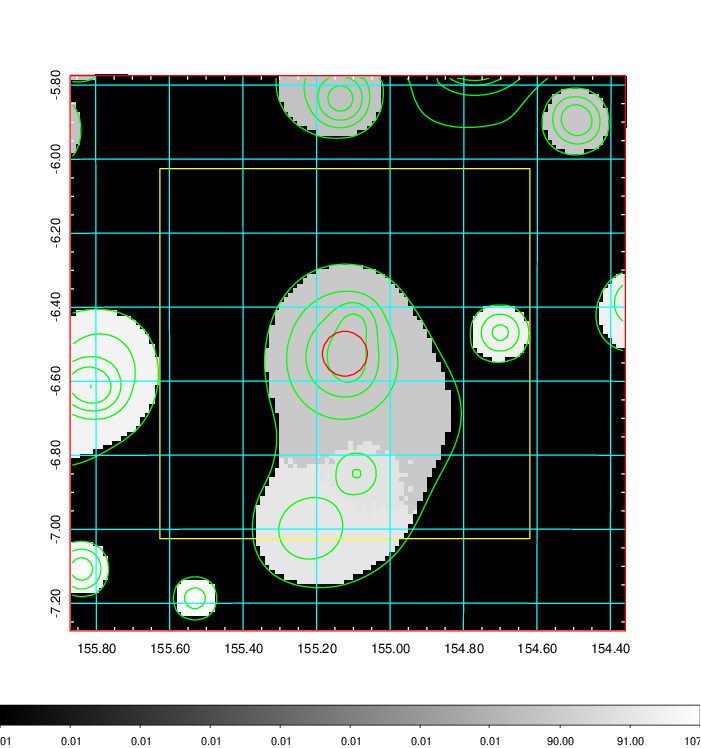
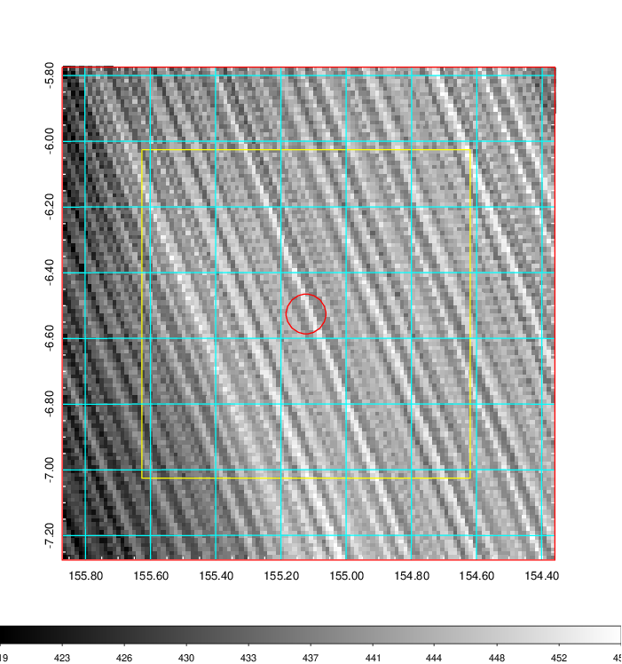
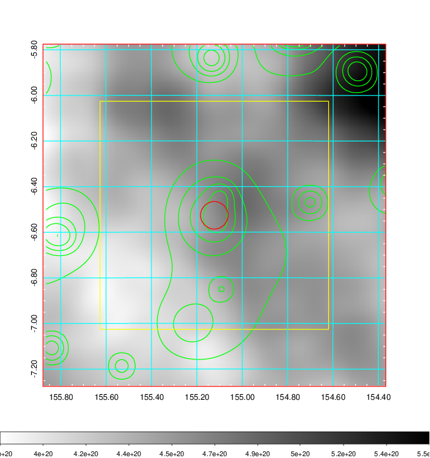
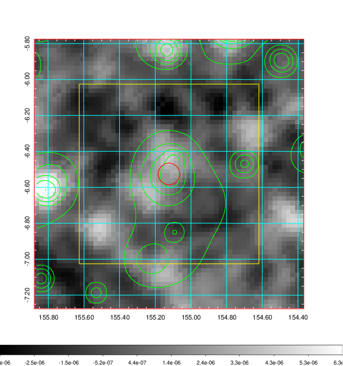
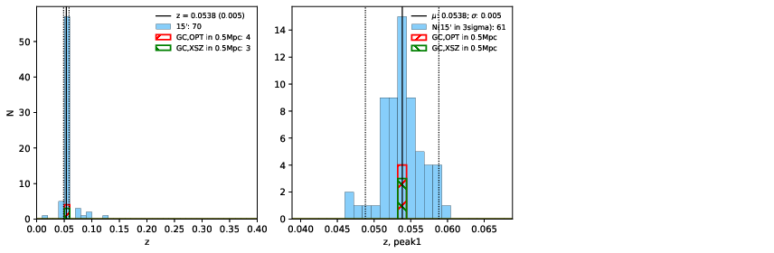
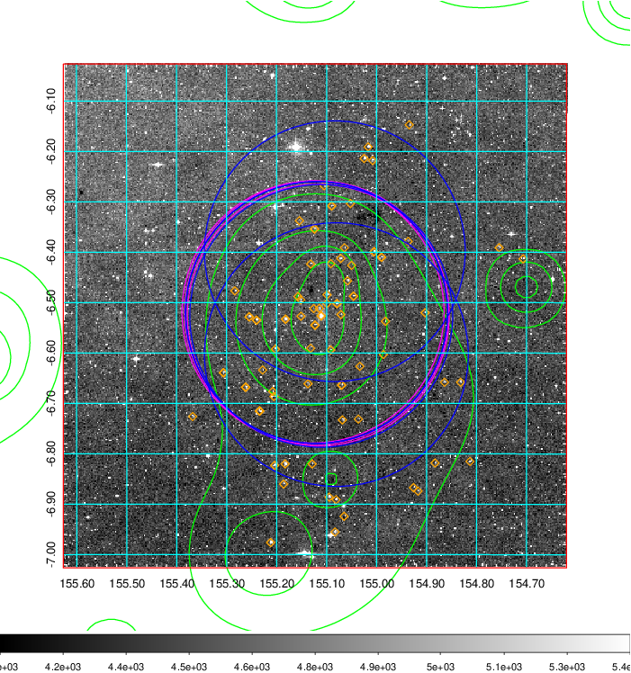
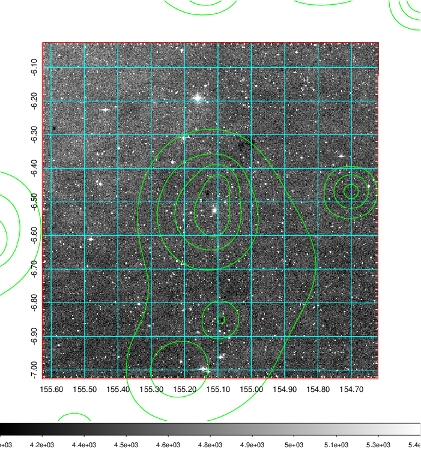
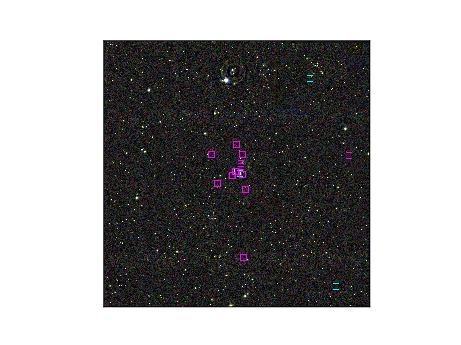

### 353

|Name|RAJ2000[deg]|DEJ2000[deg] |Ext[arcmin]| Ext,ml | z | z_src| C|GC(XSZ,Delta_z<0.01)| GC(OPT,Delta_z<0.01)|GC| R_sig[arcmin] | R500[arcmin] | R500[Mpc]| CRsig[c/s] | CR500[c/s] |L500[1E44 erg/s]|F500[1E-12 erg/s/cm^2]| M500[1E14 Msun]|Tx[keV]|Cnt_sig|Beta|Rc[arcmin]|Comment|Alias|
|---|---|---|---|---|---|------|---|--------|---------|----------|---|---|---|---|---|---|---|---|---|---|---|---|---|---|
|353| 155.123| -6.526| 3.63| 77.73| 0.0538(0.005)| z1, z_xsz| B| L03, MCXC| A, N, W| A, L03, MCXC, N, W| 12.212| 11.261| 0.707| 0.206(0.034)| 0.204(0.033)| 0.239(0.024)| 3.477(0.342)| 1.06(0.05)| 2.26(0.07)| 82.7| 0.894(-0.121+0.076)| 6.209(-0.979+0.709)| -| k449|

|[RASS image](../image/353/353_img.pdf)|[filtered image](../image/353/353_fil.pdf)|[Segment image](../image/353/353_seg.pdf)|
|-------------------|--------------------|-------------------|
|   |    |   |

|[Exposure image](../image/353/353_mex.pdf)| [nH image](../image/353/353_nh.pdf)| [Planck image](../image/353/353_p.pdf)|
|-------------------|--------------------|-------------------|
|   |     |  |

|[Redshift Histogram](../image/353/353_zg.pdf) | [DSS image(z1)](../image/353/353_dss_z1.pdf)      |  [DSS image(z2)](../image/353/353_dss_z2.pdf)    |
|-------------------|--------------------|-------------------|
| |  Blue circle for optical clusters;  Magenta circle for XSZ clusters;  all with r=1Mpc;  Only GC with Delta_z<0.01 are shown. |  Blue circle for optical clusters;  Magenta circle for XSZ clusters;  all with r=1Mpc;  Only GC with Delta_z<0.01 are shown.  |

|[Previous-identified clusters](../image/353/353_gc.pdf) | [2MASS image](../image/353/353_2mass.pdf)      |
|-------------------|-------------------|
|  Green, magenta, and blue circles  for optical, X-ray and SZ clusters  respectively, with redshift of clusters  labelled. The radius of circles  are 1Mpc.|  |

|[ATLAS image](../image/353/353_s.pdf)        |
|-------------------|
|   |
