

### 354

|Name|RAJ2000[deg]|DEJ2000[deg] |Ext[arcmin]| Ext,ml | z | z_src| C|GC(XSZ,Delta_z<0.01)| GC(OPT,Delta_z<0.01)|GC| R_sig[arcmin] | R500[arcmin] | R500[Mpc]| CRsig[c/s] | CR500[c/s] |L500[1E44 erg/s]|F500[1E-12 erg/s/cm^2]| M500[1E14 Msun]|Tx[keV]|Cnt_sig|Beta|Rc[arcmin]|Comment|Alias|
|---|---|---|---|---|---|------|---|--------|---------|----------|---|---|---|---|---|---|---|---|---|---|---|---|---|---|
|354| 155.263| 64.604| 43.68| 114.50| 0.0410(0.000)| z_opt| S| -| N| A, C, F20, N, W| 12.700| 11.014| 0.535| 0.104(0.036)| 0.101(0.035)| 0.065(0.028)| 1.654(0.725)| 0.45(0.10)| 1.33(0.19)| 74.9| 0.542(-0.032+0.088)| 3.910(-1.103+1.154)| -| t687|

|[RASS image](../image/354/354_img.pdf)|[filtered image](../image/354/354_fil.pdf)|[Segment image](../image/354/354_seg.pdf)|
|-------------------|--------------------|-------------------|
| 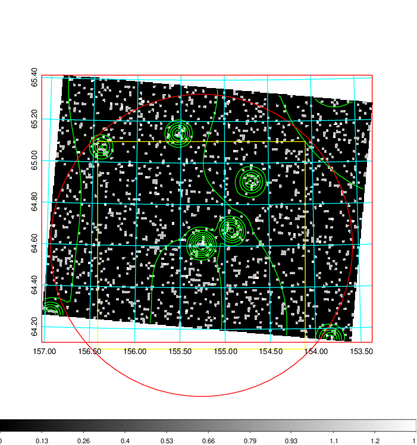  | 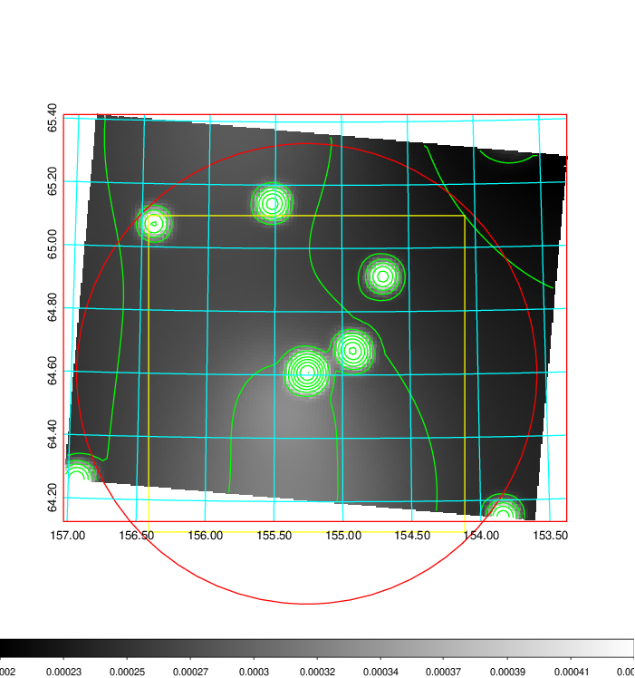   | 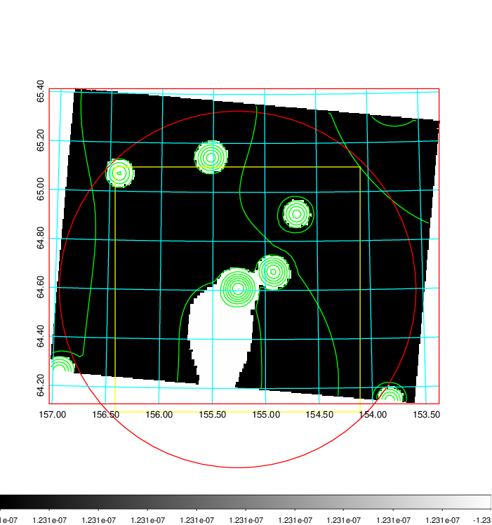  |

|[Exposure image](../image/354/354_mex.pdf)| [nH image](../image/354/354_nh.pdf)| [Planck image](../image/354/354_p.pdf)|
|-------------------|--------------------|-------------------|
|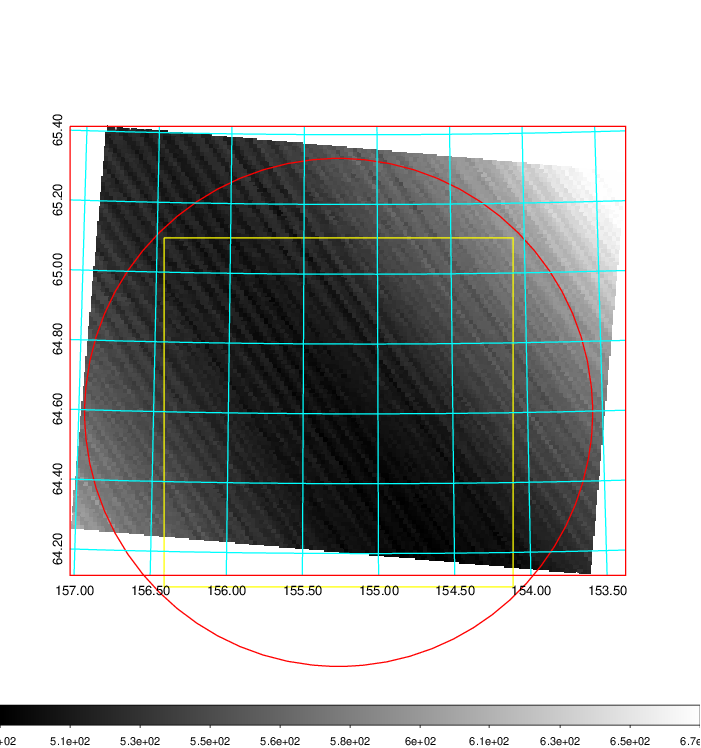   | 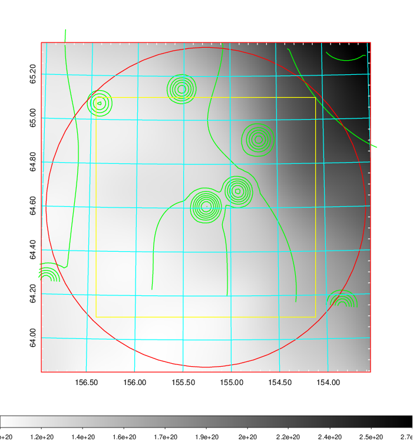    | 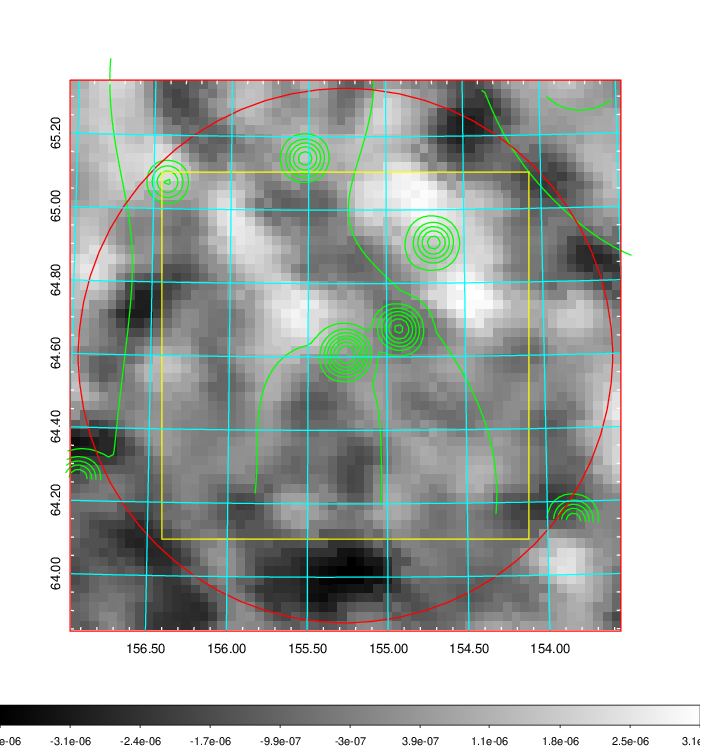 |

|[Redshift Histogram](../image/354/354_zg.pdf) | [DSS image(z1)](../image/354/354_dss_z1.pdf)      |  [DSS image(z2)](../image/354/354_dss_z2.pdf)    |
|-------------------|--------------------|-------------------|
|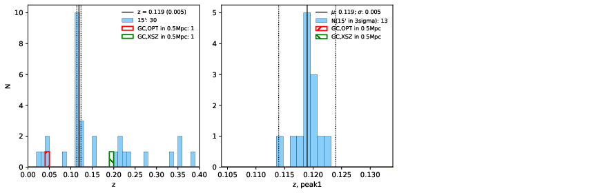 |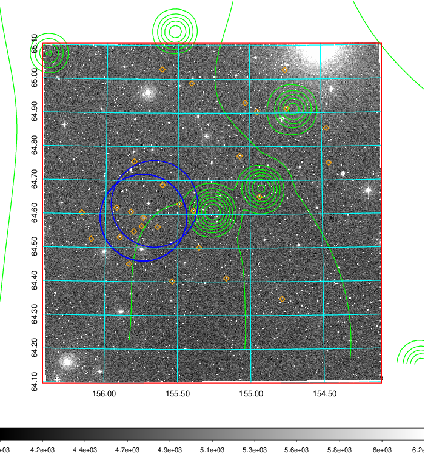  Blue circle for optical clusters;  Magenta circle for XSZ clusters;  all with r=1Mpc;  Only GC with Delta_z<0.01 are shown. | 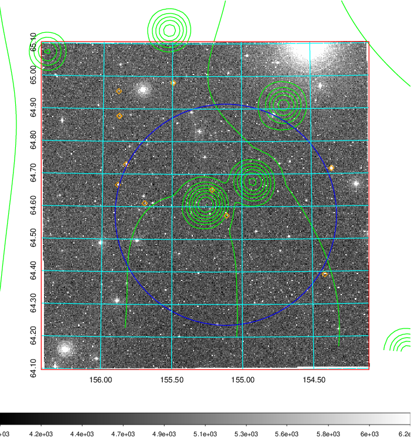 Blue circle for optical clusters;  Magenta circle for XSZ clusters;  all with r=1Mpc;  Only GC with Delta_z<0.01 are shown.  |

|[Previous-identified clusters](../image/354/354_gc.pdf) | [2MASS image](../image/354/354_2mass.pdf)      |
|-------------------|-------------------|
|  Green, magenta, and blue circles  for optical, X-ray and SZ clusters  respectively, with redshift of clusters  labelled. The radius of circles  are 1Mpc.|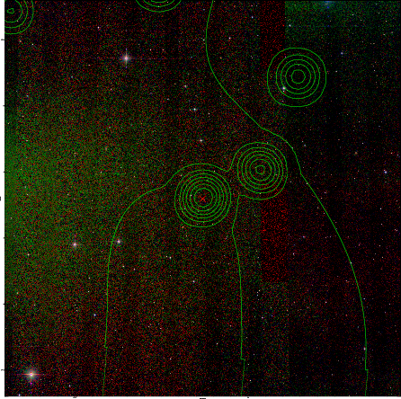  |

|[PS1 image](../image/354/354_ps1.pdf)            |
|-------------------|
| 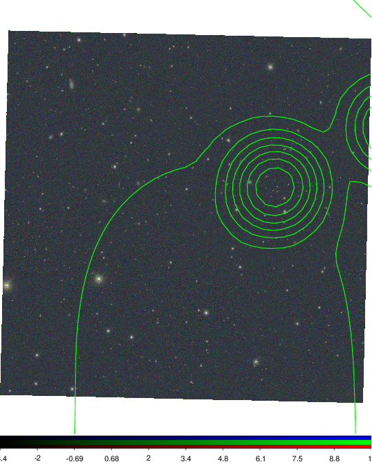  |
