

### 355

|Name|RAJ2000[deg]|DEJ2000[deg] |Ext[arcmin]| Ext,ml | z | z_src| C|GC(XSZ,Delta_z<0.01)| GC(OPT,Delta_z<0.01)|GC| R_sig[arcmin] | R500[arcmin] | R500[Mpc]| CRsig[c/s] | CR500[c/s] |L500[1E44 erg/s]|F500[1E-12 erg/s/cm^2]| M500[1E14 Msun]|Tx[keV]|Cnt_sig|Beta|Rc[arcmin]|Comment|Alias|
|---|---|---|---|---|---|------|---|--------|---------|----------|---|---|---|---|---|---|---|---|---|---|---|---|---|---|
|355| 155.416| 23.895| 2.70| 112.13| 0.0398(0.005)| z1, z_opt| S| -| N| C, F20, N, Tar, W| 14.650| 14.380| 0.680| 0.316(0.038)| 0.315(0.038)| 0.219(0.019)| 5.947(0.504)| 0.93(0.04)| 2.07(0.06)| 146.4| 0.721(-0.114+0.155)| 3.783(-1.037+1.179)| An SZ cluster with no $z$ and offset = 0.03 Mpc| t114|

|[RASS image](../image/355/355_img.pdf)|[filtered image](../image/355/355_fil.pdf)|[Segment image](../image/355/355_seg.pdf)|
|-------------------|--------------------|-------------------|
| 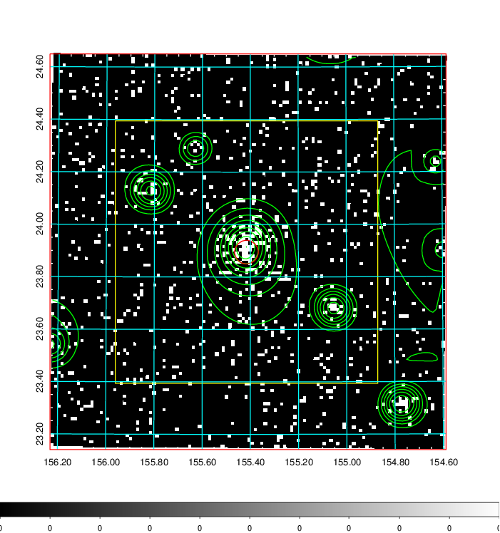  | 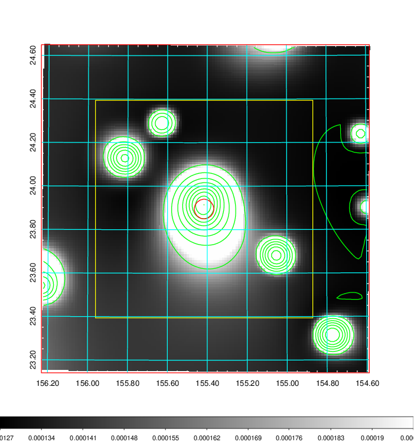   | 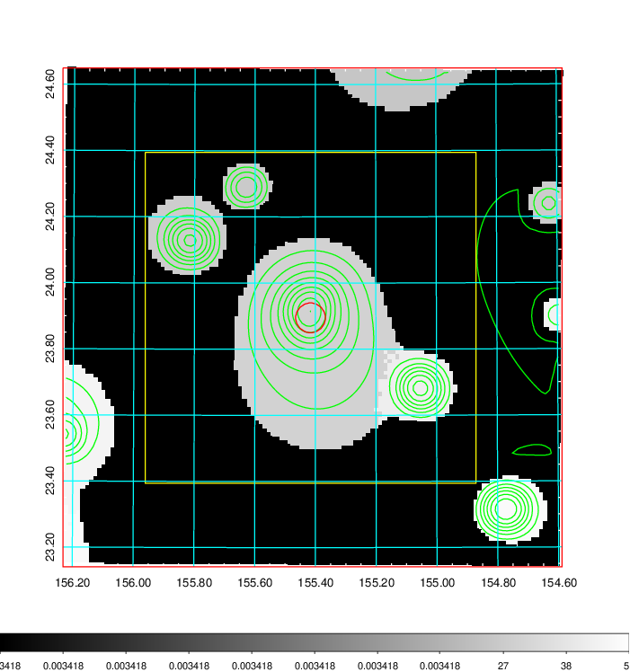  |

|[Exposure image](../image/355/355_mex.pdf)| [nH image](../image/355/355_nh.pdf)| [Planck image](../image/355/355_p.pdf)|
|-------------------|--------------------|-------------------|
|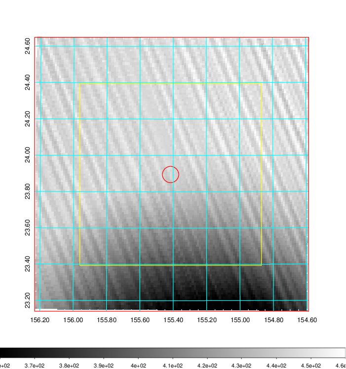   | 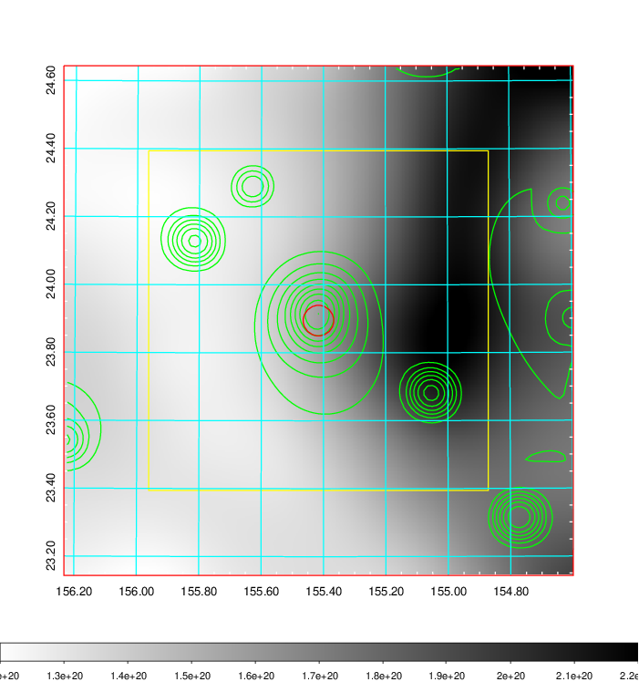    | 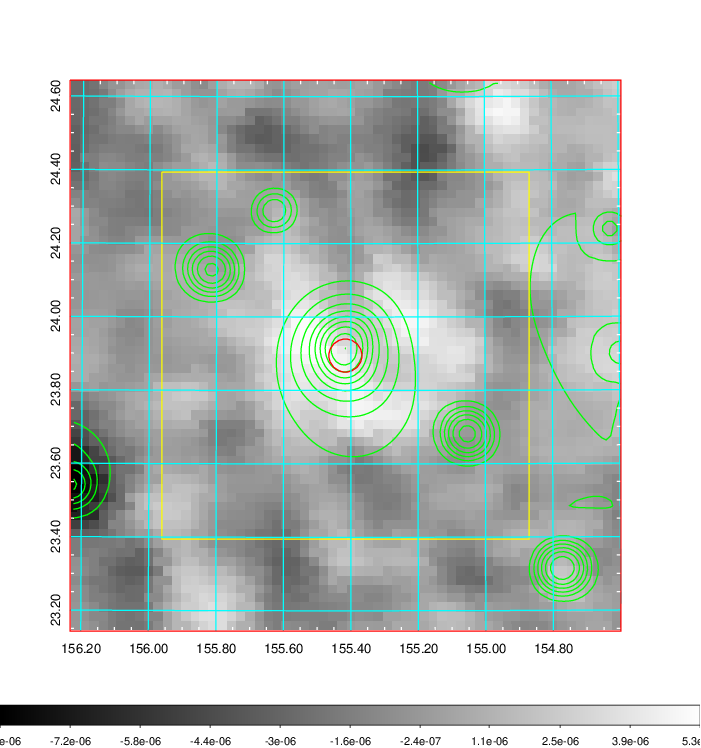 |

|[Redshift Histogram](../image/355/355_zg.pdf) | [DSS image(z1)](../image/355/355_dss_z1.pdf)      |  [DSS image(z2)](../image/355/355_dss_z2.pdf)    |
|-------------------|--------------------|-------------------|
|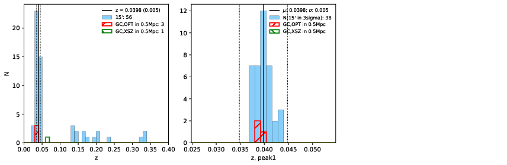 |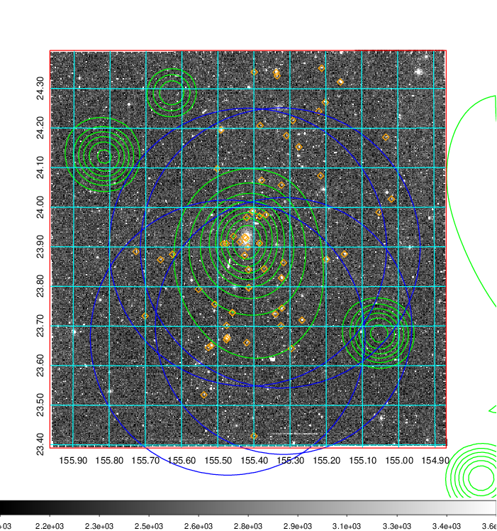  Blue circle for optical clusters;  Magenta circle for XSZ clusters;  all with r=1Mpc;  Only GC with Delta_z<0.01 are shown. | 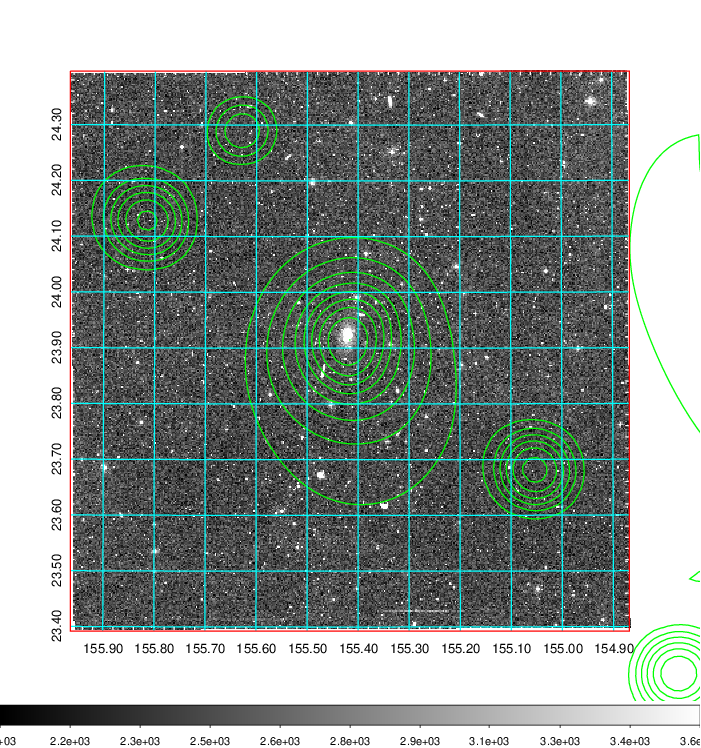 Blue circle for optical clusters;  Magenta circle for XSZ clusters;  all with r=1Mpc;  Only GC with Delta_z<0.01 are shown.  |

|[Previous-identified clusters](../image/355/355_gc.pdf) | [2MASS image](../image/355/355_2mass.pdf)      |[SDSS image](../image/355/355_sdss.pdf)   |
|-------------------|-------------------|-------------------|
|  Green, magenta, and blue circles  for optical, X-ray and SZ clusters  respectively, with redshift of clusters  labelled. The radius of circles  are 1Mpc.|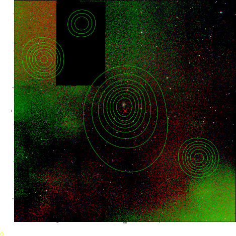  | 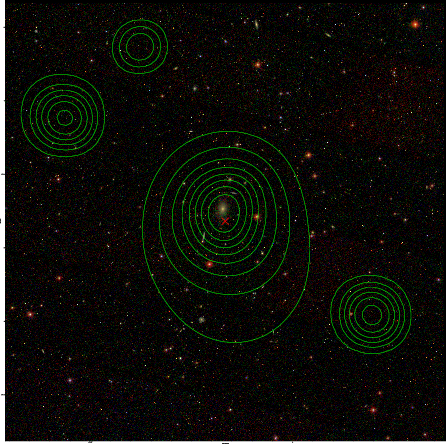  |

