

### 356

|Name|RAJ2000[deg]|DEJ2000[deg] |Ext[arcmin]| Ext,ml | z | z_src| C|GC(XSZ,Delta_z<0.01)| GC(OPT,Delta_z<0.01)|GC| R_sig[arcmin] | R500[arcmin] | R500[Mpc]| CRsig[c/s] | CR500[c/s] |L500[1E44 erg/s]|F500[1E-12 erg/s/cm^2]| M500[1E14 Msun]|Tx[keV]|Cnt_sig|Beta|Rc[arcmin]|Comment|Alias|
|---|---|---|---|---|---|------|---|--------|---------|----------|---|---|---|---|---|---|---|---|---|---|---|---|---|---|
|356| 155.507| 51.052| 3.78| 27.62| 0.1680(0.005)| z1, z_xsz| B| F20, SPI| -| C, F20, N, SPI, W| 12.700| 5.766| 0.993| 0.145(0.029)| 0.133(0.026)| 2.138(0.373)| 2.740(0.478)| 3.28(0.28)| 4.70(0.25)| 87.1| 0.712(-0.146+0.181)| 4.846(-1.649+1.682)| -| t181|

|[RASS image](../image/356/356_img.pdf)|[filtered image](../image/356/356_fil.pdf)|[Segment image](../image/356/356_seg.pdf)|
|-------------------|--------------------|-------------------|
| 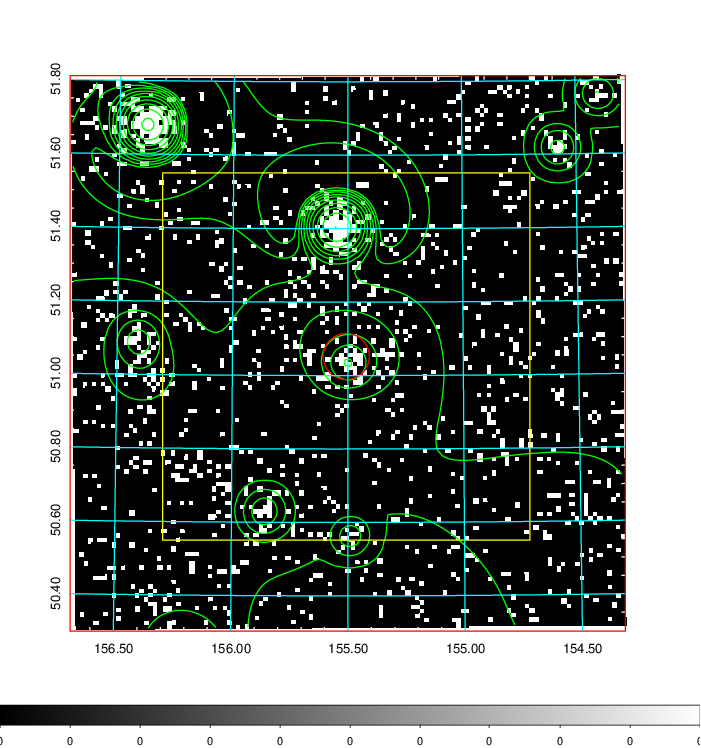  | 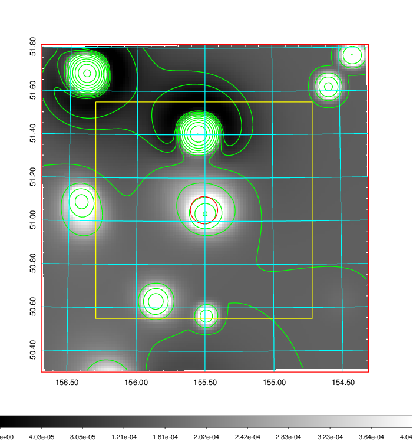   | 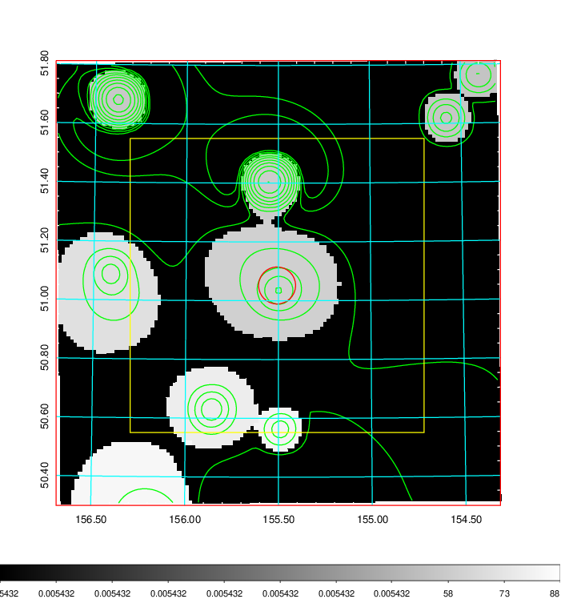  |

|[Exposure image](../image/356/356_mex.pdf)| [nH image](../image/356/356_nh.pdf)| [Planck image](../image/356/356_p.pdf)|
|-------------------|--------------------|-------------------|
|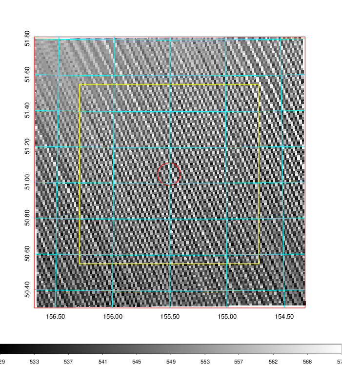   | 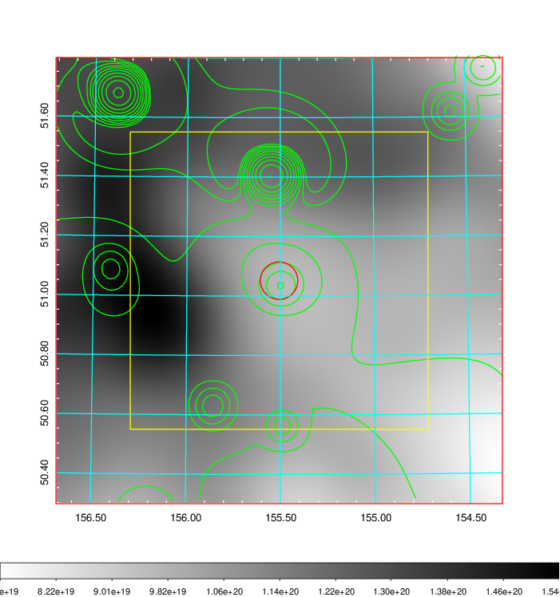    | 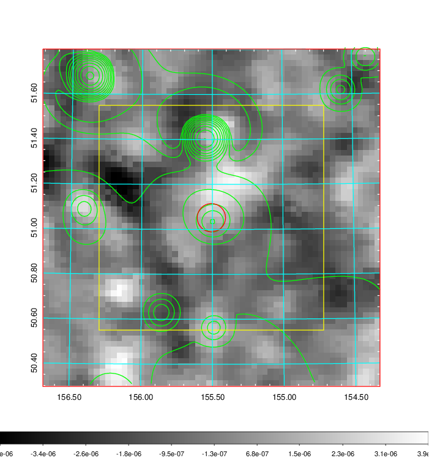 |

|[Redshift Histogram](../image/356/356_zg.pdf) | [DSS image(z1)](../image/356/356_dss_z1.pdf)      |  [DSS image(z2)](../image/356/356_dss_z2.pdf)    |
|-------------------|--------------------|-------------------|
|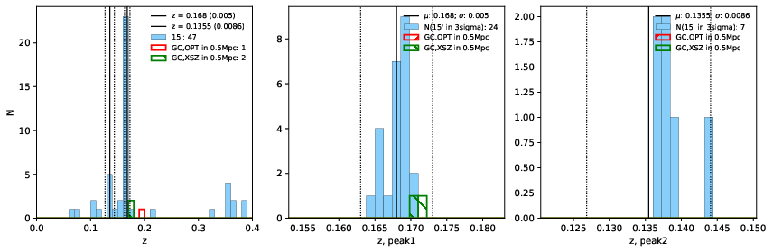 |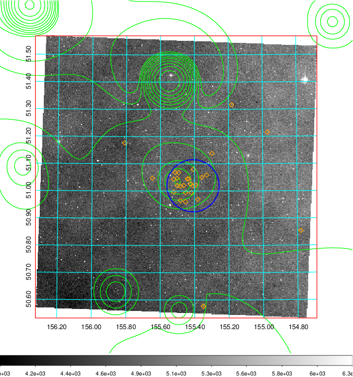  Blue circle for optical clusters;  Magenta circle for XSZ clusters;  all with r=1Mpc;  Only GC with Delta_z<0.01 are shown. | 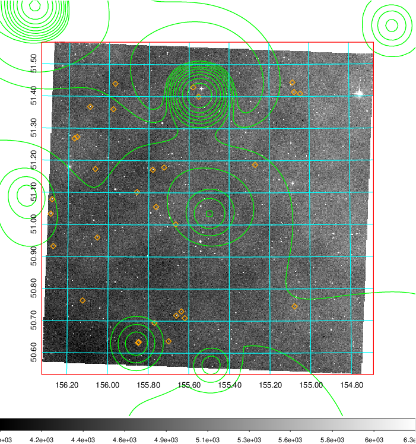 Blue circle for optical clusters;  Magenta circle for XSZ clusters;  all with r=1Mpc;  Only GC with Delta_z<0.01 are shown.  |

|[known Abell/XSZ clusters](../image/356/356_gc.pdf) | [2MASS image](../image/356/356_2mass.pdf)      |[SDSS image](../image/356/356_sdss.pdf)   |
|-------------------|-------------------|-------------------|
|  Magenta, blue and green circles  for optical, X-ray and SZ clusters  respectively, with redshift of clusters  labelled. The radius of circles  are 1Mpc.|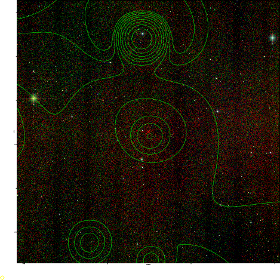  | 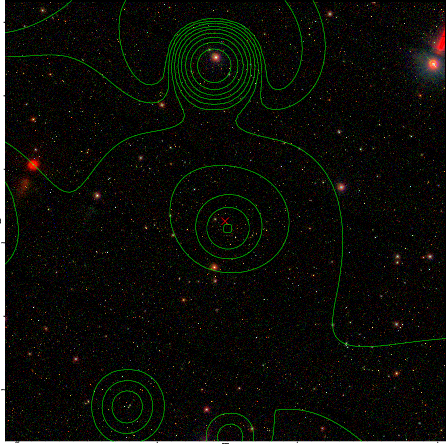  |

