

### 359

|Name|RAJ2000[deg]|DEJ2000[deg] |Ext[arcmin]| Ext,ml | z | z_src| C|GC(XSZ,Delta_z<0.01)| GC(OPT,Delta_z<0.01)|GC| R_sig[arcmin] | R500[arcmin] | R500[Mpc]| CRsig[c/s] | CR500[c/s] |L500[1E44 erg/s]|F500[1E-12 erg/s/cm^2]| M500[1E14 Msun]|Tx[keV]|Cnt_sig|Beta|Rc[arcmin]|Comment|Alias|
|---|---|---|---|---|---|------|---|--------|---------|----------|---|---|---|---|---|---|---|---|---|---|---|---|---|---|
|359| 155.907| 49.141| 1.70| 140.50| 0.1416(0.005)| z1, z_xsz| B| F20, MCXC, PSZ2, SPI, Tar, XB| A, N, RM, W| A, C, F20, MCXC, N, PSZ2, SPI, Tar, W, XB| 8.312| 7.903| 1.181| 0.410(0.037)| 0.407(0.037)| 4.445(0.173)| 8.283(0.322)| 5.38(0.10)| 6.33(0.08)| 210.9| 0.928(-0.079+0.051)| 3.965(-0.438+0.308)| -| k156|

|[RASS image](../image/359/359_img.pdf)|[filtered image](../image/359/359_fil.pdf)|[Segment image](../image/359/359_seg.pdf)|
|-------------------|--------------------|-------------------|
| 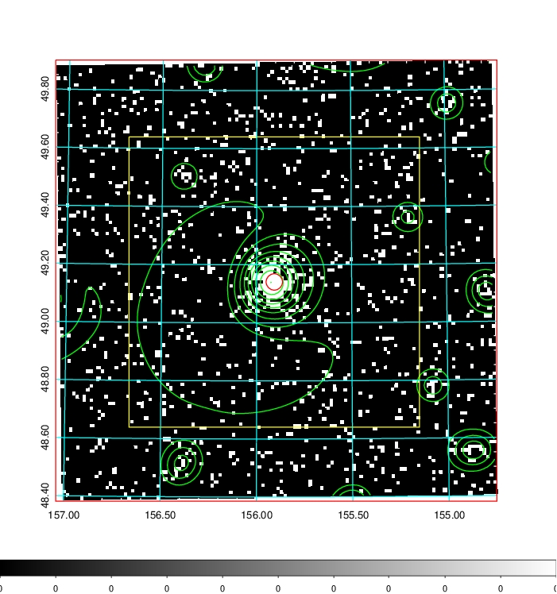  | 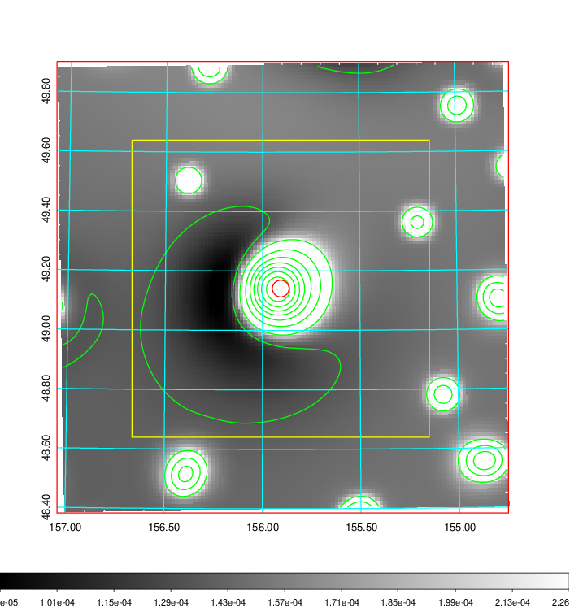   | 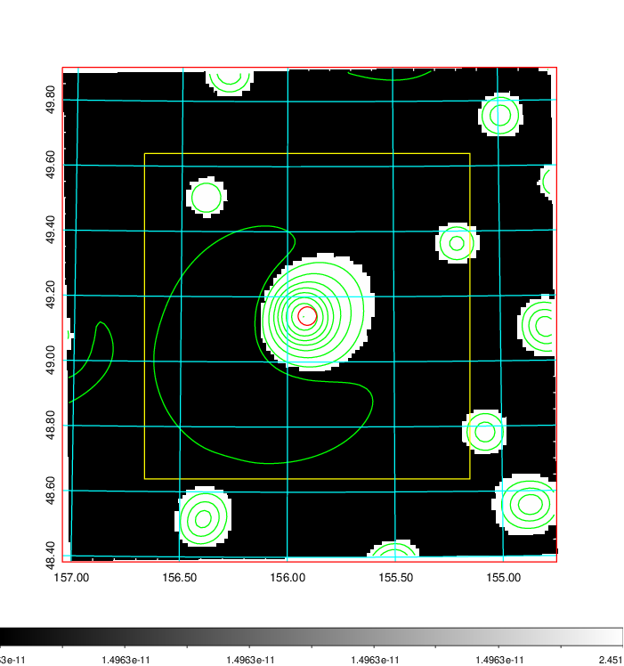  |

|[Exposure image](../image/359/359_mex.pdf)| [nH image](../image/359/359_nh.pdf)| [Planck image](../image/359/359_p.pdf)|
|-------------------|--------------------|-------------------|
|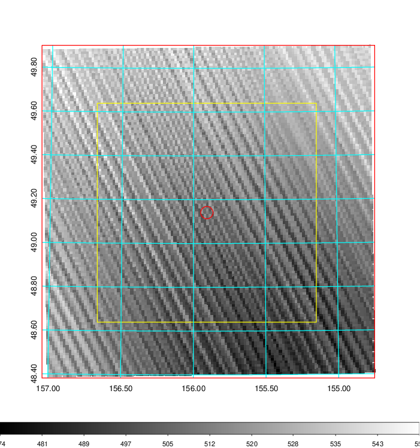   | 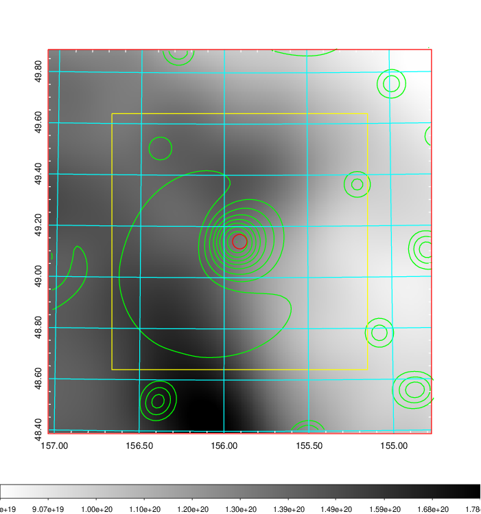    | 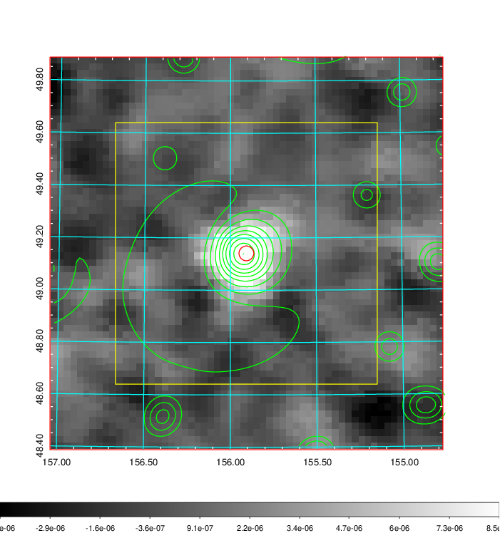 |

|[Redshift Histogram](../image/359/359_zg.pdf) | [DSS image(z1)](../image/359/359_dss_z1.pdf)      |  [DSS image(z2)](../image/359/359_dss_z2.pdf)    |
|-------------------|--------------------|-------------------|
|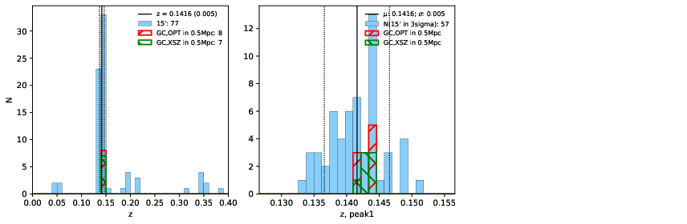 |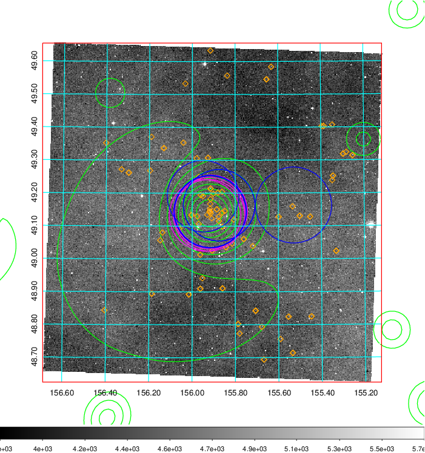  Blue circle for optical clusters;  Magenta circle for XSZ clusters;  all with r=1Mpc;  Only GC with Delta_z<0.01 are shown. | 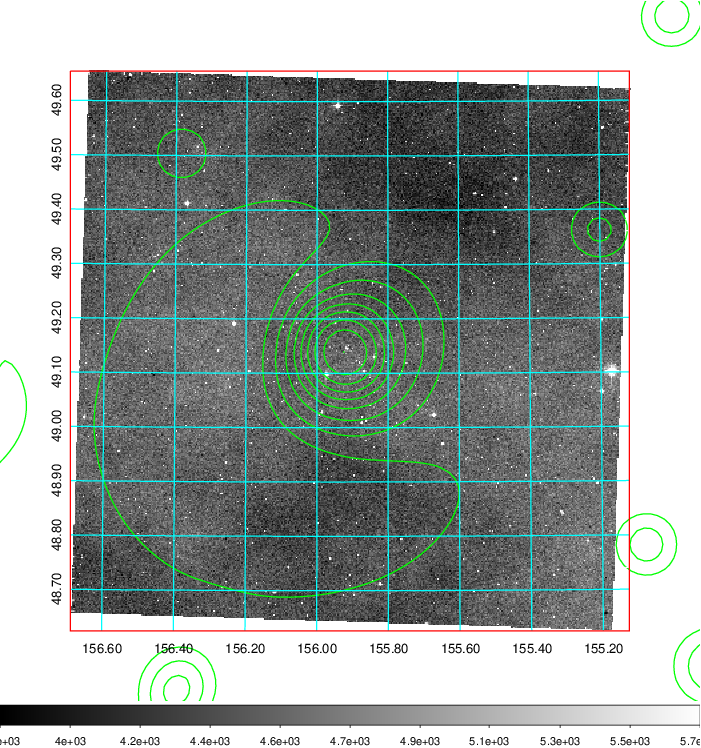 Blue circle for optical clusters;  Magenta circle for XSZ clusters;  all with r=1Mpc;  Only GC with Delta_z<0.01 are shown.  |

|[Previous-identified clusters](../image/359/359_gc.pdf) | [2MASS image](../image/359/359_2mass.pdf)      |[SDSS image](../image/359/359_sdss.pdf)   |
|-------------------|-------------------|-------------------|
|  Green, magenta, and blue circles  for optical, X-ray and SZ clusters  respectively, with redshift of clusters  labelled. The radius of circles  are 1Mpc.|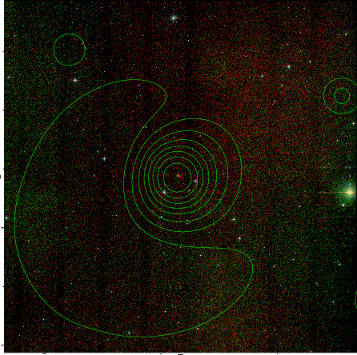  | 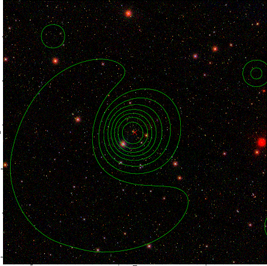  |

