

### 36

|Name|RAJ2000[deg]|DEJ2000[deg] |Ext[arcmin]| Ext,ml | z | z_src| C|GC(XSZ,Delta_z<0.01)| GC(OPT,Delta_z<0.01)|GC| R_sig[arcmin] | R500[arcmin] | R500[Mpc]| CRsig[c/s] | CR500[c/s] |L500[1E44 erg/s]|F500[1E-12 erg/s/cm^2]| M500[1E14 Msun]|Tx[keV]|Cnt_sig|Beta|Rc[arcmin]|Comment|Alias|
|---|---|---|---|---|---|------|---|--------|---------|----------|---|---|---|---|---|---|---|---|---|---|---|---|---|---|
|36| 11.562| -1.618| 6.89| 25.85| 0.1231(0.005)| z1,| G| -| -| C, N, W| 8.800| 6.247| 0.829| 0.099(0.036)| 0.095(0.035)| 0.703(0.266)| 1.774(0.672)| 1.82(0.35)| 3.22(0.39)| 35.9| 0.851(-0.163+0.107)| 8.438(-1.775+1.542)| -| t342|

|[RASS image](../image/36/36_img.pdf)|[filtered image](../image/36/36_fil.pdf)|[Segment image](../image/36/36_seg.pdf)|
|-------------------|--------------------|-------------------|
| 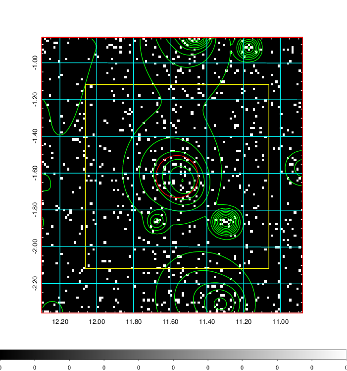  | 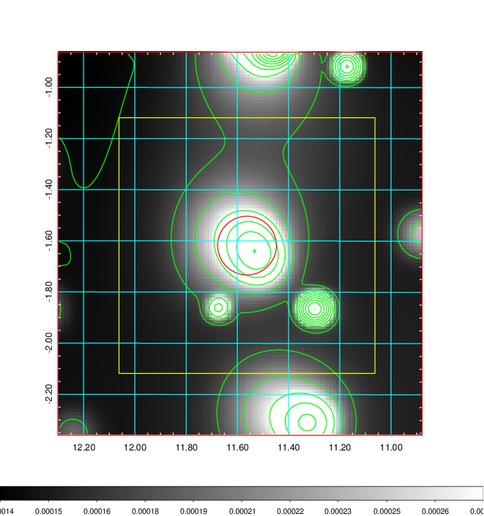   | 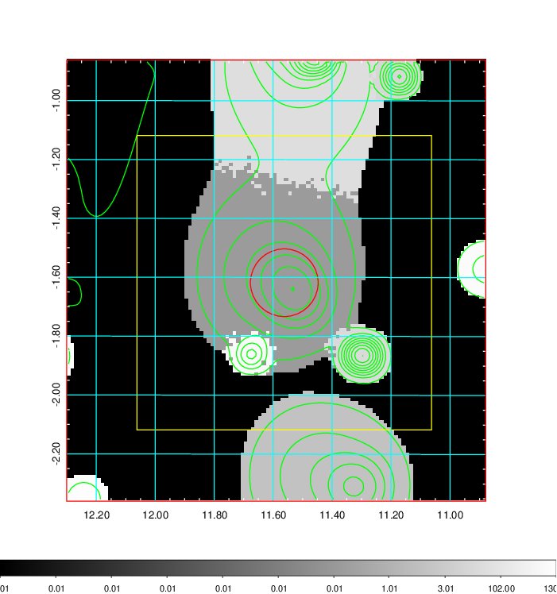  |

|[Exposure image](../image/36/36_mex.pdf)| [nH image](../image/36/36_nh.pdf)| [Planck image](../image/36/36_p.pdf)|
|-------------------|--------------------|-------------------|
|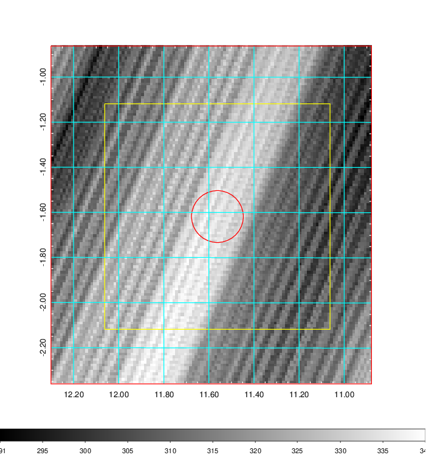   | 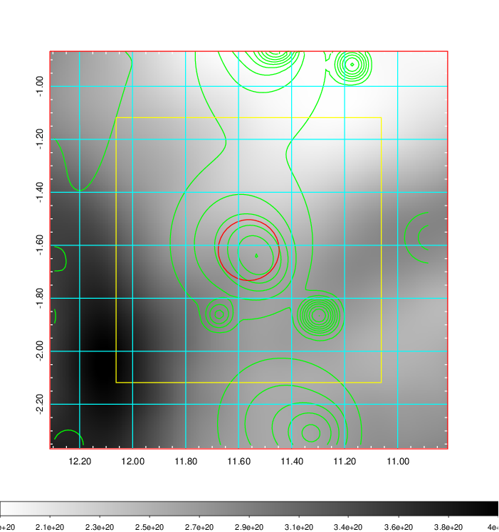    | 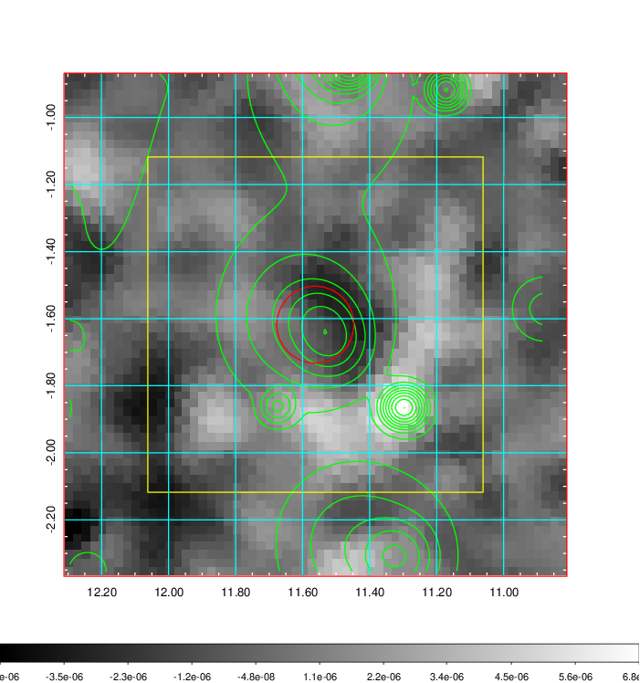 |

|[Redshift Histogram](../image/36/36_zg.pdf) | [DSS image(z1)](../image/36/36_dss_z1.pdf)      |  [DSS image(z2)](../image/36/36_dss_z2.pdf)    |
|-------------------|--------------------|-------------------|
|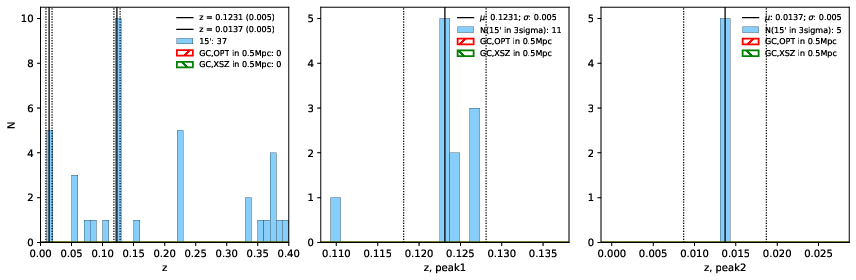 |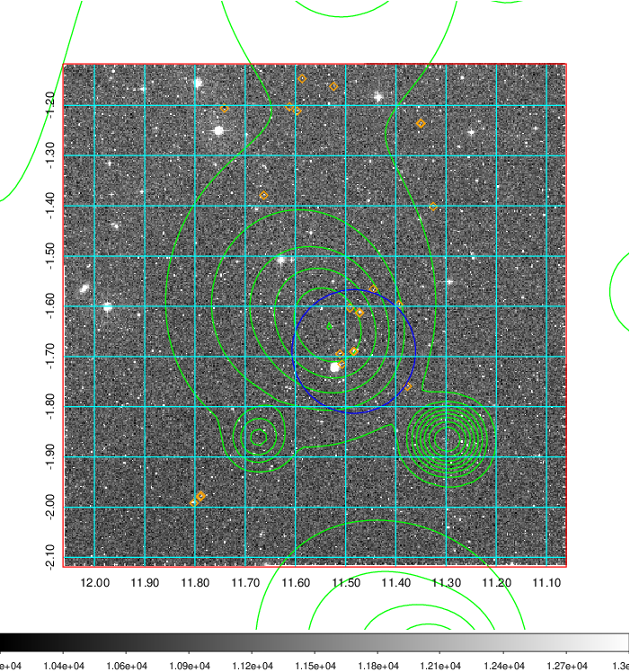  Blue circle for optical clusters;  Magenta circle for XSZ clusters;  all with r=1Mpc;  Only GC with Delta_z<0.01 are shown. |  Blue circle for optical clusters;  Magenta circle for XSZ clusters;  all with r=1Mpc;  Only GC with Delta_z<0.01 are shown.  |

|[Previous-identified clusters](../image/36/36_gc.pdf) | [2MASS image](../image/36/36_2mass.pdf)      |[SDSS image](../image/36/36_sdss.pdf)   |
|-------------------|-------------------|-------------------|
|  Green, magenta, and blue circles  for optical, X-ray and SZ clusters  respectively, with redshift of clusters  labelled. The radius of circles  are 1Mpc.|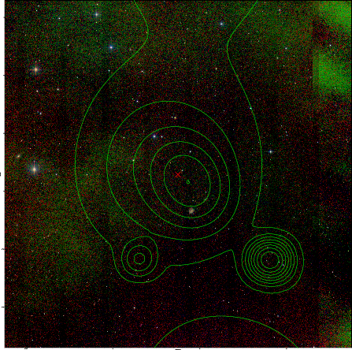  | 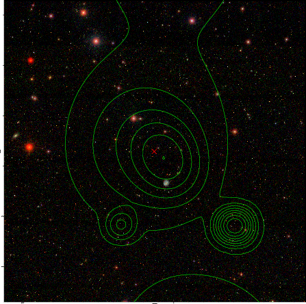  |

|[DES image](../image/36/36_des.pdf)   |
|-------------------|
| 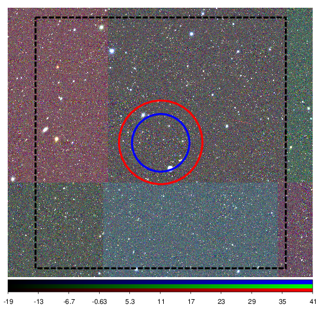  |
