

### 360

|Name|RAJ2000[deg]|DEJ2000[deg] |Ext[arcmin]| Ext,ml | z | z_src| C|GC(XSZ,Delta_z<0.01)| GC(OPT,Delta_z<0.01)|GC| R_sig[arcmin] | R500[arcmin] | R500[Mpc]| CRsig[c/s] | CR500[c/s] |L500[1E44 erg/s]|F500[1E-12 erg/s/cm^2]| M500[1E14 Msun]|Tx[keV]|Cnt_sig|Beta|Rc[arcmin]|Comment|Alias|
|---|---|---|---|---|---|------|---|--------|---------|----------|---|---|---|---|---|---|---|---|---|---|---|---|---|---|
|360| 156.222| 50.254| 4.02| 25.38| 0.1551(0.005)| z1, z_xsz| B| F20, SPI| N| A, C, F20, N, SPI, W| 11.238| 5.367| 0.866| 0.087(0.027)| 0.080(0.025)| 1.056(0.359)| 1.613(0.549)| 2.15(0.36)| 3.60(0.39)| 58.1| 0.762(-0.162+0.161)| 5.889(-1.720+1.576)| An Abell cluster with $z$ = 0.1546 and offset = 0.73 Mpc(4.48 arcmin)| t196|

|[RASS image](../image/360/360_img.pdf)|[filtered image](../image/360/360_fil.pdf)|[Segment image](../image/360/360_seg.pdf)|
|-------------------|--------------------|-------------------|
| 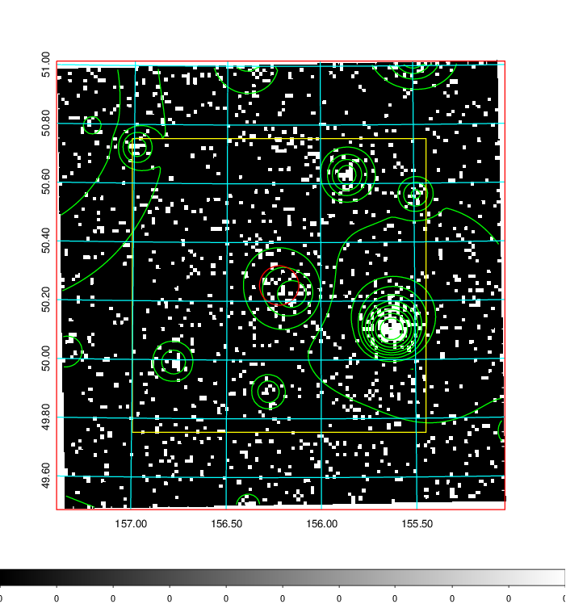  | 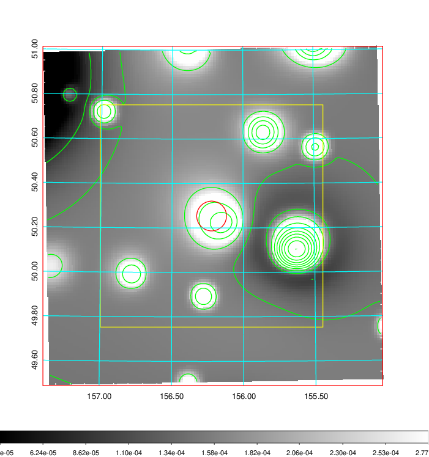   | 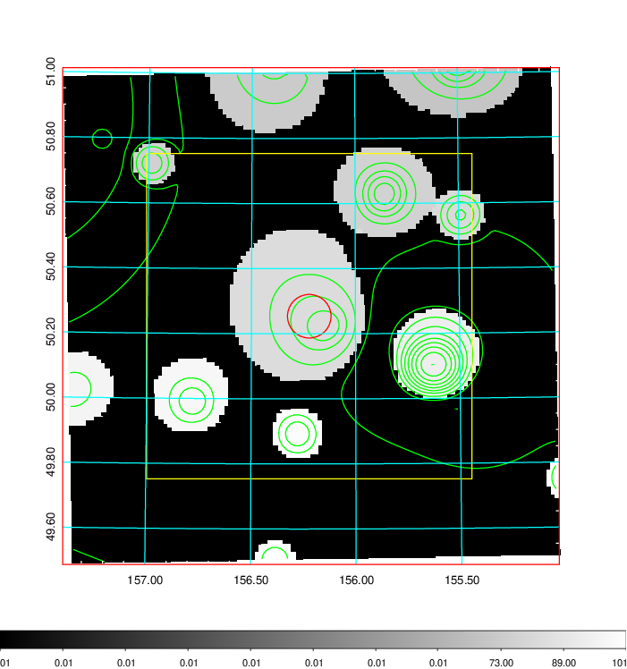  |

|[Exposure image](../image/360/360_mex.pdf)| [nH image](../image/360/360_nh.pdf)| [Planck image](../image/360/360_p.pdf)|
|-------------------|--------------------|-------------------|
|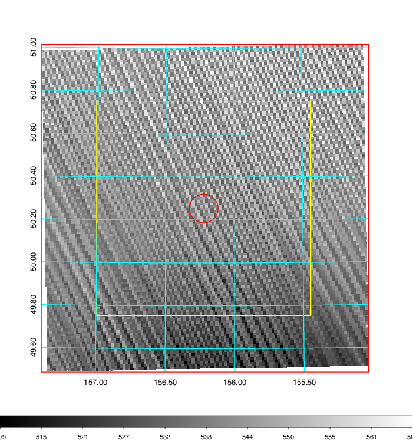   | 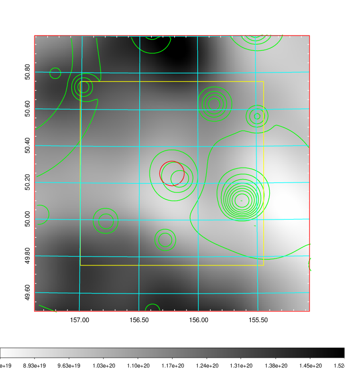    | 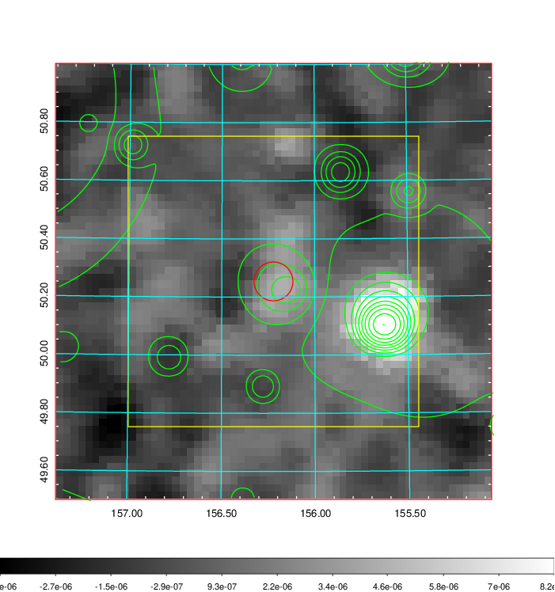 |

|[Redshift Histogram](../image/360/360_zg.pdf) | [DSS image(z1)](../image/360/360_dss_z1.pdf)      |  [DSS image(z2)](../image/360/360_dss_z2.pdf)    |
|-------------------|--------------------|-------------------|
|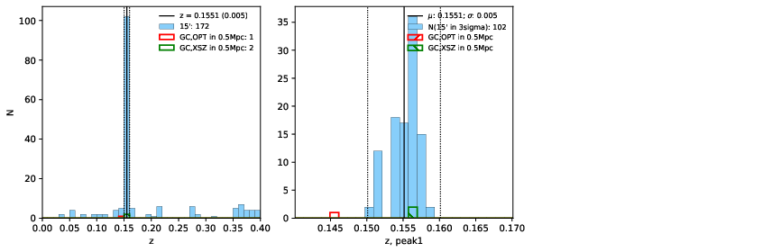 |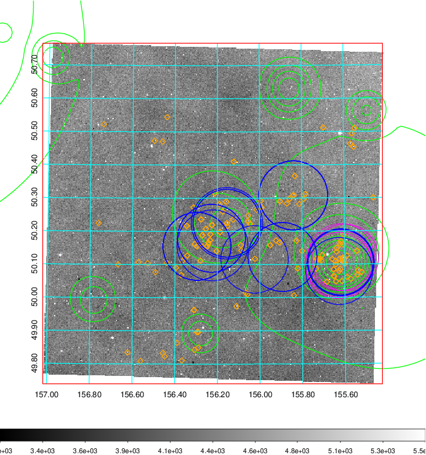  Blue circle for optical clusters;  Magenta circle for XSZ clusters;  all with r=1Mpc;  Only GC with Delta_z<0.01 are shown. | 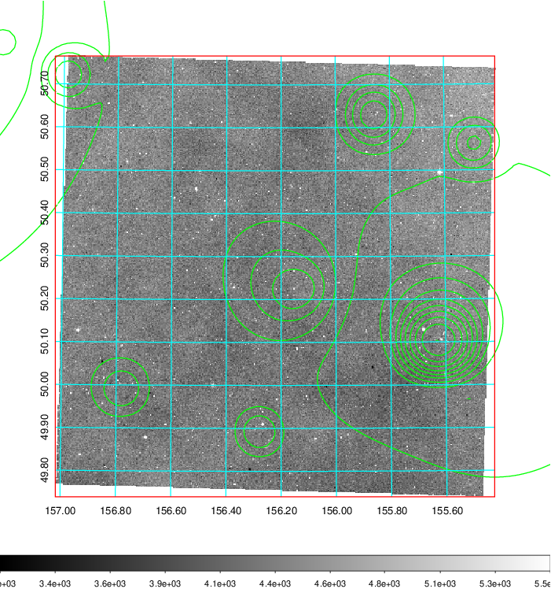 Blue circle for optical clusters;  Magenta circle for XSZ clusters;  all with r=1Mpc;  Only GC with Delta_z<0.01 are shown.  |

|[known Abell/XSZ clusters](../image/360/360_gc.pdf) | [2MASS image](../image/360/360_2mass.pdf)      |[SDSS image](../image/360/360_sdss.pdf)   |
|-------------------|-------------------|-------------------|
|  Magenta, blue and green circles  for optical, X-ray and SZ clusters  respectively, with redshift of clusters  labelled. The radius of circles  are 1Mpc.|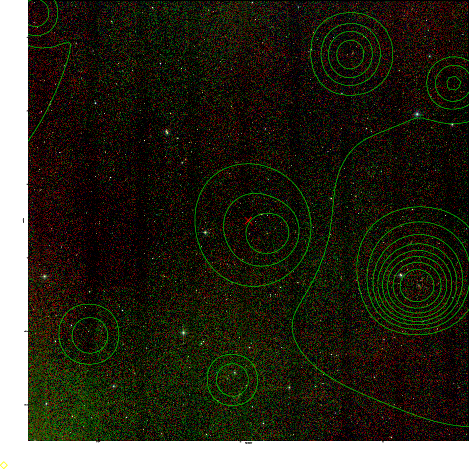  | 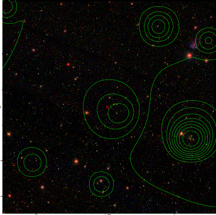  |

