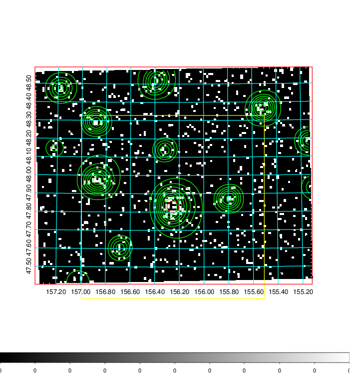
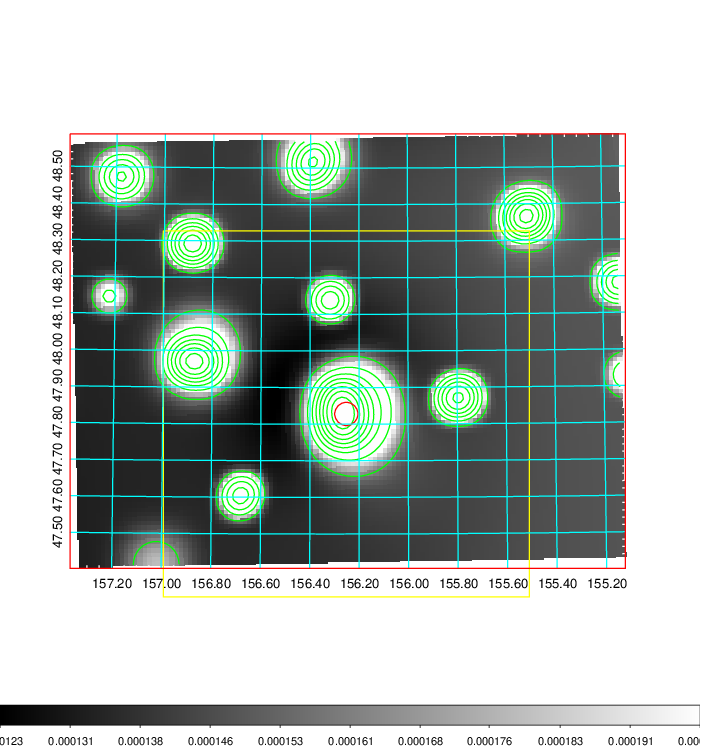
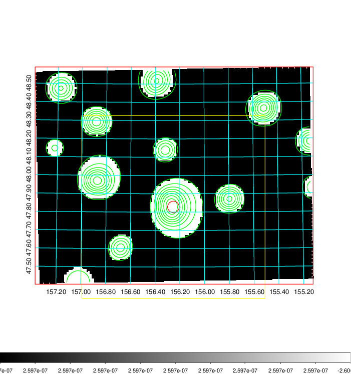
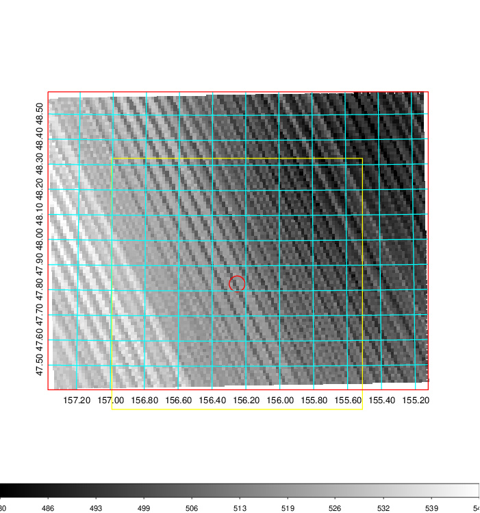
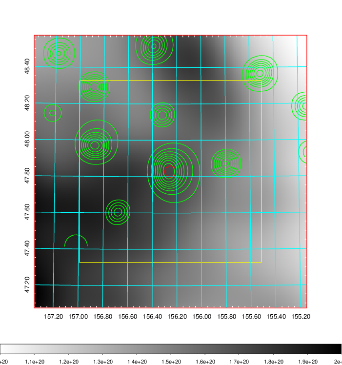
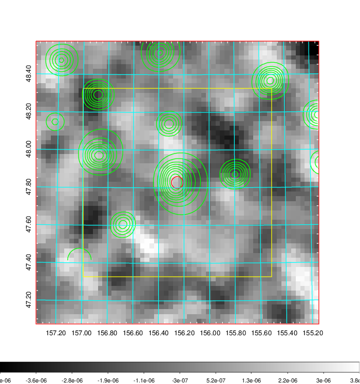
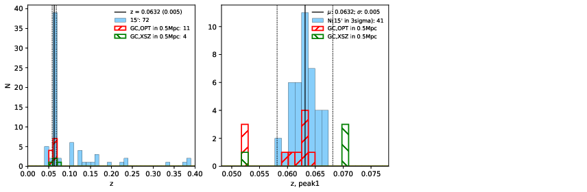
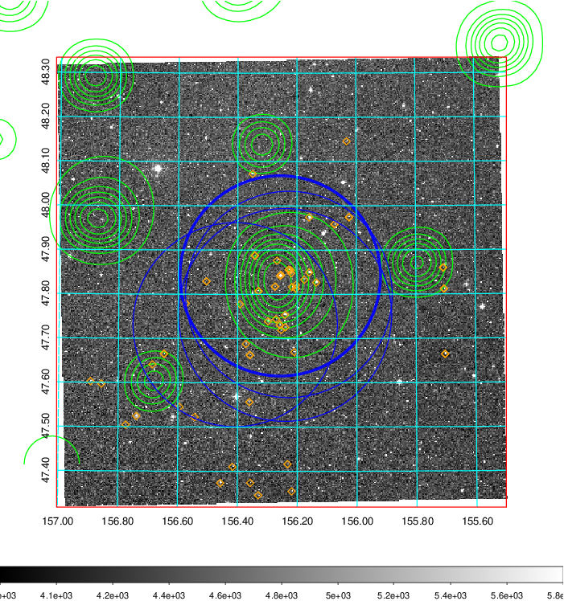
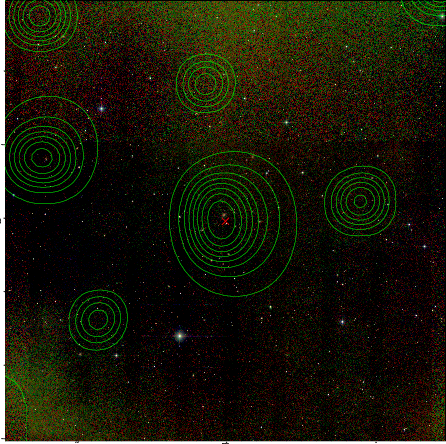
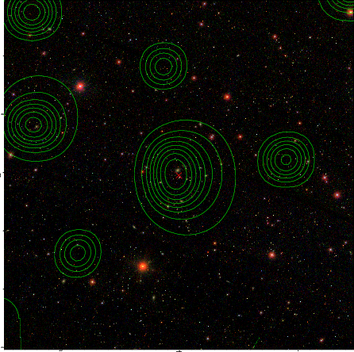

### 361

|Name|RAJ2000[deg]|DEJ2000[deg] |Ext[arcmin]| Ext,ml | z | z_src| C|GC(XSZ,Delta_z<0.01)| GC(OPT,Delta_z<0.01)|GC| R_sig[arcmin] | R500[arcmin] | R500[Mpc]| CRsig[c/s] | CR500[c/s] |L500[1E44 erg/s]|F500[1E-12 erg/s/cm^2]| M500[1E14 Msun]|Tx[keV]|Cnt_sig|Beta|Rc[arcmin]|Comment|Alias|
|---|---|---|---|---|---|------|---|--------|---------|----------|---|---|---|---|---|---|---|---|---|---|---|---|---|---|
|361| 156.252| 47.828| 1.90| 25.90| 0.0632(0.005)| z1, z_xsz| B| F20, SPI| N, W| A, F20, MCXC, N, SPI, W| 7.338| 8.780| 0.641| 0.095(0.027)| 0.099(0.028)| 0.171(0.030)| 1.778(0.315)| 0.79(0.07)| 1.89(0.11)| 50.0| 0.934(-0.085+0.048)| 4.131(-0.498+0.451)| An X-ray cluster with $z$ = 0.052 and offset = 0.08 Mpc| k195|

|[RASS image](../image/361/361_img.pdf)|[filtered image](../image/361/361_fil.pdf)|[Segment image](../image/361/361_seg.pdf)|
|-------------------|--------------------|-------------------|
|   |    |   |

|[Exposure image](../image/361/361_mex.pdf)| [nH image](../image/361/361_nh.pdf)| [Planck image](../image/361/361_p.pdf)|
|-------------------|--------------------|-------------------|
|   |     |  |

|[Redshift Histogram](../image/361/361_zg.pdf) | [DSS image(z1)](../image/361/361_dss_z1.pdf)      |  [DSS image(z2)](../image/361/361_dss_z2.pdf)    |
|-------------------|--------------------|-------------------|
| |  Blue circle for optical clusters;  Magenta circle for XSZ clusters;  all with r=1Mpc;  Only GC with Delta_z<0.01 are shown. |  Blue circle for optical clusters;  Magenta circle for XSZ clusters;  all with r=1Mpc;  Only GC with Delta_z<0.01 are shown.  |

|[Previous-identified clusters](../image/361/361_gc.pdf) | [2MASS image](../image/361/361_2mass.pdf)      |[SDSS image](../image/361/361_sdss.pdf)   |
|-------------------|-------------------|-------------------|
|  Green, magenta, and blue circles  for optical, X-ray and SZ clusters  respectively, with redshift of clusters  labelled. The radius of circles  are 1Mpc.|  |   |

