

### 362

|Name|RAJ2000[deg]|DEJ2000[deg] |Ext[arcmin]| Ext,ml | z | z_src| C|GC(XSZ,Delta_z<0.01)| GC(OPT,Delta_z<0.01)|GC| R_sig[arcmin] | R500[arcmin] | R500[Mpc]| CRsig[c/s] | CR500[c/s] |L500[1E44 erg/s]|F500[1E-12 erg/s/cm^2]| M500[1E14 Msun]|Tx[keV]|Cnt_sig|Beta|Rc[arcmin]|Comment|Alias|
|---|---|---|---|---|---|------|---|--------|---------|----------|---|---|---|---|---|---|---|---|---|---|---|---|---|---|
|362| 157.938| 35.056| 0.96| 42.78| 0.1224(0.005)| z1, z_xsz| B| F20, MCXC, PSZ2, SPI, Tar, XB| A, C, N, RM, W| A, C, F20, MCXC, N, PSZ2, SPI, Tar, W, XB| 9.775| 8.115| 1.071| 0.343(0.037)| 0.334(0.036)| 2.625(0.138)| 6.711(0.352)| 3.94(0.10)| 5.18(0.08)| 163.9| 0.827(-0.119+0.111)| 2.383(-0.619+0.494)| -| k030|

|[RASS image](../image/362/362_img.pdf)|[filtered image](../image/362/362_fil.pdf)|[Segment image](../image/362/362_seg.pdf)|
|-------------------|--------------------|-------------------|
| 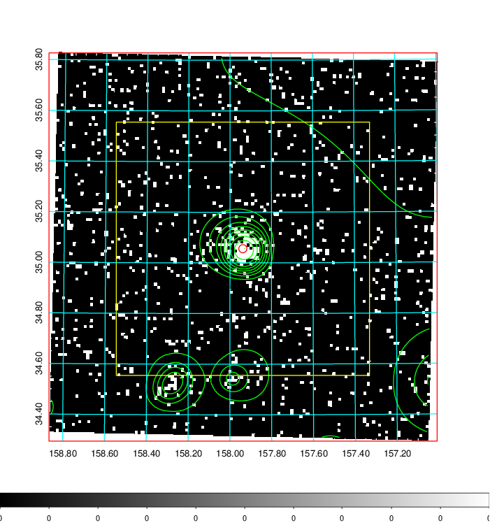  | 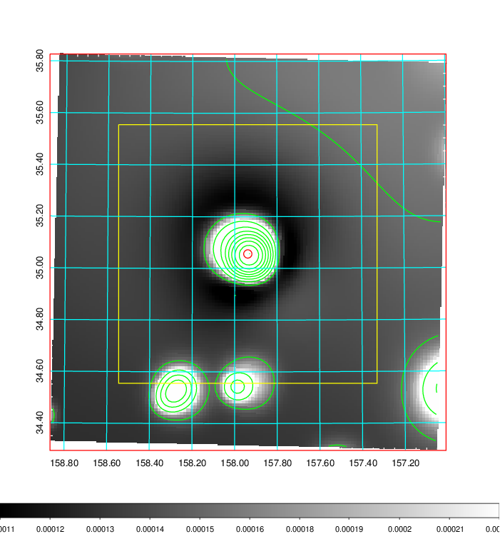   | 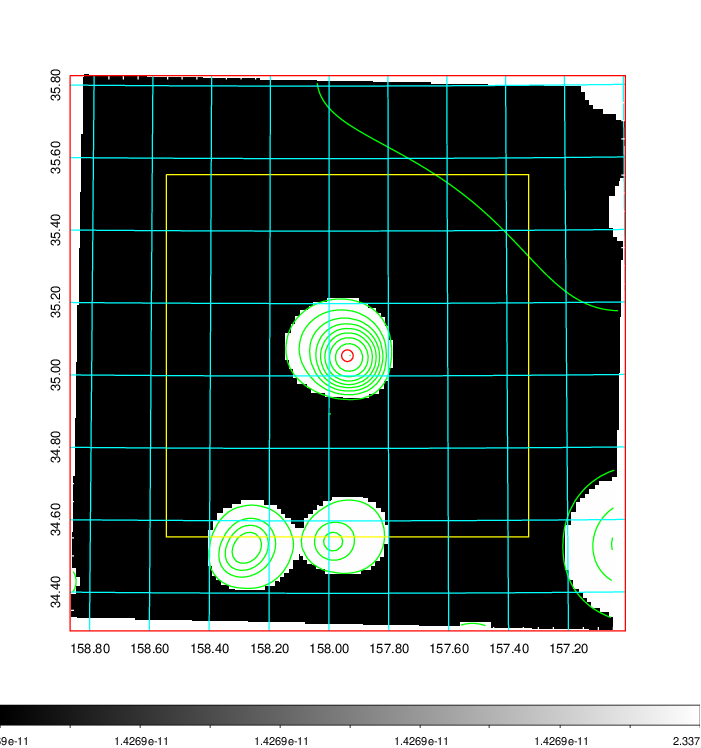  |

|[Exposure image](../image/362/362_mex.pdf)| [nH image](../image/362/362_nh.pdf)| [Planck image](../image/362/362_p.pdf)|
|-------------------|--------------------|-------------------|
|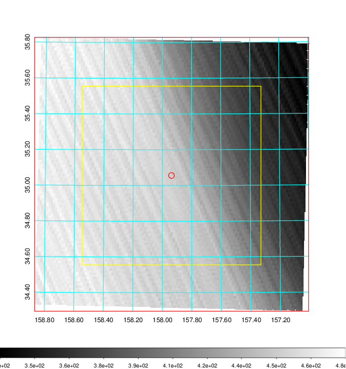   | 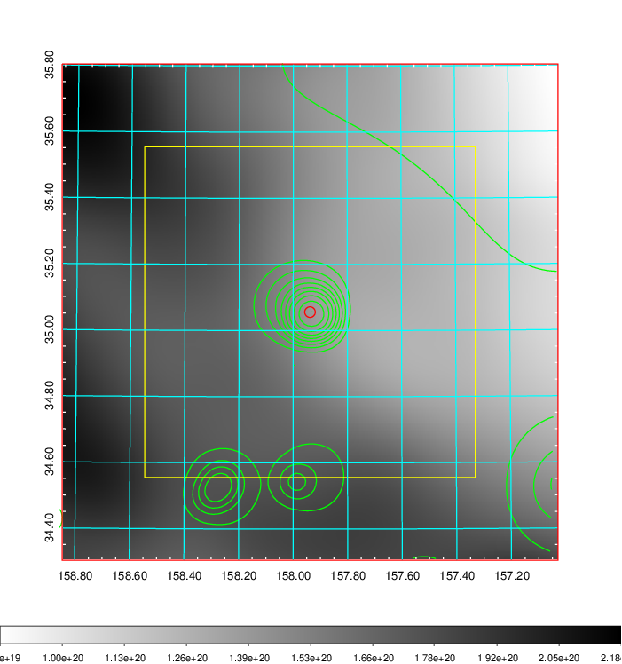    | 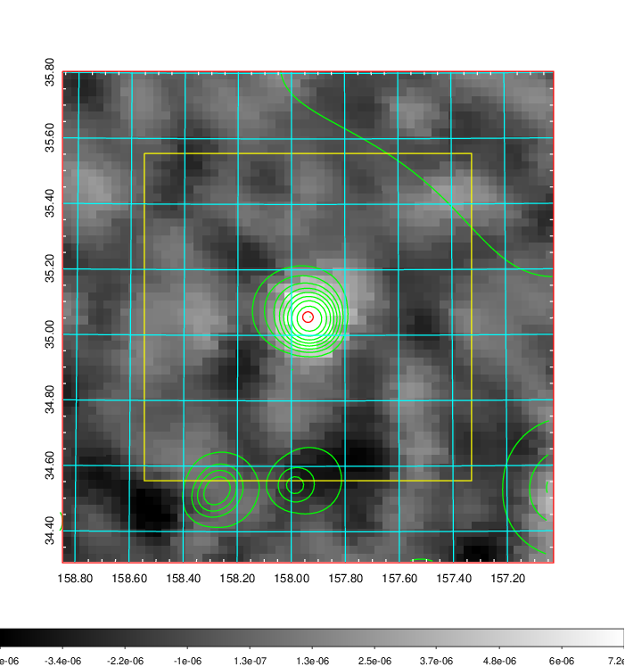 |

|[Redshift Histogram](../image/362/362_zg.pdf) | [DSS image(z1)](../image/362/362_dss_z1.pdf)      |  [DSS image(z2)](../image/362/362_dss_z2.pdf)    |
|-------------------|--------------------|-------------------|
|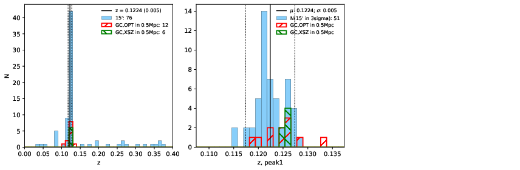 |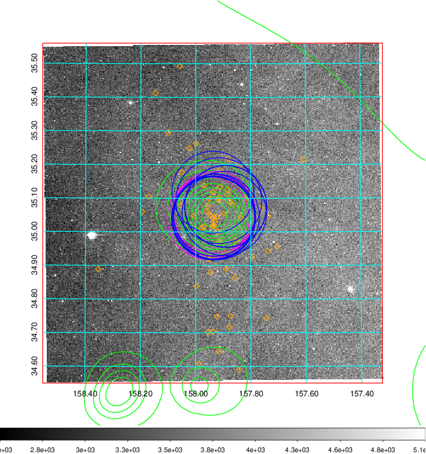  Blue circle for optical clusters;  Magenta circle for XSZ clusters;  all with r=1Mpc;  Only GC with Delta_z<0.01 are shown. | 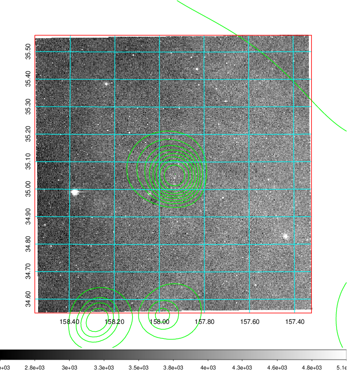 Blue circle for optical clusters;  Magenta circle for XSZ clusters;  all with r=1Mpc;  Only GC with Delta_z<0.01 are shown.  |

|[Previous-identified clusters](../image/362/362_gc.pdf) | [2MASS image](../image/362/362_2mass.pdf)      |[SDSS image](../image/362/362_sdss.pdf)   |
|-------------------|-------------------|-------------------|
|  Green, magenta, and blue circles  for optical, X-ray and SZ clusters  respectively, with redshift of clusters  labelled. The radius of circles  are 1Mpc.|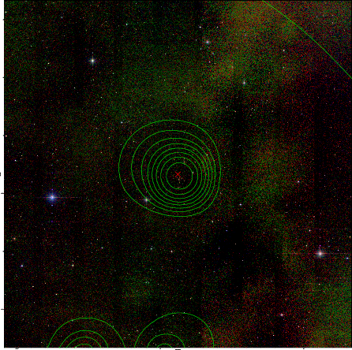  | 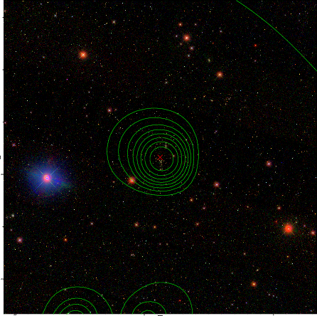  |

