

### 363

|Name|RAJ2000[deg]|DEJ2000[deg] |Ext[arcmin]| Ext,ml | z | z_src| C|GC(XSZ,Delta_z<0.01)| GC(OPT,Delta_z<0.01)|GC| R_sig[arcmin] | R500[arcmin] | R500[Mpc]| CRsig[c/s] | CR500[c/s] |L500[1E44 erg/s]|F500[1E-12 erg/s/cm^2]| M500[1E14 Msun]|Tx[keV]|Cnt_sig|Beta|Rc[arcmin]|Comment|Alias|
|---|---|---|---|---|---|------|---|--------|---------|----------|---|---|---|---|---|---|---|---|---|---|---|---|---|---|
|363| 158.076| 40.208| 3.58| 80.23| 0.0682(0.005)| z1, z_xsz| B| L03| A, N, W| A, C, F20, L03, MCXC, N, SPI, W, XB| 13.675| 10.106| 0.791| 0.248(0.034)| 0.238(0.033)| 0.518(0.050)| 4.590(0.441)| 1.50(0.07)| 2.81(0.09)| 137.4| 0.887(-0.125+0.080)| 8.159(-1.244+0.862)| -| k444|

|[RASS image](../image/363/363_img.pdf)|[filtered image](../image/363/363_fil.pdf)|[Segment image](../image/363/363_seg.pdf)|
|-------------------|--------------------|-------------------|
| 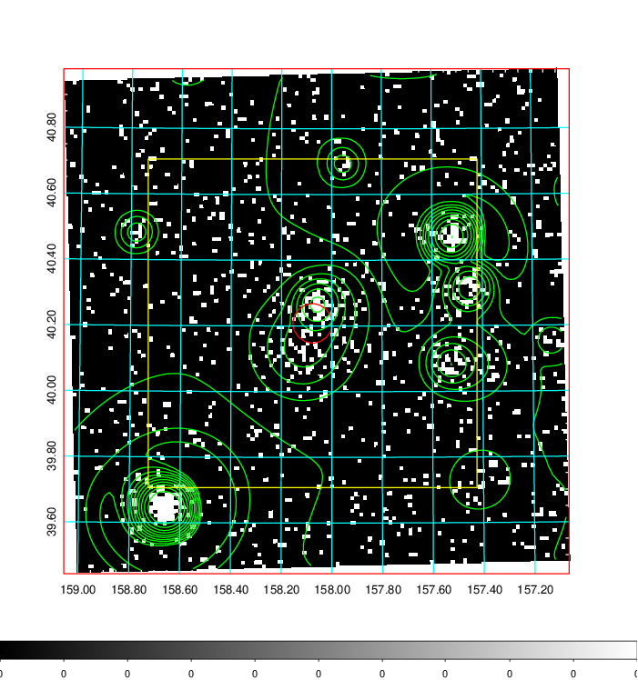  | 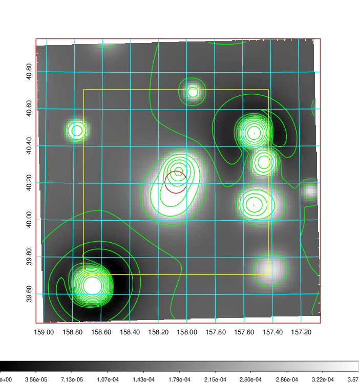   | 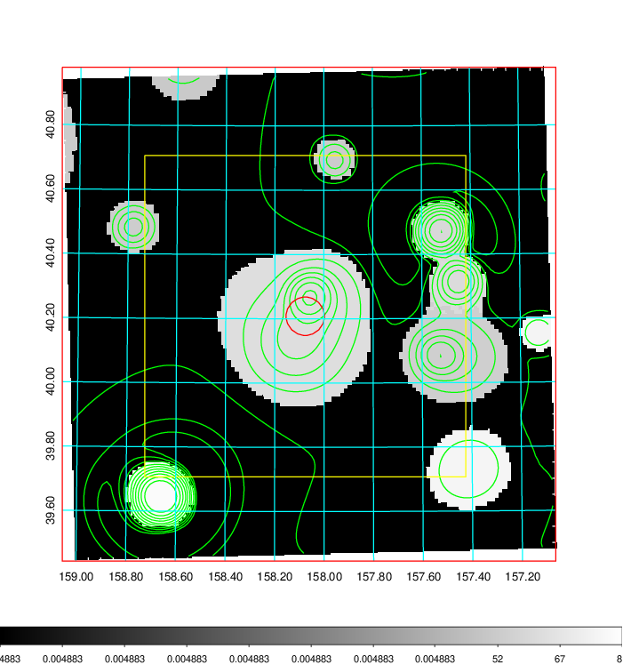  |

|[Exposure image](../image/363/363_mex.pdf)| [nH image](../image/363/363_nh.pdf)| [Planck image](../image/363/363_p.pdf)|
|-------------------|--------------------|-------------------|
|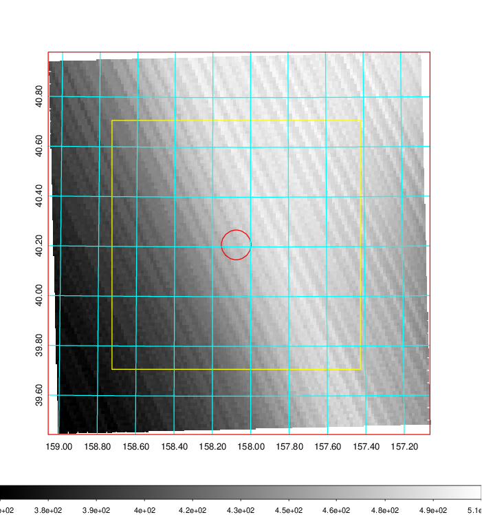   | 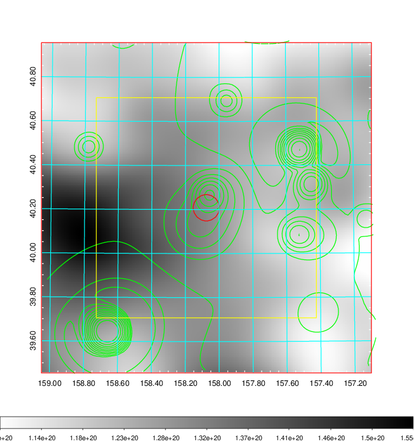    | 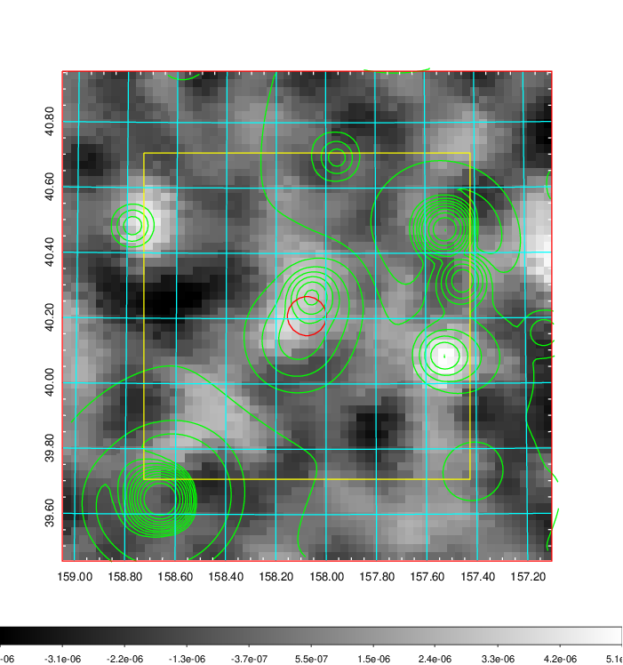 |

|[Redshift Histogram](../image/363/363_zg.pdf) | [DSS image(z1)](../image/363/363_dss_z1.pdf)      |  [DSS image(z2)](../image/363/363_dss_z2.pdf)    |
|-------------------|--------------------|-------------------|
|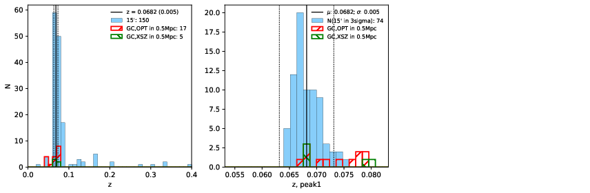 |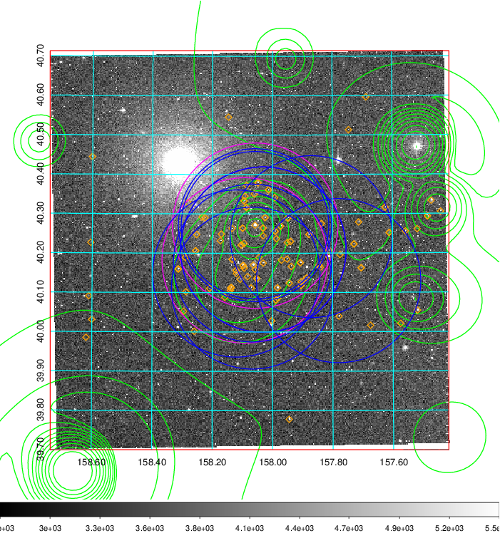  Blue circle for optical clusters;  Magenta circle for XSZ clusters;  all with r=1Mpc;  Only GC with Delta_z<0.01 are shown. | 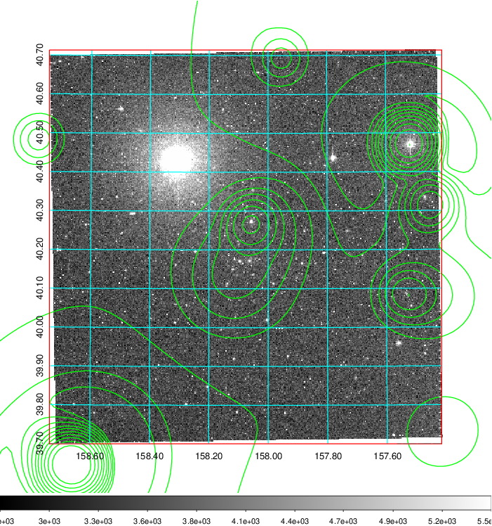 Blue circle for optical clusters;  Magenta circle for XSZ clusters;  all with r=1Mpc;  Only GC with Delta_z<0.01 are shown.  |

|[Previous-identified clusters](../image/363/363_gc.pdf) | [2MASS image](../image/363/363_2mass.pdf)      |[SDSS image](../image/363/363_sdss.pdf)   |
|-------------------|-------------------|-------------------|
|  Green, magenta, and blue circles  for optical, X-ray and SZ clusters  respectively, with redshift of clusters  labelled. The radius of circles  are 1Mpc.|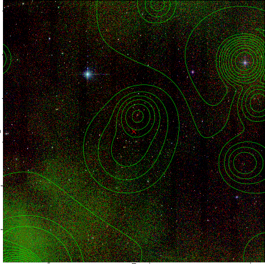  | 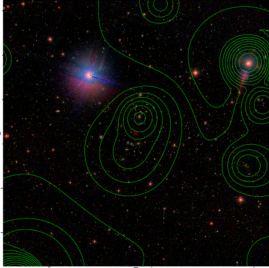  |

