

### 364

|Name|RAJ2000[deg]|DEJ2000[deg] |Ext[arcmin]| Ext,ml | z | z_src| C|GC(XSZ,Delta_z<0.01)| GC(OPT,Delta_z<0.01)|GC| R_sig[arcmin] | R500[arcmin] | R500[Mpc]| CRsig[c/s] | CR500[c/s] |L500[1E44 erg/s]|F500[1E-12 erg/s/cm^2]| M500[1E14 Msun]|Tx[keV]|Cnt_sig|Beta|Rc[arcmin]|Comment|Alias|
|---|---|---|---|---|---|------|---|--------|---------|----------|---|---|---|---|---|---|---|---|---|---|---|---|---|---|
|364| 158.092| 19.801| 7.99| 26.37| 0.1664(0.005)| z1,| G| -| -| C, F20, N, W| 12.212| 5.519| 0.943| 0.111(0.032)| 0.102(0.029)| 1.520(0.430)| 1.989(0.563)| 2.81(0.39)| 4.27(0.38)| 47.0| 0.852(-0.161+0.106)| 8.664(-1.767+1.460)| -| t392|

|[RASS image](../image/364/364_img.pdf)|[filtered image](../image/364/364_fil.pdf)|[Segment image](../image/364/364_seg.pdf)|
|-------------------|--------------------|-------------------|
| 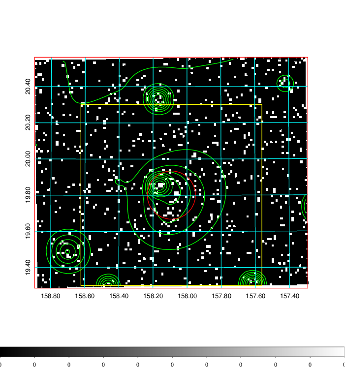  | 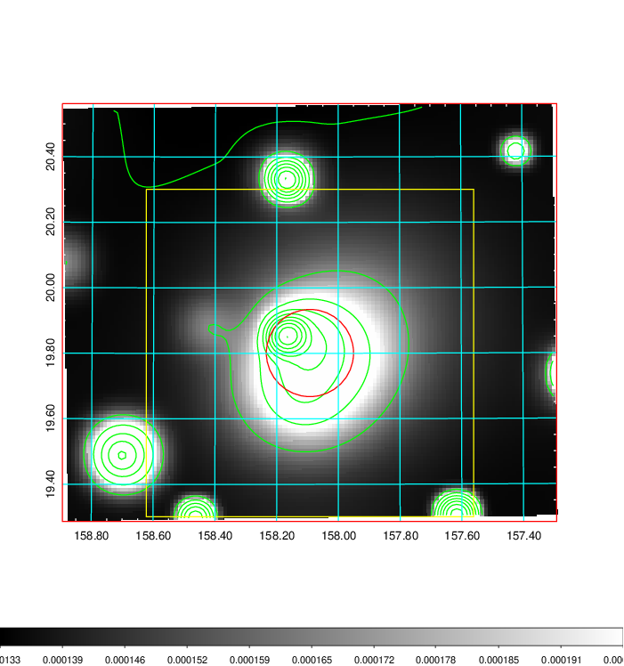   | 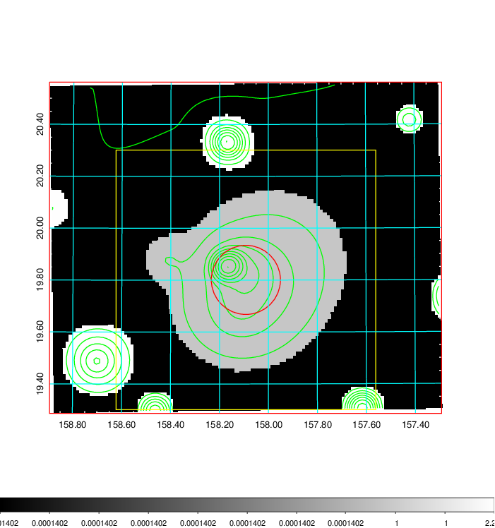  |

|[Exposure image](../image/364/364_mex.pdf)| [nH image](../image/364/364_nh.pdf)| [Planck image](../image/364/364_p.pdf)|
|-------------------|--------------------|-------------------|
|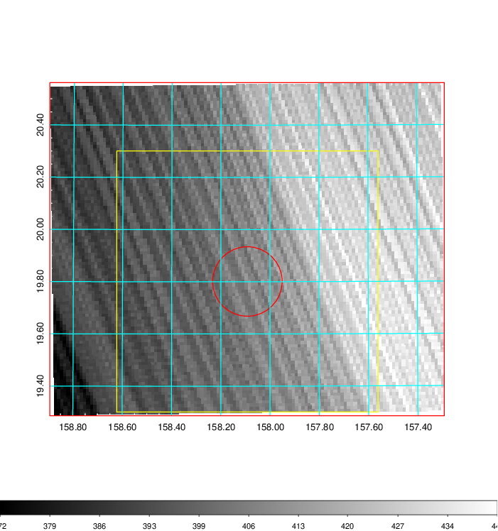   | 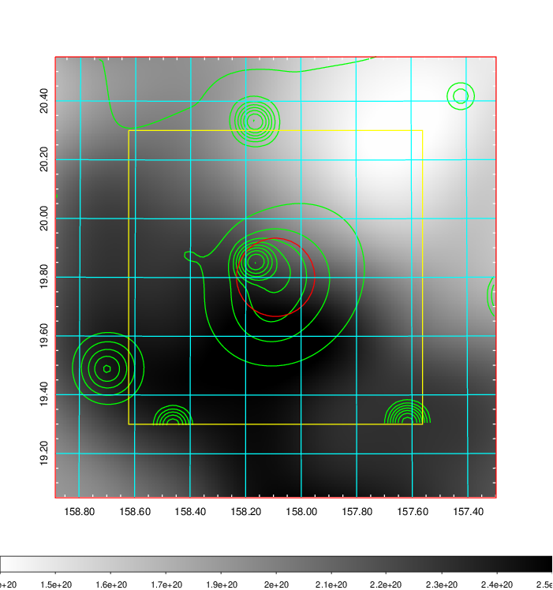    | 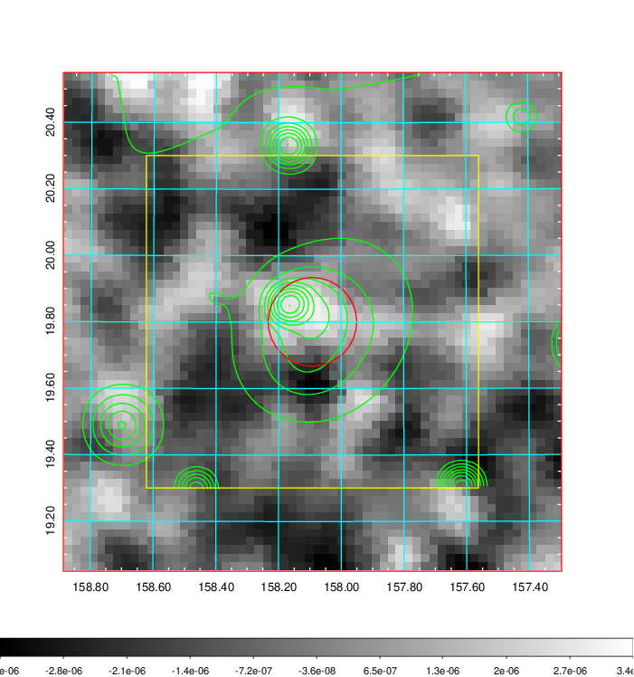 |

|[Redshift Histogram](../image/364/364_zg.pdf) | [DSS image(z1)](../image/364/364_dss_z1.pdf)      |  [DSS image(z2)](../image/364/364_dss_z2.pdf)    |
|-------------------|--------------------|-------------------|
|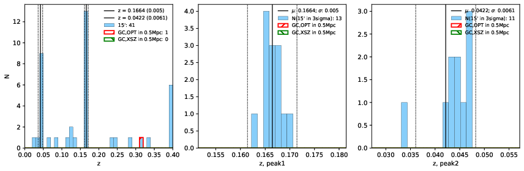 |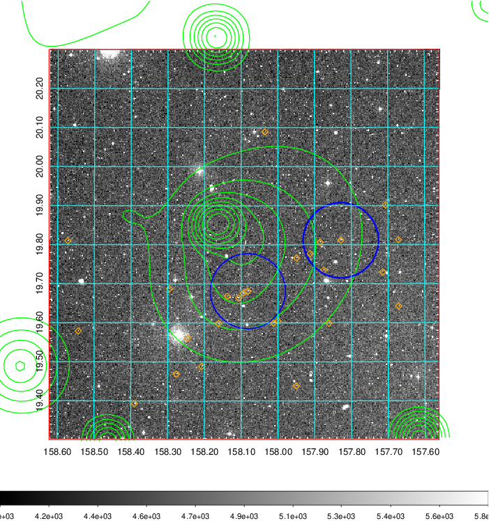  Blue circle for optical clusters;  Magenta circle for XSZ clusters;  all with r=1Mpc;  Only GC with Delta_z<0.01 are shown. | 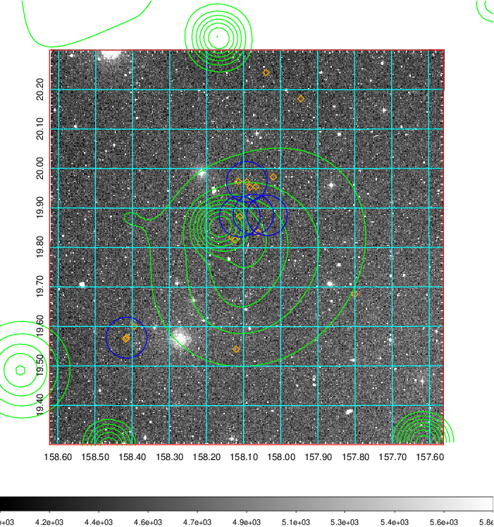 Blue circle for optical clusters;  Magenta circle for XSZ clusters;  all with r=1Mpc;  Only GC with Delta_z<0.01 are shown.  |

|[Previous-identified clusters](../image/364/364_gc.pdf) | [2MASS image](../image/364/364_2mass.pdf)      |[SDSS image](../image/364/364_sdss.pdf)   |
|-------------------|-------------------|-------------------|
|  Green, magenta, and blue circles  for optical, X-ray and SZ clusters  respectively, with redshift of clusters  labelled. The radius of circles  are 1Mpc.|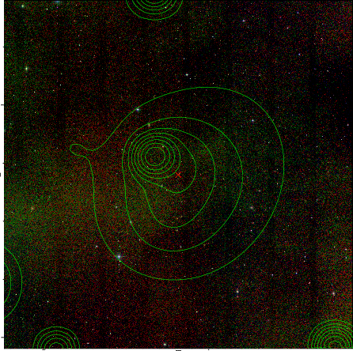  | 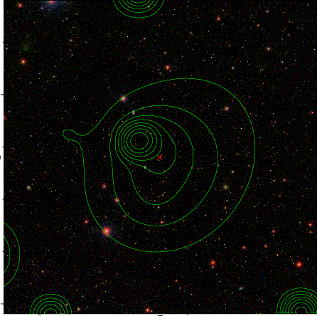  |

