

### 365

|Name|RAJ2000[deg]|DEJ2000[deg] |Ext[arcmin]| Ext,ml | z | z_src| C|GC(XSZ,Delta_z<0.01)| GC(OPT,Delta_z<0.01)|GC| R_sig[arcmin] | R500[arcmin] | R500[Mpc]| CRsig[c/s] | CR500[c/s] |L500[1E44 erg/s]|F500[1E-12 erg/s/cm^2]| M500[1E14 Msun]|Tx[keV]|Cnt_sig|Beta|Rc[arcmin]|Comment|Alias|
|---|---|---|---|---|---|------|---|--------|---------|----------|---|---|---|---|---|---|---|---|---|---|---|---|---|---|
|365| 158.249| 2.131| 5.25| 26.07| 0.1263(0.005)| z1, z_xsz| B| F20| -| A, C, F20, N, W| 27.169| 7.352| 0.997| 0.241(0.058)| 0.215(0.052)| 1.697(0.433)| 4.053(1.035)| 3.19(0.40)| 4.55(0.36)| 65.6| 0.528(-0.021+0.049)| 7.761(-1.009+1.593)| An Abell cluster with $z$ = 0.1241 and offset = 0.95 Mpc(6.88 arcmin)| t271|

|[RASS image](../image/365/365_img.pdf)|[filtered image](../image/365/365_fil.pdf)|[Segment image](../image/365/365_seg.pdf)|
|-------------------|--------------------|-------------------|
| 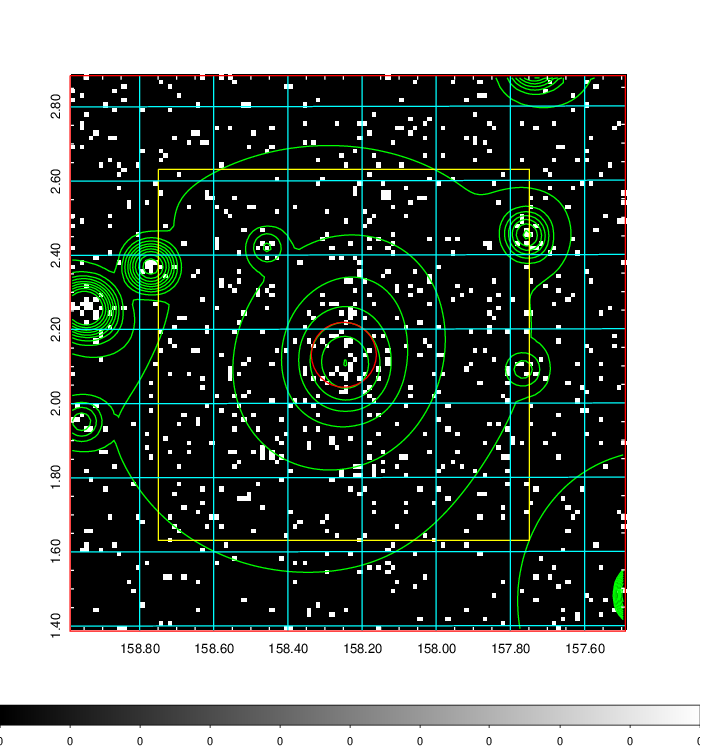  | 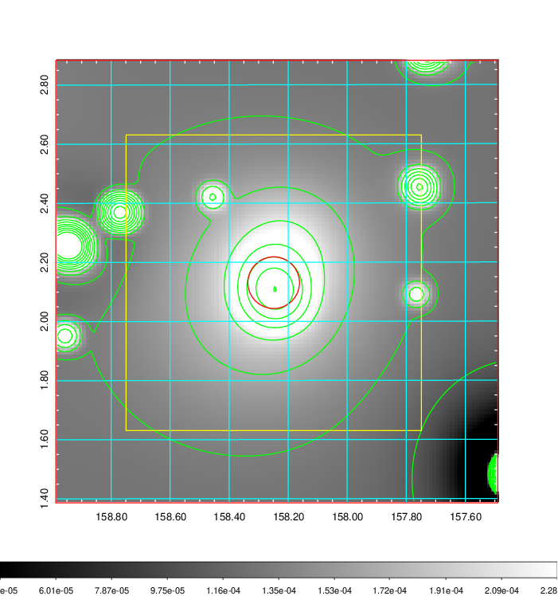   | 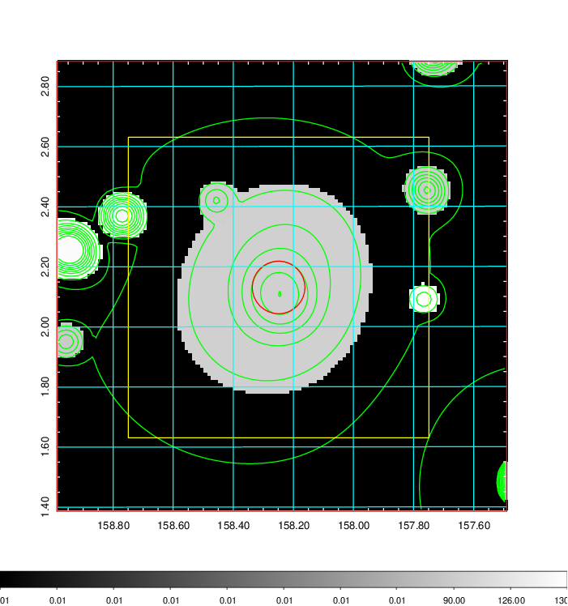  |

|[Exposure image](../image/365/365_mex.pdf)| [nH image](../image/365/365_nh.pdf)| [Planck image](../image/365/365_p.pdf)|
|-------------------|--------------------|-------------------|
|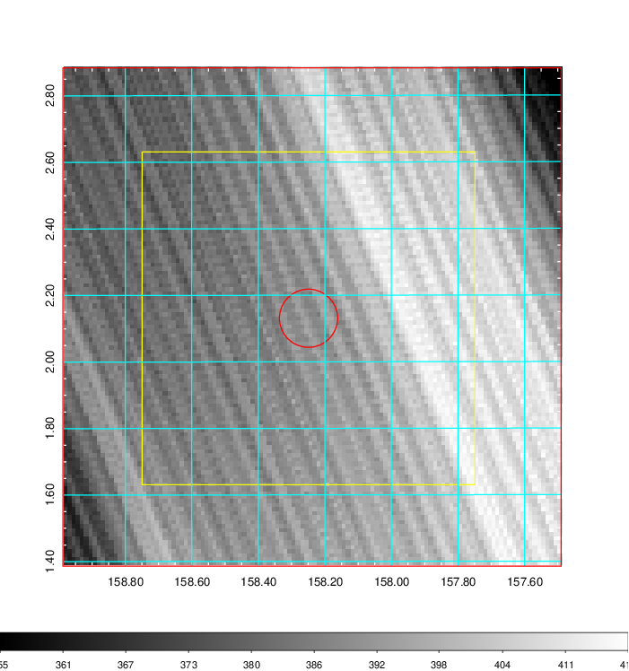   | 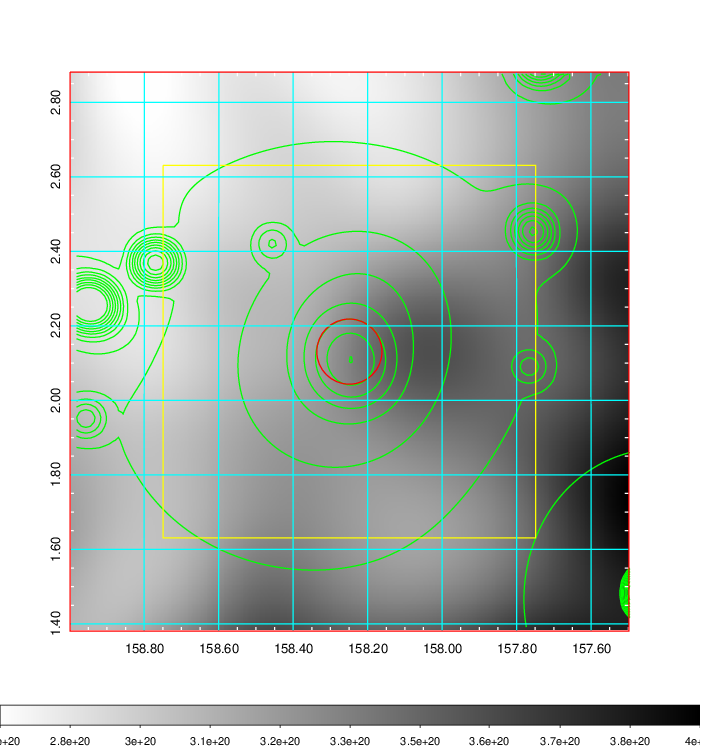    | 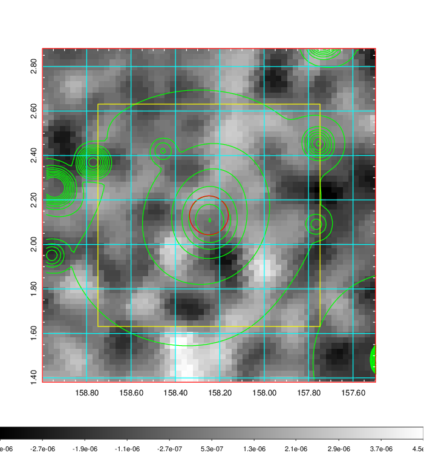 |

|[Redshift Histogram](../image/365/365_zg.pdf) | [DSS image(z1)](../image/365/365_dss_z1.pdf)      |  [DSS image(z2)](../image/365/365_dss_z2.pdf)    |
|-------------------|--------------------|-------------------|
|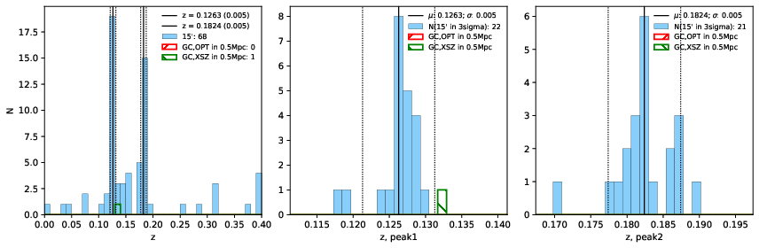 |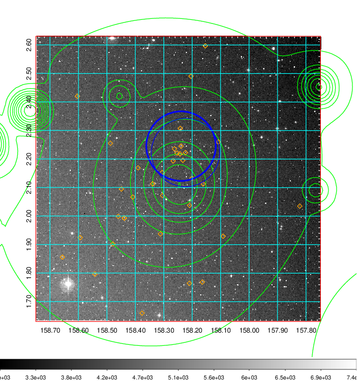  Blue circle for optical clusters;  Magenta circle for XSZ clusters;  all with r=1Mpc;  Only GC with Delta_z<0.01 are shown. | 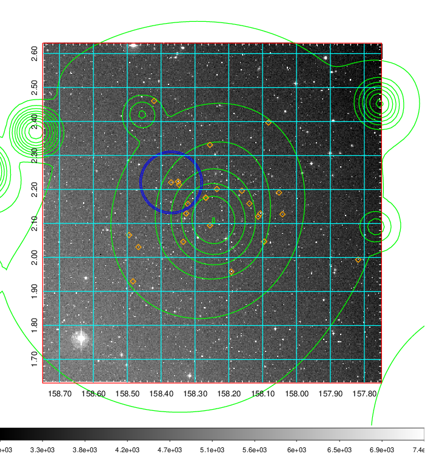 Blue circle for optical clusters;  Magenta circle for XSZ clusters;  all with r=1Mpc;  Only GC with Delta_z<0.01 are shown.  |

|[Previous-identified clusters](../image/365/365_gc.pdf) | [2MASS image](../image/365/365_2mass.pdf)      |[SDSS image](../image/365/365_sdss.pdf)   |
|-------------------|-------------------|-------------------|
|  Green, magenta, and blue circles  for optical, X-ray and SZ clusters  respectively, with redshift of clusters  labelled. The radius of circles  are 1Mpc.|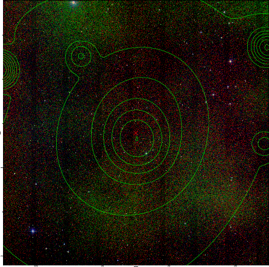  | 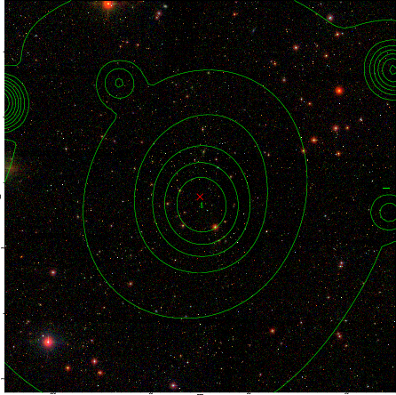  |

