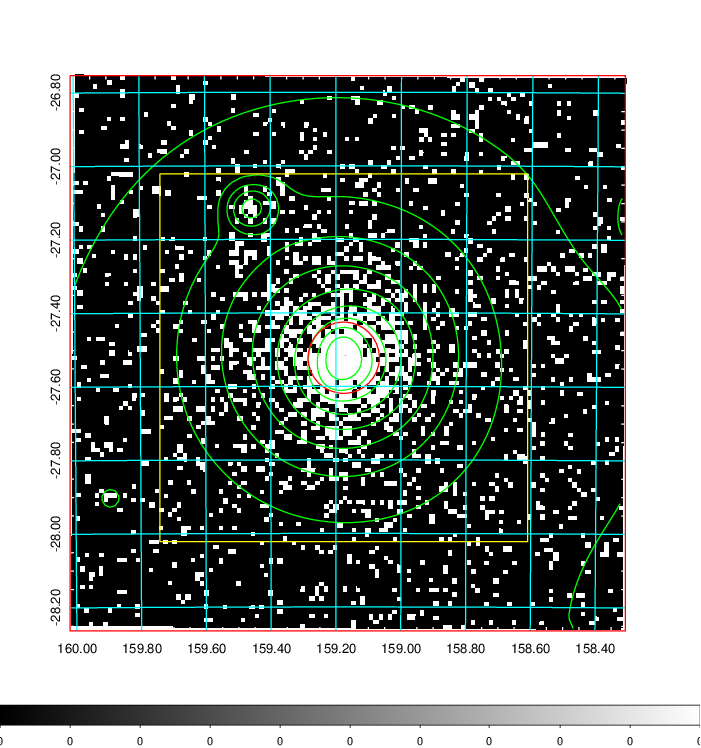
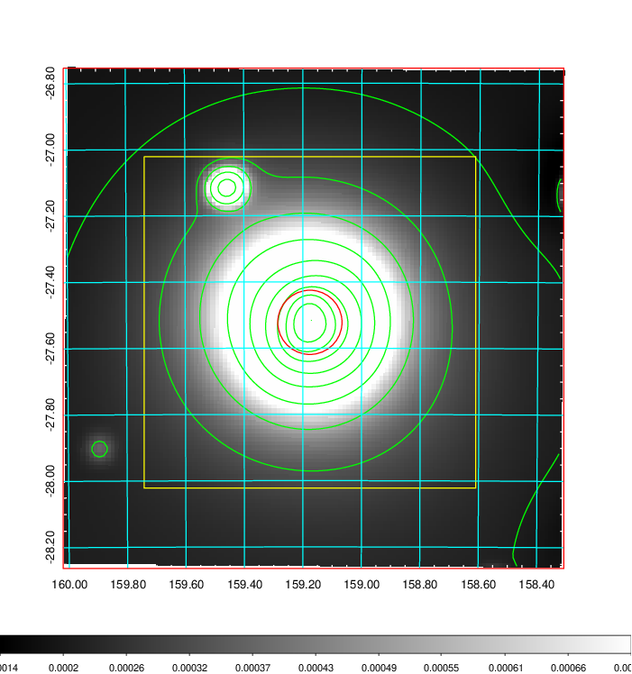
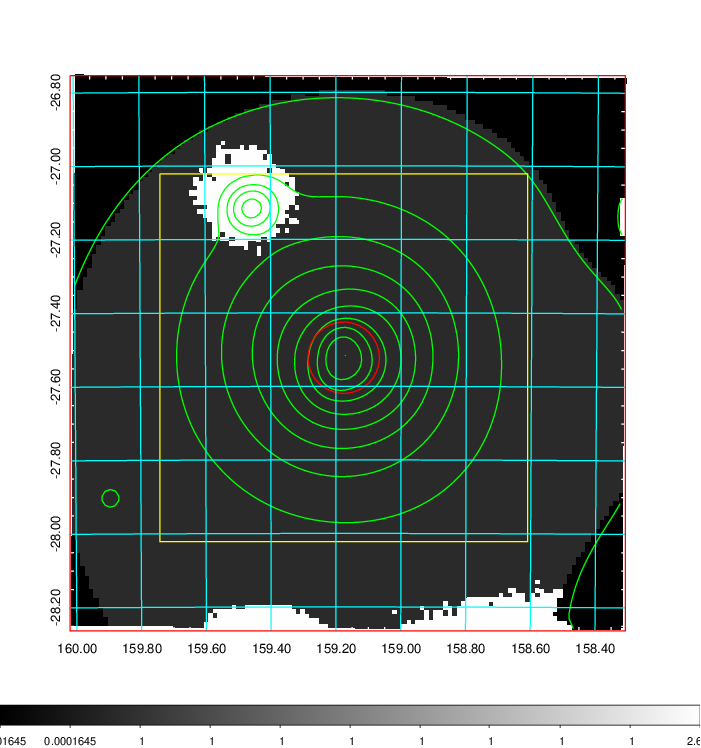
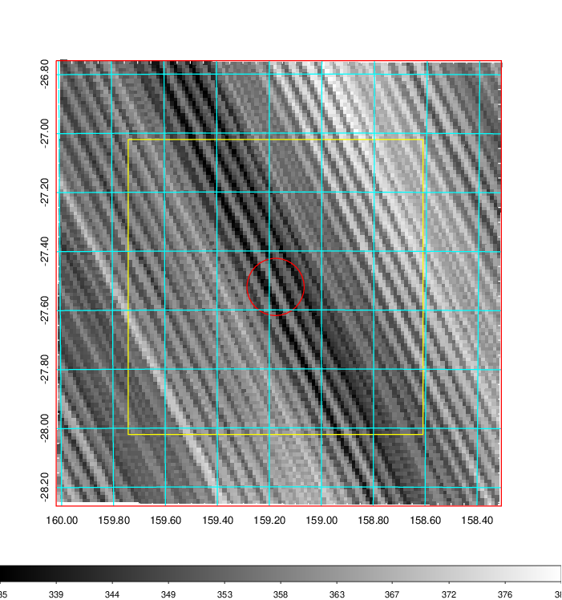
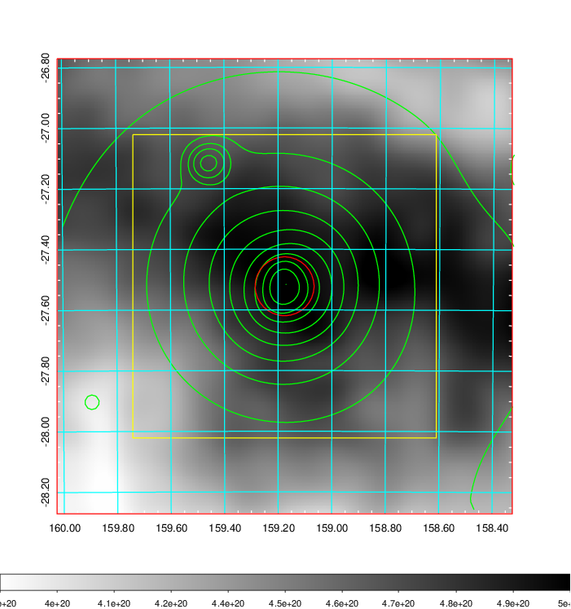
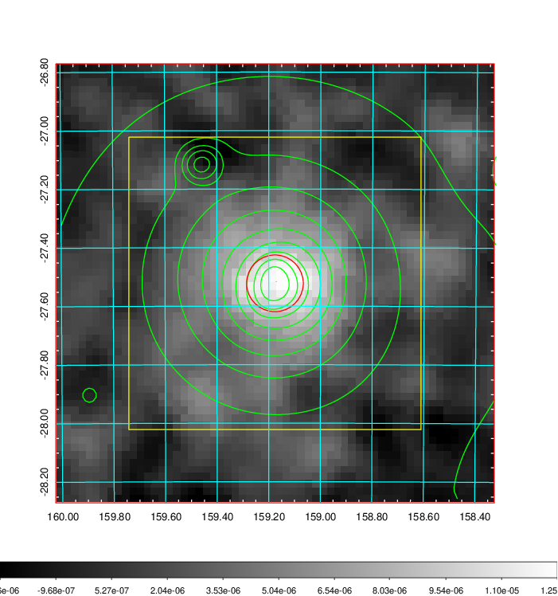
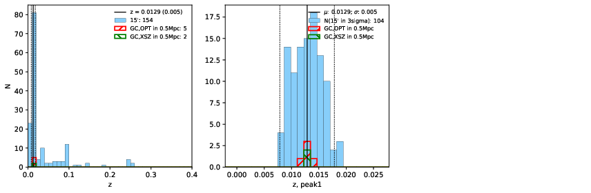
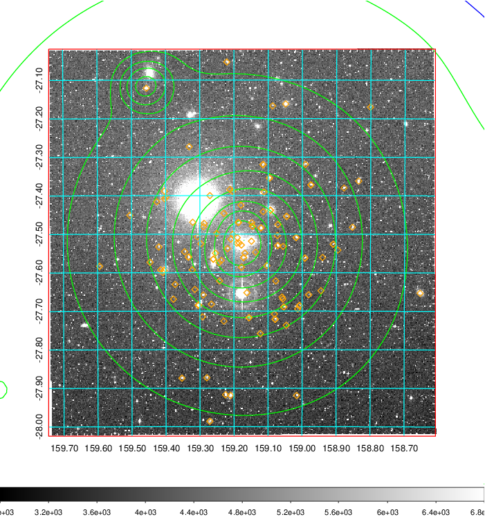
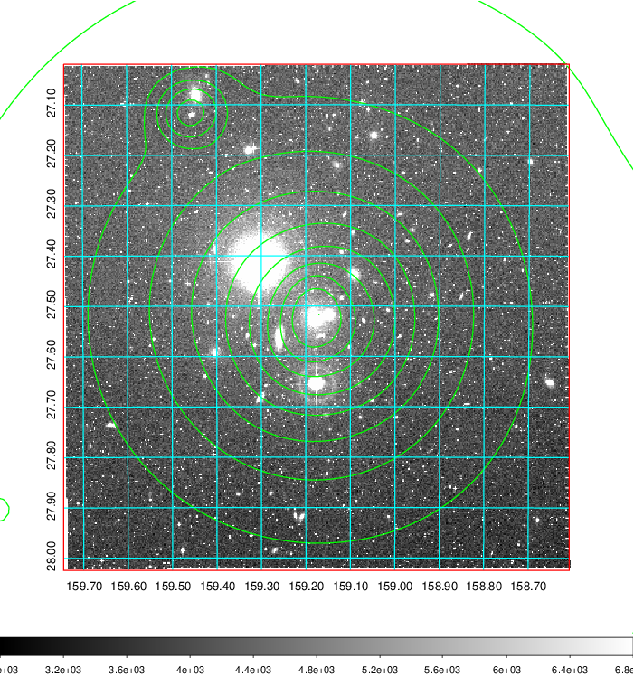
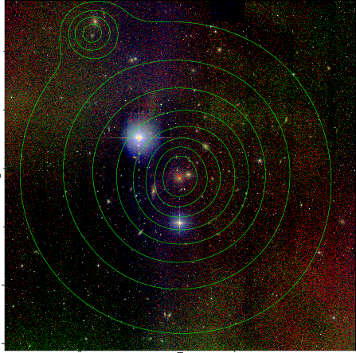

### 366

|Name|RAJ2000[deg]|DEJ2000[deg] |Ext[arcmin]| Ext,ml | z | z_src| C|GC(XSZ,Delta_z<0.01)| GC(OPT,Delta_z<0.01)|GC| R_sig[arcmin] | R500[arcmin] | R500[Mpc]| CRsig[c/s] | CR500[c/s] |L500[1E44 erg/s]|F500[1E-12 erg/s/cm^2]| M500[1E14 Msun]|Tx[keV]|Cnt_sig|Beta|Rc[arcmin]|Comment|Alias|
|---|---|---|---|---|---|------|---|--------|---------|----------|---|---|---|---|---|---|---|---|---|---|---|---|---|---|
|366| 159.176| -27.522| 5.82| 2721.69| 0.0129(0.005)| z1, z_xsz| B| MCXC, XB| A, N| A, MCXC, N, W, XB| 45.550| 47.112| 0.745| 4.316(0.150)| 4.340(0.150)| 0.275(0.005)| 73.703(1.322)| 1.19(0.01)| 2.40(0.01)| 1581.9| 0.621(-0.010+0.010)| 5.473(-0.218+0.228)| -| k538|

|[RASS image](../image/366/366_img.pdf)|[filtered image](../image/366/366_fil.pdf)|[Segment image](../image/366/366_seg.pdf)|
|-------------------|--------------------|-------------------|
|   |    |   |

|[Exposure image](../image/366/366_mex.pdf)| [nH image](../image/366/366_nh.pdf)| [Planck image](../image/366/366_p.pdf)|
|-------------------|--------------------|-------------------|
|   |     |  |

|[Redshift Histogram](../image/366/366_zg.pdf) | [DSS image(z1)](../image/366/366_dss_z1.pdf)      |  [DSS image(z2)](../image/366/366_dss_z2.pdf)    |
|-------------------|--------------------|-------------------|
| |  Blue circle for optical clusters;  Magenta circle for XSZ clusters;  all with r=1Mpc;  Only GC with Delta_z<0.01 are shown. |  Blue circle for optical clusters;  Magenta circle for XSZ clusters;  all with r=1Mpc;  Only GC with Delta_z<0.01 are shown.  |

|[known Abell/XSZ clusters](../image/366/366_gc.pdf) | [2MASS image](../image/366/366_2mass.pdf)      |
|-------------------|-------------------|
|  Magenta, blue and green circles  for optical, X-ray and SZ clusters  respectively, with redshift of clusters  labelled. The radius of circles  are 1Mpc.|  |

|[PS1 image](../image/366/366_ps1.pdf)            |
|-------------------|
|   |
