

### 367

|Name|RAJ2000[deg]|DEJ2000[deg] |Ext[arcmin]| Ext,ml | z | z_src| C|GC(XSZ,Delta_z<0.01)| GC(OPT,Delta_z<0.01)|GC| R_sig[arcmin] | R500[arcmin] | R500[Mpc]| CRsig[c/s] | CR500[c/s] |L500[1E44 erg/s]|F500[1E-12 erg/s/cm^2]| M500[1E14 Msun]|Tx[keV]|Cnt_sig|Beta|Rc[arcmin]|Comment|Alias|
|---|---|---|---|---|---|------|---|--------|---------|----------|---|---|---|---|---|---|---|---|---|---|---|---|---|---|
|367| 159.299| 50.090| 4.36| 43.63| 0.0449(0.005)| z1, z_opt| S| -| N, W| C, F20, N, SPI, W| 8.800| 9.878| 0.523| 0.080(0.026)| 0.082(0.026)| 0.059(0.015)| 1.244(0.319)| 0.43(0.06)| 1.28(0.11)| 59.2| 0.837(-0.159+0.115)| 5.612(-1.335+1.083)| -| t222|

|[RASS image](../image/367/367_img.pdf)|[filtered image](../image/367/367_fil.pdf)|[Segment image](../image/367/367_seg.pdf)|
|-------------------|--------------------|-------------------|
| 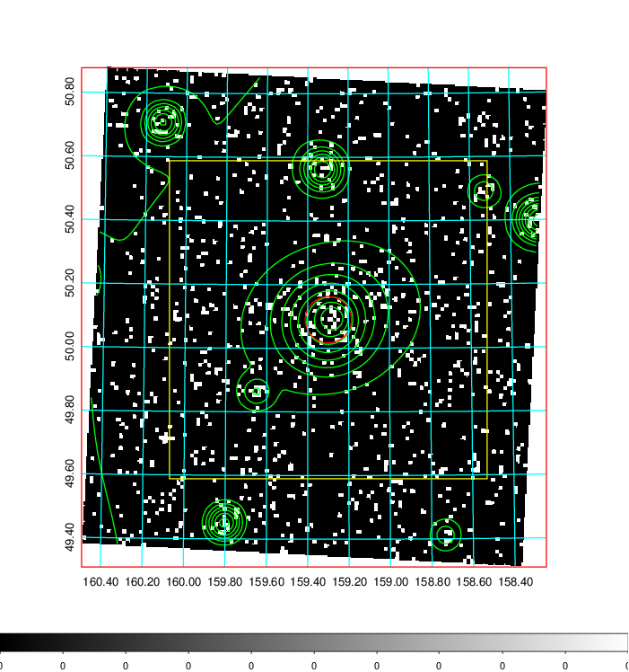  | 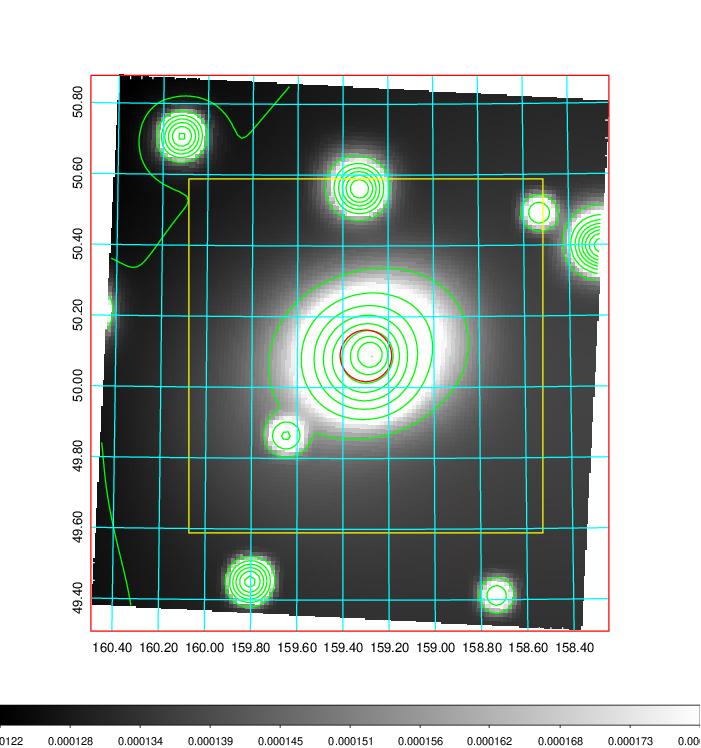   | 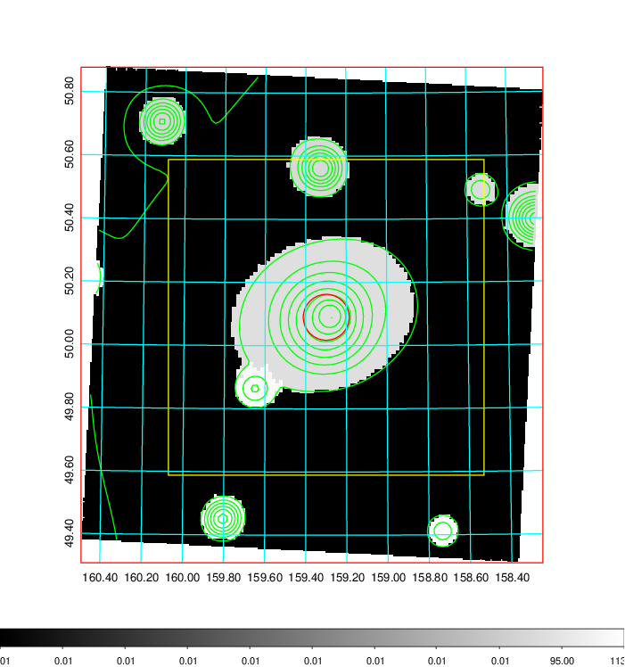  |

|[Exposure image](../image/367/367_mex.pdf)| [nH image](../image/367/367_nh.pdf)| [Planck image](../image/367/367_p.pdf)|
|-------------------|--------------------|-------------------|
|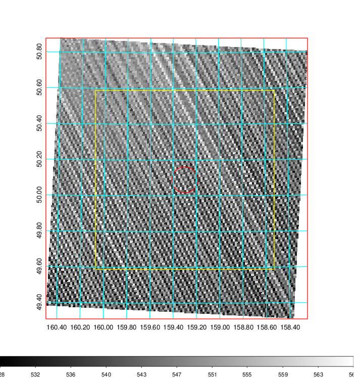   | 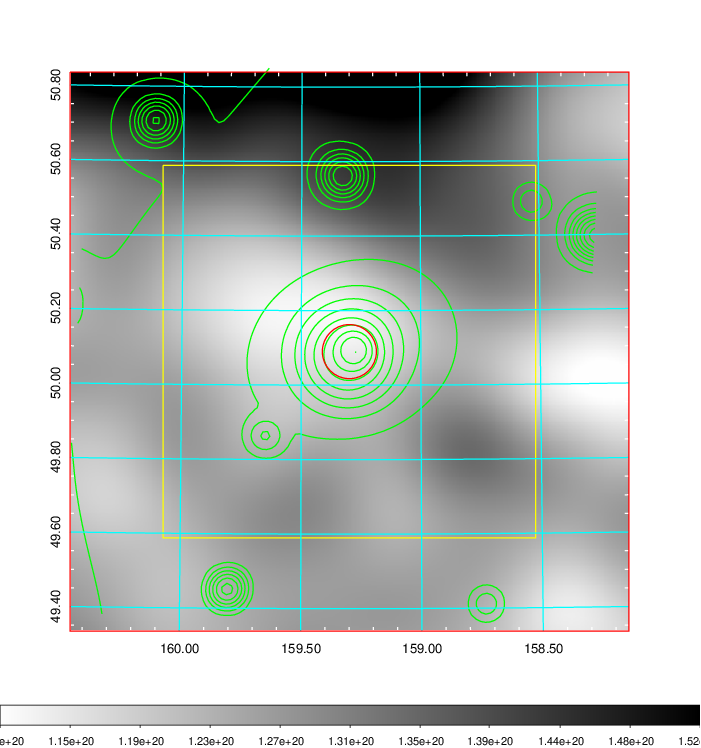    | 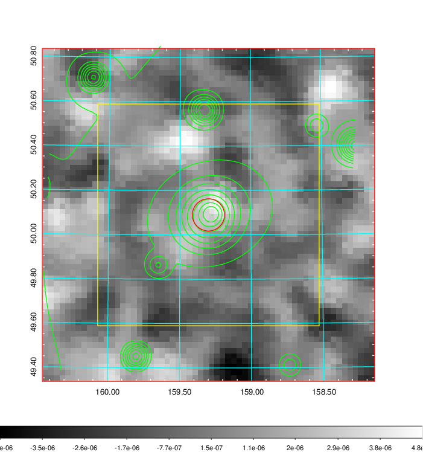 |

|[Redshift Histogram](../image/367/367_zg.pdf) | [DSS image(z1)](../image/367/367_dss_z1.pdf)      |  [DSS image(z2)](../image/367/367_dss_z2.pdf)    |
|-------------------|--------------------|-------------------|
|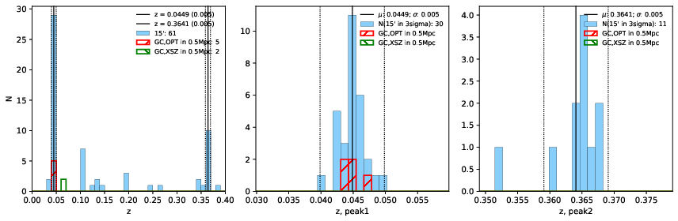 |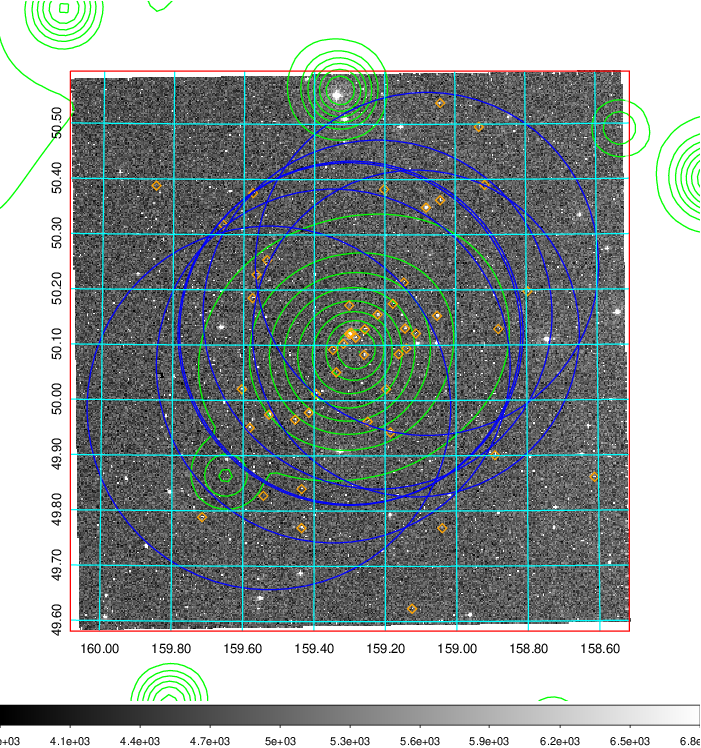  Blue circle for optical clusters;  Magenta circle for XSZ clusters;  all with r=1Mpc;  Only GC with Delta_z<0.01 are shown. | 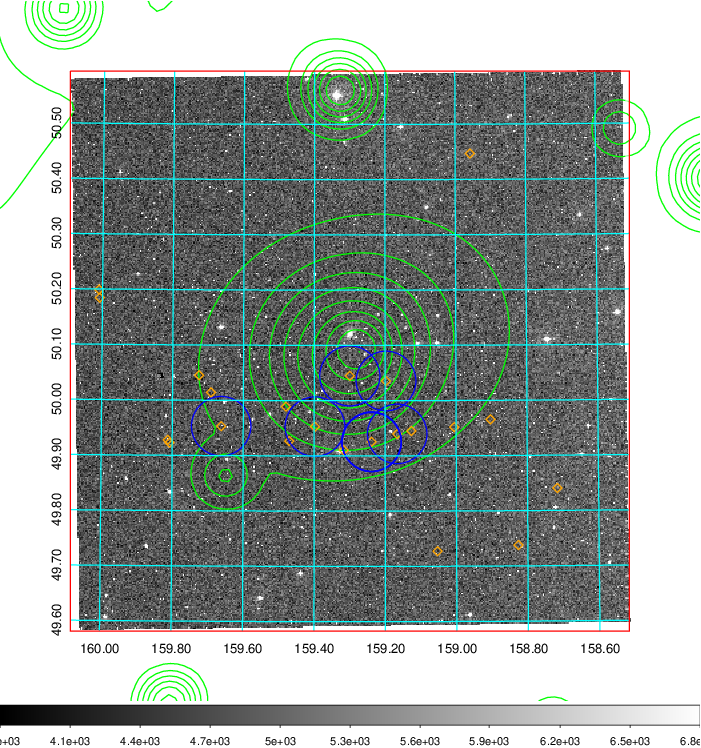 Blue circle for optical clusters;  Magenta circle for XSZ clusters;  all with r=1Mpc;  Only GC with Delta_z<0.01 are shown.  |

|[known Abell/XSZ clusters](../image/367/367_gc.pdf) | [2MASS image](../image/367/367_2mass.pdf)      |[SDSS image](../image/367/367_sdss.pdf)   |
|-------------------|-------------------|-------------------|
|  Magenta, blue and green circles  for optical, X-ray and SZ clusters  respectively, with redshift of clusters  labelled. The radius of circles  are 1Mpc.|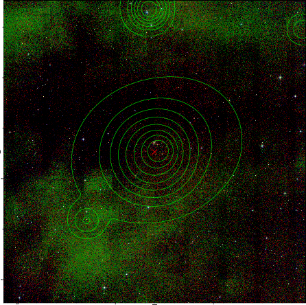  | 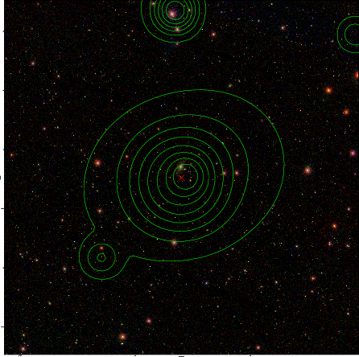  |

